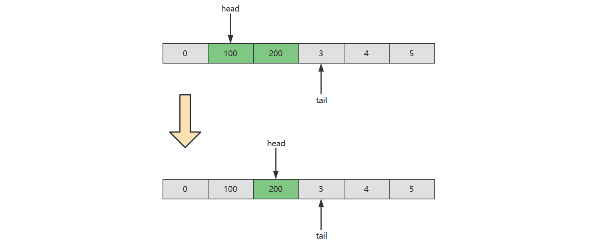
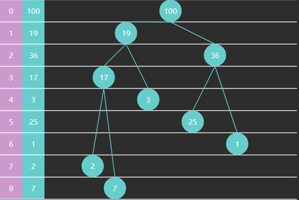
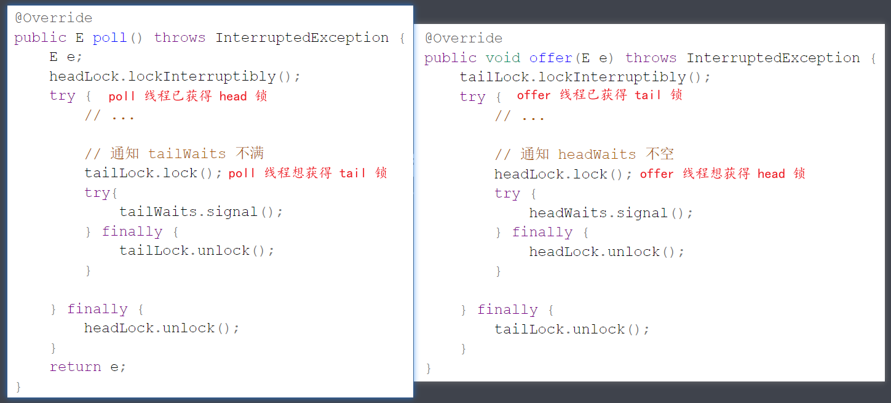
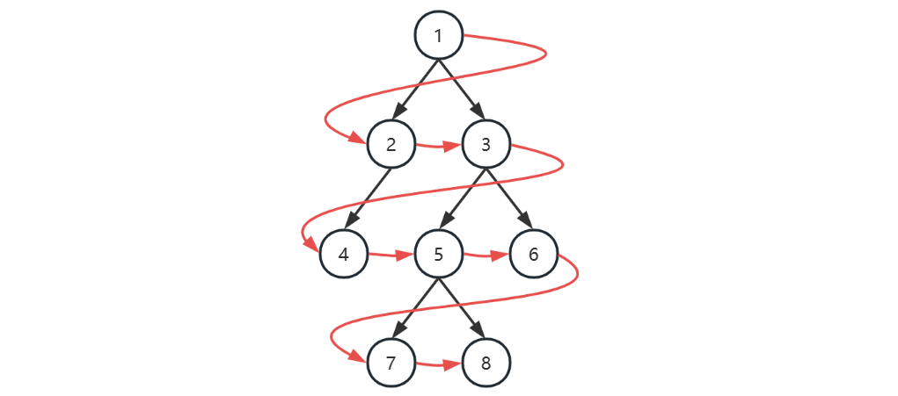
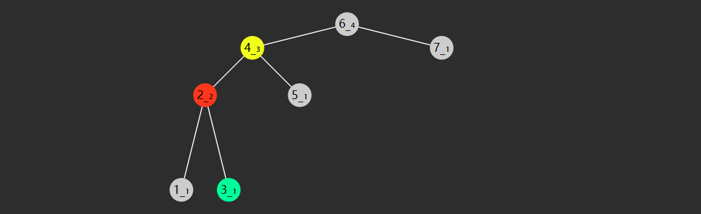
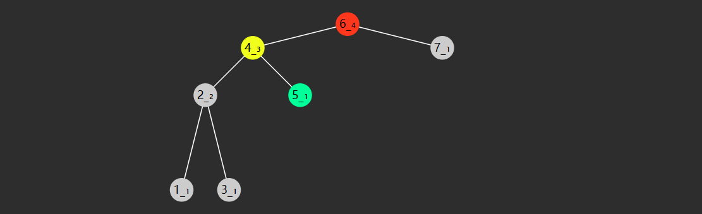
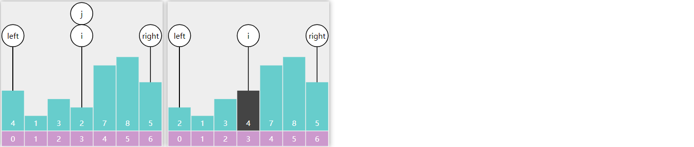
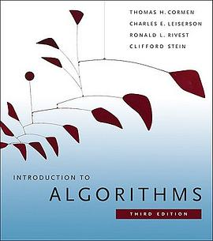

# 一. 初识算法

## 1.1 什么是算法？

**定义**

在数学和计算机科学领域，算法是一系列有限的严谨指令，通常用于解决一类特定问题或执行计算

> In mathematics and computer science, an **algorithm** (/ˈælɡərɪðəm/) is a finite sequence of rigorous instructions, typically used to solve a class of specific problems or to perform a computation.[^1]

**Introduction to Algorithm[^2]**

不正式的说，算法就是任何定义优良的计算过程：接收一些值作为输入，在有限的时间内，产生一些值作为输出。

> Informally, an algorithm is any well-defined computational procedure that takes some value, or set of values, as input and produces some value, or set of values, as output in a finite amount of time.

## 1.2 什么是数据结构？

**定义**

在计算机科学领域，数据结构是一种数据组织、管理和存储格式，通常被选择用来高效访问数据

> In computer science, a **data structure** is a data organization, management, and storage format that is usually chosen for efficient access to data

**Introduction to Algorithm[^2]**

数据结构是一种存储和组织数据的方式，旨在便于访问和修改

> A data structure is a way to store and organize data in order to facilitate access and modifications

可以说，**程序 = 数据结构 + 算法**，它们是每一位程序员的基本功，下来我们通过对一个非常著名的二分查找算法的讲解来认识一下算法

## 1.3 二分查找 [^3]

二分查找算法也称折半查找，是一种非常高效的工作于有序数组的查找算法。后续的课程中还会学习更多的查找算法，但在此之前，不妨用它作为入门。

### 1) 基础版

需求：在**有序**数组 $A$ 内，查找值 $target$

- 如果找到返回索引
- 如果找不到返回 $-1$

算法描述

|      |                                                                                                                      |
| ---- | -------------------------------------------------------------------------------------------------------------------- |
| 前提 | 给定一个内含 $n$ 个元素的有序数组 $A$，满足 $A_{0}\leq A_{1}\leq A_{2}\leq \cdots \leq A_{n-1}$，一个待查值 $target$ |
| 1    | 设置 $i=0$，$j=n-1$                                                                                                  |
| 2    | 如果 $i \gt j$，结束查找，没找到                                                                                     |
| 3    | 设置 $m = floor(\frac {i+j}{2})$ ，$m$ 为中间索引，$floor$ 是向下取整（$\leq \frac {i+j}{2}$ 的最小整数）            |
| 4    | 如果 $target < A_{m}$ 设置 $j = m - 1$，跳到第 2 步                                                                  |
| 5    | 如果 $A_{m} < target$ 设置 $i = m + 1$，跳到第 2 步                                                                  |
| 6    | 如果 $A_{m} = target$，结束查找，找到了                                                                              |

> **_P.S._**
>
> - 对于一个算法来讲，都有较为严谨的描述，上面是一个例子
> - 后续讲解时，以简明直白为目标，不会总以上面的方式来描述算法

java 实现

```java
public static int binarySearch(int[] a, int target) {
    int i = 0, j = a.length - 1;
    while (i <= j) {
        int m = (i + j) >>> 1;
        if (target < a[m]) {			// 在左边
            j = m - 1;
        } else if (a[m] < target) {		// 在右边
            i = m + 1;
        } else {
            return m;
        }
    }
    return -1;
}
```

- $i,j$ 对应着搜索区间 $[0,a.length-1]$（注意是闭合的区间），$i<=j$ 意味着搜索区间内还有未比较的元素，$i,j$ 指向的元素也可能是比较的目标
  - 思考：如果不加 $i==j$ 行不行？
  - 回答：不行，因为这意味着 $i,j$ 指向的元素会漏过比较
- $m$ 对应着中间位置，中间位置左边和右边的元素可能不相等（差一个），不会影响结果
- 如果某次未找到，那么缩小后的区间内不包含 $m$

### 2) 改变版

另一种写法

```java
public static int binarySearch(int[] a, int target) {
    int i = 0, j = a.length;
    while (i < j) {
        int m = (i + j) >>> 1;
        if (target < a[m]) {			// 在左边
            j = m;
        } else if (a[m] < target) {		// 在右边
            i = m + 1;
        } else {
            return m;
        }
    }
    return -1;
}
```

- $i,j$ 对应着搜索区间 $[0,a.length)$（注意是左闭右开的区间），$i<j$ 意味着搜索区间内还有未比较的元素，$j$ 指向的**一定不是**查找目标
  - 思考：为啥这次不加 $i==j$ 的条件了？
  - 回答：这回 $j$ 指向的不是查找目标，如果还加 $i==j$ 条件，就意味着 $j$ 指向的还会再次比较，找不到时，会死循环
- 如果某次要缩小右边界，那么 $j=m$，因为此时的 $m$ 已经**不是**查找目标了

## 1.4 衡量算法好坏

**时间复杂度**

下面的查找算法也能得出与之前二分查找一样的结果，那你能说出它差在哪里吗？

```java
public static int search(int[] a, int k) {
    for (
        int i = 0;
        i < a.length;
        i++
    ) {
        if (a[i] == k) {
            return i;
        }
    }
    return -1;
}
```

考虑最坏情况下（没找到）例如 `[1,2,3,4]` 查找 5

- `int i = 0` 只执行一次
- `i < a.length` 受数组元素个数 $n$ 的影响，比较 $n+1$ 次
- `i++` 受数组元素个数 $n$ 的影响，自增 $n$ 次
- `a[i] == k` 受元素个数 $n$ 的影响，比较 $n$ 次
- `return -1`，执行一次

粗略认为每行代码执行时间是 $t$，假设 $n=4$ 那么

- 总执行时间是 $(1+4+1+4+4+1)*t = 15t$
- 可以推导出更一般地公式为，$T = (3*n+3)t$

如果套用二分查找算法，还是 `[1,2,3,4]` 查找 5

```java
public static int binarySearch(int[] a, int target) {
    int i = 0, j = a.length - 1;
    while (i <= j) {
        int m = (i + j) >>> 1;
        if (target < a[m]) {			// 在左边
            j = m - 1;
        } else if (a[m] < target) {		// 在右边
            i = m + 1;
        } else {
            return m;
        }
    }
    return -1;
}
```

- `int i = 0, j = a.length - 1` 各执行 1 次
- `i <= j` 比较 $floor(\log_{2}(n)+1)$ 再加 1 次
- `(i + j) >>> 1` 计算 $floor(\log_{2}(n)+1)$ 次
- 接下来 `if() else if() else` 会执行 $3* floor(\log_{2}(n)+1)$ 次，分别为

  - if 比较
  - else if 比较
  - else if 比较成立后的赋值语句

- `return -1`，执行一次

结果：

- 总执行时间为 $(2 + (1+3) + 3 + 3 * 3 +1)*t = 19t$
- 更一般地公式为 $(4 + 5 * floor(\log_{2}(n)+1))*t$

> **注意：**
>
> 左侧未找到和右侧未找到结果不一样，这里不做分析

两个算法比较，可以看到 $n$ 在较小的时候，二者花费的次数差不多


但随着 $n$ 越来越大，比如说 $n=1000$ 时，用二分查找算法（红色）也就是 $54t$，而蓝色算法则需要 $3003t$


> 画图采用的是 [Desmos | 图形计算器](https://www.desmos.com/calculator?lang=zh-CN)

计算机科学中，**时间复杂度**是用来衡量：一个算法的执行，随数据规模增大，而增长的时间成本

- 不依赖于环境因素

如何表示时间复杂度呢？

- 假设算法要处理的数据规模是 $n$，代码总的执行行数用函数 $f(n)$ 来表示，例如：

  - 线性查找算法的函数 $f(n) = 3*n + 3$
  - 二分查找算法的函数 $f(n) = (floor(log_2(n)) + 1) * 5 + 4$

- 为了对 $f(n)$ 进行化简，应当抓住主要矛盾，找到一个变化趋势与之相近的表示法

**大 $O$ 表示法[^4]**


其中

- $c, c_1, c_2$ 都为一个常数
- $f(n)$ 是实际执行代码行数与 n 的函数
- $g(n)$ 是经过化简，变化趋势与 $f(n)$ 一致的 n 的函数

**渐进上界**

渐进上界（asymptotic upper bound）：从某个常数 $n_0$开始，$c*g(n)$ 总是位于 $f(n)$ 上方，那么记作 $O(g(n))$

- 代表算法执行的最差情况

例 1

- $f(n) = 3*n+3$
- $g(n) = n$
- 取 $c=4$，在$n_0=3$ 之后，$g(n)$ 可以作为 $f(n)$ 的渐进上界，因此表示法写作 $O(n)$

例 2

- $f(n) = 5*floor(log_2(n)) + 9$
- $g(n) = log_2(n)$
- $O(log_2(n))$

已知 $f(n)$ 来说，求 $g(n)$

- 表达式中相乘的常量，可以省略，如
  - $f(n) = 100*n^2$ 中的 $100$
- 多项式中数量规模更小（低次项）的表达式，如
  - $f(n)=n^2+n$ 中的 $n$
  - $f(n) = n^3 + n^2$ 中的 $n^2$
- 不同底数的对数，渐进上界可以用一个对数函数 $\log n$ 表示
  - 例如：$log_2(n)$ 可以替换为 $log_{10}(n)$，因为 $log_2(n) = \frac{log_{10}(n)}{log_{10}(2)}$，相乘的常量 $\frac{1}{log_{10}(2)}$ 可以省略
- 类似的，对数的常数次幂可省略
  - 如：$log(n^c) = c * log(n)$

**常见大 $O$ 表示法**


按时间复杂度从低到高

- 黑色横线 $O(1)$，常量时间，意味着算法时间并不随数据规模而变化
- 绿色 $O(log(n))$，对数时间
- 蓝色 $O(n)$，线性时间，算法时间与数据规模成正比
- 橙色 $O(n*log(n))$，拟线性时间
- 红色 $O(n^2)$ 平方时间
- 黑色朝上 $O(2^n)$ 指数时间
- 没画出来的 $O(n!)$

**渐进下界**

渐进下界（asymptotic lower bound）：从某个常数 $n_0$开始，$c*g(n)$ 总是位于 $f(n)$ 下方，那么记作 $\Omega(g(n))$

**渐进紧界**

渐进紧界（asymptotic tight bounds）：从某个常数 $n_0$开始，$f(n)$ 总是在 $c_1*g(n)$ 和 $c_2*g(n)$ 之间，那么记作 $\Theta(g(n))$

**空间复杂度**

与时间复杂度类似，一般也使用大 $O$ 表示法来衡量：一个算法执行随数据规模增大，而增长的**额外**空间成本

```java
public static int binarySearchBasic(int[] a, int target) {
    int i = 0, j = a.length - 1;    // 设置指针和初值
    while (i <= j) {                // i~j 范围内有东西
        int m = (i + j) >>> 1;
        if(target < a[m]) {         // 目标在左边
            j = m - 1;
        } else if (a[m] < target) { // 目标在右边
            i = m + 1;
        } else {                    // 找到了
            return m;
        }
    }
    return -1;
}
```

**二分查找性能**

下面分析二分查找算法的性能

时间复杂度

- 最坏情况：$O(\log n)$
- 最好情况：如果待查找元素恰好在数组中央，只需要循环一次 $O(1)$

空间复杂度

- 需要常数个指针 $i,j,m$，因此额外占用的空间是 $O(1)$

## 1.5 再看二分查找

### 1) 平衡版

```java
public static int binarySearchBalance(int[] a, int target) {
    int i = 0, j = a.length;
    while (1 < j - i) {
        int m = (i + j) >>> 1;
        if (target < a[m]) {
            j = m;
        } else {
            i = m;
        }
    }
    return (a[i] == target) ? i : -1;
}
```

思想：

1. 左闭右开的区间，$i$ 指向的可能是目标，而 $j$ 指向的不是目标
2. 不奢望循环内通过 $m$ 找出目标, 缩小区间直至剩 1 个, 剩下的这个可能就是要找的（通过 $i$）
   - $j - i > 1$ 的含义是，在范围内待比较的元素个数 > 1
3. 改变 $i$ 边界时，它指向的可能是目标，因此不能 $m+1$
4. 循环内的平均比较次数减少了
5. 时间复杂度 $\Theta(log(n))$

### 2) Java 版

```java
private static int binarySearch0(long[] a, int fromIndex, int toIndex,
                                     long key) {
    int low = fromIndex;
    int high = toIndex - 1;

    while (low <= high) {
        int mid = (low + high) >>> 1;
        long midVal = a[mid];

        if (midVal < key)
            low = mid + 1;
        else if (midVal > key)
            high = mid - 1;
        else
            return mid; // key found
    }
    return -(low + 1);  // key not found.
}
```

- 例如 $[1,3,5,6]$ 要插入 $2$ 那么就是找到一个位置，这个位置左侧元素都比它小
  - 等循环结束，若没找到，low 左侧元素肯定都比 target 小，因此 low 即插入点
- 插入点取负是为了与找到情况区分
- -1 是为了把索引 0 位置的插入点与找到的情况进行区分

### 3) Leftmost 与 Rightmost

有时我们希望返回的是最左侧的重复元素，如果用 Basic 二分查找

- 对于数组 $[1, 2, 3, 4, 4, 5, 6, 7]$，查找元素 4，结果是索引 3

- 对于数组 $[1, 2, 4, 4, 4, 5, 6, 7]$，查找元素 4，结果也是索引 3，并不是最左侧的元素

```java
public static int binarySearchLeftmost1(int[] a, int target) {
    int i = 0, j = a.length - 1;
    int candidate = -1;
    while (i <= j) {
        int m = (i + j) >>> 1;
        if (target < a[m]) {
            j = m - 1;
        } else if (a[m] < target) {
            i = m + 1;
        } else {
            candidate = m; // 记录候选位置
            j = m - 1;     // 继续向左
        }
    }
    return candidate;
}
```

如果希望返回的是最右侧元素

```java
public static int binarySearchRightmost1(int[] a, int target) {
    int i = 0, j = a.length - 1;
    int candidate = -1;
    while (i <= j) {
        int m = (i + j) >>> 1;
        if (target < a[m]) {
            j = m - 1;
        } else if (a[m] < target) {
            i = m + 1;
        } else {
            candidate = m; // 记录候选位置
            i = m + 1;	   // 继续向右
        }
    }
    return candidate;
}
```

**应用**

对于 Leftmost 与 Rightmost，可以返回一个比 -1 更有用的值

Leftmost 改为

```java
public static int binarySearchLeftmost(int[] a, int target) {
    int i = 0, j = a.length - 1;
    while (i <= j) {
        int m = (i + j) >>> 1;
        if (target <= a[m]) {
            j = m - 1;
        } else {
            i = m + 1;
        }
    }
    return i;
}
```

- leftmost 返回值的另一层含义：$\lt target$ 的元素个数
- 小于等于中间值，都要向左找

Rightmost 改为

```java
public static int binarySearchRightmost(int[] a, int target) {
    int i = 0, j = a.length - 1;
    while (i <= j) {
        int m = (i + j) >>> 1;
        if (target < a[m]) {
            j = m - 1;
        } else {
            i = m + 1;
        }
    }
    return i - 1;
}
```

- 大于等于中间值，都要向右找

几个名词


**范围查询**：

- 查询 $x \lt 4$，$0 .. leftmost(4) - 1$
- 查询 $x \leq 4$，$0 .. rightmost(4)$
- 查询 $4 \lt x$，$rightmost(4) + 1 .. \infty $
- 查询 $4 \leq x$， $leftmost(4) .. \infty$
- 查询 $4 \leq x \leq 7$，$leftmost(4) .. rightmost(7)$
- 查询 $4 \lt x \lt 7$，$rightmost(4)+1 .. leftmost(7)-1$

**求排名**：$leftmost(target) + 1$

- $target$ 可以不存在，如：$leftmost(5)+1 = 6$
- $target$ 也可以存在，如：$leftmost(4)+1 = 3$

**求前任（predecessor）**：$leftmost(target) - 1$

- $leftmost(3) - 1 = 1$，前任 $a_1 = 2$
- $leftmost(4) - 1 = 1$，前任 $a_1 = 2$

**求后任（successor）**：$rightmost(target)+1$

- $rightmost(5) + 1 = 5$，后任 $a_5 = 7$
- $rightmost(4) + 1 = 5$，后任 $a_5 = 7$

**求最近邻居**：

- 前任和后任距离更近者

## 习题

### 1) 时间复杂度估算

用函数 $f(n)$ 表示算法效率与数据规模的关系，假设每次解决问题需要 1 微秒（$10^{-6}$ 秒），进行估算：

1. 如果 $f(n) = n^2$ 那么 1 秒能解决多少次问题？1 天呢？
2. 如果 $f(n) = log_2(n)$ 那么 1 秒能解决多少次问题？1 天呢？
3. 如果 $f(n) = n!$ 那么 1 秒能解决多少次问题？1 天呢？

**参考解答**

1. 1 秒 $\sqrt{10^6} = 1000$ 次，1 天 $\sqrt{10^6 * 3600 * 24} \approx 293938$ 次
2. 1 秒 $2^{1,000,000} $ 次，一天 $2^{86,400,000,000}$
3. 推算如下
   - $10! = 3,628,800$ 1 秒能解决 $1,000,000$ 次，因此次数为 9 次
   - $14!=87,178,291,200$，一天能解决 $86,400,000,000$ 次，因此次数为 13 次

### 2) 耗时估算

一台机器对 200 个单词进行排序花了 200 秒(使用冒泡排序)，那么花费 800 秒，大概可以对多少个单词进行排序

a. 400

b. 600

c. 800

d. 1600

**答案**

- a

**解释**

- 冒泡排序时间复杂度是 $O(N^2)$
- 时间增长 4 倍，而因此能处理的数据量是原来的 $\sqrt{4} = 2$ 倍

### 3) E01. 二分查找-Leetcode 704

**要点**：减而治之，可以用递归或非递归实现

给定一个 n 个元素有序的（升序）整型数组 nums 和一个目标值 target ，写一个函数搜索 nums 中的 target，如果目标值存在返回下标，否则返回 -1

例如

```java
输入: nums = [-1,0,3,5,9,12], target = 9
输出: 4
解释: 9 出现在 nums 中并且下标为 4

输入: nums = [-1,0,3,5,9,12], target = 2
输出: -1
解释: 2 不存在 nums 中因此返回 -1
```

**参考答案**：略，可以用讲过的任意一种二分求解

### 4) E02. 搜索插入位置-Leetcode 35

**要点**：理解谁代表插入位置

给定一个排序数组和一个目标值

- 在数组中找到目标值，并返回其索引
- 如果目标值不存在于数组中，返回它将会被按顺序插入的位置

例如

```
输入: nums = [1,3,5,6], target = 5
输出: 2

输入: nums = [1,3,5,6], target = 2
输出: 1

输入: nums = [1,3,5,6], target = 7
输出: 4
```

**参考答案 1**：用二分查找基础版代码改写，基础版中，找到返回 m，没找到 i 代表插入点，因此有

```java
public int searchInsert(int[] a, int target) {
    int i = 0, j = a.length - 1;
    while (i <= j) {
        int m = (i + j) >>> 1;
        if (target < a[m]) {
            j = m - 1;
        } else if (a[m] < target) {
            i = m + 1;
        } else {
            return m;
        }
    }
    return i; // 原始 return -1
}
```

**参考答案 2**：用二分查找平衡版改写，平衡版中

- 如果 target == a[i] 返回 i 表示找到
- 如果 target < a[i]，例如 target = 2，a[i] = 3，这时就应该在 i 位置插入 2
- 如果 a[i] < target，例如 a[i] = 3，target = 4，这时就应该在 i+1 位置插入 4

```java
public static int searchInsert(int[] a, int target) {
    int i = 0, j = a.length;
    while (1 < j - i) {
        int m = (i + j) >>> 1;
        if (target < a[m]) {
            j = m;
        } else {
            i = m;
        }
    }
    return (target <= a[i]) ? i : i + 1;
    // 原始 (target == a[i]) ? i : -1;
}
```

**参考答案 3**：用 leftmost 版本解，返回值即为插入位置（并能处理元素重复的情况）

```java
public int searchInsert(int[] a, int target) {
    int i = 0, j = a.length - 1;
    while(i <= j) {
        int m = (i + j) >>> 1;
        if(target <= a[m]) {
            j = m - 1;
        } else {
            i = m + 1;
        }
    }
    return i;
}
```

### 5) E03. 搜索开始结束位置-Leetcode 34

给你一个按照非递减顺序排列的整数数组 nums，和一个目标值 target。请你找出给定目标值在数组中的开始位置和结束位置。

如果数组中不存在目标值 target，返回 [-1, -1]。

你必须设计并实现时间复杂度为 O(log n) 的算法解决此问题

例如

```
输入：nums = [5,7,7,8,8,10], target = 8
输出：[3,4]

输入：nums = [5,7,7,8,8,10], target = 6
输出：[-1,-1]

输入：nums = [], target = 0
输出：[-1,-1]
```

**参考答案**

```java
public static int left(int[] a, int target) {
    int i = 0, j = a.length - 1;
    int candidate = -1;
    while (i <= j) {
        int m = (i + j) >>> 1;
        if (target < a[m]) {
            j = m - 1;
        } else if (a[m] < target) {
            i = m + 1;
        } else {
            candidate = m;
            j = m - 1;
        }
    }
    return candidate;
}

public static int right(int[] a, int target) {
    int i = 0, j = a.length - 1;
    int candidate = -1;
    while (i <= j) {
        int m = (i + j) >>> 1;
        if (target < a[m]) {
            j = m - 1;
        } else if (a[m] < target) {
            i = m + 1;
        } else {
            candidate = m;
            i = m + 1;
        }
    }
    return candidate;
}

public static int[] searchRange(int[] nums, int target) {
    int x = left(nums, target);
    if(x == -1) {
        return new int[] {-1, -1};
    } else {
        return new int[] {x, right(nums, target)};
    }
}
```

# 二. 基础数据结构

## 2.1 数组

### 1) 概述

**定义**

在计算机科学中，数组是由一组元素（值或变量）组成的数据结构，每个元素有至少一个索引或键来标识

> In computer science, an **array** is a data structure consisting of a collection of _elements_ (values or variables), each identified by at least one _array index_ or _key_

因为数组内的元素是**连续存储**的，所以数组中元素的地址，可以通过其索引计算出来，例如：

```java
int[] array = {1,2,3,4,5}
```

知道了数组的**数据**起始地址 $BaseAddress$，就可以由公式 $BaseAddress + i * size$ 计算出索引 $i$ 元素的地址

- $i$ 即索引，在 Java、C 等语言都是从 0 开始
- $size$ 是每个元素占用字节，例如 $int$ 占 $4$，$double$ 占 $8$

**小测试**

```java
byte[] array = {1,2,3,4,5}
```

已知 array 的**数据**的起始地址是 0x7138f94c8，那么元素 3 的地址是什么？

> 答：0x7138f94c8 + 2 \* 1 = 0x7138f94ca

**空间占用**

Java 中数组结构为

- 8 字节 markword
- 4 字节 class 指针（压缩 class 指针的情况）
- 4 字节 数组大小（决定了数组最大容量是 $2^{32}$）
- 数组元素 + 对齐字节（java 中所有对象大小都是 8 字节的整数倍[^12]，不足的要用对齐字节补足）

例如

```java
int[] array = {1, 2, 3, 4, 5};
```

的大小为 40 个字节，组成如下

```
8 + 4 + 4 + 5*4 + 4(alignment)
```

**随机访问性能**

即根据索引查找元素，时间复杂度是 $O(1)$

### 2) 动态数组

**java 版本**

```java
public class DynamicArray implements Iterable<Integer> {
    private int size = 0; // 逻辑大小
    private int capacity = 8; // 容量
    private int[] array = {};


    /**
     * 向最后位置 [size] 添加元素
     *
     * @param element 待添加元素
     */
    public void addLast(int element) {
        add(size, element);
    }

    /**
     * 向 [0 .. size] 位置添加元素
     *
     * @param index   索引位置
     * @param element 待添加元素
     */
    public void add(int index, int element) {
        checkAndGrow();

        // 添加逻辑
        if (index >= 0 && index < size) {
            // 向后挪动, 空出待插入位置
            System.arraycopy(array, index,
                    array, index + 1, size - index);
        }
        array[index] = element;
        size++;
    }

    private void checkAndGrow() {
        // 容量检查
        if (size == 0) {
            array = new int[capacity];
        } else if (size == capacity) {
            // 进行扩容, 1.5 1.618 2
            capacity += capacity >> 1;
            int[] newArray = new int[capacity];
            System.arraycopy(array, 0,
                    newArray, 0, size);
            array = newArray;
        }
    }

    /**
     * 从 [0 .. size) 范围删除元素
     *
     * @param index 索引位置
     * @return 被删除元素
     */
    public int remove(int index) { // [0..size)
        int removed = array[index];
        if (index < size - 1) {
            // 向前挪动
            System.arraycopy(array, index + 1,
                    array, index, size - index - 1);
        }
        size--;
        return removed;
    }


    /**
     * 查询元素
     *
     * @param index 索引位置, 在 [0..size) 区间内
     * @return 该索引位置的元素
     */
    public int get(int index) {
        return array[index];
    }

    /**
     * 遍历方法1
     *
     * @param consumer 遍历要执行的操作, 入参: 每个元素
     */
    public void foreach(Consumer<Integer> consumer) {
        for (int i = 0; i < size; i++) {
            // 提供 array[i]
            // 返回 void
            consumer.accept(array[i]);
        }
    }

    /**
     * 遍历方法2 - 迭代器遍历
     */
    @Override
    public Iterator<Integer> iterator() {
        return new Iterator<Integer>() {
            int i = 0;

            @Override
            public boolean hasNext() { // 有没有下一个元素
                return i < size;
            }

            @Override
            public Integer next() { // 返回当前元素,并移动到下一个元素
                return array[i++];
            }
        };
    }

    /**
     * 遍历方法3 - stream 遍历
     *
     * @return stream 流
     */
    public IntStream stream() {
        return IntStream.of(Arrays.copyOfRange(array, 0, size));
    }
}
```

- 这些方法实现，都简化了 index 的有效性判断，假设输入的 index 都是合法的

**插入或删除性能**

头部位置，时间复杂度是 $O(n)$

中间位置，时间复杂度是 $O(n)$

尾部位置，时间复杂度是 $O(1)$（均摊来说）

### 3) 二维数组

```java
int[][] array = {
    {11, 12, 13, 14, 15},
    {21, 22, 23, 24, 25},
    {31, 32, 33, 34, 35},
};
```

内存图如下


- 二维数组占 32 个字节，其中 array[0]，array[1]，array[2] 三个元素分别保存了指向三个一维数组的引用

- 三个一维数组各占 40 个字节

- 它们在内层布局上是**连续**的

更一般的，对一个二维数组 $Array[m][n]$

- $m$ 是外层数组的长度，可以看作 row 行
- $n$ 是内层数组的长度，可以看作 column 列
- 当访问 $Array[i][j]$，$0\leq i \lt m, 0\leq j \lt n$时，就相当于
  - 先找到第 $i$ 个内层数组（行）
  - 再找到此内层数组中第 $j$ 个元素（列）

**小测试**

Java 环境下（不考虑类指针和引用压缩，此为默认情况），有下面的二维数组

```java
byte[][] array = {
    {11, 12, 13, 14, 15},
    {21, 22, 23, 24, 25},
    {31, 32, 33, 34, 35},
};
```

已知 array **对象**起始地址是 0x1000，那么 23 这个元素的地址是什么？

> 答：
>
> - 起始地址 0x1000
> - 外层数组大小：16 字节对象头 + 3 元素 \* 每个引用 4 字节 + 4 对齐字节 = 32 = 0x20
> - 第一个内层数组大小：16 字节对象头 + 5 元素 \* 每个 byte1 字节 + 3 对齐字节 = 24 = 0x18
> - 第二个内层数组，16 字节对象头 = 0x10，待查找元素索引为 2
> - 最后结果 = 0x1000 + 0x20 + 0x18 + 0x10 + 2\*1 = 0x104a

### 4) 局部性原理

这里只讨论空间局部性

- cpu 读取内存（速度慢）数据后，会将其放入高速缓存（速度快）当中，如果后来的计算再用到此数据，在缓存中能读到的话，就不必读内存了
- 缓存的最小存储单位是缓存行（cache line），一般是 64 bytes，一次读的数据少了不划算啊，因此最少读 64 bytes 填满一个缓存行，因此读入某个数据时也会读取其**临近的数据**，这就是所谓**空间局部性**

**对效率的影响**

比较下面 ij 和 ji 两个方法的执行效率

```java
int rows = 1000000;
int columns = 14;
int[][] a = new int[rows][columns];

StopWatch sw = new StopWatch();
sw.start("ij");
ij(a, rows, columns);
sw.stop();
sw.start("ji");
ji(a, rows, columns);
sw.stop();
System.out.println(sw.prettyPrint());
```

ij 方法

```java
public static void ij(int[][] a, int rows, int columns) {
    long sum = 0L;
    for (int i = 0; i < rows; i++) {
        for (int j = 0; j < columns; j++) {
            sum += a[i][j];
        }
    }
    System.out.println(sum);
}
```

ji 方法

```java
public static void ji(int[][] a, int rows, int columns) {
    long sum = 0L;
    for (int j = 0; j < columns; j++) {
        for (int i = 0; i < rows; i++) {
            sum += a[i][j];
        }
    }
    System.out.println(sum);
}
```

执行结果

```
0
0
StopWatch '': running time = 96283300 ns
---------------------------------------------
ns         %     Task name
---------------------------------------------
016196200  017%  ij
080087100  083%  ji
```

可以看到 ij 的效率比 ji 快很多，为什么呢？

- 缓存是有限的，当新数据来了后，一些旧的缓存行数据就会被覆盖
- 如果不能充分利用缓存的数据，就会造成效率低下

以 ji 执行为例，第一次内循环要读入 $[0,0]$ 这条数据，由于局部性原理，读入 $[0,0]$ 的同时也读入了 $[0,1] ... [0,13]$，如图所示


但很遗憾，第二次内循环要的是 $[1,0]$ 这条数据，缓存中没有，于是再读入了下图的数据


这显然是一种浪费，因为 $[0,1] ... [0,13]$ 包括 $[1,1] ... [1,13]$ 这些数据虽然读入了缓存，却没有及时用上，而缓存的大小是有限的，等执行到第九次内循环时


缓存的第一行数据已经被新的数据 $[8,0] ... [8,13]$ 覆盖掉了，以后如果再想读，比如 $[0,1]$，又得到内存去读了

同理可以分析 ij 函数则能充分利用局部性原理加载到的缓存数据

**举一反三**

1. I/O 读写时同样可以体现局部性原理

2. 数组可以充分利用局部性原理，那么链表呢？

   > 答：链表不行，因为链表的元素并非相邻存储

### 5) 越界检查

java 中对数组元素的读写都有越界检查，类似于下面的代码

```c++
bool is_within_bounds(int index) const
{
    return 0 <= index && index < length();
}
```

- 代码位置：`openjdk\src\hotspot\share\oops\arrayOop.hpp`

只不过此检查代码，不需要由程序员自己来调用，JVM 会帮我们调用

### 习题

#### E01. 合并有序数组 - 对应 Leetcode 88

将数组内两个区间内的有序元素合并

例

```
[1, 5, 6, 2, 4, 10, 11]
```

可以视作两个有序区间

```
[1, 5, 6] 和 [2, 4, 10, 11]
```

合并后，结果仍存储于原有空间

```
[1, 2, 4, 5, 6, 10, 11]
```

**方法 1**

递归

- 每次递归把更小的元素复制到结果数组

```java
merge(left=[1,5,6],right=[2,4,10,11],a2=[]){
    merge(left=[5,6],right=[2,4,10,11],a2=[1]){
        merge(left=[5,6],right=[4,10,11],a2=[1,2]){
            merge(left=[5,6],right=[10,11],a2=[1,2,4]){
                merge(left=[6],right=[10,11],a2=[1,2,4,5]){
                    merge(left=[],right=[10,11],a2=[1,2,4,5,6]){
						// 拷贝10，11
                    }
                }
            }
        }
    }
}
```

代码

```java
public static void merge(int[] a1, int i, int iEnd, int j, int jEnd,
                              int[] a2, int k) {
    if (i > iEnd) {
        System.arraycopy(a1, j, a2, k, jEnd - j + 1);
        return;
    }
    if (j > jEnd) {
        System.arraycopy(a1, i, a2, k, iEnd - i + 1);
        return;
    }
    if (a1[i] < a1[j]) {
        a2[k] = a1[i];
        merge(a1, i + 1, iEnd, j, jEnd, a2, k + 1);
    } else {
        a2[k] = a1[j];
        merge(a1, i, iEnd, j + 1, jEnd, a2, k + 1);
    }
}
```

测试

```java
int[] a1 = {1, 5, 6, 2, 4, 10, 11};
int[] a2 = new int[a1.length];
merge(a1, 0, 2, 3, 6, a2, 0);
```

**方法 2**

代码

```java
public static void merge(int[] a1, int i, int iEnd,
                             int j, int jEnd,
                             int[] a2) {
    int k = i;
    while (i <= iEnd && j <= jEnd) {
        if (a1[i] < a1[j]) {
            a2[k] = a1[i];
            i++;
        } else {
            a2[k] = a1[j];
            j++;
        }
        k++;
    }
    if (i > iEnd) {
        System.arraycopy(a1, j, a2, k, jEnd - j + 1);
    }
    if (j > jEnd) {
        System.arraycopy(a1, i, a2, k, iEnd - i + 1);
    }
}
```

测试

```java
int[] a1 = {1, 5, 6, 2, 4, 10, 11};
int[] a2 = new int[a3.length];
merge(a1, 0, 2, 3, 6, a2);
```

## 2.2 链表

### 1) 概述

**定义**

在计算机科学中，链表是数据元素的线性集合，其每个元素都指向下一个元素，元素存储上并不连续

> In computer science, a **linked list** is a linear collection of data elements whose order is not given by their physical placement in memory. Instead, each element points to the next.

可以分类为[^5]

- 单向链表，每个元素只知道其下一个元素是谁


- 双向链表，每个元素知道其上一个元素和下一个元素


- 循环链表，通常的链表尾节点 tail 指向的都是 null，而循环链表的 tail 指向的是头节点 head


链表内还有一种特殊的节点称为哨兵（Sentinel）节点，也叫做哑元（ Dummy）节点，它不存储数据，通常用作头尾，用来简化边界判断，如下图所示


**随机访问性能**

根据 index 查找，时间复杂度 $O(n)$

**插入或删除性能**

- 起始位置：$O(1)$
- 结束位置：如果已知 tail 尾节点是 $O(1)$，不知道 tail 尾节点是 $O(n)$
- 中间位置：根据 index 查找时间 + $O(1)$

### 2) 单向链表

根据单向链表的定义，首先定义一个存储 value 和 next 指针的类 Node，和一个描述头部节点的引用

```java
public class SinglyLinkedList {

    private Node head; // 头部节点

    private static class Node { // 节点类
        int value;
        Node next;

        public Node(int value, Node next) {
            this.value = value;
            this.next = next;
        }
    }
}
```

- Node 定义为内部类，是为了对外**隐藏**实现细节，没必要让类的使用者关心 Node 结构
- 定义为 static 内部类，是因为 Node **不需要**与 SinglyLinkedList 实例相关，多个 SinglyLinkedList 实例能共用 Node 类定义

**头部添加**

```java
public class SinglyLinkedList {
    // ...
    public void addFirst(int value) {
		this.head = new Node(value, this.head);
    }
}
```

- 如果 this.head == null，新增节点指向 null，并作为新的 this.head
- 如果 this.head != null，新增节点指向原来的 this.head，并作为新的 this.head
  - 注意赋值操作执行顺序是从右到左

**while 遍历**

```java
public class SinglyLinkedList {
    // ...
    public void loop() {
        Node curr = this.head;
        while (curr != null) {
            // 做一些事
            curr = curr.next;
        }
    }
}
```

**for 遍历**

```java
public class SinglyLinkedList {
    // ...
    public void loop() {
        for (Node curr = this.head; curr != null; curr = curr.next) {
            // 做一些事
        }
    }
}
```

- 以上两种遍历都可以把**要做的事**以 Consumer 函数的方式传递进来
  - Consumer 的规则是**一个参数**，**无返回值**，因此像 System.out::println 方法等都是 Consumer
  - 调用 Consumer 时，将当前节点 curr.value 作为参数传递给它

**迭代器遍历**

```java
public class SinglyLinkedList implements Iterable<Integer> {
    // ...
    private class NodeIterator implements Iterator<Integer> {
        Node curr = head;

        public boolean hasNext() {
            return curr != null;
        }

        public Integer next() {
            int value = curr.value;
            curr = curr.next;
            return value;
        }
    }

    public Iterator<Integer> iterator() {
        return new NodeIterator();
    }
}
```

- hasNext 用来判断是否还有必要调用 next
- next 做两件事
  - 返回当前节点的 value
  - 指向下一个节点
- NodeIterator 要定义为**非 static 内部类**，是因为它与 SinglyLinkedList 实例相关，是对某个 SinglyLinkedList 实例的迭代

**递归遍历**

```java
public class SinglyLinkedList implements Iterable<Integer> {
    // ...
    public void loop() {
        recursion(this.head);
    }

    private void recursion(Node curr) {
        if (curr == null) {
            return;
        }
        // 前面做些事
        recursion(curr.next);
        // 后面做些事
    }
}
```

**尾部添加**

```java
public class SinglyLinkedList {
    // ...
    private Node findLast() {
        if (this.head == null) {
            return null;
        }
        Node curr;
        for (curr = this.head; curr.next != null; ) {
            curr = curr.next;
        }
        return curr;
    }

    public void addLast(int value) {
        Node last = findLast();
        if (last == null) {
            addFirst(value);
            return;
        }
        last.next = new Node(value, null);
    }
}
```

- 注意，找最后一个节点，终止条件是 curr.next == null
- 分成两个方法是为了代码清晰，而且 findLast() 之后还能复用

**尾部添加多个**

```java
public class SinglyLinkedList {
    // ...
	public void addLast(int first, int... rest) {

        Node sublist = new Node(first, null);
        Node curr = sublist;
        for (int value : rest) {
            curr.next = new Node(value, null);
            curr = curr.next;
        }

        Node last = findLast();
        if (last == null) {
            this.head = sublist;
            return;
        }
        last.next = sublist;
    }
}
```

- 先串成一串 sublist
- 再作为一个整体添加

**根据索引获取**

```java
public class SinglyLinkedList {
    // ...
	private Node findNode(int index) {
        int i = 0;
        for (Node curr = this.head; curr != null; curr = curr.next, i++) {
            if (index == i) {
                return curr;
            }
        }
        return null;
    }

    private IllegalArgumentException illegalIndex(int index) {
        return new IllegalArgumentException(String.format("index [%d] 不合法%n", index));
    }

    public int get(int index) {
        Node node = findNode(index);
        if (node != null) {
            return node.value;
        }
        throw illegalIndex(index);
    }
}
```

- 同样，分方法可以实现复用

**插入**

```java
public class SinglyLinkedList {
    // ...
	public void insert(int index, int value) {
        if (index == 0) {
            addFirst(value);
            return;
        }
        Node prev = findNode(index - 1); // 找到上一个节点
        if (prev == null) { // 找不到
            throw illegalIndex(index);
        }
        prev.next = new Node(value, prev.next);
    }
}
```

- 插入包括下面的删除，都必须找到上一个节点

**删除**

```java
public class SinglyLinkedList {
    // ...
	public void remove(int index) {
        if (index == 0) {
            if (this.head != null) {
                this.head = this.head.next;
                return;
            } else {
                throw illegalIndex(index);
            }
        }
        Node prev = findNode(index - 1);
        Node curr;
        if (prev != null && (curr = prev.next) != null) {
            prev.next = curr.next;
        } else {
            throw illegalIndex(index);
        }
    }
}
```

- 第一个 if 块对应着 removeFirst 情况
- 最后一个 if 块对应着至少得两个节点的情况
  - 不仅仅判断上一个节点非空，还要保证当前节点非空

### 3) 单向链表（带哨兵）

观察之前单向链表的实现，发现每个方法内几乎都有判断是不是 head 这样的代码，能不能简化呢？

用一个不参与数据存储的特殊 Node 作为哨兵，它一般被称为哨兵或哑元，拥有哨兵节点的链表称为带头链表

```java
public class SinglyLinkedListSentinel {
    // ...
    private Node head = new Node(Integer.MIN_VALUE, null);
}
```

- 具体存什么值无所谓，因为不会用到它的值

加入哨兵节点后，代码会变得比较简单，先看几个工具方法

```java
public class SinglyLinkedListSentinel {
    // ...

    // 根据索引获取节点
    private Node findNode(int index) {
        int i = -1;
        for (Node curr = this.head; curr != null; curr = curr.next, i++) {
            if (i == index) {
                return curr;
            }
        }
        return null;
    }

    // 获取最后一个节点
    private Node findLast() {
        Node curr;
        for (curr = this.head; curr.next != null; ) {
            curr = curr.next;
        }
        return curr;
    }
}
```

- findNode 与之前类似，只是 i 初始值设置为 -1 对应哨兵，实际传入的 index 也是 $[-1, \infty)$
- findLast 绝不会返回 null 了，就算没有其它节点，也会返回哨兵作为最后一个节点

这样，代码简化为

```java
public class SinglyLinkedListSentinel {
    // ...

    public void addLast(int value) {
        Node last = findLast();
        /*
        改动前
        if (last == null) {
            this.head = new Node(value, null);
            return;
        }
        */
        last.next = new Node(value, null);
    }

    public void insert(int index, int value) {
        /*
        改动前
        if (index == 0) {
            this.head = new Node(value, this.head);
            return;
        }
        */
        // index 传入 0 时，返回的是哨兵
        Node prev = findNode(index - 1);
        if (prev != null) {
            prev.next = new Node(value, prev.next);
        } else {
            throw illegalIndex(index);
        }
    }

    public void remove(int index) {
        /*
        改动前
        if (index == 0) {
            if (this.head != null) {
                this.head = this.head.next;
                return;
            } else {
                throw illegalIndex(index);
            }
        }
        */
        // index 传入 0 时，返回的是哨兵
        Node prev = findNode(index - 1);
        Node curr;
        if (prev != null && (curr = prev.next) != null) {
            prev.next = curr.next;
        } else {
            throw illegalIndex(index);
        }
    }

    public void addFirst(int value) {
        /*
        改动前
        this.head = new Node(value, this.head);
        */
		this.head.next = new Node(value, this.head.next);
        // 也可以视为 insert 的特例, 即 insert(0, value);
    }
}
```

- 对于删除，前面说了【最后一个 if 块对应着至少得两个节点的情况】，现在有了哨兵，就凑足了两个节点

### 4) 双向链表（带哨兵）

```java
public class DoublyLinkedListSentinel implements Iterable<Integer> {

    private final Node head;
    private final Node tail;

    public DoublyLinkedListSentinel() {
        head = new Node(null, 666, null);
        tail = new Node(null, 888, null);
        head.next = tail;
        tail.prev = head;
    }

    private Node findNode(int index) {
        int i = -1;
        for (Node p = head; p != tail; p = p.next, i++) {
            if (i == index) {
                return p;
            }
        }
        return null;
    }

    public void addFirst(int value) {
        insert(0, value);
    }

    public void removeFirst() {
        remove(0);
    }

    public void addLast(int value) {
        Node prev = tail.prev;
        Node added = new Node(prev, value, tail);
        prev.next = added;
        tail.prev = added;
    }

    public void removeLast() {
        Node removed = tail.prev;
        if (removed == head) {
            throw illegalIndex(0);
        }
        Node prev = removed.prev;
        prev.next = tail;
        tail.prev = prev;
    }

    public void insert(int index, int value) {
        Node prev = findNode(index - 1);
        if (prev == null) {
            throw illegalIndex(index);
        }
        Node next = prev.next;
        Node inserted = new Node(prev, value, next);
        prev.next = inserted;
        next.prev = inserted;
    }

    public void remove(int index) {
        Node prev = findNode(index - 1);
        if (prev == null) {
            throw illegalIndex(index);
        }
        Node removed = prev.next;
        if (removed == tail) {
            throw illegalIndex(index);
        }
        Node next = removed.next;
        prev.next = next;
        next.prev = prev;
    }

    private IllegalArgumentException illegalIndex(int index) {
        return new IllegalArgumentException(
                String.format("index [%d] 不合法%n", index));
    }

    @Override
    public Iterator<Integer> iterator() {
        return new Iterator<Integer>() {
            Node p = head.next;

            @Override
            public boolean hasNext() {
                return p != tail;
            }

            @Override
            public Integer next() {
                int value = p.value;
                p = p.next;
                return value;
            }
        };
    }

    static class Node {
        Node prev;
        int value;
        Node next;

        public Node(Node prev, int value, Node next) {
            this.prev = prev;
            this.value = value;
            this.next = next;
        }
    }
}
```

### 5) 环形链表（带哨兵）

双向环形链表带哨兵，这时哨兵**既作为头，也作为尾**


参考实现

```java
public class DoublyLinkedListSentinel implements Iterable<Integer> {

    @Override
    public Iterator<Integer> iterator() {
        return new Iterator<>() {
            Node p = sentinel.next;

            @Override
            public boolean hasNext() {
                return p != sentinel;
            }

            @Override
            public Integer next() {
                int value = p.value;
                p = p.next;
                return value;
            }
        };
    }

    static class Node {
        Node prev;
        int value;
        Node next;

        public Node(Node prev, int value, Node next) {
            this.prev = prev;
            this.value = value;
            this.next = next;
        }
    }

    private final Node sentinel = new Node(null, -1, null); // 哨兵

    public DoublyLinkedListSentinel() {
        sentinel.next = sentinel;
        sentinel.prev = sentinel;
    }

    /**
     * 添加到第一个
     * @param value 待添加值
     */
    public void addFirst(int value) {
        Node next = sentinel.next;
        Node prev = sentinel;
        Node added = new Node(prev, value, next);
        prev.next = added;
        next.prev = added;
    }

    /**
     * 添加到最后一个
     * @param value 待添加值
     */
    public void addLast(int value) {
        Node prev = sentinel.prev;
        Node next = sentinel;
        Node added = new Node(prev, value, next);
        prev.next = added;
        next.prev = added;
    }

    /**
     * 删除第一个
     */
    public void removeFirst() {
        Node removed = sentinel.next;
        if (removed == sentinel) {
            throw new IllegalArgumentException("非法");
        }
        Node a = sentinel;
        Node b = removed.next;
        a.next = b;
        b.prev = a;
    }

    /**
     * 删除最后一个
     */
    public void removeLast() {
        Node removed = sentinel.prev;
        if (removed == sentinel) {
            throw new IllegalArgumentException("非法");
        }
        Node a = removed.prev;
        Node b = sentinel;
        a.next = b;
        b.prev = a;
    }

    /**
     * 根据值删除节点
     * <p>假定 value 在链表中作为 key, 有唯一性</p>
     * @param value 待删除值
     */
    public void removeByValue(int value) {
        Node removed = findNodeByValue(value);
        if (removed != null) {
            Node prev = removed.prev;
            Node next = removed.next;
            prev.next = next;
            next.prev = prev;
        }
    }

    private Node findNodeByValue(int value) {
        Node p = sentinel.next;
        while (p != sentinel) {
            if (p.value == value) {
                return p;
            }
            p = p.next;
        }
        return null;
    }

}
```

### 习题

#### E01. 反转单向链表-Leetcode 206

对应力扣题目 [206. 反转链表 - 力扣（LeetCode）](https://leetcode.cn/problems/reverse-linked-list/)

```
输入：head = [1,2,3,4,5]
输出：[5,4,3,2,1]

输入：[1,2]
输出：[2,1]

输入：[]
输出：[]
```

**方法 1**

构造一个新链表，从**旧链表**依次拿到每个节点，创建新节点添加至**新链表**头部，完成后新链表即是倒序的

```java
public ListNode reverseList(ListNode o1) {
    ListNode n1 = null;
    ListNode p = o1;
    while (p != null) {
        n1 = new ListNode(p.val, n1);
        p = p.next;
    }
    return n1;
}
```

评价：简单直白，就是得新创建节点对象

**方法 2**

与方法 1 类似，构造一个新链表，从**旧链表头部**移除节点，添加到**新链表头部**，完成后新链表即是倒序的，区别在于原题目未提供节点外层的容器类，这里提供一个，另外一个区别是并不去构造新节点

```java
static class List {
    ListNode head;

    public List(ListNode head) {
        this.head = head;
    }

    public ListNode removeFirst(){
        ListNode first = head;
        if (first != null) {
            head = first.next;
        }
        return first;
    }

    public void addFirst(ListNode first) {
        first.next = head;
        head = first;
    }
}
```

代码

```java
public ListNode reverseList(ListNode head) {
    List list1 = new List(head);
    List list2 = new List(null);
    ListNode first;
    while ((first = list1.removeFirst()) != null) {
        list2.addFirst(first);
    }
    return list2.head;
}
```

评价：更加面向对象，如果实际写代码而非刷题，更多会这么做

**方法 3**

递归，在**归**时让 $5 \rightarrow 4$，$4 \rightarrow 3$ ...

首先，写一个递归方法，返回值用来拿到最后一个节点

```java
public ListNode reverseList(ListNode p) {
    if (p == null || p.next == null) { // 不足两个节点
        return p; // 最后一个节点
    }
    ListNode last = reverseList(p.next);
    return last;
}
```

- 注意 1：递归终止条件是 curr.next == null，目的是到最后一个节点就结束递归，与之前递归遍历不一样
- 注意 2：需要考虑空链表即 p == null 的情况

可以先测试一下

```java
ListNode o5 = new ListNode(5, null);
ListNode o4 = new ListNode(4, o5);
ListNode o3 = new ListNode(3, o4);
ListNode o2 = new ListNode(2, o3);
ListNode o1 = new ListNode(1, o2);
ListNode n1 = new E01Leetcode206().reverseList(o1);
System.out.println(n1);
```

会打印

```
[5]
```

下面为**伪码**调用过程，假设节点分别是 $1 \rightarrow 2 \rightarrow 3 \rightarrow 4 \rightarrow 5 \rightarrow null$，先忽略返回值

```java
reverseList(ListNode p = 1) {
    reverseList(ListNode p = 2) {
    	reverseList(ListNode p = 3) {
    		reverseList(ListNode p = 4) {
    			reverseList(ListNode p = 5) {
    				if (p == null || p.next == null) {
                        return p; // 返回5
                    }
				}
                // 此时p是4, p.next是5
			}
            // 此时p是3, p.next是4
		}
        // 此时p是2, p.next是3
	}
    // 此时p是1, p.next是2
}
```

接下来，从 p = 4 开始，要让 $5 \rightarrow 4$，$4 \rightarrow 3$ ...

```java
reverseList(ListNode p = 1) {
    reverseList(ListNode p = 2) {
    	reverseList(ListNode p = 3) {
    		reverseList(ListNode p = 4) {
    			reverseList(ListNode p = 5) {
    				if (p == null || p.next == null) {
                        return p; // 返回5
                    }
				}
                // 此时p是4, p.next是5, 要让5指向4,代码写成 p.next.next=p
                // 还要注意4要指向 null, 否则就死链了
			}
            // 此时p是3, p.next是4
		}
        // 此时p是2, p.next是3
	}
    // 此时p是1, p.next是2
}
```

最终代码为：

```java
public ListNode reverseList(ListNode p) {
    if (p == null || p.next == null) { // 不足两个节点
        return p; // 最后一个节点
    }
    ListNode last = reverseList(p.next);
    p.next.next = p;
    p.next = null;
    return last;
}
```

Q：为啥不能在**递**的过程中倒序？

A：比如

- $ 1 \rightarrow 2 \rightarrow 3 $ 如果递的过程中让 $2 \rightarrow 1$ 那么此时 $2 \rightarrow 3$ 就被覆盖，不知道接下来递给谁
- 而归的时候让 $3 \rightarrow 2$ 不会影响上一层的 $1 \rightarrow 2$

评价：单向链表没有 prev 指针，但利用递归的特性【记住了】链表每次调用时相邻两个节点是谁

**方法 4**

从链表每次拿到第二个节点，将其从链表断开，插入头部，直至它为 null 结束

1. 设置指针 o1(旧头)、n1(新头)、o2(旧老二)，分别指向第一，第一，第二节点

$\frac{n1 \ o1}{1} \rightarrow \frac{o2}{2} \rightarrow 3 \rightarrow 4 \rightarrow 5 \rightarrow null$

2. 将 o2 节点从链表断开，即 o1 节点指向第三节点

$ \frac{n1 \ o1}{1} \rightarrow 3 \rightarrow 4 \rightarrow 5 \rightarrow null$ ，$\frac{o2}{2}$

3. o2 节点链入链表头部，即

$\frac{o2}{2} \rightarrow \frac{n1 \ o1}{1} \rightarrow 3 \rightarrow 4 \rightarrow 5 \rightarrow null$

4. n1 指向 o2

$\frac{n1 \ o2}{2} \rightarrow \frac{o1}{1} \rightarrow 3 \rightarrow 4 \rightarrow 5 \rightarrow null$

5. o2 指向 o1 的下一个节点，即

$\frac{n1}{2} \rightarrow \frac{o1}{1} \rightarrow \frac{o2}{3} \rightarrow 4 \rightarrow 5 \rightarrow null$

6. 重复以上 $2\sim5$ 步，直到 o2 指向 null

7. 还应当考虑边界条件，即链表中不满两个元素时，无需走以上逻辑

参考答案

```java
public ListNode reverseList(ListNode o1) {
    if (o1 == null || o1.next == null) { // 不足两个节点
        return o1;
    }
    ListNode o2 = o1.next;
    ListNode n1 = o1;
    while (o2 != null) {
        o1.next = o2.next;
        o2.next = n1;
        n1 = o2;
        o2 = o1.next;
    }
    return n1;
}
```

**方法 5**

要点：把链表分成两部分，思路就是不断从链表 2 的头，往链表 1 的头搬移

1. n1 指向 null，代表**新链表**一开始没有元素，o1 指向**原链表**的首节点

$\frac{n1}{null}$，$\frac{o1}{1} \rightarrow 2 \rightarrow 3 \rightarrow 4 \rightarrow 5 \rightarrow null$

2. 开始循环，o2 指向**原链表**次节点

$\frac{n1}{null}$，$\frac{o1}{1} \rightarrow \frac{o2}{2} \rightarrow 3 \rightarrow 4 \rightarrow 5 \rightarrow null$

3. 搬移

$\frac{o1}{1} \rightarrow \frac{n1}{null}$ ， $\frac{o2}{2} \rightarrow 3 \rightarrow 4 \rightarrow 5 \rightarrow null$

4. 指针复位

$\frac{n1}{1} \rightarrow null$ ， $\frac{o1 \ o2}{2} \rightarrow 3 \rightarrow 4 \rightarrow 5 \rightarrow null$

5. 重复 $2\sim4$ 步
6. 当 o1 = null 时退出循环

**参考答案**

```java
public ListNode reverseList(ListNode o1) {
    if (o1 == null || o1.next == null) {
        return o1;
    }
    ListNode n1 = null;
    while (o1 != null) {
        ListNode o2 = o1.next;
        o1.next = n1;
        n1 = o1;
        o1 = o2;
    }
    return n1;
}
```

评价：本质上与方法 2 相同，只是方法 2 更为面向对象

#### E02. 根据值删除节点-Leetcode 203

例如

```
输入：head = [1,2,6,3,6], val = 6
输出：[1,2,3]

输入：head = [], val = 1
输出：[]

输入：head = [7,7,7,7], val = 7
输出：[]
```

**方法 1**

图中 s 代表 sentinel 哨兵（如果不加哨兵，则删除第一个节点要特殊处理），例如要删除 6

```
p1   p2
s -> 1 -> 2 -> 6 -> 3 -> 6 -> null
```

- 如果 p2 不等于目标，则 p1，p2 不断后移

```
	 p1   p2
s -> 1 -> 2 -> 6 -> 3 -> 6 -> null

	 	  p1   p2
s -> 1 -> 2 -> 6 -> 3 -> 6 -> null
```

- p2 == 6，删除它，注意 p1 此时保持不变，p2 后移

```
	 	  p1   p2
s -> 1 -> 2 -> 3 -> 6 -> null
```

- p2 不等于目标，则 p1，p2 不断后移

```
	 	  	   p1   p2
s -> 1 -> 2 -> 3 -> 6 -> null
```

- p2 == 6，删除它，注意 p1 此时保持不变，p2 后移

```
	 	  	   p1   p2
s -> 1 -> 2 -> 3 -> null
```

- p2 == null 退出循环

最后代码

```java
public ListNode removeElements(ListNode head, int val) {
    ListNode sentinel = new ListNode(-1, head);
    ListNode p1 = sentinel;
    ListNode p2;
    while ((p2 = p1.next) != null) {
        if (p2.val == val) {
            p1.next = p2.next;
        } else {
            p1 = p1.next;
        }
    }
    return sentinel.next;
}
```

**方法 2**

思路，递归函数负责返回：从当前节点（我）开始，完成删除的子链表

1. 若我与 v 相等，应该返回下一个节点递归结果
2. 若我与 v 不等，应该返回我，但我的 next 应该更新（让我能带上后续删过的子链表）

```java
removeElements(ListNode p=1, int v=6){
    1.next=removeElements(ListNode p=2, int v=6){
    	2.next=removeElements(ListNode p=6, int v=6){
    		removeElements(ListNode p=3, int v=6){
    			3.next=removeElements(ListNode p=6, int v=6){
    				removeElements(ListNode p=null, int v=6){
    					// 没有节点,返回
                        return null
					}
				}
                return 3
			}
		}
        return 2
    }
    return 1
}
```

代码

```java
public ListNode removeElements(ListNode head, int val) {
    if (head == null) {
        return null;
    }
    if (head.val == val) {
        return removeElements(head.next, val);
    } else {
        head.next = removeElements(head.next, val);
        return head;
    }
}
```

#### E03. 删除倒数节点-Leetcode 19

例如

```
输入：head = [1,2,3,4,5], n = 2
输出：[1,2,3,5]

输入：head = [1], n = 1
输出：[]

输入：head = [1,2], n = 1
输出：[1]
```

另外题目提示

- 链表至少一个节点
- n 只会在合理范围

**方法 1**

思路，写一个递归函数，用来返回下一个节点的倒数序号

```java
recursion(ListNode p=1, int n=2) {
    recursion(ListNode p=2, int n=2) {
    	recursion(ListNode p=3, int n=2) {
    		recursion(ListNode p=4, int n=2) {
    			recursion(ListNode p=5, int n=2) {
    				recursion(ListNode p=null, int n=2) {
    					return 0; // 最内层序号0
					}
                    return 1; // 上一次返回值+1
				}
                return 2;
			}
            if(返回值 == n == 2) {
                // 删除 next
            }
            return 3;
		}
        return 4;
	}
    return 5;
}
```

但上述代码有一个问题，就是若删除的是第一个节点，它没有上一个节点，因此可以加一个哨兵来解决

代码

```java
public ListNode removeNthFromEnd(ListNode head, int n) {
    ListNode sentinel = new ListNode(-1, head);
    recursion(sentinel, n);
    return sentinel.next;
}

public int recursion(ListNode p, int n) {
    if (p == null) {
        return 0;
    }
    int nth = recursion(p.next, n);
    if (nth == n) {
        p.next = p.next.next;
    }
    return nth + 1;
}
```

Q：p.next.next 不怕空指针吗？

A：

- p 是待删除节点的上一个节点，如果能递归回到 p，那么 p.next 肯定有值，不会是 null
- 且题目说明了 n >=1，不会因为 nth == 0 而让 p.next 指向最后的 null

**方法 2**

快慢指针，p1 指向待删节点的上一个，p2 先走 n + 1 步

```java
i=0
p2
s -> 1 -> 2 -> 3 -> 4 -> 5 -> null

     i=1
     p2
s -> 1 -> 2 -> 3 -> 4 -> 5 -> null

          i=2
          p2
s -> 1 -> 2 -> 3 -> 4 -> 5 -> null

               i=3 从此开始 p1 p2 依次向右平移, 直到 p2 移动到末尾
p1             p2
s -> 1 -> 2 -> 3 -> 4 -> 5 -> null

               p1             p2
s -> 1 -> 2 -> 3 -> 4 -> 5 -> null
```

代码

```java
public ListNode removeNthFromEnd(ListNode head, int n) {
    ListNode s = new ListNode(-1, head);
    ListNode p1 = s;
    ListNode p2 = s;
    for (int i = 0; i < n + 1; i++) {
        p2 = p2.next;
    }
    while (p2 != null) {
        p1 = p1.next;
        p2 = p2.next;
    }
    p1.next = p1.next.next;
    return s.next;
}
```

**方法 3**

```java
public ListNode removeNthFromEnd(ListNode head, int n) {
    Composite c = recursion(head, n);
    return c.node;
}

static class Composite {
    ListNode node;
    int nth;

    public Composite(ListNode node, int nth) {
        this.node = node;
        this.nth = nth;
    }
}

public Composite recursion(ListNode p, int n) {
    if (p == null) {
        return new Composite(null, 1);
    }
    Composite c = recursion(p.next, n);
    if (c.nth != n) {
        p.next = c.node;
        c.node = p;
    }
    c.nth +=1;
    return c;
}
```

#### E04. 有序链表去重-Leetcode 83

例如

```
输入：head = [1,1,2]
输出：[1,2]

输入：head = [1,1,2,3,3]
输出：[1,2,3]
```

注意：**重复元素保留一个**

**方法 1**

```
p1   p2
1 -> 1 -> 2 -> 3 -> 3 -> null
```

- p1.val == p2.val 那么删除 p2，注意 p1 此时保持不变

```
p1   p2
1 -> 2 -> 3 -> 3 -> null
```

- p1.val != p2.val 那么 p1，p2 向后移动

```java
     p1   p2
1 -> 2 -> 3 -> 3 -> null

          p1   p2
1 -> 2 -> 3 -> 3 -> null
```

- p1.val == p2.val 那么删除 p2

```
          p1   p2
1 -> 2 -> 3 -> null
```

- 当 p2 == null 退出循环

代码

```java
public ListNode deleteDuplicates(ListNode head) {
    // 链表节点 < 2
    if (head == null || head.next == null) {
        return head;
    }
    // 链表节点 >= 2
    ListNode p1 = head;
    ListNode p2;
    while ((p2 = p1.next) != null) {
        if (p1.val == p2.val) {
            p1.next = p2.next;
        } else {
            p1 = p1.next;
        }
    }
    return head;
}
```

**方法 2**

递归函数负责返回：从当前节点（我）开始，完成去重的链表

1. 若我与 next 重复，返回 next
2. 若我与 next 不重复，返回我，但 next 应当更新

```java
deleteDuplicates(ListNode p=1) {
    deleteDuplicates(ListNode p=1) {
        1.next=deleteDuplicates(ListNode p=2) {
            2.next=deleteDuplicates(ListNode p=3) {
                deleteDuplicates(ListNode p=3) {
					// 只剩一个节点，返回
                    return 3
                }
            }
            return 2
        }
        return 1
    }
}
```

代码

```java
public ListNode deleteDuplicates(ListNode p) {
    if (p == null || p.next == null) {
        return p;
    }
    if(p.val == p.next.val) {
        return deleteDuplicates(p.next);
    } else {
        p.next = deleteDuplicates(p.next);
        return p;
    }
}
```

#### E05. 有序链表去重-Leetcode 82

例如

```
输入：head = [1,2,3,3,4,4,5]
输出：[1,2,5]

输入：head = [1,1,1,2,3]
输出：[2,3]
```

注意：**重复元素一个不留**

**方法 1**

递归函数负责返回：从当前节点（我）开始，完成去重的链表

1. 若我与 next 重复，一直找到下一个不重复的节点，以它的返回结果为准
2. 若我与 next 不重复，返回我，同时更新 next

```java
deleteDuplicates(ListNode p = 1) {
    // 找下个不重复的
	deleteDuplicates(ListNode p = 1) {
        deleteDuplicates(ListNode p = 1) {
			deleteDuplicates(ListNode p = 2) {
                2.next=deleteDuplicates(ListNode p = 3) {
					// 只剩一个节点，返回
                    return 3
                }
                return 2
			}
        }
    }
}
```

代码

```java
public ListNode deleteDuplicates(ListNode p) {
    if (p == null || p.next == null) {
        return p;
    }
    if (p.val == p.next.val) {
        ListNode x = p.next.next;
        while (x != null && x.val == p.val) {
            x = x.next;
        }
        return deleteDuplicates(x);
    } else {
        p.next = deleteDuplicates(p.next);
        return p;
    }
}
```

**方法 2**

p1 是待删除的上一个节点，每次循环对比 p2、p3 的值

- 如果 p2 与 p3 的值重复，那么 p3 继续后移，直到找到与 p2 不重复的节点，p1 指向 p3 完成删除
- 如果 p2 与 p3 的值不重复，p1，p2，p3 向后平移一位，继续上面的操作
- p2 或 p3 为 null 退出循环
  - p2 为 null 的情况，比如链表为 1 1 1 null

```
p1 p2 p3
s, 1, 1, 1, 2, 3, null

p1 p2    p3
s, 1, 1, 1, 2, 3, null

p1 p2       p3
s, 1, 1, 1, 2, 3, null

p1 p3
s, 2, 3, null

p1 p2 p3
s, 2, 3, null

   p1 p2 p3
s, 2, 3, null
```

代码

```java
public ListNode deleteDuplicates(ListNode head) {
    if (head == null || head.next == null) {
        return head;
    }

    ListNode s = new ListNode(-1, head);
    ListNode p1 = s;
    ListNode p2;
    ListNode p3;
    while ((p2 = p1.next) != null && (p3 = p2.next) != null) {
        if (p2.val == p3.val) {
            while ((p3 = p3.next) != null
                   && p3.val == p2.val) {
            }
            p1.next = p3;
        } else {
            p1 = p1.next;
        }
    }
    return s.next;
}
```

#### E06. 合并有序链表-Leetcode 21

例

```
输入：l1 = [1,2,4], l2 = [1,3,4]
输出：[1,1,2,3,4,4]

输入：l1 = [], l2 = []
输出：[]

输入：l1 = [], l2 = [0]
输出：[0]
```

**方法 1**

- 谁小，把谁链给 p，p 和小的都向后平移一位
- 当 p1、p2 有一个为 null，退出循环，把不为 null 的链给 p

```
p1
1	3	8	9	null

p2
2	4	null

p
s	null
```

代码

```java
public ListNode mergeTwoLists(ListNode p1, ListNode p2) {
    ListNode s = new ListNode(-1, null);
    ListNode p = s;
    while (p1 != null && p2 != null) {
        if (p1.val < p2.val) {
            p.next = p1;
            p1 = p1.next;
        } else {
            p.next = p2;
            p2 = p2.next;
        }
        p = p.next;
    }
    if (p1 != null) {
        p.next = p1;
    }
    if (p2 != null) {
        p.next = p2;
    }
    return s.next;
}
```

- 可以自行验证**例**中后两种情况

**方法 2**

递归函数应该返回

- 更小的那个链表节点，并把它剩余节点与另一个链表再次递归
- 返回之前，更新此节点的 next

```java
mergeTwoLists(p1=[1,3,8,9], p2=[2,4]) {
    1.next=mergeTwoLists(p1=[3,8,9], p2=[2,4]) {
        2.next=mergeTwoLists(p1=[3,8,9], p2=[4]) {
            3.next=mergeTwoLists(p1=[8,9], p2=[4]) {
                4.next=mergeTwoLists(p1=[8,9], p2=null) {
                    return [8,9]
                }
                return 4
            }
            return 3
        }
        return 2
    }
	return 1
}
```

#### E07. 合并多个有序链表-Leetcode 23

例

```
输入：lists = [[1,4,5],[1,3,4],[2,6]]
输出：[1,1,2,3,4,4,5,6]
解释：链表数组如下：
[
  1->4->5,
  1->3->4,
  2->6
]
将它们合并到一个有序链表中得到。
1->1->2->3->4->4->5->6
```

**方法 1**

递归

```java
public ListNode mergeKLists(ListNode[] lists) {
    if (lists.length == 0) {
        return null;
    }
    return split(lists, 0, lists.length - 1);
}

public ListNode split(ListNode[] lists, int i, int j) {
    System.out.println(i + " " + j);
    if (j == i) {
        return lists[i];
    }
    int m = (i + j) >>> 1;
    return mergeTwoLists(
        split(lists, i, m),
        split(lists, m + 1, j)
    );
}
```

还可以用优先级队列求解，这个放在后面讲

#### E08. 查找链表中间节点-Leetcode 876

例如

```
输入：[1,2,3,4,5]
输出：此列表中的结点 3 (序列化形式：[3,4,5])

输入：[1,2,3,4,5,6]
输出：此列表中的结点 4 (序列化形式：[4,5,6])
```

- **偶数**节点时，中间点是靠右的那个

解法：快慢指针，快指针一次走两步，慢指针一次走一步，当快指针到链表结尾时，慢指针恰好走到链表的一半

```java
public ListNode middleNode(ListNode head) {
    ListNode p1 = head;	// 慢指针，中间点
    ListNode p2 = head;	// 快指针
    while (p2 != null && p2.next != null) {
        p1 = p1.next;
        p2 = p2.next;
        p2 = p2.next;
    }
    return p1;
}
```

#### E09. 回文链表-Leetcode 234

所谓回文指正着读、反着读，结果一样，例如

```
[1,2,2,1]
[1,2,3,2,1]
```

它们都是回文链表，不是回文的例子

```
[1,2,3,1]  --反过来-->  [1,3,2,1]
```

解法

```java
/*
    步骤1. 找中间点
    步骤2. 中间点后半个链表反转
    步骤3. 反转后链表与原链表逐一比较
*/
public boolean isPalindrome(ListNode head) {
    ListNode middle = middle(head);
    ListNode newHead = reverse(middle);
    while (newHead != null) {
        if (newHead.val != head.val) {
            return false;
        }
        newHead = newHead.next;
        head = head.next;
    }
    return true;
}

private ListNode reverse(ListNode o1) {
    ListNode n1 = null;
    while (o1 != null) {
        ListNode o2 = o1.next;
        o1.next = n1;
        n1 = o1;
        o1 = o2;
    }
    return n1;
}

private ListNode middle(ListNode head) {
    ListNode p1 = head; // 慢
    ListNode p2 = head; // 快
    while (p2 != null && p2.next != null) {
        p1 = p1.next;
        p2 = p2.next.next;
    }
    return p1;
}
```

优化后解法

```java
public boolean isPalindrome(ListNode h1) {
    if (h1 == null || h1.next == null) {
        return true;
    }
    ListNode p1 = h1; 	// 慢指针，中间点
    ListNode p2 = h1; 	// 快指针
    ListNode n1 = null;	// 新头
    ListNode o1 = h1;	// 旧头
    // 快慢指针找中间点
    while (p2 != null && p2.next != null) {
        p1 = p1.next;
        p2 = p2.next.next;

        // 反转前半部分
        o1.next = n1;
        n1 = o1;
        o1 = p1;
    }
    if (p2 != null) { // 节点数为奇数
        p1 = p1.next;
    }
    // 同步比较新头和后半部分
    while (n1 != null) {
        if (n1.val != p1.val) {
            return false;
        }
        p1 = p1.next;
        n1 = n1.next;
    }
    return true;
}
```

#### E10. 环形链表-Leetcode 141

本题以及下题，实际是 Floyd's Tortoise and Hare Algorithm （Floyd 龟兔赛跑算法）[^15]

> 除了 Floyd 判环算法外，还有其它的判环算法，详见 https://en.wikipedia.org/wiki/Cycle_detection


如果链表上存在环，那么在环上以不同速度前进的两个指针必定会在某个时刻相遇。算法分为两个阶段

阶段 1

- 龟一次走一步，兔子一次走两步
- 当兔子能走到终点时，不存在环
- 当兔子能追上龟时，可以判断存在环

阶段 2

- 从它们第一次相遇开始，龟回到起点，兔子保持原位不变
- 龟和兔子一次都走一步
- 当再次相遇时，地点就是环的入口

为什么呢？

- 设起点到入口走 a 步（本例是 7），绕环一圈长度为 b（本例是 5），
- 那么**从起点开始，走 a + 绕环 n 圈，都能找到环入口**
- 第一次相遇时
  - 兔走了 a + 绕环 n 圈（本例 2 圈） + k，k 是它们相遇距环入口位置（本例 3，不重要）
  - 龟走了 a + 绕环 n 圈（本例 0 圈） + k，当然它绕的圈数比兔少
  - 兔走的距离是龟的两倍，所以**龟走的** = 兔走的 - 龟走的 = **绕环 n 圈**
- 而前面分析过，如果走 a + 绕环 n 圈，都能找到环入口，因此从相遇点开始，再走 a 步，就是环入口

阶段 1 参考代码（判断是否有环）

```java
public boolean hasCycle(ListNode head) {
    ListNode h = head; // 兔
    ListNode t = head; // 龟
    while (h != null && h.next != null) {
        t = t.next;
        h = h.next.next;
        if(h == t){
            return true;
        }
    }
    return false;
}
```

#### E11. 环形链表-Leetcode 142

阶段 2 参考代码（找到环入口）

```java
public ListNode detectCycle(ListNode head) {
    ListNode t = head; // 龟
    ListNode h = head; // 兔
    while (h != null && h.next != null) {
        t = t.next;
        h = h.next.next;
        if (h == t) {
            t = head;
            while (true) {
                if (h == t) {
                    return h;
                }
                h = h.next;
                t = t.next;
            }
        }
    }
    return null;
}
```

- 还有一道扩展题目，也可以用判环算法思想来解：就是 287 题，寻找重复数

#### Ex1. 删除节点-Leetcode 237

这道题目比较简单，留给大家自己练习

例如

```
输入：head = [4,5,1,9], node = 5
输出：[4,1,9]


输入：head = [4,5,1,9], node = 1
输出：[4,5,9]
```

注意：被删除的节点**不是**末尾节点

**参考答案**

```java
public class Ex1Leetcode237 {
    /**
     *
     * @param node 待删除节点, 题目已说明肯定不是最后一个节点
     */
    public void deleteNode(ListNode node) {
        node.val = node.next.val;		// 下一个节点值赋值给待"删除"节点
        node.next = node.next.next;		// 把下一个节点删除
    }

    public static void main(String[] args) {
        ListNode o5 = new ListNode(5, null);
        ListNode o4 = new ListNode(4, o5);
        ListNode o3 = new ListNode(3, o4);
        ListNode o2 = new ListNode(2, o3);
        ListNode o1 = new ListNode(1, o2);
        System.out.println(o1);
        new E0xLeetcode237().deleteNode(o3);
        System.out.println(o1);
    }
}
```

输出

```
[1,2,3,4,5]
[1,2,4,5]
```

#### Ex2. 共尾链表-Leetcode 160

原题叫做**相交**链表，个人觉得用**共尾**链表更形象些，此题更像是一道脑筋急转弯，留给大家练习

例如，下图的两个链表 [1, 2, 4, 5] 与 [3, 4, 5] 它们中 [4, 5] 是相同的，此时应返回节点 4


非共尾的情况，如下图所示，此时返回 null


思路，称两个链表为 a=[1, 2, 4, 5]，b=[3, 4, 5]，图中用 N 代表 null

1. 遍历 a，遇到 null 时改道遍历 b
2. 与此同时，遍历 b，遇到 null 时改道遍历 a
3. 在此过程中，如果**遇到相同**的节点，即为找寻目标，返回即可，如下图中的第二次出现的 4
4. 相同节点应该比较其**引用值**，图中数字只是为了便于区分

```
1	2	4	5	N	3	4	5	N
3	4	5	N	1	2	4	5	N
```

如果两个链表长度相同，则可以更早找到目标，例如 a=[1, 4, 5]，b=[3, 4, 5]，第一次出现 4 时，即可返回

```
1	4	5	N	3	4	5	N
3	4	5	N	1	4	5	N
```

如果是非共尾的情况，如 a=[1, 2, 4]，b=[3, 5]，可以看到，唯一相等的情况，是遍历到最后那个 N 此时退出循环

```
1	2	4	N	3	5	N
3	5	N	1	2	4	N
```

代码

```java
public ListNode getIntersectionNode(ListNode a, ListNode b) {
    ListNode p1 = a;
    ListNode p2 = b;
    while (true) {
        if (p1 == p2) {
            return p1;
        }
        if (p1 == null) {
            p1 = b;
        } else {
            p1 = p1.next;
        }
        if (p2 == null) {
            p2 = a;
        } else {
            p2 = p2.next;
        }
    }
}
```

## 2.3 递归

### 1) 概述

**定义**

计算机科学中，递归是一种解决计算问题的方法，其中解决方案取决于同一类问题的更小子集

> In computer science, **recursion** is a method of solving a computational problem where the solution depends on solutions to smaller instances of the same problem.

比如单链表递归遍历的例子：

```java
void f(Node node) {
    if(node == null) {
        return;
    }
    println("before:" + node.value)
    f(node.next);
    println("after:" + node.value)
}
```

说明：

1. 自己调用自己，如果说每个函数对应着一种解决方案，自己调用自己意味着解决方案是一样的（有规律的）
2. 每次调用，函数处理的数据会较上次缩减（子集），而且最后会缩减至无需继续递归
3. 内层函数调用（子集处理）完成，外层函数才能算调用完成

**原理**

假设链表中有 3 个节点，value 分别为 1，2，3，以上代码的执行流程就类似于下面的**伪码**

```java
// 1 -> 2 -> 3 -> null  f(1)

void f(Node node = 1) {
    println("before:" + node.value) // 1
    void f(Node node = 2) {
        println("before:" + node.value) // 2
        void f(Node node = 3) {
            println("before:" + node.value) // 3
            void f(Node node = null) {
                if(node == null) {
                    return;
                }
            }
            println("after:" + node.value) // 3
        }
        println("after:" + node.value) // 2
    }
    println("after:" + node.value) // 1
}
```

**思路**

1. 确定能否使用递归求解
2. 推导出递推关系，即父问题与子问题的关系，以及递归的结束条件

例如之前遍历链表的递推关系为

$$
f(n) =
\begin{cases}
停止& n = null \\
f(n.next) & n \neq null
\end{cases}
$$

- 深入到最里层叫做**递**
- 从最里层出来叫做**归**
- 在**递**的过程中，外层函数内的局部变量（以及方法参数）并未消失，**归**的时候还可以用到

### 2) 单路递归 Single Recursion

#### E01. 阶乘

用递归方法求阶乘

- 阶乘的定义 $n!= 1⋅2⋅3⋯(n-2)⋅(n-1)⋅n$，其中 $n$ 为自然数，当然 $0! = 1$

- 递推关系

$$
f(n) =
\begin{cases}
1 & n = 1\\
n * f(n-1) & n > 1
\end{cases}
$$

代码

```java
private static int f(int n) {
    if (n == 1) {
        return 1;
    }
    return n * f(n - 1);
}
```

拆解**伪码**如下，假设 n 初始值为 3

```java
f(int n = 3) { // 解决不了,递
    return 3 * f(int n = 2) { // 解决不了,继续递
        return 2 * f(int n = 1) {
            if (n == 1) { // 可以解决, 开始归
                return 1;
            }
        }
    }
}
```

#### E02. 反向打印字符串

用递归反向打印字符串，n 为字符在整个字符串 str 中的索引位置

- **递**：n 从 0 开始，每次 n + 1，一直递到 n == str.length() - 1
- **归**：从 n == str.length() 开始归，从归打印，自然是逆序的

递推关系

$$
f(n) =
\begin{cases}
停止 & n = str.length() \\
f(n+1) & 0 \leq n \leq str.length() - 1
\end{cases}
$$

代码为

```java
public static void reversePrint(String str, int index) {
    if (index == str.length()) {
        return;
    }
    reversePrint(str, index + 1);
    System.out.println(str.charAt(index));
}
```

拆解**伪码**如下，假设字符串为 "abc"

```java
void reversePrint(String str, int index = 0) {
    void reversePrint(String str, int index = 1) {
        void reversePrint(String str, int index = 2) {
            void reversePrint(String str, int index = 3) {
                if (index == str.length()) {
                    return; // 开始归
                }
            }
            System.out.println(str.charAt(index)); // 打印 c
        }
        System.out.println(str.charAt(index)); // 打印 b
    }
    System.out.println(str.charAt(index)); // 打印 a
}
```

#### E03. 二分查找（单路递归）

```java
public static int binarySearch(int[] a, int target) {
    return recursion(a, target, 0, a.length - 1);
}

public static int recursion(int[] a, int target, int i, int j) {
    if (i > j) {
        return -1;
    }
    int m = (i + j) >>> 1;
    if (target < a[m]) {
        return recursion(a, target, i, m - 1);
    } else if (a[m] < target) {
        return recursion(a, target, m + 1, j);
    } else {
        return m;
    }
}
```

#### E04. 冒泡排序（单路递归）

```java
public static void main(String[] args) {
    int[] a = {3, 2, 6, 1, 5, 4, 7};
    bubble(a, 0, a.length - 1);
    System.out.println(Arrays.toString(a));
}

private static void bubble(int[] a, int low, int high) {
    if(low == high) {
        return;
    }
    int j = low;
    for (int i = low; i < high; i++) {
        if (a[i] > a[i + 1]) {
            swap(a, i, i + 1);
            j = i;
        }
    }
    bubble(a, low, j);
}

private static void swap(int[] a, int i, int j) {
    int t = a[i];
    a[i] = a[j];
    a[j] = t;
}
```

- low 与 high 为未排序范围
- j 表示的是未排序的边界，下一次递归时的 high
  - 发生交换，意味着有无序情况
  - 最后一次交换（以后没有无序）时，左侧 i 仍是无序，右侧 i+1 已然有序
- 视频中讲解的是只考虑 high 边界的情况，参考以上代码，理解在 low .. high 范围内的处理方法

#### E05. 插入排序（单路递归）

```java
public static void main(String[] args) {
    int[] a = {3, 2, 6, 1, 5, 7, 4};
    insertion(a, 1, a.length - 1);
    System.out.println(Arrays.toString(a));
}

private static void insertion(int[] a, int low, int high) {
    if (low > high) {
        return;
    }
    int i = low - 1;
    int t = a[low];
    while (i >= 0 && a[i] > i) {
        a[i + 1] = a[i];
        i--;
    }
    if(i + 1 != low) {
        a[i + 1] = t;
    }
    insertion(a, low + 1, high);
}
```

- 已排序区域：[0 .. i .. low-1]
- 未排序区域：[low .. high]
- 视频中讲解的是只考虑 low 边界的情况，参考以上代码，理解 low-1 .. high 范围内的处理方法
- 扩展：利用二分查找 leftmost 版本，改进寻找插入位置的代码

#### E06. 约瑟夫问题[^16]（单路递归）

$n$ 个人排成圆圈，从头开始报数，每次数到第 $m$ 个人（$m$ 从 $1$ 开始）杀之，继续从下一个人重复以上过程，求最后活下来的人是谁？

**方法 1**

根据最后的存活者 a 倒推出它在上一轮的索引号

| f(n,m) | 本轮索引 | 为了让 a 是这个索引，上一轮应当这样排 | 规律        |
| ------ | -------- | ------------------------------------- | ----------- |
| f(1,3) | 0        | x x x a                               | (0 + 3) % 2 |
| f(2,3) | 1        | x x x 0 a                             | (1 + 3) % 3 |
| f(3,3) | 1        | x x x 0 a                             | (1 + 3) % 4 |
| f(4,3) | 0        | x x x a                               | (0 + 3) % 5 |
| f(5,3) | 3        | x x x 0 1 2 a                         | (3 + 3) % 6 |
| f(6,3) | 0        | x x x a                               |             |

**方法 2**

设 n 为总人数，m 为报数次数，解返回的是这些人的索引，从 0 开始

| f(n, m) | 解                       | 规律  |
| ------- | ------------------------ | ----- |
| f(1, 3) | 0                        |       |
| f(2, 3) | 0 1 => 1                 | 3%2=1 |
| f(3, 3) | 0 1 2 => 0 1             | 3%3=0 |
| f(4, 3) | 0 1 2 3 => 3 0 1         | 3%4=3 |
| f(5, 3) | 0 1 2 3 4 => 3 4 0 1     | 3%5=3 |
| f(6, 3) | 0 1 2 3 4 5 => 3 4 5 0 1 | 3%6=3 |

**一. 找出等价函数**

规律：下次报数的起点为 $k = m \% n$

- 首次出列人的序号是 $k-1$，剩下的的 $n-1$ 个人重新组成约瑟夫环
- 下次从 $k$ 开始数，序号如下
  - $k,\ k+1, \ ...\ ,\ 0,\ 1,\ k-2$，如上例中 $3\ 4\ 5\ 0\ 1$

这个函数称之为 $g(n-1,m)$，它的最终结果与 $f(n,m)$ 是相同的。

**二. 找到映射函数**

现在想办法找到 $g(n-1,m)$ 与 $f(n-1, m)$ 的对应关系，即

$$
3 \rightarrow 0 \\
4 \rightarrow 1 \\
5 \rightarrow 2 \\
0 \rightarrow 3 \\
1 \rightarrow 4 \\
$$

映射函数为

$$
mapping(x) =
\begin{cases}
x-k & x=[k..n-1] \\
x+n-k & x=[0..k-2]
\end{cases}
$$

等价于下面函数

$$
mapping(x) = (x + n - k)\%{n}
$$

代入测试一下

$$
3 \rightarrow (3+6-3)\%6 \rightarrow 0 \\
4 \rightarrow (4+6-3)\%6 \rightarrow 1 \\
5 \rightarrow (5+6-3)\%6 \rightarrow 2 \\
0 \rightarrow (0+6-3)\%6 \rightarrow 3 \\
1 \rightarrow (1+6-3)\%6 \rightarrow 4 \\
$$

综上有

$$
f(n-1,m) = mapping(g(n-1,m))
$$

**三. 求逆映射函数**

映射函数是根据 x 计算 y，逆映射函数即根据 y 得到 x

$$
mapping^{-1}(x) = (x + k)\%n
$$

代入测试一下

$$
0 \rightarrow (0+3)\%6 \rightarrow 3 \\
1 \rightarrow (1+3)\%6 \rightarrow 4 \\
2 \rightarrow (2+3)\%6 \rightarrow 5 \\
3 \rightarrow (3+3)\%6 \rightarrow 0 \\
4 \rightarrow (4+3)\%6 \rightarrow 1 \\
$$

因此可以求得

$$
g(n-1,m) = mapping^{-1}(f(n-1,m))
$$

**四. 递推式**

代入推导

$$
\begin{aligned}
f(n,m) = \ & g(n-1,m) \\
= \ & mapping^{-1}(f(n-1,m)) \\
= \ & (f(n-1,m) + k) \% n \\
= \ & (f(n-1,m) + m\%n) \% n \\
= \ & (f(n-1,m) + m) \% n \\
\end{aligned}
$$

最后一步化简是利用了模运算法则

$(a+b)\%n = (a\%n + b\%n) \%n$ 例如

- $(6+6)\%5 = 2 = (6+6\%5)\%5$
- $(6+5)\%5 = 1 = (6+5\%5)\%5$
- $(6+4)\%5 = 0 = (6+4\%5)\%5$

最终递推式

$$
f(n,m) =
\begin{cases}
(f(n-1,m) + m) \% n & n>1\\
0 & n = 1
\end{cases}
$$

### 3) 多路递归 Multi Recursion

#### E01. 斐波那契数列-Leetcode 70

- 之前的例子是每个递归函数只包含一个自身的调用，这称之为 single recursion
- 如果每个递归函数例包含多个自身调用，称之为 multi recursion

**递推关系**

$$
f(n) =
\begin{cases}
0 & n=0 \\
1 & n=1 \\
f(n-1) + f(n-2) & n>1
\end{cases}
$$

下面的表格列出了数列的前几项

| *F*0 | *F*1 | *F*2 | *F*3 | *F*4 | *F*5 | *F*6 | *F*7 | *F*8 | *F*9 | *F*10 | *F*11 | *F*12 | *F*13 |
| ---- | ---- | ---- | ---- | ---- | ---- | ---- | ---- | ---- | ---- | ----- | ----- | ----- | ----- |
| 0    | 1    | 1    | 2    | 3    | 5    | 8    | 13   | 21   | 34   | 55    | 89    | 144   | 233   |

**实现**

```java
public static int f(int n) {
    if (n == 0) {
        return 0;
    }
    if (n == 1) {
        return 1;
    }
    return f(n - 1) + f(n - 2);
}
```

**执行流程**


- 绿色代表正在执行（对应递），灰色代表执行结束（对应归）
- 递不到头，不能归，对应着深度优先搜索

**时间复杂度**

- 递归的次数也符合斐波那契规律，$2 * f(n+1)-1$
- 时间复杂度推导过程
  - 斐波那契通项公式 $f(n) = \frac{1}{\sqrt{5}}*({\frac{1+\sqrt{5}}{2}}^n - {\frac{1-\sqrt{5}}{2}}^n)$
  - 简化为：$f(n) = \frac{1}{2.236}*({1.618}^n - {(-0.618)}^n)$
  - 带入递归次数公式 $2*\frac{1}{2.236}*({1.618}^{n+1} - {(-0.618)}^{n+1})-1$
  - 时间复杂度为 $\Theta(1.618^n)$

> 1. 更多 Fibonacci 参考[^8][^9][^10]
> 2. 以上时间复杂度分析，未考虑大数相加的因素

**变体 1 - 兔子问题[^8]**


- 第一个月，有一对未成熟的兔子（黑色，注意图中个头较小）
- 第二个月，它们成熟
- 第三个月，它们能产下一对新的小兔子（蓝色）
- 所有兔子遵循相同规律，求第 $n$ 个月的兔子数

**分析**

兔子问题如何与斐波那契联系起来呢？设第 n 个月兔子数为 $f(n)$

- $f(n)$ = 上个月兔子数 + 新生的小兔子数
- 而【新生的小兔子数】实际就是【上个月成熟的兔子数】
- 因为需要一个月兔子就成熟，所以【上个月成熟的兔子数】也就是【上上个月的兔子数】
- 上个月兔子数，即 $f(n-1)$
- 上上个月的兔子数，即 $f(n-2)$

因此本质还是斐波那契数列，只是从其第一项开始

**变体 2 - 青蛙爬楼梯**

- 楼梯有 $n$ 阶
- 青蛙要爬到楼顶，可以一次跳一阶，也可以一次跳两阶
- 只能向上跳，问有多少种跳法

**分析**

| n   | 跳法                                         | 规律                                                                     |
| --- | -------------------------------------------- | ------------------------------------------------------------------------ |
| 1   | (1)                                          | 暂时看不出                                                               |
| 2   | (1,1) (2)                                    | 暂时看不出                                                               |
| 3   | (1,1,1) (1,2) (2,1)                          | 暂时看不出                                                               |
| 4   | (1,1,1,1) (1,2,1) (2,1,1)<br />(1,1,2) (2,2) | 最后一跳，跳一个台阶的，基于 f(3)<br />最后一跳，跳两个台阶的，基于 f(2) |
| 5   | ...                                          | ...                                                                      |

- 因此本质上还是斐波那契数列，只是从其第二项开始

- 对应 leetcode 题目 [70. 爬楼梯 - 力扣（LeetCode）](https://leetcode.cn/problems/climbing-stairs/)

#### E02. 汉诺塔[^13]（多路递归）

Tower of Hanoi，是一个源于印度古老传说：大梵天创建世界时做了三根金刚石柱，在一根柱子从下往上按大小顺序摞着 64 片黄金圆盘，大梵天命令婆罗门把圆盘重新摆放在另一根柱子上，并且规定

- 一次只能移动一个圆盘
- 小圆盘上不能放大圆盘

下面的动图演示了 4 片圆盘的移动方法


使用程序代码模拟圆盘的移动过程，并估算出时间复杂度

**思路**

- 假设每根柱子标号 a，b，c，每个圆盘用 1，2，3 ... 表示其大小，圆盘初始在 a，要移动到的目标是 c

- 如果只有一个圆盘，此时是最小问题，可以直接求解

  - 移动圆盘 1 $a \mapsto c$

  

- 如果有两个圆盘，那么

  - 圆盘 1 $a \mapsto b$
  - 圆盘 2 $a \mapsto c$
  - 圆盘 1 $b \mapsto c$

  

- 如果有三个圆盘，那么

  - 圆盘 12 $a \mapsto b$
  - 圆盘 3 $a \mapsto c$
  - 圆盘 12 $b \mapsto c$

  

- 如果有四个圆盘，那么

  - 圆盘 123 $a \mapsto b$
  - 圆盘 4 $a \mapsto c$
  - 圆盘 123 $b \mapsto c$


**题解**

```java
public class E02HanoiTower {


    /*
             源 借 目
        h(4, a, b, c) -> h(3, a, c, b)
                         a -> c
                         h(3, b, a, c)
     */
    static LinkedList<Integer> a = new LinkedList<>();
    static LinkedList<Integer> b = new LinkedList<>();
    static LinkedList<Integer> c = new LinkedList<>();

    static void init(int n) {
        for (int i = n; i >= 1; i--) {
            a.add(i);
        }
    }

    static void h(int n, LinkedList<Integer> a,
                  LinkedList<Integer> b,
                  LinkedList<Integer> c) {
        if (n == 0) {
            return;
        }
        h(n - 1, a, c, b);
        c.addLast(a.removeLast());
        print();
        h(n - 1, b, a, c);
    }

    private static void print() {
        System.out.println("-----------------------");
        System.out.println(a);
        System.out.println(b);
        System.out.println(c);
    }

    public static void main(String[] args) {
        init(3);
        print();
        h(3, a, b, c);
    }
}
```

#### E03. 杨辉三角[^6]


**分析**

把它斜着看

```
        1
      1   1
    1   2   1
  1   3   3   1
1   4   6   4   1
```

- 行 $i$，列 $j$，那么 $[i][j]$ 的取值应为 $[i-1][j-1] + [i-1][j]$
- 当 $j=0$ 或 $i=j$ 时，$[i][j]$ 取值为 $1$

**题解**

```java
public static void print(int n) {
    for (int i = 0; i < n; i++) {
        if (i < n - 1) {
            System.out.printf("%" + 2 * (n - 1 - i) + "s", " ");
        }

        for (int j = 0; j < i + 1; j++) {
            System.out.printf("%-4d", element(i, j));
        }
        System.out.println();
    }
}

public static int element(int i, int j) {
    if (j == 0 || i == j) {
        return 1;
    }
    return element(i - 1, j - 1) + element(i - 1, j);
}
```

**优化 1**

是 multiple recursion，因此很多递归调用是重复的，例如

- recursion(3, 1) 分解为
  - recursion(2, 0) + recursion(2, 1)
- 而 recursion(3, 2) 分解为
  - recursion(2, 1) + recursion(2, 2)

这里 recursion(2, 1) 就重复调用了，事实上它会重复很多次，可以用 static AtomicInteger counter = new AtomicInteger(0) 来查看递归函数的调用总次数

事实上，可以用 **memoization** 来进行优化：

```java
public static void print1(int n) {
    int[][] triangle = new int[n][];
    for (int i = 0; i < n; i++) {
        // 打印空格
        triangle[i] = new int[i + 1];
        for (int j = 0; j <= i; j++) {
            System.out.printf("%-4d", element1(triangle, i, j));
        }
        System.out.println();
    }
}

public static int element1(int[][] triangle, int i, int j) {
    if (triangle[i][j] > 0) {
        return triangle[i][j];
    }

    if (j == 0 || i == j) {
        triangle[i][j] = 1;
        return triangle[i][j];
    }
    triangle[i][j] = element1(triangle, i - 1, j - 1) + element1(triangle, i - 1, j);
    return triangle[i][j];
}
```

- 将数组作为递归函数内可以访问的遍历，如果 $triangle[i][j]$ 已经有值，说明该元素已经被之前的递归函数计算过，就不必重复计算了

**优化 2**

```java
public static void print2(int n) {
    int[] row = new int[n];
    for (int i = 0; i < n; i++) {
        // 打印空格
        createRow(row, i);
        for (int j = 0; j <= i; j++) {
            System.out.printf("%-4d", row[j]);
        }
        System.out.println();
    }
}

private static void createRow(int[] row, int i) {
    if (i == 0) {
        row[0] = 1;
        return;
    }
    for (int j = i; j > 0; j--) {
        row[j] = row[j - 1] + row[j];
    }
}
```

> 注意：还可以通过每一行的前一项计算出下一项，不必借助上一行，这与杨辉三角的另一个特性有关，暂不展开了

#### 其它题目

力扣对应题目，但递归不适合在力扣刷高分，因此只列出相关题目，不做刷题讲解了

| 题号        | 名称        |
| ----------- | ----------- |
| Leetcode118 | 杨辉三角    |
| Leetcode119 | 杨辉三角 II |
|             |             |

### 4) 递归优化-记忆法

上述代码存在很多重复的计算，例如求 $f(5)$ 递归分解过程


可以看到（颜色相同的是重复的）：

- $f(3)$ 重复了 2 次
- $f(2)$ 重复了 3 次
- $f(1)$ 重复了 5 次
- $f(0)$ 重复了 3 次

随着 $n$ 的增大，重复次数非常可观，如何优化呢？

**Memoization** 记忆法（也称备忘录）是一种优化技术，通过存储函数调用结果（通常比较昂贵），当再次出现相同的输入（子问题）时，就能实现加速效果，改进后的代码

```java
public static void main(String[] args) {
    int n = 13;
    int[] cache = new int[n + 1];
    Arrays.fill(cache, -1);
    cache[0] = 0;
    cache[1] = 1;
    System.out.println(f(cache, n));
}

public static int f(int[] cache, int n) {
    if (cache[n] != -1) {
        return cache[n];
    }

    cache[n] = f(cache, n - 1) + f(cache, n - 2);
    return cache[n];
}
```

优化后的图示，只要结果被缓存，就**不会执行其子问题**


- 改进后的时间复杂度为 $O(n)$
- 请自行验证改进后的效果
- 请自行分析改进后的空间复杂度

> **注意**
>
> 1. 记忆法是动态规划的一种情况，强调的是自顶向下的解决
> 2. 记忆法的本质是空间换时间

### 5) 递归优化-尾递归

**爆栈**

用递归做 $n + (n-1) + (n-2) ... + 1$

```java
public static long sum(long n) {
    if (n == 1) {
        return 1;
    }
    return n + sum(n - 1);
}
```

在我的机器上 $n = 12000$ 时，爆栈了

```
Exception in thread "main" java.lang.StackOverflowError
	at Test.sum(Test.java:10)
	at Test.sum(Test.java:10)
	at Test.sum(Test.java:10)
	at Test.sum(Test.java:10)
	at Test.sum(Test.java:10)
	...
```

为什么呢？

- 每次方法调用是需要消耗一定的栈内存的，这些内存用来存储方法参数、方法内局部变量、返回地址等等
- 方法调用占用的内存需要等到**方法结束时**才会释放
- 而递归调用我们之前讲过，不到最深不会回头，最内层方法没完成之前，外层方法都结束不了
  - 例如，$sum(3)$ 这个方法内有个需要执行 $3 + sum(2)$，$sum(2)$ 没返回前，加号前面的 $3$ 不能释放
  - 看下面伪码

```java
long sum(long n = 3) {
    return 3 + long sum(long n = 2) {
        return 2 + long sum(long n = 1) {
            return 1;
        }
    }
}
```

**尾调用**

如果函数的最后一步是调用一个函数，那么称为尾调用，例如

```js
function a() {
  return b();
}
```

下面三段代码**不能**叫做尾调用

```js
function a() {
  const c = b();
  return c;
}
```

- 因为最后一步并非调用函数

```js
function a() {
  return b() + 1;
}
```

- 最后一步执行的是加法

```js
function a(x) {
  return b() + x;
}
```

- 最后一步执行的是加法

**一些语言**[^11]的编译器能够对尾调用做优化，例如

```js
function a() {
  // 做前面的事
  return b();
}

function b() {
  // 做前面的事
  return c();
}

function c() {
  return 1000;
}

a();
```

没优化之前的**伪码**

```js
function a() {
  return function b() {
    return function c() {
      return 1000;
    };
  };
}
```

优化后**伪码**如下

```js
a();
b();
c();
```

为何尾递归才能优化？

调用 a 时

- a 返回时发现：没什么可留给 b 的，将来返回的结果 b 提供就可以了，用不着我 a 了，我的内存就可以释放

调用 b 时

- b 返回时发现：没什么可留给 c 的，将来返回的结果 c 提供就可以了，用不着我 b 了，我的内存就可以释放

如果调用 a 时

- 不是尾调用，例如 return b() + 1，那么 a 就不能提前结束，因为它还得利用 b 的结果做加法

**尾递归**

尾递归是尾调用的一种特例，也就是最后一步执行的是同一个函数

**尾递归避免爆栈**

安装 Scala


Scala 入门

```scala
object Main {
  def main(args: Array[String]): Unit = {
    println("Hello Scala")
  }
}
```

- Scala 是 java 的近亲，java 中的类都可以拿来重用
- 类型是放在变量后面的
- Unit 表示无返回值，类似于 void
- 不需要以分号作为结尾，当然加上也对

还是先写一个会爆栈的函数

```scala
def sum(n: Long): Long = {
    if (n == 1) {
        return 1
    }
    return n + sum(n - 1)
}
```

- Scala 最后一行代码若作为返回值，可以省略 return

不出所料，在 $n = 11000$ 时，还是出了异常

```scala
println(sum(11000))

Exception in thread "main" java.lang.StackOverflowError
	at Main$.sum(Main.scala:25)
	at Main$.sum(Main.scala:25)
	at Main$.sum(Main.scala:25)
	at Main$.sum(Main.scala:25)
	...
```

这是因为以上代码，还不是尾调用，要想成为尾调用，那么：

1. 最后一行代码，必须是一次函数调用
2. 内层函数必须**摆脱**与外层函数的关系，内层函数**执行后**不依赖于外层的变量或常量

```scala
def sum(n: Long): Long = {
    if (n == 1) {
        return 1
    }
    return n + sum(n - 1)  // 依赖于外层函数的 n 变量
}
```

如何让它执行后就摆脱对 n 的依赖呢？

- 不能等递归回来再做加法，那样就必须保留外层的 n
- 把 n 当做内层函数的一个参数传进去，这时 n 就属于内层函数了
- 传参时就完成累加, 不必等回来时累加

```
sum(n - 1, n + 累加器)
```

改写后代码如下

```scala
@tailrec
def sum(n: Long, accumulator: Long): Long = {
    if (n == 1) {
        return 1 + accumulator
    }
    return sum(n - 1, n + accumulator)
}
```

- accumulator 作为累加器
- @tailrec 注解是 scala 提供的，用来检查方法是否符合尾递归
- 这回 sum(10000000, 0) 也没有问题，打印 50000005000000

执行流程如下，以**伪码**表示 $sum(4, 0)$

```scala
// 首次调用
def sum(n = 4, accumulator = 0): Long = {
    return sum(4 - 1, 4 + accumulator)
}

// 接下来调用内层 sum, 传参时就完成了累加, 不必等回来时累加，当内层 sum 调用后，外层 sum 空间没必要保留
def sum(n = 3, accumulator = 4): Long = {
    return sum(3 - 1, 3 + accumulator)
}

// 继续调用内层 sum
def sum(n = 2, accumulator = 7): Long = {
    return sum(2 - 1, 2 + accumulator)
}

// 继续调用内层 sum, 这是最后的 sum 调用完就返回最后结果 10, 前面所有其它 sum 的空间早已释放
def sum(n = 1, accumulator = 9): Long = {
    if (1 == 1) {
        return 1 + accumulator
    }
}
```

本质上，尾递归优化是将函数的**递归**调用，变成了函数的**循环**调用

**改循环避免爆栈**

```java
public static void main(String[] args) {
    long n = 100000000;
    long sum = 0;
    for (long i = n; i >= 1; i--) {
        sum += i;
    }
    System.out.println(sum);
}
```

### 6) 递归时间复杂度-Master theorem[^14]

若有递归式

$$
T(n) = aT(\frac{n}{b}) + f(n)
$$

其中

- $T(n)$ 是问题的运行时间，$n$ 是数据规模
- $a$ 是子问题个数
- $T(\frac{n}{b})$ 是子问题运行时间，每个子问题被拆成原问题数据规模的 $\frac{n}{b}$
- $f(n)$ 是除递归外执行的计算

令 $x = \log_{b}{a}$，即 $x = \log_{子问题缩小倍数}{子问题个数}$

那么

$$
T(n) =
\begin{cases}
\Theta(n^x) & f(n) = O(n^c) 并且 c \lt x\\
\Theta(n^x\log{n}) & f(n) = \Theta(n^x)\\
\Theta(n^c) & f(n) = \Omega(n^c) 并且 c \gt x
\end{cases}
$$

**例 1**

$T(n) = 2T(\frac{n}{2}) + n^4$

- 此时 $x = 1 < 4$，由后者决定整个时间复杂度 $\Theta(n^4)$
- 如果觉得对数不好算，可以换为求【$b$ 的几次方能等于 $a$】

**例 2**

$T(n) = T(\frac{7n}{10}) + n$

- $a=1, b=\frac{10}{7}, x=0, c=1$
- 此时 $x = 0 < 1$，由后者决定整个时间复杂度 $\Theta(n)$

**例 3**

$T(n) = 16T(\frac{n}{4}) + n^2$

- $a=16, b=4, x=2, c=2$
- 此时 $x=2 = c$，时间复杂度 $\Theta(n^2 \log{n})$

**例 4**

$T(n)=7T(\frac{n}{3}) + n^2$

- $a=7, b=3, x=1.?, c=2$
- 此时 $x = \log_{3}{7} < 2$，由后者决定整个时间复杂度 $\Theta(n^2)$

**例 5**

$T(n) = 7T(\frac{n}{2}) + n^2$

- $a=7, b=2, x=2.?, c=2$
- 此时 $x = log_2{7} > 2$，由前者决定整个时间复杂度 $\Theta(n^{\log_2{7}})$

**例 6**

$T(n) = 2T(\frac{n}{4}) + \sqrt{n}$

- $a=2, b=4, x = 0.5, c=0.5$
- 此时 $x = 0.5 = c$，时间复杂度 $\Theta(\sqrt{n}\ \log{n})$

**例 7. 二分查找递归**

```java
int f(int[] a, int target, int i, int j) {
    if (i > j) {
        return -1;
    }
    int m = (i + j) >>> 1;
    if (target < a[m]) {
        return f(a, target, i, m - 1);
    } else if (a[m] < target) {
        return f(a, target, m + 1, j);
    } else {
        return m;
    }
}
```

- 子问题个数 $a = 1$
- 子问题数据规模缩小倍数 $b = 2$
- 除递归外执行的计算是常数级 $c=0$

$T(n) = T(\frac{n}{2}) + n^0$

- 此时 $x=0 = c$，时间复杂度 $\Theta(\log{n})$

**例 8. 归并排序递归**

```python
void split(B[], i, j, A[])
{
    if (j - i <= 1)
        return;
    m = (i + j) / 2;

    // 递归
    split(A, i, m, B);
    split(A, m, j, B);

    // 合并
    merge(B, i, m, j, A);
}
```

- 子问题个数 $a=2$
- 子问题数据规模缩小倍数 $b=2$
- 除递归外，主要时间花在合并上，它可以用 $f(n) = n$ 表示

$T(n) = 2T(\frac{n}{2}) + n$

- 此时 $x=1=c$，时间复杂度 $\Theta(n\log{n})$

**例 9. 快速排序递归**

```python
algorithm quicksort(A, lo, hi) is
  if lo >= hi || lo < 0 then
    return

  // 分区
  p := partition(A, lo, hi)

  // 递归
  quicksort(A, lo, p - 1)
  quicksort(A, p + 1, hi)
```

- 子问题个数 $a=2$
- 子问题数据规模缩小倍数
  - 如果分区分的好，$b=2$
  - 如果分区没分好，例如分区 1 的数据是 0，分区 2 的数据是 $n-1$
- 除递归外，主要时间花在分区上，它可以用 $f(n) = n$ 表示

情况 1 - 分区分的好

$T(n) = 2T(\frac{n}{2}) + n$

- 此时 $x=1=c$，时间复杂度 $\Theta(n\log{n})$

情况 2 - 分区没分好

$T(n) = T(n-1) + T(1) + n$

- 此时不能用主定理求解

### 7) 递归时间复杂度-展开求解

像下面的递归式，都不能用主定理求解

**例 1 - 递归求和**

```java
long sum(long n) {
    if (n == 1) {
        return 1;
    }
    return n + sum(n - 1);
}
```

$T(n) = T(n-1) + c$，$T(1) = c$

下面为展开过程

$T(n) = T(n-2) + c + c$

$T(n) = T(n-3) + c + c + c$

...

$T(n) = T(n-(n-1)) + (n-1)c$

- 其中 $T(n-(n-1))$ 即 $T(1)$
- 带入求得 $T(n) = c + (n-1)c = nc$

时间复杂度为 $O(n)$

**例 2 - 递归冒泡排序**

```java
void bubble(int[] a, int high) {
    if(0 == high) {
        return;
    }
    for (int i = 0; i < high; i++) {
        if (a[i] > a[i + 1]) {
            swap(a, i, i + 1);
        }
    }
    bubble(a, high - 1);
}
```

$T(n) = T(n-1) + n$，$T(1) = c$

下面为展开过程

$T(n) = T(n-2) + (n-1) + n$

$T(n) = T(n-3) + (n-2) + (n-1) + n$

...

$T(n) = T(1) + 2 + ... + n = T(1) + (n-1)\frac{2+n}{2} = c + \frac{n^2}{2} + \frac{n}{2} -1$

时间复杂度 $O(n^2)$

> 注：
>
> - 等差数列求和为 $个数*\frac{\vert首项-末项\vert}{2}$

**例 3 - 递归快排**

快速排序分区没分好的极端情况

$T(n) = T(n-1) + T(1) + n$，$T(1) = c$

$T(n) = T(n-1) + c + n$

下面为展开过程

$T(n) = T(n-2) + c + (n-1) + c + n$

$T(n) = T(n-3) + c + (n-2) + c + (n-1) + c + n$

...

$T(n) = T(n-(n-1)) + (n-1)c + 2+...+n = \frac{n^2}{2} + \frac{2cn+n}{2} -1$

时间复杂度 $O(n^2)$

不会推导的同学可以进入 https://www.wolframalpha.com/

- 例 1 输入 f(n) = f(n - 1) + c, f(1) = c
- 例 2 输入 f(n) = f(n - 1) + n, f(1) = c
- 例 3 输入 f(n) = f(n - 1) + n + c, f(1) = c

## 2.4 队列

### 1) 概述

计算机科学中，queue 是以顺序的方式维护的一组数据集合，在一端添加数据，从另一端移除数据。习惯来说，添加的一端称为**尾**，移除的一端称为**头**，就如同生活中的排队买商品

> In computer science, a **queue** is a collection of entities that are maintained in a sequence and can be modified by the addition of entities at one end of the sequence and the removal of entities from the other end of the sequence

先定义一个简化的队列接口

```java
public interface Queue<E> {

    /**
     * 向队列尾插入值
     * @param value 待插入值
     * @return 插入成功返回 true, 插入失败返回 false
     */
    boolean offer(E value);

    /**
     * 从对列头获取值, 并移除
     * @return 如果队列非空返回对头值, 否则返回 null
     */
    E poll();

    /**
     * 从对列头获取值, 不移除
     * @return 如果队列非空返回对头值, 否则返回 null
     */
    E peek();

    /**
     * 检查队列是否为空
     * @return 空返回 true, 否则返回 false
     */
    boolean isEmpty();

    /**
     * 检查队列是否已满
     * @return 满返回 true, 否则返回 false
     */
    boolean isFull();
}
```

### 2) 链表实现

下面以**单向环形带哨兵**链表方式来实现队列


代码

```java
public class LinkedListQueue<E>
        implements Queue<E>, Iterable<E> {

    private static class Node<E> {
        E value;
        Node<E> next;

        public Node(E value, Node<E> next) {
            this.value = value;
            this.next = next;
        }
    }

    private Node<E> head = new Node<>(null, null);
    private Node<E> tail = head;
    private int size = 0;
    private int capacity = Integer.MAX_VALUE;

    {
        tail.next = head;
    }

    public LinkedListQueue() {
    }

    public LinkedListQueue(int capacity) {
        this.capacity = capacity;
    }

    @Override
    public boolean offer(E value) {
        if (isFull()) {
            return false;
        }
        Node<E> added = new Node<>(value, head);
        tail.next = added;
        tail = added;
        size++;
        return true;
    }

    @Override
    public E poll() {
        if (isEmpty()) {
            return null;
        }
        Node<E> first = head.next;
        head.next = first.next;
        if (first == tail) {
            tail = head;
        }
        size--;
        return first.value;
    }

    @Override
    public E peek() {
        if (isEmpty()) {
            return null;
        }
        return head.next.value;
    }

    @Override
    public boolean isEmpty() {
        return head == tail;
    }

    @Override
    public boolean isFull() {
        return size == capacity;
    }

    @Override
    public Iterator<E> iterator() {
        return new Iterator<E>() {
            Node<E> p = head.next;
            @Override
            public boolean hasNext() {
                return p != head;
            }
            @Override
            public E next() {
                E value = p.value;
                p = p.next;
                return value;
            }
        };
    }
}
```

### 3) 环形数组实现

**好处**

1. 对比普通数组，起点和终点更为自由，不用考虑数据移动
2. “环”意味着不会存在【越界】问题
3. 数组性能更佳
4. 环形数组比较适合实现有界队列、RingBuffer 等


**下标计算**

例如，数组长度是 5，当前位置是 3 ，向前走 2 步，此时下标为 $(3 + 2)\%5 = 0$


$$
(cur + step) \% length
$$

- cur 当前指针位置
- step 前进步数
- length 数组长度

> 注意：
>
> - 如果 step = 1，也就是一次走一步，可以在 >= length 时重置为 0 即可

**判断空**


**判断满**


满之后的策略可以根据业务需求决定

- 例如我们要实现的环形队列，满之后就拒绝入队

代码

```java
public class ArrayQueue<E> implements Queue<E>, Iterable<E>{

    private int head = 0;
    private int tail = 0;
    private final E[] array;
    private final int length;

    @SuppressWarnings("all")
    public ArrayQueue(int capacity) {
        length = capacity + 1;
        array = (E[]) new Object[length];
    }

    @Override
    public boolean offer(E value) {
        if (isFull()) {
            return false;
        }
        array[tail] = value;
        tail = (tail + 1) % length;
        return true;
    }

    @Override
    public E poll() {
        if (isEmpty()) {
            return null;
        }
        E value = array[head];
        head = (head + 1) % length;
        return value;
    }

    @Override
    public E peek() {
        if (isEmpty()) {
            return null;
        }
        return array[head];
    }

    @Override
    public boolean isEmpty() {
        return tail == head;
    }

    @Override
    public boolean isFull() {
        return (tail + 1) % length == head;
    }

    @Override
    public Iterator<E> iterator() {
        return new Iterator<E>() {
            int p = head;
            @Override
            public boolean hasNext() {
                return p != tail;
            }

            @Override
            public E next() {
                E value = array[p];
                p = (p + 1) % array.length;
                return value;
            }
        };
    }
}
```

**判断空、满方法 2**

引入 size

```java
public class ArrayQueue2<E> implements Queue<E>, Iterable<E> {

    private int head = 0;
    private int tail = 0;
    private final E[] array;
    private final int capacity;
    private int size = 0;

    @SuppressWarnings("all")
    public ArrayQueue2(int capacity) {
        this.capacity = capacity;
        array = (E[]) new Object[capacity];
    }

    @Override
    public boolean offer(E value) {
        if (isFull()) {
            return false;
        }
        array[tail] = value;
        tail = (tail + 1) % capacity;
        size++;
        return true;
    }

    @Override
    public E poll() {
        if (isEmpty()) {
            return null;
        }
        E value = array[head];
        head = (head + 1) % capacity;
        size--;
        return value;
    }

    @Override
    public E peek() {
        if (isEmpty()) {
            return null;
        }
        return array[head];
    }

    @Override
    public boolean isEmpty() {
        return size == 0;
    }

    @Override
    public boolean isFull() {
        return size == capacity;
    }

    @Override
    public Iterator<E> iterator() {
        return new Iterator<E>() {
            int p = head;

            @Override
            public boolean hasNext() {
                return p != tail;
            }

            @Override
            public E next() {
                E value = array[p];
                p = (p + 1) % capacity;
                return value;
            }
        };
    }
}
```

**判断空、满方法 3**

- head 和 tail 不断递增，用到索引时，再用它们进行计算，两个问题

  - 如何保证 head 和 tail 自增超过正整数最大值的正确性

  - 如何让取模运算性能更高

- 答案：让 capacity 为 2 的幂

```java
public class ArrayQueue3<E> implements Queue<E>, Iterable<E> {

    private int head = 0;
    private int tail = 0;
    private final E[] array;
    private final int capacity;

    @SuppressWarnings("all")
    public ArrayQueue3(int capacity) {
        if ((capacity & capacity - 1) != 0) {
            throw new IllegalArgumentException("capacity 必须为 2 的幂");
        }
        this.capacity = capacity;
        array = (E[]) new Object[this.capacity];
    }

    @Override
    public boolean offer(E value) {
        if (isFull()) {
            return false;
        }
        array[tail & capacity - 1] = value;
        tail++;
        return true;
    }

    @Override
    public E poll() {
        if (isEmpty()) {
            return null;
        }
        E value = array[head & capacity - 1];
        head++;
        return value;
    }

    @Override
    public E peek() {
        if (isEmpty()) {
            return null;
        }
        return array[head & capacity - 1];
    }

    @Override
    public boolean isEmpty() {
        return tail - head == 0;
    }

    @Override
    public boolean isFull() {
        return tail - head == capacity;
    }

    @Override
    public Iterator<E> iterator() {
        return new Iterator<E>() {
            int p = head;

            @Override
            public boolean hasNext() {
                return p != tail;
            }

            @Override
            public E next() {
                E value = array[p & capacity - 1];
                p++;
                return value;
            }
        };
    }
}
```

### 习题

#### E01. 二叉树层序遍历-Leetcode 102

```java
class Solution {
    public List<List<Integer>> levelOrder(TreeNode root) {
        List<List<Integer>> result = new ArrayList<>();
        if(root == null) {
            return result;
        }
        LinkedListQueue<TreeNode> queue = new LinkedListQueue<>();
        queue.offer(root);
        int c1 = 1;		// 本层节点个数
        while (!queue.isEmpty()) {
            int c2 = 0; 	// 下层节点个数
            List<Integer> level = new ArrayList<>();
            for (int i = 0; i < c1; i++) {
                TreeNode node = queue.poll();
                level.add(node.val);
                if (node.left != null) {
                    queue.offer(node.left);
                    c2++;
                }
                if (node.right != null) {
                    queue.offer(node.right);
                    c2++;
                }
            }
            c1 = c2;
            result.add(level);
        }
        return result;
    }

    // 自定义队列
    static class LinkedListQueue<E> {

        private static class Node<E> {
            E value;
            Node<E> next;

            public Node(E value, Node<E> next) {
                this.value = value;
                this.next = next;
            }
        }

        private final Node<E> head = new Node<>(null, null);
        private Node<E> tail = head;
        int size = 0;
        private int capacity = Integer.MAX_VALUE;

        {
            tail.next = head;
        }

        public LinkedListQueue() {
        }

        public LinkedListQueue(int capacity) {
            this.capacity = capacity;
        }

        public boolean offer(E value) {
            if (isFull()) {
                return false;
            }
            Node<E> added = new Node<>(value, head);
            tail.next = added;
            tail = added;
            size++;
            return true;
        }

        public E poll() {
            if (isEmpty()) {
                return null;
            }
            Node<E> first = head.next;
            head.next = first.next;
            if (first == tail) {
                tail = head;
            }
            size--;
            return first.value;
        }

        public E peek() {
            if (isEmpty()) {
                return null;
            }
            return head.next.value;
        }

        public boolean isEmpty() {
            return head == tail;
        }

        public boolean isFull() {
            return size == capacity;
        }
    }
}
```

#### Ex1. 设计队列-Leetcode 622

由于与课堂例题差别不大，这里只给出参考解答

基于链表的实现

```java
public class Ex1Leetcode622 {

    private static class Node {
        int value;
        Node next;
        Node(int value, Node next) {
            this.value = value;
            this.next = next;
        }
    }
    private final Node head = new Node(-1, null);
    private Node tail = head;
    private int size = 0;
    private int capacity = 0;

    {
        tail.next = head;
    }

    public Ex1Leetcode622(int capacity) {
        this.capacity = capacity;
    }

    public boolean enQueue(int value) {
        if(isFull()) {
            return false;
        }
        Node added = new Node(value, head);
        tail.next = added;
        tail = added;
        size++;
        return true;
    }

    public boolean deQueue() {
        if(isEmpty()) {
            return false;
        }
        Node first = head.next;
        head.next = first.next;
        if (first == tail) {
            tail = head;
        }
        size--;
        return true;
    }

    public int Front() {
        if(isEmpty()) {
            return -1;
        }
        return head.next.value;
    }

    public int Rear() {
        if(isEmpty()) {
            return -1;
        }
        return tail.value;
    }

    public boolean isEmpty() {
        return head == tail;
    }

    public boolean isFull() {
        return size == capacity;
    }
}
```

注意：

- Leetcode 的实现里 deQueue（出队）返回值是布尔值，并不会返回队头元素
- 它期望用法是先用 Front 返回对头元素，再 deQueue 出队

## 2.5 栈

### 1) 概述

计算机科学中，**stack** 是一种线性的数据结构，只能在其一端添加数据和移除数据。习惯来说，这一端称之为**栈顶**，另一端不能操作数据的称之为**栈底**，就如同生活中的一摞书

先提供一个栈接口

```java
public interface Stack<E> {
    /**
     * 向栈顶压入元素
     * @param value 待压入值
     * @return 压入成功返回 true, 否则返回 false
     */
    boolean push(E value);

    /**
     * 从栈顶弹出元素
     * @return 栈非空返回栈顶元素, 栈为空返回 null
     */
    E pop();

    /**
     * 返回栈顶元素, 不弹出
     * @return 栈非空返回栈顶元素, 栈为空返回 null
     */
    E peek();

    /**
     * 判断栈是否为空
     * @return 空返回 true, 否则返回 false
     */
    boolean isEmpty();

    /**
     * 判断栈是否已满
     * @return 满返回 true, 否则返回 false
     */
    boolean isFull();
}
```

### 2) 链表实现

```java
public class LinkedListStack<E> implements Stack<E>, Iterable<E> {

    private final int capacity;
    private int size;
    private final Node<E> head = new Node<>(null, null);

    public LinkedListStack(int capacity) {
        this.capacity = capacity;
    }

    @Override
    public boolean push(E value) {
        if (isFull()) {
            return false;
        }
        head.next = new Node<>(value, head.next);
        size++;
        return true;
    }

    @Override
    public E pop() {
        if (isEmpty()) {
            return null;
        }
        Node<E> first = head.next;
        head.next = first.next;
        size--;
        return first.value;
    }

    @Override
    public E peek() {
        if (isEmpty()) {
            return null;
        }
        return head.next.value;
    }

    @Override
    public boolean isEmpty() {
        return head.next == null;
    }

    @Override
    public boolean isFull() {
        return size == capacity;
    }

    @Override
    public Iterator<E> iterator() {
        return new Iterator<E>() {
            Node<E> p = head.next;
            @Override
            public boolean hasNext() {
                return p != null;
            }

            @Override
            public E next() {
                E value = p.value;
                p = p.next;
                return value;
            }
        };
    }

    static class Node<E> {
        E value;
        Node<E> next;

        public Node(E value, Node<E> next) {
            this.value = value;
            this.next = next;
        }
    }
}
```

### 3) 数组实现

```java
public class ArrayStack<E> implements Stack<E>, Iterable<E>{
    private final E[] array;
    private int top = 0;

    @SuppressWarnings("all")
    public ArrayStack(int capacity) {
        this.array = (E[]) new Object[capacity];
    }

    @Override
    public boolean push(E value) {
        if (isFull()) {
            return false;
        }
        array[top++] = value;
        return true;
    }

    @Override
    public E pop() {
        if (isEmpty()) {
            return null;
        }
        return array[--top];
    }

    @Override
    public E peek() {
        if (isEmpty()) {
            return null;
        }
        return array[top-1];
    }

    @Override
    public boolean isEmpty() {
        return top == 0;
    }

    @Override
    public boolean isFull() {
        return top == array.length;
    }

    @Override
    public Iterator<E> iterator() {
        return new Iterator<E>() {
            int p = top;
            @Override
            public boolean hasNext() {
                return p > 0;
            }

            @Override
            public E next() {
                return array[--p];
            }
        };
    }
}
```

### 4) 应用

模拟如下方法调用

```java
public static void main(String[] args) {
    System.out.println("main1");
    System.out.println("main2");
    method1();
    method2();
    System.out.println("main3");
}

public static void method1() {
    System.out.println("method1");
    method3();
}

public static void method2() {
    System.out.println("method2");
}

public static void method3() {
    System.out.println("method3");
}
```

模拟代码

```java
public class CPU {
    static class Frame {
        int exit;

        public Frame(int exit) {
            this.exit = exit;
        }
    }
    static int pc = 1; // 模拟程序计数器 Program counter
    static ArrayStack<Frame> stack = new ArrayStack<>(100); // 模拟方法调用栈

    public static void main(String[] args) {
        stack.push(new Frame(-1));
        while (!stack.isEmpty()) {
            switch (pc) {
                case 1 -> {
                    System.out.println("main1");
                    pc++;
                }
                case 2 -> {
                    System.out.println("main2");
                    pc++;
                }
                case 3 -> {
                    stack.push(new Frame(pc + 1));
                    pc = 100;
                }
                case 4 -> {
                    stack.push(new Frame(pc + 1));
                    pc = 200;
                }
                case 5 -> {
                    System.out.println("main3");
                    pc = stack.pop().exit;
                }
                case 100 -> {
                    System.out.println("method1");
                    stack.push(new Frame(pc + 1));
                    pc = 300;
                }
                case 101 -> {
                    pc = stack.pop().exit;
                }
                case 200 -> {
                    System.out.println("method2");
                    pc = stack.pop().exit;
                }
                case 300 -> {
                    System.out.println("method3");
                    pc = stack.pop().exit;
                }
            }
        }
    }
}
```

### 习题

#### E01. 有效的括号-Leetcode 20

一个字符串中可能出现 `[]` `()` 和 `{}` 三种括号，判断该括号是否有效

有效的例子

```
()[]{}

([{}])

()
```

无效的例子

```
[)

([)]

([]
```

思路

- 遇到左括号, 把要配对的右括号放入栈顶
- 遇到右括号, 若此时栈为空, 返回 false，否则把它与栈顶元素对比
  - 若相等, 栈顶元素弹出, 继续对比下一组
  - 若不等, 无效括号直接返回 false
- 循环结束
  - 若栈为空, 表示所有括号都配上对, 返回 true
  - 若栈不为空, 表示右没配对的括号, 应返回 false

答案（用到了课堂案例中的 ArrayStack 类）

```java
public boolean isValid(String s) {
    ArrayStack<Character> stack = new ArrayStack<>(s.length() / 2 + 1);
    for (int i = 0; i < s.length(); i++) {
        char c = s.charAt(i);
        if (c == '(') {
            stack.push(')');
        } else if (c == '[') {
            stack.push(']');
        } else if (c == '{') {
            stack.push('}');
        } else {
            if (!stack.isEmpty() && stack.peek() == c) {
                stack.pop();
            } else {
                return false;
            }
        }
    }
    return stack.isEmpty();
}
```

#### E02. 后缀表达式求值-Leetcode 120

后缀表达式也称为逆波兰表达式，即运算符写在后面

- 从左向右进行计算
- 不必考虑运算符优先级，即不用包含括号

示例

```
输入：tokens = ["2","1","+","3","*"]
输出：9
即：(2 + 1) * 3

输入：tokens = ["4","13","5","/","+"]
输出：6
即：4 + (13 / 5)
```

题目假设

- 数字都视为整数
- 数字和运算符个数给定正确，不会有除零发生

代码

```java
public int evalRPN(String[] tokens) {
    LinkedList<Integer> numbers = new LinkedList<>();
    for (String t : tokens) {
        switch (t) {
            case "+" -> {
                Integer b = numbers.pop();
                Integer a = numbers.pop();
                numbers.push(a + b);
            }
            case "-" -> {
                Integer b = numbers.pop();
                Integer a = numbers.pop();
                numbers.push(a - b);
            }
            case "*" -> {
                Integer b = numbers.pop();
                Integer a = numbers.pop();
                numbers.push(a * b);
            }
            case "/" -> {
                Integer b = numbers.pop();
                Integer a = numbers.pop();
                numbers.push(a / b);
            }
            default -> numbers.push(Integer.parseInt(t));
        }
    }
    return numbers.pop();
}
```

#### E03. 中缀表达式转后缀

```java
public class E03InfixToSuffix {
    /*
        思路
        1. 遇到数字, 拼串
        2. 遇到 + - * /
            - 优先级高于栈顶运算符 入栈
            - 否则将栈中高级或平级运算符出栈拼串, 本运算符入栈
        3. 遍历完成, 栈中剩余运算符出栈拼串
            - 先出栈,意味着优先运算
        4. 带 ()
            - 左括号直接入栈
            - 右括号要将栈中直至左括号为止的运算符出栈拼串

        |   |
        |   |
        |   |
        _____

        a+b
        a+b-c
        a+b*c
        a*b+c
        (a+b)*c

     */
    public static void main(String[] args) {
        System.out.println(infixToSuffix("a+b"));
        System.out.println(infixToSuffix("a+b-c"));
        System.out.println(infixToSuffix("a+b*c"));
        System.out.println(infixToSuffix("a*b-c"));
        System.out.println(infixToSuffix("(a+b)*c"));
        System.out.println(infixToSuffix("a+b*c+(d*e+f)*g"));
    }

    static String infixToSuffix(String exp) {
        LinkedList<Character> stack = new LinkedList<>();
        StringBuilder sb = new StringBuilder(exp.length());
        for (int i = 0; i < exp.length(); i++) {
            char c = exp.charAt(i);
            switch (c) {
                case '+', '-', '*', '/' -> {
                    if (stack.isEmpty()) {
                        stack.push(c);
                    } else {
                        if (priority(c) > priority(stack.peek())) {
                            stack.push(c);
                        } else {
                            while (!stack.isEmpty()
                                   && priority(stack.peek()) >= priority(c)) {
                                sb.append(stack.pop());
                            }
                            stack.push(c);
                        }
                    }
                }
                case '(' -> {
                    stack.push(c);
                }
                case ')' -> {
                    while (!stack.isEmpty() && stack.peek() != '(') {
                        sb.append(stack.pop());
                    }
                    stack.pop();
                }
                default -> {
                    sb.append(c);
                }
            }
        }
        while (!stack.isEmpty()) {
            sb.append(stack.pop());
        }
        return sb.toString();
    }

    static int priority(char c) {
        return switch (c) {
            case '(' -> 0;
            case '*', '/' -> 2;
            case '+', '-' -> 1;
            default -> throw new IllegalArgumentException("不合法字符:" + c);
        };
    }
}
```

#### E04. 双栈模拟队列-Leetcode 232

给力扣题目用的**自实现**栈，可以定义为静态内部类

```java
class ArrayStack<E> {

    private E[] array;
    private int top; // 栈顶指针

    @SuppressWarnings("all")
    public ArrayStack(int capacity) {
        this.array = (E[]) new Object[capacity];
    }

    public boolean push(E value) {
        if (isFull()) {
            return false;
        }
        array[top++] = value;
        return true;
    }

    public E pop() {
        if (isEmpty()) {
            return null;
        }
        return array[--top];
    }

    public E peek() {
        if (isEmpty()) {
            return null;
        }
        return array[top - 1];
    }

    public boolean isEmpty() {
        return top == 0;
    }

    public boolean isFull() {
        return top == array.length;
    }
}
```

参考解答，注意：题目已说明

- 调用 push、pop 等方法的次数最多 100

```java
public class E04Leetcode232 {

    /*
        队列头      队列尾
        s1       s2
        顶   底   底   顶
                 abc

        push(a)
        push(b)
        push(c)
        pop()
     */
    ArrayStack<Integer> s1 = new ArrayStack<>(100);
    ArrayStack<Integer> s2 = new ArrayStack<>(100);

    public void push(int x) {
        s2.push(x);
    }

    public int pop() {
        if (s1.isEmpty()) {
            while (!s2.isEmpty()) {
                s1.push(s2.pop());
            }
        }
        return s1.pop();
    }

    public int peek() {
        if (s1.isEmpty()) {
            while (!s2.isEmpty()) {
                s1.push(s2.pop());
            }
        }
        return s1.peek();
    }

    public boolean empty() {
        return s1.isEmpty() && s2.isEmpty();
    }

}
```

#### E05. 单队列模拟栈-Leetcode 225

给力扣题目用的**自实现**队列，可以定义为静态内部类

```java
public class ArrayQueue3<E> {

    private final E[] array;
    int head = 0;
    int tail = 0;

    @SuppressWarnings("all")
    public ArrayQueue3(int c) {
        c -= 1;
        c |= c >> 1;
        c |= c >> 2;
        c |= c >> 4;
        c |= c >> 8;
        c |= c >> 16;
        c += 1;
        array = (E[]) new Object[c];
    }

    public boolean offer(E value) {
        if (isFull()) {
            return false;
        }
        array[tail & (array.length - 1)] = value;
        tail++;
        return true;
    }

    public E poll() {
        if (isEmpty()) {
            return null;
        }
        E value = array[head & (array.length - 1)];
        head++;
        return value;
    }

    public E peek() {
        if (isEmpty()) {
            return null;
        }
        return array[head & (array.length - 1)];
    }

    public boolean isEmpty() {
        return head == tail;
    }

    public boolean isFull() {
        return tail - head == array.length;
    }
}
```

参考解答，注意：题目已说明

- 调用 push、pop 等方法的次数最多 100
- 每次调用 pop 和 top 都能保证栈不为空

```java
public class E05Leetcode225 {
    /*
        队列头     队列尾
        cba
        顶           底

        queue.offer(a)
        queue.offer(b)
        queue.offer(c)
     */
    ArrayQueue3<Integer> queue = new ArrayQueue3<>(100);
    int size = 0;
    public void push(int x) {
        queue.offer(x);
        for (int i = 0; i < size; i++) {
            queue.offer(queue.poll());
        }
        size++;
    }

    public int pop() {
        size--;
        return queue.poll();
    }

    public int top() {
        return queue.peek();
    }

    public boolean empty() {
        return queue.isEmpty();
    }
}
```

## 2.6 双端队列

### 1) 概述

双端队列、队列、栈对比

|                | 定义                               | 特点                   |
| -------------- | ---------------------------------- | ---------------------- |
| 队列           | 一端删除（头）另一端添加（尾）     | First In First Out     |
| 栈             | 一端删除和添加（顶）               | Last In First Out      |
| 双端队列       | 两端都可以删除、添加               |                        |
| 优先级队列     |                                    | 优先级高者先出队       |
| 延时队列       |                                    | 根据延时时间确定优先级 |
| 并发非阻塞队列 | 队列空或满时不阻塞                 |                        |
| 并发阻塞队列   | 队列空时删除阻塞、队列满时添加阻塞 |                        |

> 注 1：
>
> - Java 中 LinkedList 即为典型双端队列实现，不过它同时实现了 Queue 接口，也提供了栈的 push pop 等方法
>
> 注 2：
>
> - 不同语言，操作双端队列的方法命名有所不同，参见下表
>
>   | 操作     | Java       | JavaScript | C++        | leetCode 641 |
>   | -------- | ---------- | ---------- | ---------- | ------------ |
>   | 尾部插入 | offerLast  | push       | push_back  | insertLast   |
>   | 头部插入 | offerFirst | unshift    | push_front | insertFront  |
>   | 尾部移除 | pollLast   | pop        | pop_back   | deleteLast   |
>   | 头部移除 | pollFirst  | shift      | pop_front  | deleteFront  |
>   | 尾部获取 | peekLast   | at(-1)     | back       | getRear      |
>   | 头部获取 | peekFirst  | at(0)      | front      | getFront     |
>
> - 吐槽一下 leetCode 命名比较 low
>
> - 常见的单词还有 enqueue 入队、dequeue 出队

**接口定义**

```java
public interface Deque<E> {

    boolean offerFirst(E e);

    boolean offerLast(E e);

    E pollFirst();

    E pollLast();

    E peekFirst();

    E peekLast();

    boolean isEmpty();

    boolean isFull();
}
```

### 2) 链表实现

```java
/**
 * 基于环形链表的双端队列
 * @param <E> 元素类型
 */
public class LinkedListDeque<E> implements Deque<E>, Iterable<E> {

    @Override
    public boolean offerFirst(E e) {
        if (isFull()) {
            return false;
        }
        size++;
        Node<E> a = sentinel;
        Node<E> b = sentinel.next;
        Node<E> offered = new Node<>(a, e, b);
        a.next = offered;
        b.prev = offered;
        return true;
    }

    @Override
    public boolean offerLast(E e) {
        if (isFull()) {
            return false;
        }
        size++;
        Node<E> a = sentinel.prev;
        Node<E> b = sentinel;
        Node<E> offered = new Node<>(a, e, b);
        a.next = offered;
        b.prev = offered;
        return true;
    }

    @Override
    public E pollFirst() {
        if (isEmpty()) {
            return null;
        }
        Node<E> a = sentinel;
        Node<E> polled = sentinel.next;
        Node<E> b = polled.next;
        a.next = b;
        b.prev = a;
        size--;
        return polled.value;
    }

    @Override
    public E pollLast() {
        if (isEmpty()) {
            return null;
        }
        Node<E> polled = sentinel.prev;
        Node<E> a = polled.prev;
        Node<E> b = sentinel;
        a.next = b;
        b.prev = a;
        size--;
        return polled.value;
    }

    @Override
    public E peekFirst() {
        if (isEmpty()) {
            return null;
        }
        return sentinel.next.value;
    }

    @Override
    public E peekLast() {
        if (isEmpty()) {
            return null;
        }
        return sentinel.prev.value;
    }

    @Override
    public boolean isEmpty() {
        return size == 0;
    }

    @Override
    public boolean isFull() {
        return size == capacity;
    }

    @Override
    public Iterator<E> iterator() {
        return new Iterator<E>() {
            Node<E> p = sentinel.next;
            @Override
            public boolean hasNext() {
                return p != sentinel;
            }

            @Override
            public E next() {
                E value = p.value;
                p = p.next;
                return value;
            }
        };
    }

    static class Node<E> {
        Node<E> prev;
        E value;
        Node<E> next;

        public Node(Node<E> prev, E value, Node<E> next) {
            this.prev = prev;
            this.value = value;
            this.next = next;
        }
    }

    Node<E> sentinel = new Node<>(null, null, null);
    int capacity;
    int size;

    public LinkedListDeque(int capacity) {
        sentinel.next = sentinel;
        sentinel.prev = sentinel;
        this.capacity = capacity;
    }
}
```

### 3) 数组实现

```java
/**
 * 基于循环数组实现, 特点
 * <ul>
 *     <li>tail 停下来的位置不存储, 会浪费一个位置</li>
 * </ul>
 * @param <E>
 */
public class ArrayDeque1<E> implements Deque<E>, Iterable<E> {

    /*
                    h
            t
        0   1   2   3
        b           a
     */
    @Override
    public boolean offerFirst(E e) {
        if (isFull()) {
            return false;
        }
        head = dec(head, array.length);
        array[head] = e;
        return true;
    }

    @Override
    public boolean offerLast(E e) {
        if (isFull()) {
            return false;
        }
        array[tail] = e;
        tail = inc(tail, array.length);
        return true;
    }

    @Override
    public E pollFirst() {
        if (isEmpty()) {
            return null;
        }
        E e = array[head];
        array[head] = null;
        head = inc(head, array.length);
        return e;
    }

    @Override
    public E pollLast() {
        if (isEmpty()) {
            return null;
        }
        tail = dec(tail, array.length);
        E e = array[tail];
        array[tail] = null;
        return e;
    }

    @Override
    public E peekFirst() {
        if (isEmpty()) {
            return null;
        }
        return array[head];
    }

    @Override
    public E peekLast() {
        if (isEmpty()) {
            return null;
        }
        return array[dec(tail, array.length)];
    }

    @Override
    public boolean isEmpty() {
        return head == tail;
    }

    @Override
    public boolean isFull() {
        if (tail > head) {
            return tail - head == array.length - 1;
        } else if (tail < head) {
            return head - tail == 1;
        } else {
            return false;
        }
    }

    @Override
    public Iterator<E> iterator() {
        return new Iterator<E>() {
            int p = head;
            @Override
            public boolean hasNext() {
                return p != tail;
            }

            @Override
            public E next() {
                E e = array[p];
                p = inc(p, array.length);
                return e;
            }
        };
    }

    E[] array;
    int head;
    int tail;

    @SuppressWarnings("unchecked")
    public ArrayDeque1(int capacity) {
        array = (E[]) new Object[capacity + 1];
    }

    static int inc(int i, int length) {
        if (i + 1 >= length) {
            return 0;
        }
        return i + 1;
    }

    static int dec(int i, int length) {
        if (i - 1 < 0) {
            return length - 1;
        }
        return i - 1;
    }
}
```

数组实现中，如果存储的是基本类型，那么无需考虑内存释放，例如



但如果存储的是引用类型，应当设置该位置的引用为 null，以便内存及时释放


### 习题

#### E01. 二叉树 Z 字层序遍历-Leetcode 103

```java
public class E01Leetcode103 {
    public List<List<Integer>> zigzagLevelOrder(TreeNode root) {
        List<List<Integer>> result = new ArrayList<>();
        if (root == null) {
            return result;
        }
        LinkedList<TreeNode> queue = new LinkedList<>();
        queue.offer(root);
        boolean leftToRight = true;
        int c1 = 1;
        while (!queue.isEmpty()) {
            int c2 = 0;
            LinkedList<Integer> deque = new LinkedList<>();
            for (int i = 0; i < c1; i++) {
                TreeNode n = queue.poll();
                if (leftToRight) {
                    deque.offerLast(n.val);
                } else {
                    deque.offerFirst(n.val);
                }
                if (n.left != null) {
                    queue.offer(n.left);
                    c2++;
                }
                if (n.right != null) {
                    queue.offer(n.right);
                    c2++;
                }
            }
            c1 = c2;
            leftToRight = !leftToRight;
            result.add(deque);
        }

        return result;
    }

    public static void main(String[] args) {
        TreeNode root = new TreeNode(
                new TreeNode(
                        new TreeNode(4),
                        2,
                        new TreeNode(5)
                ),
                1,
                new TreeNode(
                        new TreeNode(6),
                        3,
                        new TreeNode(7)
                )
        );
        List<List<Integer>> lists = new E01Leetcode103().zigzagLevelOrder(root);
        for (List<Integer> list : lists) {
            System.out.println(list);
        }
    }
}
```

#### Ex1. 设计双端队列-Leetcode 641

与课堂例题也是差别不大，略

## 2.7 优先级队列

### 1) 无序数组实现

**要点**

1. 入队保持顺序
2. 出队前找到优先级最高的出队，相当于一次选择排序

```java
public class PriorityQueue1<E extends Priority> implements Queue<E> {

    Priority[] array;
    int size;

    public PriorityQueue1(int capacity) {
        array = new Priority[capacity];
    }

    @Override // O(1)
    public boolean offer(E e) {
        if (isFull()) {
            return false;
        }
        array[size++] = e;
        return true;
    }

    // 返回优先级最高的索引值
    private int selectMax() {
        int max = 0;
        for (int i = 1; i < size; i++) {
            if (array[i].priority() > array[max].priority()) {
                max = i;
            }
        }
        return max;
    }

    @Override // O(n)
    public E poll() {
        if (isEmpty()) {
            return null;
        }
        int max = selectMax();
        E e = (E) array[max];
        remove(max);
        return e;
    }

    private void remove(int index) {
        if (index < size - 1) {
            System.arraycopy(array, index + 1,
                    array, index, size - 1 - index);
        }
        array[--size] = null; // help GC
    }

    @Override
    public E peek() {
        if (isEmpty()) {
            return null;
        }
        int max = selectMax();
        return (E) array[max];
    }

    @Override
    public boolean isEmpty() {
        return size == 0;
    }

    @Override
    public boolean isFull() {
        return size == array.length;
    }
}
```

- 视频中忘记了 help GC，注意一下

### 2) 有序数组实现

**要点**

1. 入队后排好序，优先级最高的排列在尾部
2. 出队只需删除尾部元素即可

```java
public class PriorityQueue2<E extends Priority> implements Queue<E> {

    Priority[] array;
    int size;

    public PriorityQueue2(int capacity) {
        array = new Priority[capacity];
    }

    // O(n)
    @Override
    public boolean offer(E e) {
        if (isFull()) {
            return false;
        }
        insert(e);
        size++;
        return true;
    }

    // 一轮插入排序
    private void insert(E e) {
        int i = size - 1;
        while (i >= 0 && array[i].priority() > e.priority()) {
            array[i + 1] = array[i];
            i--;
        }
        array[i + 1] = e;
    }

    // O(1)
    @Override
    public E poll() {
        if (isEmpty()) {
            return null;
        }
        E e = (E) array[size - 1];
        array[--size] = null; // help GC
        return e;
    }

    @Override
    public E peek() {
        if (isEmpty()) {
            return null;
        }
        return (E) array[size - 1];
    }

    @Override
    public boolean isEmpty() {
        return size == 0;
    }

    @Override
    public boolean isFull() {
        return size == array.length;
    }
}
```

### 3) 堆实现

计算机科学中，堆是一种基于树的数据结构，通常用**完全二叉树**实现。堆的特性如下

- 在大顶堆中，任意节点 C 与它的父节点 P 符合 $P.value \geq C.value$
- 而小顶堆中，任意节点 C 与它的父节点 P 符合 $P.value \leq C.value$
- 最顶层的节点（没有父亲）称之为 root 根节点

> In computer science, a **heap** is a specialized tree-based data structure which is essentially an almost complete tree that satisfies the **heap property**: in a _max heap_, for any given node C, if P is a parent node of C, then the _key_ (the _value_) of P is greater than or equal to the key of C. In a _min heap_, the key of P is less than or equal to the key of C. The node at the "top" of the heap (with no parents) is called the **root** node

例 1 - 满二叉树（Full Binary Tree）特点：每一层都是填满的


例 2 - 完全二叉树（Complete Binary Tree）特点：最后一层可能未填满，靠左对齐


例 3 - 大顶堆


例 4 - 小顶堆


完全二叉树可以使用数组来表示



特征

- 如果从索引 0 开始存储节点数据
  - 节点 $i$ 的父节点为 $floor((i-1)/2)$，当 $i>0$ 时
  - 节点 $i$ 的左子节点为 $2i+1$，右子节点为 $2i+2$，当然它们得 $< size$
- 如果从索引 1 开始存储节点数据
  - 节点 $i$ 的父节点为 $floor(i/2)$，当 $i > 1$ 时
  - 节点 $i$ 的左子节点为 $2i$，右子节点为 $2i+1$，同样得 $< size$

代码

```java
public class PriorityQueue4<E extends Priority> implements Queue<E> {

    Priority[] array;
    int size;

    public PriorityQueue4(int capacity) {
        array = new Priority[capacity];
    }

    @Override
    public boolean offer(E offered) {
        if (isFull()) {
            return false;
        }
        int child = size++;
        int parent = (child - 1) / 2;
        while (child > 0 && offered.priority() > array[parent].priority()) {
            array[child] = array[parent];
            child = parent;
            parent = (child - 1) / 2;
        }
        array[child] = offered;
        return true;
    }


    private void swap(int i, int j) {
        Priority t = array[i];
        array[i] = array[j];
        array[j] = t;
    }

    @Override
    public E poll() {
        if (isEmpty()) {
            return null;
        }
        swap(0, size - 1);
        size--;
        Priority e = array[size];
        array[size] = null;

        shiftDown(0);
        return (E) e;
    }

    void shiftDown(int parent) {
        int left = 2 * parent + 1;
        int right = left + 1;
        int max = parent;
        if (left < size && array[left].priority() > array[max].priority()) {
            max = left;
        }
        if (right < size && array[right].priority() > array[max].priority()) {
            max = right;
        }
        if (max != parent) {
            swap(max, parent);
            shiftDown(max);
        }
    }

    @Override
    public E peek() {
        if (isEmpty()) {
            return null;
        }
        return (E) array[0];
    }

    @Override
    public boolean isEmpty() {
        return size == 0;
    }

    @Override
    public boolean isFull() {
        return size == array.length;
    }
}
```

### 习题

#### E01. 合并多个有序链表-Leetcode 23

这道题目之前解答过，现在用刚学的优先级队列来实现一下

题目中要从小到大排列，因此选择用小顶堆来实现，自定义小顶堆如下

```java
public class MinHeap {

    ListNode[] array;
    int size;

    public MinHeap(int capacity) {
        array = new ListNode[capacity];
    }

    public void offer(ListNode offered) {
        int child = size++;
        int parent = (child - 1) / 2;
        while (child > 0 && offered.val < array[parent].val) {
            array[child] = array[parent];
            child = parent;
            parent = (child - 1) / 2;
        }
        array[child] = offered;
    }

    public ListNode poll() {
        if (isEmpty()) {
            return null;
        }
        swap(0, size - 1);
        size--;
        ListNode e = array[size];
        array[size] = null; // help GC

        down(0);

        return e;
    }

    private void down(int parent) {
        int left = 2 * parent + 1;
        int right = left + 1;
        int min = parent;
        if (left < size && array[left].val < array[min].val) {
            min = left;
        }
        if (right < size && array[right].val < array[min].val) {
            min = right;
        }
        if (min != parent) {
            swap(min, parent);
            down(min);
        }
    }

    private void swap(int i, int j) {
        ListNode t = array[i];
        array[i] = array[j];
        array[j] = t;
    }

    public boolean isEmpty() {
        return size == 0;
    }
}
```

代码

```java
public class E01Leetcode23 {
    public ListNode mergeKLists(ListNode[] lists) {
        // 1. 使用 jdk 的优先级队列实现
//        PriorityQueue<ListNode> queue = new PriorityQueue<>(Comparator.comparingInt(a -> a.val));
        // 2. 使用自定义小顶堆实现
        MinHeap queue = new MinHeap(lists.length);
        for (ListNode head : lists) {
            if (head != null) {
                queue.offer(head);
            }
        }
        ListNode s = new ListNode(-1, null);
        ListNode p = s;
        while (!queue.isEmpty()) {
            ListNode node = queue.poll();
            p.next = node;
            p = node;
            if (node.next != null) {
                queue.offer(node.next);
            }
        }
        return s.next;
    }
}
```

提问：

- 能否将每个链表的所有元素全部加入堆，再一个个从堆顶移除？

回答：

- 可以是可以，但对空间占用就高了，堆的一个优点就是用有限的空间做事情

## 2.8 阻塞队列

之前的队列在很多场景下都不能很好地工作，例如

1. 大部分场景要求分离向队列放入（生产者）、从队列拿出（消费者）两个角色、它们得由不同的线程来担当，而之前的实现根本没有考虑线程安全问题
2. 队列为空，那么在之前的实现里会返回 null，如果就是硬要拿到一个元素呢？只能不断循环尝试
3. 队列为满，那么再之前的实现里会返回 false，如果就是硬要塞入一个元素呢？只能不断循环尝试

因此我们需要解决的问题有

1. 用锁保证线程安全
2. 用条件变量让**等待非空线程**与**等待不满线程**进入**等待**状态，而不是不断循环尝试，让 CPU 空转

有同学对线程安全还没有足够的认识，下面举一个反例，两个线程都要执行入队操作（几乎在同一时刻）

```java
public class TestThreadUnsafe {
    private final String[] array = new String[10];
    private int tail = 0;

    public void offer(String e) {
        array[tail] = e;
        tail++;
    }

    @Override
    public String toString() {
        return Arrays.toString(array);
    }

    public static void main(String[] args) {
        TestThreadUnsafe queue = new TestThreadUnsafe();
        new Thread(()-> queue.offer("e1"), "t1").start();
        new Thread(()-> queue.offer("e2"), "t2").start();
    }
}
```

执行的时间序列如下，假设初始状态 tail = 0，在执行过程中由于 CPU 在两个线程之间切换，造成了指令交错

| 线程 1         | 线程 2         | 说明                                                         |
| -------------- | -------------- | ------------------------------------------------------------ |
| array[tail]=e1 |                | 线程 1 向 tail 位置加入 e1 这个元素，但还没来得及执行 tail++ |
|                | array[tail]=e2 | 线程 2 向 tail 位置加入 e2 这个元素，覆盖掉了 e1             |
|                | tail++         | tail 自增为 1                                                |
| tail++         |                | tail 自增为 2                                                |
|                |                | 最后状态 tail 为 2，数组为 [e2, null, null ...]              |

糟糕的是，由于指令交错的顺序不同，得到的结果不止以上一种，宏观上造成混乱的效果

### 1) 单锁实现

Java 中要防止代码段交错执行，需要使用锁，有两种选择

- synchronized 代码块，属于关键字级别提供锁保护，功能少
- ReentrantLock 类，功能丰富

以 ReentrantLock 为例

```java
ReentrantLock lock = new ReentrantLock();

public void offer(String e) {
    lock.lockInterruptibly();
    try {
        array[tail] = e;
        tail++;
    } finally {
        lock.unlock();
    }
}
```

只要两个线程执行上段代码时，锁对象是同一个，就能保证 try 块内的代码的执行不会出现指令交错现象，即执行顺序只可能是下面两种情况之一

| 线程 1                   | 线程 2                   | 说明                                                                         |
| ------------------------ | ------------------------ | ---------------------------------------------------------------------------- |
| lock.lockInterruptibly() |                          | t1 对锁对象上锁                                                              |
| array[tail]=e1           |                          |                                                                              |
|                          | lock.lockInterruptibly() | 即使 CPU 切换到线程 2，但由于 t1 已经对该对象上锁，因此线程 2 卡在这儿进不去 |
| tail++                   |                          | 切换回线程 1 执行后续代码                                                    |
| lock.unlock()            |                          | 线程 1 解锁                                                                  |
|                          | array[tail]=e2           | 线程 2 此时才能获得锁，执行它的代码                                          |
|                          | tail++                   |                                                                              |

- 另一种情况是线程 2 先获得锁，线程 1 被挡在外面
- 要明白**保护的本质**，本例中是保护的是 tail 位置读写的安全

事情还没有完，上面的例子是队列还没有放满的情况，考虑下面的代码（这回锁同时保护了 tail 和 size 的读写安全）

```java
ReentrantLock lock = new ReentrantLock();
int size = 0;

public void offer(String e) {
    lock.lockInterruptibly();
    try {
        if(isFull()) {
            // 满了怎么办?
        }
        array[tail] = e;
        tail++;

        size++;
    } finally {
        lock.unlock();
    }
}

private boolean isFull() {
    return size == array.length;
}
```

之前是返回 false 表示添加失败，前面分析过想达到这么一种效果：

- 在队列满时，不是立刻返回，而是当前线程进入等待
- 什么时候队列不满了，再唤醒这个等待的线程，从上次的代码处继续向下运行

ReentrantLock 可以配合条件变量来实现，代码进化为

```java
ReentrantLock lock = new ReentrantLock();
Condition tailWaits = lock.newCondition(); // 条件变量
int size = 0;

public void offer(String e) {
    lock.lockInterruptibly();
    try {
        while (isFull()) {
            tailWaits.await();	// 当队列满时, 当前线程进入 tailWaits 等待
        }
        array[tail] = e;
        tail++;

        size++;
    } finally {
        lock.unlock();
    }
}

private boolean isFull() {
    return size == array.length;
}
```

- 条件变量底层也是个队列，用来存储这些需要等待的线程，当队列满了，就会将 offer 线程加入条件队列，并暂时释放锁
- 将来我们的队列如果不满了（由 poll 线程那边得知）可以调用 tailWaits.signal() 来唤醒 tailWaits 中首个等待的线程，被唤醒的线程会再次抢到锁，从上次 await 处继续向下运行

思考为何要用 while 而不是 if，设队列容量是 3

| 操作前  | offer(4)                    | offer(5)                     | poll()                     | 操作后    |
| ------- | --------------------------- | ---------------------------- | -------------------------- | --------- |
| [1 2 3] | 队列满，进入 tailWaits 等待 |                              |                            | [1 2 3]   |
| [1 2 3] |                             |                              | 取走 1，队列不满，唤醒线程 | [2 3]     |
| [2 3]   |                             | 抢先获得锁，发现不满，放入 5 |                            | [2 3 5]   |
| [2 3 5] | 从上次等待处直接向下执行    |                              |                            | [2 3 5 ?] |

关键点：

- 从 tailWaits 中唤醒的线程，会与新来的 offer 的线程争抢锁，谁能抢到是不一定的，如果后者先抢到，就会导致条件又发生变化
- 这种情况称之为**虚假唤醒**，唤醒后应该重新检查条件，看是不是得重新进入等待

最后的实现代码

```java
/**
 * 单锁实现
 * @param <E> 元素类型
 */
public class BlockingQueue1<E> implements BlockingQueue<E> {
    private final E[] array;
    private int head = 0;
    private int tail = 0;
    private int size = 0; // 元素个数

    @SuppressWarnings("all")
    public BlockingQueue1(int capacity) {
        array = (E[]) new Object[capacity];
    }

    ReentrantLock lock = new ReentrantLock();
    Condition tailWaits = lock.newCondition();
    Condition headWaits = lock.newCondition();

    @Override
    public void offer(E e) throws InterruptedException {
        lock.lockInterruptibly();
        try {
            while (isFull()) {
                tailWaits.await();
            }
            array[tail] = e;
            if (++tail == array.length) {
                tail = 0;
            }
            size++;
            headWaits.signal();
        } finally {
            lock.unlock();
        }
    }

    @Override
    public void offer(E e, long timeout) throws InterruptedException {
        lock.lockInterruptibly();
        try {
            long t = TimeUnit.MILLISECONDS.toNanos(timeout);
            while (isFull()) {
                if (t <= 0) {
                    return;
                }
                t = tailWaits.awaitNanos(t);
            }
            array[tail] = e;
            if (++tail == array.length) {
                tail = 0;
            }
            size++;
            headWaits.signal();
        } finally {
            lock.unlock();
        }
    }

    @Override
    public E poll() throws InterruptedException {
        lock.lockInterruptibly();
        try {
            while (isEmpty()) {
                headWaits.await();
            }
            E e = array[head];
            array[head] = null; // help GC
            if (++head == array.length) {
                head = 0;
            }
            size--;
            tailWaits.signal();
            return e;
        } finally {
            lock.unlock();
        }
    }

    private boolean isEmpty() {
        return size == 0;
    }

    private boolean isFull() {
        return size == array.length;
    }
}
```

- public void offer(E e, long timeout) throws InterruptedException 是带超时的版本，可以只等待一段时间，而不是永久等下去，类似的 poll 也可以做带超时的版本，这个留给大家了

> **注意**
>
> - JDK 中 BlockingQueue 接口的方法命名与我的示例有些差异
>   - 方法 offer(E e) 是非阻塞的实现，阻塞实现方法为 put(E e)
>   - 方法 poll() 是非阻塞的实现，阻塞实现方法为 take()

### 2) 双锁实现

单锁的缺点在于：

- 生产和消费几乎是不冲突的，唯一冲突的是生产者和消费者它们有可能同时修改 size
- 冲突的主要是生产者之间：多个 offer 线程修改 tail
- 冲突的还有消费者之间：多个 poll 线程修改 head

如果希望进一步提高性能，可以用两把锁

- 一把锁保护 tail
- 另一把锁保护 head

```java
ReentrantLock headLock = new ReentrantLock();  // 保护 head 的锁
Condition headWaits = headLock.newCondition(); // 队列空时，需要等待的线程集合

ReentrantLock tailLock = new ReentrantLock();  // 保护 tail 的锁
Condition tailWaits = tailLock.newCondition(); // 队列满时，需要等待的线程集合
```

先看看 offer 方法的初步实现

```java
@Override
public void offer(E e) throws InterruptedException {
    tailLock.lockInterruptibly();
    try {
        // 队列满等待
        while (isFull()) {
            tailWaits.await();
        }

        // 不满则入队
        array[tail] = e;
        if (++tail == array.length) {
            tail = 0;
        }

        // 修改 size （有问题）
        size++;

    } finally {
        tailLock.unlock();
    }
}
```

上面代码的缺点是 size 并不受 tailLock 保护，tailLock 与 headLock 是两把不同的锁，并不能实现互斥的效果。因此，size 需要用下面的代码保证原子性

```java
AtomicInteger size = new AtomicInteger(0);	   // 保护 size 的原子变量

size.getAndIncrement(); // 自增
size.getAndDecrement(); // 自减
```

代码修改为

```java
@Override
public void offer(E e) throws InterruptedException {
    tailLock.lockInterruptibly();
    try {
        // 队列满等待
        while (isFull()) {
            tailWaits.await();
        }

        // 不满则入队
        array[tail] = e;
        if (++tail == array.length) {
            tail = 0;
        }

        // 修改 size
        size.getAndIncrement();

    } finally {
        tailLock.unlock();
    }
}
```

对称地，可以写出 poll 方法

```java
@Override
public E poll() throws InterruptedException {
    E e;
    headLock.lockInterruptibly();
    try {
        // 队列空等待
        while (isEmpty()) {
            headWaits.await();
        }

        // 不空则出队
        e = array[head];
        if (++head == array.length) {
            head = 0;
        }

        // 修改 size
        size.getAndDecrement();

    } finally {
        headLock.unlock();
    }
    return e;
}
```

下面来看一个难题，就是如何通知 headWaits 和 tailWaits 中等待的线程，比如 poll 方法拿走一个元素，通知 tailWaits：我拿走一个，不满了噢，你们可以放了，因此代码改为

```java
@Override
public E poll() throws InterruptedException {
    E e;
    headLock.lockInterruptibly();
    try {
        // 队列空等待
        while (isEmpty()) {
            headWaits.await();
        }

        // 不空则出队
        e = array[head];
        if (++head == array.length) {
            head = 0;
        }

        // 修改 size
        size.getAndDecrement();

        // 通知 tailWaits 不满（有问题）
        tailWaits.signal();

    } finally {
        headLock.unlock();
    }
    return e;
}
```

问题在于要使用这些条件变量的 await()， signal() 等方法需要先获得与之关联的锁，上面的代码若直接运行会出现以下错误

```java
java.lang.IllegalMonitorStateException
```

那有同学说，加上锁不就行了吗，于是写出了下面的代码


发现什么问题了？两把锁这么嵌套使用，非常容易出现死锁，如下所示



因此得避免嵌套，两段加锁的代码变成了下面平级的样子


性能还可以进一步提升

1. 代码调整后 offer 并没有同时获取 tailLock 和 headLock 两把锁，因此两次加锁之间会有**空隙**，这个空隙内可能有其它的 offer 线程添加了更多的元素，那么这些线程都要执行 signal()，通知 poll 线程队列非空吗？

   - 每次调用 signal() 都需要这些 offer 线程先获得 headLock 锁，成本较高，要想法减少 offer 线程获得 headLock 锁的次数
   - 可以加一个条件：当 offer 增加前队列为空，即从 0 变化到不空，才由此 offer 线程来通知 headWaits，其它情况不归它管

2. 队列从 0 变化到不空，会唤醒一个等待的 poll 线程，这个线程被唤醒后，肯定能拿到 headLock 锁，因此它具备了唤醒 headWaits 上其它 poll 线程的先决条件。如果检查出此时有其它 offer 线程新增了元素（不空，但不是从 0 变化而来），那么不妨由此 poll 线程来唤醒其它 poll 线程

这个技巧被称之为级联通知（cascading notifies），类似的原因

3. 在 poll 时队列从满变化到不满，才由此 poll 线程来唤醒一个等待的 offer 线程，目的也是为了减少 poll 线程对 tailLock 上锁次数，剩下等待的 offer 线程由这个 offer 线程间接唤醒

最终的代码为

```java
public class BlockingQueue2<E> implements BlockingQueue<E> {

    private final E[] array;
    private int head = 0;
    private int tail = 0;
    private final AtomicInteger size = new AtomicInteger(0);
    ReentrantLock headLock = new ReentrantLock();
    Condition headWaits = headLock.newCondition();
    ReentrantLock tailLock = new ReentrantLock();
    Condition tailWaits = tailLock.newCondition();

    public BlockingQueue2(int capacity) {
        this.array = (E[]) new Object[capacity];
    }

    @Override
    public void offer(E e) throws InterruptedException {
        int c;
        tailLock.lockInterruptibly();
        try {
            while (isFull()) {
                tailWaits.await();
            }
            array[tail] = e;
            if (++tail == array.length) {
                tail = 0;
            }
            c = size.getAndIncrement();
            // a. 队列不满, 但不是从满->不满, 由此offer线程唤醒其它offer线程
            if (c + 1 < array.length) {
                tailWaits.signal();
            }
        } finally {
            tailLock.unlock();
        }
        // b. 从0->不空, 由此offer线程唤醒等待的poll线程
        if (c == 0) {
            headLock.lock();
            try {
                headWaits.signal();
            } finally {
                headLock.unlock();
            }
        }
    }

    @Override
    public E poll() throws InterruptedException {
        E e;
        int c;
        headLock.lockInterruptibly();
        try {
            while (isEmpty()) {
                headWaits.await();
            }
            e = array[head];
            if (++head == array.length) {
                head = 0;
            }
            c = size.getAndDecrement();
            // b. 队列不空, 但不是从0变化到不空，由此poll线程通知其它poll线程
            if (c > 1) {
                headWaits.signal();
            }
        } finally {
            headLock.unlock();
        }
        // a. 从满->不满, 由此poll线程唤醒等待的offer线程
        if (c == array.length) {
            tailLock.lock();
            try {
                tailWaits.signal();
            } finally {
                tailLock.unlock();
            }
        }
        return e;
    }

    private boolean isEmpty() {
        return size.get() == 0;
    }

    private boolean isFull() {
        return size.get() == array.length;
    }

}
```

双锁实现的非常精巧，据说作者 Doug Lea 花了一年的时间才完善了此段代码

## 2.9 堆

以大顶堆为例，相对于之前的优先级队列，增加了堆化等方法

```java
public class MaxHeap {
    int[] array;
    int size;

    public MaxHeap(int capacity) {
        this.array = new int[capacity];
    }

    /**
     * 获取堆顶元素
     *
     * @return 堆顶元素
     */
    public int peek() {
        return array[0];
    }

    /**
     * 删除堆顶元素
     *
     * @return 堆顶元素
     */
    public int poll() {
        int top = array[0];
        swap(0, size - 1);
        size--;
        down(0);
        return top;
    }

    /**
     * 删除指定索引处元素
     *
     * @param index 索引
     * @return 被删除元素
     */
    public int poll(int index) {
        int deleted = array[index];
        up(Integer.MAX_VALUE, index);
        poll();
        return deleted;
    }

    /**
     * 替换堆顶元素
     *
     * @param replaced 新元素
     */
    public void replace(int replaced) {
        array[0] = replaced;
        down(0);
    }

    /**
     * 堆的尾部添加元素
     *
     * @param offered 新元素
     * @return 是否添加成功
     */
    public boolean offer(int offered) {
        if (size == array.length) {
            return false;
        }
        up(offered, size);
        size++;
        return true;
    }

    // 将 offered 元素上浮: 直至 offered 小于父元素或到堆顶
    private void up(int offered, int index) {
        int child = index;
        while (child > 0) {
            int parent = (child - 1) / 2;
            if (offered > array[parent]) {
                array[child] = array[parent];
            } else {
                break;
            }
            child = parent;
        }
        array[child] = offered;
    }

    public MaxHeap(int[] array) {
        this.array = array;
        this.size = array.length;
        heapify();
    }

    // 建堆
    private void heapify() {
        // 如何找到最后这个非叶子节点  size / 2 - 1
        for (int i = size / 2 - 1; i >= 0; i--) {
            down(i);
        }
    }

    // 将 parent 索引处的元素下潜: 与两个孩子较大者交换, 直至没孩子或孩子没它大
    private void down(int parent) {
        int left = parent * 2 + 1;
        int right = left + 1;
        int max = parent;
        if (left < size && array[left] > array[max]) {
            max = left;
        }
        if (right < size && array[right] > array[max]) {
            max = right;
        }
        if (max != parent) { // 找到了更大的孩子
            swap(max, parent);
            down(max);
        }
    }

    // 交换两个索引处的元素
    private void swap(int i, int j) {
        int t = array[i];
        array[i] = array[j];
        array[j] = t;
    }

    public static void main(String[] args) {

        int[] array = {2, 3, 1, 7, 6, 4, 5};
        MaxHeap heap = new MaxHeap(array);
        System.out.println(Arrays.toString(heap.array));

        while (heap.size > 1) {
            heap.swap(0, heap.size - 1);
            heap.size--;
            heap.down(0);
        }

        System.out.println(Arrays.toString(heap.array));
    }
}
```

### 建堆

Floyd 建堆算法作者（也是之前龟兔赛跑判环作者）：


1. 找到最后一个非叶子节点
2. 从后向前，对每个节点执行下潜

一些规律

- 一棵满二叉树节点个数为 $2^h-1$，如下例中高度 $h=3$ 节点数是 $2^3-1=7$
- 非叶子节点范围为 $[0, size/2-1]$

算法时间复杂度分析


下面看交换次数的推导：设节点高度为 3

|           | 本层节点数 | 高度 | 下潜最多交换次数（高度-1） |
| --------- | ---------- | ---- | -------------------------- |
| 4567 这层 | 4          | 1    | 0                          |
| 23 这层   | 2          | 2    | 1                          |
| 1 这层    | 1          | 3    | 2                          |

每一层的交换次数为：$节点个数*此节点交换次数$，总的交换次数为

$$
\begin{aligned}
& 4 * 0 + 2 * 1 + 1 * 2 \\

& \frac{8}{2}*0 + \frac{8}{4}*1 + \frac{8}{8}*2 \\

& \frac{8}{2^1}*0 + \frac{8}{2^2}*1 + \frac{8}{2^3}*2\\

\end{aligned}
$$

即

$$
\sum_{i=1}^{h}(\frac{2^h}{2^i}*(i-1))
$$

在 https://www.wolframalpha.com/ 输入

```
Sum[\(40)Divide[Power[2,x],Power[2,i]]*\(40)i-1\(41)\(41),{i,1,x}]
```

推导出

$$
2^h -h -1
$$

其中 $2^h \approx n$，$h \approx \log_2{n}$，因此有时间复杂度 $O(n)$

### 习题

#### E01. 堆排序

算法描述

1. heapify 建立大顶堆
2. 将堆顶与堆底交换（最大元素被交换到堆底），缩小并下潜调整堆
3. 重复第二步直至堆里剩一个元素

可以使用之前课堂例题的大顶堆来实现

```java
int[] array = {1, 2, 3, 4, 5, 6, 7};
MaxHeap maxHeap = new MaxHeap(array);
System.out.println(Arrays.toString(maxHeap.array));

while (maxHeap.size > 1) {
    maxHeap.swap(0, maxHeap.size - 1);
    maxHeap.size--;
    maxHeap.down(0);
}
System.out.println(Arrays.toString(maxHeap.array));
```

#### E02. 数组中第 K 大元素-Leetcode 215

小顶堆（可删去用不到代码）

```java
class MinHeap {
    int[] array;
    int size;

    public MinHeap(int capacity) {
        array = new int[capacity];
    }

    private void heapify() {
        for (int i = (size >> 1) - 1; i >= 0; i--) {
            down(i);
        }
    }

    public int poll() {
        swap(0, size - 1);
        size--;
        down(0);
        return array[size];
    }

    public int poll(int index) {
        swap(index, size - 1);
        size--;
        down(index);
        return array[size];
    }

    public int peek() {
        return array[0];
    }

    public boolean offer(int offered) {
        if (size == array.length) {
            return false;
        }
        up(offered);
        size++;
        return true;
    }

    public void replace(int replaced) {
        array[0] = replaced;
        down(0);
    }

    private void up(int offered) {
        int child = size;
        while (child > 0) {
            int parent = (child - 1) >> 1;
            if (offered < array[parent]) {
                array[child] = array[parent];
            } else {
                break;
            }
            child = parent;
        }
        array[child] = offered;
    }

    private void down(int parent) {
        int left = (parent << 1) + 1;
        int right = left + 1;
        int min = parent;
        if (left < size && array[left] < array[min]) {
            min = left;
        }
        if (right < size && array[right] < array[min]) {
            min = right;
        }
        if (min != parent) {
            swap(min, parent);
            down(min);
        }
    }

    // 交换两个索引处的元素
    private void swap(int i, int j) {
        int t = array[i];
        array[i] = array[j];
        array[j] = t;
    }
}
```

题解

```java
public int findKthLargest(int[] numbers, int k) {
    MinHeap heap = new MinHeap(k);
    for (int i = 0; i < k; i++) {
        heap.offer(numbers[i]);
    }
    for (int i = k; i < numbers.length; i++) {
        if(numbers[i] > heap.peek()){
            heap.replace(numbers[i]);
        }
    }
    return heap.peek();
}
```

> 求数组中的第 K 大元素，使用堆并不是最佳选择，可以采用快速选择算法

#### E03. 数据流中第 K 大元素-Leetcode 703

上题的小顶堆加一个方法

```java
class MinHeap {
    // ...
	public boolean isFull() {
        return size == array.length;
    }
}
```

题解

```java
class KthLargest {

    private MinHeap heap;

    public KthLargest(int k, int[] nums) {
        heap = new MinHeap(k);
        for(int i = 0; i < nums.length; i++) {
            add(nums[i]);
        }
    }

    public int add(int val) {
        if(!heap.isFull()){
            heap.offer(val);
        } else if(val > heap.peek()){
            heap.replace(val);
        }
        return heap.peek();
    }

}
```

> 求数据流中的第 K 大元素，使用堆最合适不过

#### E04. 数据流的中位数-Leetcode 295

可以扩容的 heap, max 用于指定是大顶堆还是小顶堆

```java
public class Heap {
    int[] array;
    int size;
    boolean max;

    public int size() {
        return size;
    }

    public Heap(int capacity, boolean max) {
        this.array = new int[capacity];
        this.max = max;
    }

    /**
     * 获取堆顶元素
     *
     * @return 堆顶元素
     */
    public int peek() {
        return array[0];
    }

    /**
     * 删除堆顶元素
     *
     * @return 堆顶元素
     */
    public int poll() {
        int top = array[0];
        swap(0, size - 1);
        size--;
        down(0);
        return top;
    }

    /**
     * 删除指定索引处元素
     *
     * @param index 索引
     * @return 被删除元素
     */
    public int poll(int index) {
        int deleted = array[index];
        swap(index, size - 1);
        size--;
        down(index);
        return deleted;
    }

    /**
     * 替换堆顶元素
     *
     * @param replaced 新元素
     */
    public void replace(int replaced) {
        array[0] = replaced;
        down(0);
    }

    /**
     * 堆的尾部添加元素
     *
     * @param offered 新元素
     */
    public void offer(int offered) {
        if (size == array.length) {
            grow();
        }
        up(offered);
        size++;
    }

    private void grow() {
        int capacity = size + (size >> 1);
        int[] newArray = new int[capacity];
        System.arraycopy(array, 0,
                newArray, 0, size);
        array = newArray;
    }

    // 将 offered 元素上浮: 直至 offered 小于父元素或到堆顶
    private void up(int offered) {
        int child = size;
        while (child > 0) {
            int parent = (child - 1) / 2;
            boolean cmp = max ? offered > array[parent] : offered < array[parent];
            if (cmp) {
                array[child] = array[parent];
            } else {
                break;
            }
            child = parent;
        }
        array[child] = offered;
    }

    public Heap(int[] array, boolean max) {
        this.array = array;
        this.size = array.length;
        this.max = max;
        heapify();
    }

    // 建堆
    private void heapify() {
        // 如何找到最后这个非叶子节点  size / 2 - 1
        for (int i = size / 2 - 1; i >= 0; i--) {
            down(i);
        }
    }

    // 将 parent 索引处的元素下潜: 与两个孩子较大者交换, 直至没孩子或孩子没它大
    private void down(int parent) {
        int left = parent * 2 + 1;
        int right = left + 1;
        int min = parent;
        if (left < size && (max ? array[left] > array[min] : array[left] < array[min])) {
            min = left;
        }
        if (right < size && (max ? array[right] > array[min] : array[right] < array[min])) {
            min = right;
        }
        if (min != parent) { // 找到了更大的孩子
            swap(min, parent);
            down(min);
        }
    }

    // 交换两个索引处的元素
    private void swap(int i, int j) {
        int t = array[i];
        array[i] = array[j];
        array[j] = t;
    }
}
```

题解

```java
private Heap left = new Heap(10, false);
private Heap right = new Heap(10, true);

/**
 为了保证两边数据量的平衡
 <ul>
  <li>两边数据一样时,加入左边</li>
  <li>两边数据不一样时,加入右边</li>
 </ul>
 但是, 随便一个数能直接加入吗?
 <ul>
  <li>加入左边前, 应该挑右边最小的加入</li>
  <li>加入右边前, 应该挑左边最大的加入</li>
 </ul>
 */
public void addNum(int num) {
    if (left.size() == right.size()) {
        right.offer(num);
        left.offer(right.poll());
    } else {
        left.offer(num);
        right.offer(left.poll());
    }
}

/**
 * <ul>
 *     <li>两边数据一致, 左右各取堆顶元素求平均</li>
 *     <li>左边多一个, 取左边元素</li>
 * </ul>
 */
public double findMedian() {
    if (left.size() == right.size()) {
        return (left.peek() + right.peek()) / 2.0;
    } else {
        return left.peek();
    }
}
```

> 本题还可以使用平衡二叉搜索树求解，不过代码比两个堆复杂

## 2.10 二叉树

二叉树是这么一种树状结构：每个节点最多有两个孩子，左孩子和右孩子

重要的二叉树结构

- 完全二叉树（complete binary tree）是一种二叉树结构，除最后一层以外，每一层都必须填满，填充时要遵从先左后右
- 平衡二叉树（balance binary tree）是一种二叉树结构，其中每个节点的左右子树高度相差不超过 1

### 1) 存储

存储方式分为两种

1. 定义树节点与左、右孩子引用（TreeNode）
2. 使用数组，前面讲堆时用过，若以 0 作为树的根，索引可以通过如下方式计算
   - 父 = floor((子 - 1) / 2)
   - 左孩子 = 父 \* 2 + 1
   - 右孩子 = 父 \* 2 + 2

### 2) 遍历

遍历也分为两种

1. 广度优先遍历（Breadth-first order）：尽可能先访问距离根最近的节点，也称为层序遍历
2. 深度优先遍历（Depth-first order）：对于二叉树，可以进一步分成三种（要深入到叶子节点）
   1. pre-order 前序遍历，对于每一棵子树，先访问该节点，然后是左子树，最后是右子树
   2. in-order 中序遍历，对于每一棵子树，先访问左子树，然后是该节点，最后是右子树
   3. post-order 后序遍历，对于每一棵子树，先访问左子树，然后是右子树，最后是该节点

#### 广度优先



| 本轮开始时队列 | 本轮访问节点 |
| -------------- | ------------ |
| [1]            | 1            |
| [2, 3]         | 2            |
| [3, 4]         | 3            |
| [4, 5, 6]      | 4            |
| [5, 6]         | 5            |
| [6, 7, 8]      | 6            |
| [7, 8]         | 7            |
| [8]            | 8            |
| []             |              |

1. 初始化，将根节点加入队列
2. 循环处理队列中每个节点，直至队列为空
3. 每次循环内处理节点后，将它的孩子节点（即下一层的节点）加入队列

> 注意
>
> - 以上用队列来层序遍历是针对 TreeNode 这种方式表示的二叉树
>
> - 对于数组表现的二叉树，则直接遍历数组即可，自然为层序遍历的顺序

#### 深度优先


| 栈暂存    | 已处理                                                    | 前序遍历 | 中序遍历 |
| --------- | --------------------------------------------------------- | -------- | -------- |
| [1]       | 1 ✔️ 左 💤 右 💤                                          | 1        |          |
| [1, 2]    | 2✔️ 左 💤 右 💤<br />1✔️ 左 💤 右 💤                      | 2        |          |
| [1, 2, 4] | 4✔️ 左 ✔️ 右 ✔️<br />2✔️ 左 💤 右 💤<br />1✔️ 左 💤 右 💤 | 4        | 4        |
| [1, 2]    | 2✔️ 左 ✔️ 右 ✔️<br />1✔️ 左 💤 右 💤                      |          | 2        |
| [1]       | 1✔️ 左 ✔️ 右 💤                                           |          | 1        |
| [1, 3]    | 3✔️ 左 💤 右 💤<br />1✔️ 左 ✔️ 右 💤                      | 3        |          |
| [1, 3, 5] | 5✔️ 左 ✔️ 右 ✔️<br />3✔️ 左 💤 右 💤<br />1✔️ 左 ✔️ 右 💤 | 5        | 5        |
| [1, 3]    | 3✔️ 左 ✔️ 右 💤<br />1✔️ 左 ✔️ 右 💤                      |          | 3        |
| [1, 3, 6] | 6✔️ 左 ✔️ 右 ✔️<br />3✔️ 左 ✔️ 右 💤<br />1✔️ 左 ✔️ 右 💤 | 6        | 6        |
| [1, 3]    | 3✔️ 左 ✔️ 右 ✔️<br />1✔️ 左 ✔️ 右 💤                      |          |          |
| [1]       | 1✔️ 左 ✔️ 右 ✔️                                           |          |          |
| []        |                                                           |          |          |

#### 递归实现

```java
/**
 * <h3>前序遍历</h3>
 * @param node 节点
 */
static void preOrder(TreeNode node) {
    if (node == null) {
        return;
    }
    System.out.print(node.val + "\t"); // 值
    preOrder(node.left); // 左
    preOrder(node.right); // 右
}

/**
 * <h3>中序遍历</h3>
 * @param node 节点
 */
static void inOrder(TreeNode node) {
    if (node == null) {
        return;
    }
    inOrder(node.left); // 左
    System.out.print(node.val + "\t"); // 值
    inOrder(node.right); // 右
}

/**
 * <h3>后序遍历</h3>
 * @param node 节点
 */
static void postOrder(TreeNode node) {
    if (node == null) {
        return;
    }
    postOrder(node.left); // 左
    postOrder(node.right); // 右
    System.out.print(node.val + "\t"); // 值
}
```

#### 非递归实现

**前序遍历**

```java
LinkedListStack<TreeNode> stack = new LinkedListStack<>();
TreeNode curr = root;

while (!stack.isEmpty() || curr != null) {
    if (curr != null) {
        stack.push(curr);
        System.out.println(curr);
        curr = curr.left;
    } else {
        TreeNode pop = stack.pop();
        curr = pop.right;
    }

}
```

**中序遍历**

```java
LinkedListStack<TreeNode> stack = new LinkedListStack<>();
TreeNode curr = root;

while (!stack.isEmpty() || curr != null) {
    if (curr != null) {
        stack.push(curr);
        curr = curr.left;
    } else {
        TreeNode pop = stack.pop();
        System.out.println(pop);
        curr = pop.right;
    }
}
```

**后序遍历**

```java
LinkedListStack<TreeNode> stack = new LinkedListStack<>();
TreeNode curr = root;
TreeNode pop = null;

while (!stack.isEmpty() || curr != null) {
    if (curr != null) {
        stack.push(curr);
        curr = curr.left;
    } else {
        TreeNode peek = stack.peek();
        if (peek.right == null || peek.right == pop) {
            pop = stack.pop();
            System.out.println(pop);
        } else {
            curr = peek.right;
        }
    }
}
```

对于后序遍历，向回走时，需要处理完右子树才能 pop 出栈。如何知道右子树处理完成呢？

- 如果栈顶元素的 $right \equiv null$ 表示没啥可处理的，可以出栈

- 如果栈顶元素的 $right \neq null$，

  - 那么使用 lastPop 记录最近出栈的节点，即表示从这个节点向回走
  - 如果栈顶元素的 $right==lastPop$ 此时应当出栈

对于前、中两种遍历，实际以上代码从右子树向回走时，并未走完全程（stack 提前出栈了）后序遍历以上代码是走完全程了

**统一写法**

下面是一种统一的写法，依据后序遍历修改

```java
LinkedList<TreeNode> stack = new LinkedList<>();

TreeNode curr = root; // 代表当前节点
TreeNode pop = null; // 最近一次弹栈的元素
while (curr != null || !stack.isEmpty()) {
    if (curr != null) {
        colorPrintln("前: " + curr.val, 31);
        stack.push(curr); // 压入栈，为了记住回来的路
        curr = curr.left;
    } else {
        TreeNode peek = stack.peek();
        // 右子树可以不处理, 对中序来说, 要在右子树处理之前打印
        if (peek.right == null) {
            colorPrintln("中: " + peek.val, 36);
            pop = stack.pop();
            colorPrintln("后: " + pop.val, 34);
        }
        // 右子树处理完成, 对中序来说, 无需打印
        else if (peek.right == pop) {
            pop = stack.pop();
            colorPrintln("后: " + pop.val, 34);
        }
        // 右子树待处理, 对中序来说, 要在右子树处理之前打印
        else {
            colorPrintln("中: " + peek.val, 36);
            curr = peek.right;
        }
    }
}

public static void colorPrintln(String origin, int color) {
    System.out.printf("\033[%dm%s\033[0m%n", color, origin);
}
```

一张图演示三种遍历


- 红色：前序遍历顺序
- 绿色：中序遍历顺序
- 蓝色：后续遍历顺序

### 习题

#### E01. 前序遍历二叉树-Leetcode 144

#### E02. 中序遍历二叉树-Leetcode 94

#### E03. 后序遍历二叉树-Leetcode 145

#### E04. 对称二叉树-Leetcode 101

```java
public boolean isSymmetric(TreeNode root) {
    return check(root.left, root.right);
}

public boolean check(TreeNode left, TreeNode right) {
    // 若同时为 null
    if (left == null && right == null) {
        return true;
    }
    // 若有一个为 null (有上一轮筛选，另一个肯定不为 null)
    if (left == null || right == null) {
        return false;
    }
    if (left.val != right.val) {
        return false;
    }
    return check(left.left, right.right) && check(left.right, right.left);
}
```

类似题目：Leetcode 100 题 - 相同的树

#### E05. 二叉树最大深度-Leetcode 104

**后序遍历求解**

```java
/*
    思路：
    1. 得到左子树深度, 得到右子树深度, 二者最大者加一, 就是本节点深度
    2. 因为需要先得到左右子树深度, 很显然是后序遍历典型应用
    3. 关于深度的定义：从根出发, 离根最远的节点总边数,
        注意: 力扣里的深度定义要多一

        深度2         深度3         深度1
        1            1            1
       / \          / \
      2   3        2   3
                        \
                         4
 */
public int maxDepth(TreeNode node) {
    if (node == null) {
        return 0; // 非力扣题目改为返回 -1
    }
    int d1 = maxDepth(node.left);
    int d2 = maxDepth(node.right);
    return Integer.max(d1, d2) + 1;
}
```

**后序遍历求解-非递归**

```java
/*
    思路：
    1. 使用非递归后序遍历, 栈的最大高度即为最大深度
 */
public int maxDepth(TreeNode root) {
    TreeNode curr = root;
    LinkedList<TreeNode> stack = new LinkedList<>();
    int max = 0;
    TreeNode pop = null;
    while (curr != null || !stack.isEmpty()) {
        if (curr != null) {
            stack.push(curr);
            int size = stack.size();
            if (size > max) {
                max = size;
            }
            curr = curr.left;
        } else {
            TreeNode peek = stack.peek();
            if(peek.right == null || peek.right == pop) {
                pop = stack.pop();
            } else {
                curr = peek.right;
            }
        }
    }
    return max;
}
```

**层序遍历求解**

```java
/*
    思路：
    1. 使用层序遍历, 层数即最大深度
 */
public int maxDepth(TreeNode root) {
    if(root == null) {
        return 0;
    }
    Queue<TreeNode> queue = new LinkedList<>();
    queue.offer(root);
    int level = 0;
    while (!queue.isEmpty()) {
        level++;
        int size = queue.size();
        for (int i = 0; i < size; i++) {
            TreeNode node = queue.poll();
            if (node.left != null) {
                queue.offer(node.left);
            }
            if (node.right != null) {
                queue.offer(node.right);
            }
        }
    }
    return level;
}
```

#### E06. 二叉树最小深度-Leetcode 111

**后序遍历求解**

```java
public int minDepth(TreeNode node) {
    if (node == null) {
        return 0;
    }
    int d1 = minDepth(node.left);
    int d2 = minDepth(node.right);
    if (d1 == 0 || d2 == 0) {
        return d1 + d2 + 1;
    }
    return Integer.min(d1, d2) + 1;
}
```

相较于求最大深度，应当考虑：

- 当右子树为 null，应当返回左子树深度加一
- 当左子树为 null，应当返回右子树深度加一

上面两种情况满足时，不应该再把为 null 子树的深度 0 参与最小值比较，例如这样

```
    1
   /
  2
```

- 正确深度为 2，若把为 null 的右子树的深度 0 考虑进来，会得到错误结果 1

```
    1
     \
      3
       \
        4
```

- 正确深度为 3，若把为 null 的左子树的深度 0 考虑进来，会得到错误结果 1

**层序遍历求解**

遇到的第一个叶子节点所在层就是最小深度

例如，下面的树遇到的第一个叶子节点 3 所在的层就是最小深度，其他 4，7 等叶子节点深度更深，也更晚遇到

```
     1
    / \
   2   3
  / \
 4   5
    /
   7
```

代码

```java
public int minDepth(TreeNode root) {
    if(root == null) {
        return 0;
    }
    Queue<TreeNode> queue = new LinkedList<>();
    queue.offer(root);
    int level = 0;
    while (!queue.isEmpty()) {
        level++;
        int size = queue.size();
        for (int i = 0; i < size; i++) {
            TreeNode node = queue.poll();
            if (node.left == null && node.right == null) {
                return level;
            }
            if (node.left != null) {
                queue.offer(node.left);
            }
            if (node.right != null) {
                queue.offer(node.right);
            }
        }
    }
    return level;
}
```

效率会高于之前后序遍历解法，因为找到第一个叶子节点后，就无需后续的层序遍历了

#### E07. 翻转二叉树-Leetcode 226

```java
public TreeNode invertTree(TreeNode root) {
    fn(root);
    return root;
}

private void fn(TreeNode node){
    if (node == null) {
        return;
    }
    TreeNode t = node.left;
    node.left = node.right;
    node.right = t;
    fn(node.left);
    fn(node.right);
}
```

先交换、再递归或是先递归、再交换都可以

#### E08. 后缀表达式转二叉树

```java
static class TreeNode {
    public String val;
    public TreeNode left;
    public TreeNode right;

    public TreeNode(String val) {
        this.val = val;
    }

    public TreeNode(TreeNode left, String val, TreeNode right) {
        this.left = left;
        this.val = val;
        this.right = right;
    }

    @Override
    public String toString() {
        return this.val;
    }
}

/*
    中缀表达式           (2-1)*3
    后缀（逆波兰）表达式   21-3*

    1.遇到数字入栈
    2.遇到运算符, 出栈两次, 与当前节点建立父子关系, 当前节点入栈

    栈
    |   |
    |   |
    |   |
    _____

    表达式树
        *
       / \
      -   3
     / \
    2   1

    21-3*
 */
public TreeNode constructExpressionTree(String[] tokens) {
    LinkedList<TreeNode> stack = new LinkedList<>();
    for (String t : tokens) {
        switch (t) {
            case "+", "-", "*", "/" -> { // 运算符
                TreeNode right = stack.pop();
                TreeNode left = stack.pop();
                TreeNode parent = new TreeNode(t);
                parent.left = left;
                parent.right = right;
                stack.push(parent);
            }
            default -> { // 数字
                stack.push(new TreeNode(t));
            }
        }
    }
    return stack.peek();
}
```

#### E09. 根据前序与中序遍历结果构造二叉树-Leetcode 105

- 先通过前序遍历结果定位根节点
- 再结合中序遍历结果切分左右子树

```java
public class E09Leetcode105 {

    /*
        preOrder = {1,2,4,3,6,7}
        inOrder = {4,2,1,6,3,7}

        根 1
            pre         in
        左  2,4         4,2
        右  3,6,7       6,3,7


        根 2
        左 4

        根 3
        左 6
        右 7
     */

    public TreeNode buildTree(int[] preOrder, int[] inOrder) {
        if (preOrder.length == 0) {
            return null;
        }
        // 创建根节点
        int rootValue = preOrder[0];
        TreeNode root = new TreeNode(rootValue);
        // 区分左右子树
        for (int i = 0; i < inOrder.length; i++) {
            if (inOrder[i] == rootValue) {
                // 0 ~ i-1 左子树
                // i+1 ~ inOrder.length -1 右子树
                int[] inLeft = Arrays.copyOfRange(inOrder, 0, i); // [4,2]
                int[] inRight = Arrays.copyOfRange(inOrder, i + 1, inOrder.length); // [6,3,7]

                int[] preLeft = Arrays.copyOfRange(preOrder, 1, i + 1); // [2,4]
                int[] preRight = Arrays.copyOfRange(preOrder, i + 1, inOrder.length); // [3,6,7]

                root.left = buildTree(preLeft, inLeft); // 2
                root.right = buildTree(preRight, inRight); // 3
                break;
            }
        }
        return root;
    }

}
```

- 代码可以进一步优化，涉及新数据结构，以后实现

#### E10. 根据中序与后序遍历结果构造二叉树-Leetcode 106

- 先通过后序遍历结果定位根节点
- 再结合中序遍历结果切分左右子树

```java
public TreeNode buildTree(int[] inOrder, int[] postOrder) {
    if (inOrder.length == 0) {
        return null;
    }
    // 根
    int rootValue = postOrder[postOrder.length - 1];
    TreeNode root = new TreeNode(rootValue);
    // 切分左右子树
    for (int i = 0; i < inOrder.length; i++) {
        if (inOrder[i] == rootValue) {
            int[] inLeft = Arrays.copyOfRange(inOrder, 0, i);
            int[] inRight = Arrays.copyOfRange(inOrder, i + 1, inOrder.length);

            int[] postLeft = Arrays.copyOfRange(postOrder, 0, i);
            int[] postRight = Arrays.copyOfRange(postOrder, i, postOrder.length - 1);

            root.left = buildTree(inLeft, postLeft);
            root.right = buildTree(inRight, postRight);
            break;
        }
    }
    return root;
}
```

- 代码可以进一步优化，涉及新数据结构，以后实现

# 三. 基础算法

## 3.1 查找概述

查找算法是一种在数据集中寻找特定数据项的方法。通常，数据集是在计算机程序中存储的，例如数组、链表或散列表。在编写程序时，查找算法是非常重要的，它有助于快速找到所需的数据。在本文中，我们将介绍一些基本的查找算法及其特点。

### 线性查找

线性查找也称为顺序查找，是一种最简单的查找算法。在这种算法中，我们从数据集的开头开始，逐个比较每个数据项，以寻找要查找的数据。如果我们找到了目标数据，查找过程就结束了。如果我们到达数据集的末尾，仍然找不到目标数据，则可以认为它不存在于数据集中。

线性查找的时间复杂度是 O(n)，其中 n 是数据集的大小。因此，它在大型数据集中可能会很慢。然而，在小型数据集中，它仍然是一种非常有用的算法。

### 二分查找

二分查找也称为折半查找，是一种更快速的查找算法。但前提是，数据集必须已经排序。在二分查找中，我们取数据集的中间值，然后将目标与中间值进行比较。如果目标小于中间值，则在左侧子集中继续查找；如果目标大于中间值，则在右侧子集中继续查找。每次比较都会缩小要搜索的数据集的大小。

二分查找的时间复杂度是 O(log n)，其中 n 是数据集的大小。这种算法在大型数据集中非常有效，但在小型数据集中可能并不是最快的选择。

### 哈希表查找

哈希表查找也称为散列表查找，是另一种常见的查找算法。它利用哈希函数将数据项映射到散列表中的位置。在查找过程中，我们只需通过哈希函数计算目标数据的位置，然后检查该位置是否包含目标数据。

哈希表查找的时间复杂度是 O(1)。这使得它成为大型数据集中最快的查找算法之一。但是，哈希表查找的效率取决于哈希函数的质量。如果两个数据项映射到相同的位置，就会发生哈希冲突，这可能会导致性能下降。

### 小结

在编写程序时，我们需要选择适合数据集大小和其他要求的最佳查找算法。例如，如果数据集很小，则线性查找可能是最快的选择；如果数据集已经排序，则二分查找是非常有用的。然而，在大型数据集中，哈希表查找通常是最好的选择。了解不同类型的查找算法及其特点可以帮助我们在编写程序时做出明智的选择。

不管是之前学过的数组、链表、队列、还是栈，这些线性结构中，如果想在其中查找一个元素，效率是比较慢的，只有$O(N)$，因此如果你的需求是实现数据的快速查找，那么就需要**新的数据结构**支持。

还记得最先介绍的那个二分查找算法吗？它的查找效率能够达到 $O(\log{N})$，是不是还不错？不过呢，它需要对数组事先排好序，而排序的成本是比较高的。那么有没有一个折中的办法呢？有，那就是接下来要给大家介绍的**二叉搜索树**，它插入元素后，自然就是排好序的，接下来的查询也自然而然可以应用二分查找算法进行高效搜索。

## 3.2 二叉搜索树

### 概述

#### 历史

> 二叉搜索树最早是由 Bernoulli 兄弟在 18 世纪中提出的，但是真正推广和应用该数据结构的是 1960 年代的 D.L. Gries。他的著作《The Science of Programming》中详细介绍了二叉搜索树的实现和应用。
>
> 在计算机科学的发展中，二叉搜索树成为了一种非常基础的数据结构，被广泛应用在各种领域，包括搜索、排序、数据库索引等。随着计算机算力的提升和对数据结构的深入研究，二叉搜索树也不断被优化和扩展，例如 AVL 树、红黑树等。

#### 特性

二叉搜索树（也称二叉排序树）是符合下面特征的二叉树：

1. 树节点增加 key 属性，用来比较谁大谁小，key 不可以重复
2. 对于任意一个树节点，它的 key 比左子树的 key 都大，同时也比右子树的 key 都小，例如下图所示


轻易看出要查找 7 （从根开始）自然就可应用二分查找算法，只需三次比较

- 与 4 比，较之大，向右找
- 与 6 比，较之大，继续向右找
- 与 7 比，找到

查找的时间复杂度与**树高**相关，插入、删除也是如此。

- 如果这棵树长得还不赖（左右平衡）上图，那么时间复杂度均是 $O(\log{N})$
- 当然，这棵树如果长得丑（左右高度相差过大）下图，那么这时是最糟的情况，时间复杂度是 $O(N)$


> 注：
>
> - 二叉搜索树 - 英文 binary search tree，简称 BST
> - 二叉排序树 - 英文 binary ordered tree 或 binary sorted tree

### 实现

#### 定义节点

```java
static class BSTNode {
    int key; // 若希望任意类型作为 key, 则后续可以将其设计为 Comparable 接口
    Object value;
    BSTNode left;
    BSTNode right;

    public BSTNode(int key) {
        this.key = key;
        this.value = key;
    }

    public BSTNode(int key, Object value) {
        this.key = key;
        this.value = value;
    }

    public BSTNode(int key, Object value, BSTNode left, BSTNode right) {
        this.key = key;
        this.value = value;
        this.left = left;
        this.right = right;
    }
}
```

#### 查询

**递归实现**

```java
public Object get(int key) {
    return doGet(root, key);
}

private Object doGet(BSTNode node, int key) {
    if (node == null) {
        return null; // 没找到
    }
    if (key < node.key) {
        return doGet(node.left, key); // 向左找
    } else if (node.key < key) {
        return doGet(node.right, key); // 向右找
    } else {
        return node.value; // 找到了
    }
}
```

**非递归实现**

```java
public Object get(int key) {
    BSTNode node = root;
    while (node != null) {
        if (key < node.key) {
            node = node.left;
        } else if (node.key < key) {
            node = node.right;
        } else {
            return node.value;
        }
    }
    return null;
}
```

#### Comparable

如果希望让除 int 外更多的类型能够作为 key，一种方式是 key 必须实现 Comparable 接口。

```java
public class BSTTree2<T extends Comparable<T>> {
    static class BSTNode<T> {
        T key; // 若希望任意类型作为 key, 则后续可以将其设计为 Comparable 接口
        Object value;
        BSTNode<T> left;
        BSTNode<T> right;

        public BSTNode(T key) {
            this.key = key;
            this.value = key;
        }

        public BSTNode(T key, Object value) {
            this.key = key;
            this.value = value;
        }

        public BSTNode(T key, Object value, BSTNode<T> left, BSTNode<T> right) {
            this.key = key;
            this.value = value;
            this.left = left;
            this.right = right;
        }
    }

    BSTNode<T> root;

    public Object get(T key) {
        return doGet(root, key);
    }

    private Object doGet(BSTNode<T> node, T key) {
        if (node == null) {
            return null;
        }
        int result = node.key.compareTo(key);
        if (result > 0) {
            return doGet(node.left, key);
        } else if (result < 0) {
            return doGet(node.right, key);
        } else {
            return node.value;
        }
    }

}
```

还有一种做法不要求 key 实现 Comparable 接口，而是在构造 Tree 时把比较规则作为 Comparator 传入，将来比较 key 大小时都调用此 Comparator 进行比较，这种做法可以参考 Java 中的 java.util.TreeMap

#### 最小

**递归实现**

```java
public Object min() {
    return doMin(root);
}

public Object doMin(BSTNode node) {
    if (node == null) {
        return null;
    }
    // 左边已走到头
    if (node.left == null) {
        return node.value;
    }
    return doMin(node.left);
}
```

**非递归实现**

```java
public Object min() {
    if (root == null) {
        return null;
    }
    BSTNode p = root;
    // 左边未走到头
    while (p.left != null) {
        p = p.left;
    }
    return p.value;
}
```

#### 最大

**递归实现**

```java
public Object max() {
    return doMax(root);
}

public Object doMax(BSTNode node) {
    if (node == null) {
        return null;
    }
    // 右边已走到头
    if (node.left == null) {
        return node.value;
    }
    return doMin(node.right);
}
```

**非递归实现**

```java
public Object max() {
    if (root == null) {
        return null;
    }
    BSTNode p = root;
    // 右边未走到头
    while (p.right != null) {
        p = p.right;
    }
    return p.value;
}
```

#### 新增

**递归实现**

```java
public void put(int key, Object value) {
    root = doPut(root, key, value);
}

private BSTNode doPut(BSTNode node, int key, Object value) {
    if (node == null) {
        return new BSTNode(key, value);
    }
    if (key < node.key) {
        node.left = doPut(node.left, key, value);
    } else if (node.key < key) {
        node.right = doPut(node.right, key, value);
    } else {
        node.value = value;
    }
    return node;
}
```

- 若找到 key，走 else 更新找到节点的值
- 若没找到 key，走第一个 if，创建并返回新节点
  - 返回的新节点，作为上次递归时 node 的左孩子或右孩子
  - 缺点是，会有很多不必要的赋值操作

**非递归实现**

```java
public void put(int key, Object value) {
    BSTNode node = root;
    BSTNode parent = null;
    while (node != null) {
        parent = node;
        if (key < node.key) {
            node = node.left;
        } else if (node.key < key) {
            node = node.right;
        } else {
            // 1. key 存在则更新
            node.value = value;
            return;
        }
    }
    // 2. key 不存在则新增
    if (parent == null) {
        root = new BSTNode(key, value);
    } else if (key < parent.key) {
        parent.left = new BSTNode(key, value);
    } else {
        parent.right = new BSTNode(key, value);
    }
}
```

#### 前驱后继


一个节点的前驱（前任）节点是指比它小的节点中，最大的那个

一个节点的后继（后任）节点是指比它大的节点中，最小的那个

例如上图中

- 1 没有前驱，后继是 2
- 2 前驱是 1，后继是 3
- 3 前驱是 2，后继是 4
- ...

简单的办法是中序遍历，即可获得排序结果，此时很容易找到前驱后继

要效率更高，需要研究一下规律，**找前驱**分成 2 种情况：


1. 节点有左子树，此时前驱节点就是左子树的最大值，图中属于这种情况的有
   - 2 的前驱是 1
   - 4 的前驱是 3
   - 6 的前驱是 5
   - 7 的前驱是 6
2. 节点没有左子树，若离它最近的祖先自从左而来，此祖先即为前驱，如
   - 3 的祖先 2 自左而来，前驱 2
   - 5 的祖先 4 自左而来，前驱 4
   - 8 的祖先 7 自左而来，前驱 7
   - 1 没有这样的祖先，前驱 null

**找后继**也分成 2 种情况


1. 节点有右子树，此时后继节点即为右子树的最小值，如
   - 2 的后继 3
   - 3 的后继 4
   - 5 的后继 6
   - 7 的后继 8
2. 节点没有右子树，若离它最近的祖先自从右而来，此祖先即为后继，如
   - 1 的祖先 2 自右而来，后继 2
   - 4 的祖先 5 自右而来，后继 5
   - 6 的祖先 7 自右而来，后继 7
   - 8 没有这样的祖先，后继 null

```java
public Object predecessor(int key) {
    BSTNode ancestorFromLeft = null;
    BSTNode p = root;
    while (p != null) {
        if (key < p.key) {
            p = p.left;
        } else if (p.key < key) {
            ancestorFromLeft = p;
            p = p.right;
        } else {
            break;
        }
    }

    if (p == null) {
        return null;
    }
    // 情况1 - 有左孩子
    if (p.left != null) {
        return max(p.left);
    }
    // 情况2 - 有祖先自左而来
    return ancestorFromLeft != null ? ancestorFromLeft.value : null;
}


public Object successor(int key) {
    BSTNode ancestorFromRight = null;
    BSTNode p = root;
    while (p != null) {
        if (key < p.key) {
            ancestorFromRight = p;
            p = p.left;
        } else if (p.key < key) {
            p = p.right;
        } else {
            break;
        }
    }

    if (p == null) {
        return null;
    }
    // 情况1 - 有右孩子
    if (p.right != null) {
        return min(p.right);
    }
    // 情况2 - 有祖先自右而来
    return ancestorFromRight != null ? ancestorFromRight.value : null;
}
```

#### 删除

要删除某节点（称为 D），必须先找到被删除节点的父节点，这里称为 Parent

1. 删除节点没有左孩子，将右孩子托孤给 Parent
2. 删除节点没有右孩子，将左孩子托孤给 Parent
3. 删除节点左右孩子都没有，已经被涵盖在情况 1、情况 2 当中，把 null 托孤给 Parent
4. 删除节点左右孩子都有，可以将它的后继节点（称为 S）托孤给 Parent，设 S 的父亲为 SP，又分两种情况
   1. SP 就是被删除节点，此时 D 与 S 紧邻，只需将 S 托孤给 Parent
   2. SP 不是被删除节点，此时 D 与 S 不相邻，此时需要将 S 的后代托孤给 SP，再将 S 托孤给 Parent

**非递归实现**

```java
/**
 * <h3>根据关键字删除</h3>
 *
 * @param key 关键字
 * @return 被删除关键字对应值
 */
public Object delete(int key) {
    BSTNode p = root;
    BSTNode parent = null;
    while (p != null) {
        if (key < p.key) {
            parent = p;
            p = p.left;
        } else if (p.key < key) {
            parent = p;
            p = p.right;
        } else {
            break;
        }
    }
    if (p == null) {
        return null;
    }
    // 删除操作
    if (p.left == null) {
        shift(parent, p, p.right); // 情况1
    } else if (p.right == null) {
        shift(parent, p, p.left); // 情况2
    } else {
        // 情况4
        // 4.1 被删除节点找后继
        BSTNode s = p.right;
        BSTNode sParent = p; // 后继父亲
        while (s.left != null) {
            sParent = s;
            s = s.left;
        }
        // 4.2 删除和后继不相邻, 处理后继的后事
        if (sParent != p) {
            shift(sParent, s, s.right); // 不可能有左孩子
            s.right = p.right;
        }
        // 4.3 后继取代被删除节点
        shift(parent, p, s);
        s.left = p.left;
    }
    return p.value;
}

/**
 * 托孤方法
 *
 * @param parent  被删除节点的父亲
 * @param deleted 被删除节点
 * @param child   被顶上去的节点
 */
// 只考虑让 n1父亲的左或右孩子指向 n2, n1自己的左或右孩子并未在方法内改变
private void shift(BSTNode parent, BSTNode deleted, BSTNode child) {
    if (parent == null) {
        root = child;
    } else if (deleted == parent.left) {
        parent.left = child;
    } else {
        parent.right = child;
    }
}
```

**递归实现**

```java
public Object delete(int key) {
    ArrayList<Object> result = new ArrayList<>();
    root = doDelete(root, key, result);
    return result.isEmpty() ? null : result.get(0);
}

public BSTNode doDelete(BSTNode node, int key, ArrayList<Object> result) {
    if (node == null) {
        return null;
    }
    if (key < node.key) {
        node.left = doDelete(node.left, key, result);
        return node;
    }
    if (node.key < key) {
        node.right = doDelete(node.right, key, result);
        return node;
    }
    result.add(node.value);
    if (node.left != null && node.right != null) {
        BSTNode s = node.right;
        while (s.left != null) {
            s = s.left;
        }
        s.right = doDelete(node.right, s.key, new ArrayList<>());
        s.left = node.left;
        return s;
    }
    return node.left != null ? node.left : node.right;
}
```

说明

1. `ArrayList<Object> result` 用来保存被删除节点的值
2. 第二、第三个 if 对应没找到的情况，继续递归查找和删除，注意后续的 doDelete 返回值代表删剩下的，因此需要更新
3. 最后一个 return 对应删除节点只有一个孩子的情况，返回那个不为空的孩子，待删节点自己因没有返回而被删除
4. 第四个 if 对应删除节点有两个孩子的情况，此时需要找到后继节点，并在待删除节点的右子树中删掉后继节点，最后用后继节点替代掉待删除节点返回，别忘了改变后继节点的左右指针

#### 找小的

```java
public List<Object> less(int key) {
    ArrayList<Object> result = new ArrayList<>();
    BSTNode p = root;
    LinkedList<BSTNode> stack = new LinkedList<>();
    while (p != null || !stack.isEmpty()) {
        if (p != null) {
            stack.push(p);
            p = p.left;
        } else {
            BSTNode pop = stack.pop();
            if (pop.key < key) {
                result.add(pop.value);
            } else {
                break;
            }
            p = pop.right;
        }
    }
    return result;
}
```

#### 找大的

```java
public List<Object> greater(int key) {
    ArrayList<Object> result = new ArrayList<>();
    BSTNode p = root;
    LinkedList<BSTNode> stack = new LinkedList<>();
    while (p != null || !stack.isEmpty()) {
        if (p != null) {
            stack.push(p);
            p = p.left;
        } else {
            BSTNode pop = stack.pop();
            if (pop.key > key) {
                result.add(pop.value);
            }
            p = pop.right;
        }
    }
    return result;
}
```

但这样效率不高，可以用 RNL 遍历

> 注：
>
> - Pre-order, NLR
> - In-order, LNR
> - Post-order, LRN
> - Reverse pre-order, NRL
> - Reverse in-order, RNL
> - Reverse post-order, RLN

```java
public List<Object> greater(int key) {
    ArrayList<Object> result = new ArrayList<>();
    BSTNode p = root;
    LinkedList<BSTNode> stack = new LinkedList<>();
    while (p != null || !stack.isEmpty()) {
        if (p != null) {
            stack.push(p);
            p = p.right;
        } else {
            BSTNode pop = stack.pop();
            if (pop.key > key) {
                result.add(pop.value);
            } else {
                break;
            }
            p = pop.left;
        }
    }
    return result;
}
```

#### 找之间

```java
public List<Object> between(int key1, int key2) {
    ArrayList<Object> result = new ArrayList<>();
    BSTNode p = root;
    LinkedList<BSTNode> stack = new LinkedList<>();
    while (p != null || !stack.isEmpty()) {
        if (p != null) {
            stack.push(p);
            p = p.left;
        } else {
            BSTNode pop = stack.pop();
            if (pop.key >= key1 && pop.key <= key2) {
                result.add(pop.value);
            } else if (pop.key > key2) {
                break;
            }
            p = pop.right;
        }
    }
    return result;
}
```

#### 小结

优点：

1. 如果每个节点的左子树和右子树的大小差距不超过一，可以保证搜索操作的时间复杂度是 O(log n)，效率高。
2. 插入、删除结点等操作也比较容易实现，效率也比较高。
3. 对于有序数据的查询和处理，二叉查找树非常适用，可以使用中序遍历得到有序序列。

缺点：

1. 如果输入的数据是有序或者近似有序的，就会出现极度不平衡的情况，可能导致搜索效率下降，时间复杂度退化成 O(n)。
2. 对于频繁地插入、删除操作，需要维护平衡二叉查找树，例如红黑树、AVL 树等，否则搜索效率也会下降。
3. 对于存在大量重复数据的情况，需要做相应的处理，否则会导致树的深度增加，搜索效率下降。
4. 对于结点过多的情况，由于树的空间开销较大，可能导致内存消耗过大，不适合对内存要求高的场景。

### 习题

#### E01. 删除节点-Leetcode 450

例题已经讲过，用非递归和递归均可实现，这里只给出递归参考代码

```java
public TreeNode deleteNode(TreeNode node, int key) {
    if (node == null) {
        return null;
    }
    if (key < node.val) {
        node.left = deleteNode(node.left, key);
        return node;
    }
    if (node.val < key) {
        node.right = deleteNode(node.right, key);
        return node;
    }
    if (node.left == null) { // 情况1 - 只有右孩子
        return node.right;
    }
    if (node.right == null) { // 情况2 - 只有左孩子
        return node.left;
    }
    TreeNode s = node.right; // 情况3 - 有两个孩子
    while (s.left != null) {
        s = s.left;
    }
    s.right = deleteNode(node.right, s.val);
    s.left = node.left;
    return s;
}
```

- 树节点 TreeNode 相当于例题中的 BSTNode

  - TreeNode 有属性：val, left, right，并未区分键值
  - BSTNode 有属性：key, value, left, right，区分了键值

- 它的 TreeNode 没有 key，比较用的是 TreeNode.val 属性与待删除 key 进行比较

#### E02. 新增节点-Leetcode 701

例题也讲过了（put），下面给出递归实现

```java
public TreeNode insertIntoBST(TreeNode node, int val) {
    if(node == null) {
        return new TreeNode(val);
    }
    if(val < node.val) {
        node.left = insertIntoBST(node.left, val);
    } else if(node.val < val) {
        node.right = insertIntoBST(node.right, val);
    }
    return node;
}
```

- 注意事项与上题相同，不再赘述
- 题目提示输入的 val 一定与树中节点不同，因此只需考虑**新增**情况，不会出现**更新**情况

#### E03. 查询节点-Leetcode 700

例题讲过，下面给出递归实现

```java
public TreeNode searchBST(TreeNode node, int val) {
    if(node == null) {
        return null;
    }
    if(val < node.val) {
        return searchBST(node.left, val);
    } else if(node.val < val) {
        return searchBST(node.right, val);
    } else {
        return node;
    }
}
```

#### E04. 验证二叉搜索树-Leetcode 98

**中序非递归实现**

```java
public boolean isValidBST(TreeNode root) {
    TreeNode p = root;
    LinkedList<TreeNode> stack = new LinkedList<>();
    long prev = Long.MIN_VALUE;
    while (p != null || !stack.isEmpty()) {
        if (p != null) {
            stack.push(p);
            p = p.left;
        } else {
            TreeNode pop = stack.pop();
            if (prev >= pop.val) {
                return false;
            }
            prev = pop.val;
            p = pop.right;
        }
    }
    return true;
}
```

- 记录 prev 需要用 long，否则若测试用例中最小的节点为 Integer.MIN_VALUE 则测试会失败
- 注意，如果相邻两个节点相等，也不应当通过测试，例如，下面的树也是不合法的

```
	2
   /
  2
```

**中序递归实现**

```java
public boolean isValidBST(TreeNode root) {
    if (root == null) {
        return true;
    }
    return doValid(new AtomicLong(Long.MIN_VALUE),root);
}

public boolean doValid(AtomicLong prev, TreeNode node) {
    if (node == null) {
        return true;
    }
    boolean a = doValid(prev, node.left);
    if (prev.get() >= node.val) {
        return false;
    }
    prev.set(node.val);
    boolean b = doValid(prev, node.right);
    return a && b;
}
```

- 为何不能用 Long 或 long？因为它们都是局部变量且不可变，因此每次赋值时，并不会改变其它方法调用时的 prev
- 要么把 prev 设置为 AtomicLong，要么把 prev 设置为全局变量，而不要采用方法参数这样的局部变量

- 上述代码并不是最有效率的，分析过程见视频讲解

**上下限递归**

```java
public boolean isValidBST(TreeNode node) {
    return doValid(node, Long.MIN_VALUE, Long.MAX_VALUE);
}

private boolean doValid(TreeNode node, long min, long max) {
    if (node == null) {
        return true;
    }
    if (node.val <= min || node.val >= max) {
        return false;
    }
    return doValid(node.left, min, node.val) && doValid(node.right, node.val, max);
}
```

- 设每个节点必须在一个范围内：$(min, max)$，不包含边界，若节点值超过这个范围，则返回 false
- 对于 node.left 范围肯定是 $(min, node.val)$
- 对于 node.right 范围肯定是 $(node.val, max)$
- 一开始不知道 min，max 则取 java 中长整数的最小、最大值
- 本质是前序遍历 + 剪枝

#### E05. 求范围和-Leetcode 938

**中序递归实现**

```java
public int rangeSumBST(TreeNode node, int low, int high) {
    if (node == null) {
        return 0;
    }
    int a = rangeSumBST(node.left, low, high);
    int b = 0;
    if (node.val >= low && node.val <= high) {
        b = node.val;
    }
    return a + b + rangeSumBST(node.right, low, high);
}
```

**中序非递归实现**

```java
public int rangeSumBST(TreeNode node, int low, int high) {
    TreeNode p = node;
    LinkedList<TreeNode> stack = new LinkedList<>();
    int sum = 0;
    while(p != null || !stack.isEmpty()) {
        if (p != null) {
            stack.push(p);
            p = p.left;
        } else {
            TreeNode pop = stack.pop();
            if (pop.val > high) {
                break;
            }
            if (pop.val >= low) {
                sum += pop.val;
            }
            p = pop.right;
        }
    }
    return sum;
}
```

- leedcode 执行耗时 4ms

**上下限递归实现**

```java
public int rangeSumBST(TreeNode node, int low, int high) {
    if (node == null) {
        return 0;
    }
    if (node.val < low) {
        return rangeSumBST(node.right, low, high);
    }
    if (node.val > high) {
        return rangeSumBST(node.left, low, high);
    }
    return node.val +
        rangeSumBST(node.left, low, high) +
        rangeSumBST(node.right, low, high);
}
```

- leetcode 执行耗时 0 ms
- node.val < low 只需考虑它右子树的累加结果
- node.val > high 只需考虑它左子树的累加结果
- node.val 在范围内，需要把当前节点的值加上其左右子树的累加结果

#### E06. 根据前序遍历结果构造二叉搜索树-Leetcode 1008

**直接插入**

注意：根据前序遍历的结果，可以唯一地构造出一个二叉搜索树

```java
public TreeNode bstFromPreorder(int[] preorder) {
    TreeNode root = insert(null, preorder[0]);
    for (int i = 1; i < preorder.length; i++) {
        insert(root, preorder[i]);
    }
    return root;
}

private TreeNode insert(TreeNode node, int val) {
    if (node == null) {
        return new TreeNode(val);
    }
    if(val < node.val) {
        node.left = insert(node.left, val);
    } else if(node.val < val){
        node.right = insert(node.right, val);
    }
    return node;
}
```

**上限法**

```java
public TreeNode bstFromPreorder(int[] preorder) {
    return insert(preorder, Integer.MAX_VALUE);
}

int i = 0;
private TreeNode insert(int[] preorder, int max) {
    if (i == preorder.length) {
        return null;
    }
    int val = preorder[i];
    System.out.println(val + String.format("[%d]", max));
    if (val > max) {
        return null;
    }
    TreeNode node = new TreeNode(val);
    i++;
    node.left = insert(preorder, node.val);
    node.right = insert(preorder, max);
    return node;
}
```

依次处理 prevorder 中每个值, 返回创建好的节点或 null 作为上个节点的孩子

1. 如果超过上限, 返回 null
2. 如果没超过上限, 创建节点, 并将其左右孩子设置完整后返回
   - i++ 需要放在设置左右孩子之前，意思是从剩下的元素中挑选左右孩子

**分治法**

```java
public TreeNode bstFromPreorder(int[] preorder) {
    return partition(preorder, 0, preorder.length - 1);
}

private TreeNode partition(int[] preorder, int start, int end) {
    if (start > end) {
        return null;
    }
    TreeNode root = new TreeNode(preorder[start]);
    int index = start + 1;
    while (index <= end) {
        if (preorder[index] > preorder[start]) {
            break;
        }
        index++;
    }
    // index 就是右子树的起点
    root.left = partition(preorder, start + 1, index - 1);
    root.right = partition(preorder, index, end);
    return root;
}
```

- 刚开始 8, 5, 1, 7, 10, 12，方法每次执行，确定本次的根节点和左右子树的分界线
- 第一次确定根节点为 8，左子树 5, 1, 7，右子树 10, 12
- 对 5, 1, 7 做递归操作，确定根节点是 5， 左子树是 1， 右子树是 7
- 对 1 做递归操作，确定根节点是 1，左右子树为 null
- 对 7 做递归操作，确定根节点是 7，左右子树为 null
- 对 10, 12 做递归操作，确定根节点是 10，左子树为 null，右子树为 12
- 对 12 做递归操作，确定根节点是 12，左右子树为 null
- 递归结束，返回本范围内的根节点

#### E07. 二叉搜索树的最近公共祖先-Leetcode 235

要点：若 p，q 在 ancestor 的两侧，则 ancestor 就是它们的最近公共祖先

```java
public TreeNode lowestCommonAncestor(TreeNode root, TreeNode p, TreeNode q) {
    TreeNode ancestor = root;
    while (ancestor.val > p.val && ancestor.val > q.val ||
           ancestor.val < p.val && ancestor.val < q.val) {
        if (ancestor.val > p.val) {
            ancestor = ancestor.left;
        } else {
            ancestor = ancestor.right;
        }
    }
    return ancestor;
}
```

#### 其它题目

| 题号          | 名称                       |
| ------------- | -------------------------- |
| Leetcode 236  | 二叉树的最近公共祖先       |
| Leetcode 114  | 二叉树展开为链表           |
| Leetcode 108  | 有序数组构造平衡二叉搜索树 |
| Leetcode 1382 | 二叉搜索树变为平衡         |

## 3.3 AVL 树

### 概述

#### 历史

> AVL 树是一种自平衡二叉搜索树，由托尔·哈斯特罗姆在 1960 年提出并在 1962 年发表。它的名字来源于发明者的名字：Adelson-Velsky 和 Landis，他们是苏联数学家，于 1962 年发表了一篇论文，详细介绍了 AVL 树的概念和性质。
>
> 在二叉搜索树中，如果插入的元素按照特定的顺序排列，可能会导致树变得非常不平衡，从而降低搜索、插入和删除的效率。为了解决这个问题，AVL 树通过在每个节点中维护一个平衡因子来确保树的平衡。平衡因子是左子树的高度减去右子树的高度。如果平衡因子的绝对值大于等于 2，则通过旋转操作来重新平衡树。
>
> AVL 树是用于存储有序数据的一种重要数据结构，它是二叉搜索树的一种改进和扩展。它不仅能够提高搜索、插入和删除操作的效率，而且还能够确保树的深度始终保持在 O(log n) 的水平。随着计算机技术的不断发展，AVL 树已经成为了许多高效算法和系统中必不可少的一种基础数据结构。

前面介绍过，如果一棵二叉搜索树长的不平衡，那么查询的效率会受到影响，如下图


通过旋转可以让树重新变得平衡，并且不会改变二叉搜索树的性质（即左边仍然小，右边仍然大）


#### 如何判断失衡？

> 如果一个节点的**左右孩子，高度差超过 1**，则此节点失衡，才需要旋转

#### 处理高度

如何得到节点高度？一种方式之前做过的一道题目：E05. 求二叉树的最大深度（高度），但由于求高度是一个非常频繁的操作，因此将高度作为节点的一个属性，将来新增或删除时及时更新，默认为 1（按力扣说法）

```java
static class AVLNode {
    int height = 1;
    int key;
    Object value;
    AVLNode left;
    AVLNode right;
    // ...
}
```

**求高度代码**

这里加入了 height 函数方便求节点为 null 时的高度

```java
private int height(AVLNode node) {
    return node == null ? 0 : node.height;
}
```

**更新高度代码**

将来新增、删除、旋转时，高度都可能发生变化，需要更新。下面是更新高度的代码

```java
private void updateHeight(AVLNode node) {
    node.height = Integer.max(height(node.left), height(node.right)) + 1;
}
```

#### 何时触发失衡判断？

定义平衡因子（balance factor）如下

$$
平衡因子 = 左子树高度 - 右子树高度
$$

当平衡因子

- bf = 0，1，-1 时，表示左右平衡
- bf > 1 时，表示左边太高
- bf < -1 时，表示右边太高

对应代码

```java
private int bf(AVLNode node) {
    return height(node.left) - height(node.right);
}
```

当插入新节点，或删除节点时，引起高度变化时，例如


目前此树平衡，当再插入一个 4 时，节点们的高度都产生了相应的变化，8 节点失衡了


在比如说，下面这棵树一开始也是平衡的


当删除节点 8 时，节点们的高度都产生了相应的变化，6 节点失衡了


#### 失衡的四种情况

**LL**


- 失衡节点（图中 8 红色）的 bf > 1，即左边更高
- 失衡节点的左孩子（图中 6）的 bf >= 0 即左孩子这边也是左边更高或等高

**LR**


- 失衡节点（图中 8）的 bf > 1，即左边更高
- 失衡节点的左孩子（图中 6 红色）的 bf < 0 即左孩子这边是右边更高

对称的还有两种情况

**RL**


- 失衡节点（图中 3）的 bf <-1，即右边更高
- 失衡节点的右孩子（图中 6 红色）的 bf > 0，即右孩子这边左边更高

**RR**


- 失衡节点（图中 3）的 bf <-1，即右边更高
- 失衡节点的右孩子（图中 6 红色）的 bf <= 0，即右孩子这边右边更高或等高

### 实现

#### 解决失衡

失衡可以通过树的旋转解决。什么是树的旋转呢？它是在不干扰元素顺序的情况下更改结构，通常用来让树的高度变得平衡。

观察下面一棵二叉搜索树，可以看到，旋转后，并未改变树的左小右大特性，但根、父、孩子节点都发生了变化

```
      4                                   2
     / \             4 right             / \
    2   5      -------------------->    1   4
   / \         <--------------------       / \
  1   3              2 left               3   5
```

**右旋**

旋转前


- 红色节点，旧根（失衡节点）
- 黄色节点，旧根的左孩子，将来作为新根，旧根是它右孩子
- 绿色节点，新根的右孩子，将来要换爹作为旧根的左孩子

旋转后


代码

```java
private AVLNode rightRotate(AVLNode red) {
    AVLNode yellow = red.left;
    AVLNode green = yellow.right;
    yellow.right = red;
    red.left = green;
    return yellow;
}
```

**左旋**

旋转前


- 红色节点，旧根（失衡节点）
- 黄色节点，旧根的右孩子，将来作为新根，旧根是它左孩子
- 绿色节点，新根的左孩子，将来要换爹作为旧根的右孩子

旋转后


代码

```java
private AVLNode leftRotate(AVLNode red) {
    AVLNode yellow = red.right;
    AVLNode green = yellow.left;
    yellow.left = red;
    red.right = green;
    return yellow;
}
```

**左右旋**

指先左旋左子树，再右旋根节点（失衡），这时一次旋转并不能解决失衡


左子树旋转后



根右旋前



根右旋后


代码

```java
private AVLNode leftRightRotate(AVLNode root) {
    root.left = leftRotate(root.left);
    return rightRotate(root);
}
```

**右左旋**

指先右旋右子树，再左旋根节点（失衡）


右子树右旋后


根左旋前


根左旋后


代码

```java
private AVLNode rightLeftRotate(AVLNode root) {
    root.right = rightRotate(root.right);
    return leftRotate(root);
}
```

**判断及调整平衡代码**

```java
private AVLNode balance(AVLNode node) {
    if (node == null) {
        return null;
    }
    int bf = bf(node);
    if (bf > 1 && bf(node.left) >= 0) {
        return rightRotate(node);
    } else if (bf > 1 && bf(node.left) < 0) {
        return rightLeftRotate(node);
    } else if (bf < -1 && bf(node.right) > 0) {
        return leftRightRotate(node);
    } else if (bf < -1 && bf(node.right) <= 0) {
        return rightRotate(node);
    }
    return node;
}
```

以上四种旋转代码里，都需要更新高度，需要更新的节点是红色、黄色，而绿色节点高度不变

#### 新增

```java
public void put(int key, Object value) {
    root = doPut(root, key, value);
}

private AVLNode doPut(AVLNode node, int key, Object value) {
    if (node == null) {
        return new AVLNode(key, value);
    }
    if (key == node.key) {
        node.value = value;
        return node;
    }
    if (key < node.key) {
        node.left = doPut(node.left, key, value);
    } else {
        node.right = doPut(node.right, key, value);
    }
    updateHeight(node);
    return balance(node);
}
```

#### 删除

```java
public void remove(int key) {
    root = doRemove(root, key);
}

private AVLNode doRemove(AVLNode node, int key) {
    if (node == null) {
        return null;
    }
    if (key < node.key) {
        node.left = doRemove(node.left, key);
    } else if (node.key < key) {
        node.right = doRemove(node.right, key);
    } else {
        if (node.left == null) {
            node = node.right;
        } else if (node.right == null) {
            node = node.left;
        } else {
            AVLNode s = node.right;
            while (s.left != null) {
                s = s.left;
            }
            s.right = doRemove(node.right, s.key);
            s.left = node.left;
            node = s;
        }
    }
    if (node == null) {
        return null;
    }
    updateHeight(node);
    return balance(node);
}
```

完整代码备份

```java
public class AVLTree {
    static class AVLNode {
        int height = 1;
        int key;
        Object value;
        AVLNode left;
        AVLNode right;

        public AVLNode(int key) {
            this.key = key;
        }

        public AVLNode(int key, Object value) {
            this.key = key;
            this.value = value;
        }

        public AVLNode(int key, Object value, AVLNode left, AVLNode right) {
            this.key = key;
            this.value = value;
            this.left = left;
            this.right = right;
        }
    }

    AVLNode root;

    private AVLNode leftRotate(AVLNode p) {
        AVLNode r = p.right;
        AVLNode b = r.left;
        r.left = p;
        p.right = b;
        updateHeight(p);
        updateHeight(r);
        return r;
    }

    private void updateHeight(AVLNode node) {
        node.height = Integer.max(height(node.left), height(node.right)) + 1;
    }

    private AVLNode rightRotate(AVLNode r) {
        AVLNode a = r.left;
        AVLNode b = a.right;
        a.right = r;
        r.left = b;
        updateHeight(r);
        updateHeight(a);
        return a;
    }

    private AVLNode leftRightRotate(AVLNode p) {
        AVLNode r = p.left;
        p.left = leftRotate(r);
        return rightRotate(p);
    }

    private AVLNode rightLeftRotate(AVLNode p) {
        AVLNode r = p.right;
        p.right = rightRotate(r);
        return leftRotate(p);
    }

    private int height(AVLNode node) {
        return node == null ? 0 : node.height;
    }


    public void remove(int key) {
        root = doRemove(root, key);
    }

    private AVLNode doRemove(AVLNode node, int key) {
        if (node == null) {
            return null;
        }
        if (key < node.key) {
            node.left = doRemove(node.left, key);
        } else if (node.key < key) {
            node.right = doRemove(node.right, key);
        } else {
            if (node.left == null) {
                node = node.right;
            } else if (node.right == null) {
                node = node.left;
            } else {
                AVLNode s = node.right;
                while (s.left != null) {
                    s = s.left;
                }
                s.right = doRemove(node.right, s.key);
                s.left = node.left;
                node = s;
            }
        }
        if (node == null) {
            return null;
        }
        updateHeight(node);
        return balance(node);
    }

    public void put(int key, Object value) {
        root = doPut(root, key, value);
    }

    private AVLNode doPut(AVLNode node, int key, Object value) {
        if (node == null) {
            return new AVLNode(key, value);
        }
        if (key == node.key) {
            node.value = value;
            return node;
        }
        if (key < node.key) {
            node.left = doPut(node.left, key, value);
        } else {
            node.right = doPut(node.right, key, value);
        }
        updateHeight(node);
        return balance(node);
    }

    private int bf(AVLNode node) {
        return height(node.left) - height(node.right);
    }

    private AVLNode balance(AVLNode node) {
        if (node == null) {
            return null;
        }
        int bf = bf(node);
        if (bf > 1 && bf(node.left) >= 0) {
            return rightRotate(node);
        } else if (bf > 1 && bf(node.left) < 0) {
            return rightLeftRotate(node);
        } else if (bf < -1 && bf(node.right) > 0) {
            return leftRightRotate(node);
        } else if (bf < -1 && bf(node.right) <= 0) {
            return rightRotate(node);
        }
        return node;
    }
}
```

#### 小结

AVL 树的优点：

1. AVL 树是一种自平衡树，保证了树的高度平衡，从而保证了树的查询和插入操作的时间复杂度均为 O(logn)。
2. 相比于一般二叉搜索树，AVL 树对查询效率的提升更为显著，因为其左右子树高度的差值不会超过 1，避免了二叉搜索树退化为链表的情况，使得整棵树的高度更低。
3. AVL 树的删除操作比较简单，只需要像插入一样旋转即可，在旋转过程中树的平衡性可以得到维护。

AVL 树的缺点：

1. AVL 树每次插入或删除节点时需要进行旋转操作，这个操作比较耗时，因此在一些应用中不太适用。
2. 在 AVL 树进行插入或删除操作时，为保持树的平衡需要不断进行旋转操作，在一些高并发环节和大数据量环境下，这可能会导致多余的写锁导致性能瓶颈。
3. AVL 树的旋转操作相对较多，因此在一些应用中可能会造成较大的空间浪费。

## 3.4 红黑树

### 概述

#### 历史

> 红黑树是一种自平衡二叉查找树，最早由一位名叫 Rudolf Bayer 的德国计算机科学家于 1972 年发明。然而，最初的树形结构不是现在的红黑树，而是一种称为 B 树的结构，它是一种多叉树，可用于在磁盘上存储大量数据。
>
> 在 1980 年代早期，计算机科学家 Leonard Adleman 和 Daniel Sleator 推广了红黑树，并证明了它的自平衡性和高效性。从那时起，红黑树成为了最流行的自平衡二叉查找树之一，并被广泛应用于许多领域，如编译器、操作系统、数据库等。
>
> 红黑树的名字来源于红色节点和黑色节点的交替出现，它们的颜色是用来维护树的平衡性的关键。它们的颜色具有特殊的意义，黑色节点代表普通节点，而红色节点代表一个新添加的节点，它们必须满足一些特定的规则才能维持树的平衡性。

红黑树也是一种自平衡的二叉搜索树，较之 AVL，插入和删除时旋转次数更少

#### 红黑树特性

1. 所有节点都有两种颜色：红:red_circle:、黑:black_circle:
2. 所有 null 视为黑色:black_circle:
3. 红色:red_circle:节点不能相邻
4. 根节点是黑色:black_circle:
5. 从根到任意一个叶子节点，路径中的黑色:black_circle:节点数一样

### 实现

#### 插入情况

插入节点均视为红色:red_circle:

case 1：插入节点为根节点，将根节点变黑:black_circle:

case 2：插入节点的父亲若为黑色:black_circle:，树的红黑性质不变，无需调整

插入节点的父亲为红色:red_circle:，触发红红相邻

case 3：叔叔为红色:red_circle:

- 父亲变为黑色:black_circle:，为了保证黑色平衡，连带的叔叔也变为黑色:black_circle:
- 祖父如果是黑色不变，会造成这颗子树黑色过多，因此祖父节点变为红色:red_circle:

- 祖父如果变成红色，可能会接着触发红红相邻，因此对将祖父进行递归调整

case 4：叔叔为黑色:black_circle:

1. 父亲为左孩子，插入节点也是左孩子，此时即 LL 不平衡
   - 让父亲变黑:black_circle:，为了保证这颗子树黑色不变，将祖父变成红:red_circle:，但叔叔子树少了一个黑色
   - 祖父右旋，补齐一个黑色给叔叔，父亲旋转上去取代祖父，由于它是黑色，不会再次触发红红相邻
2. 父亲为左孩子，插入节点是右孩子，此时即 LR 不平衡
   - 父亲左旋，变成 LL 情况，按 1. 来后续处理
3. 父亲为右孩子，插入节点也是右孩子，此时即 RR 不平衡
   - 让父亲变黑:black_circle:，为了保证这颗子树黑色不变，将祖父变成红:red_circle:，但叔叔子树少了一个黑色
   - 祖父左旋，补齐一个黑色给叔叔，父亲旋转上去取代祖父，由于它是黑色，不会再次触发红红相邻
4. 父亲为右孩子，插入节点是左孩子，此时即 RL 不平衡
   - 父亲右旋，变成 RR 情况，按 3. 来后续处理

#### 删除情况

case0：如果删除节点有两个孩子

- 交换删除节点和后继节点的 key，value，递归删除后继节点，直到该节点没有孩子或只剩一个孩子

如果删除节点没有孩子或只剩一个孩子

case 1：删的是根节点

- 删完了，直接将 root = null
- 用剩余节点替换了根节点的 key，value，根节点孩子 = null，颜色保持黑色:black_circle:不变

删黑色会失衡，删红色不会失衡，但删黑色有一种简单情况

case 2：删的是黑:black_circle:，剩下的是红:red_circle:，剩下这个红节点变黑:black_circle:

删除节点和剩下节点都是黑:black_circle:，触发双黑，双黑意思是，**少了一个黑**

case 3：被调整节点的兄弟为红:red_circle:，此时两个侄子定为黑 :black_circle:

- 删除节点是左孩子，父亲左旋
- 删除节点是右孩子，父亲右旋
- 父亲和兄弟要变色，保证旋转后颜色平衡
- 旋转的目的是让黑侄子变为删除节点的黑兄弟，对删除节点再次递归，进入 case 4 或 case 5

case 4：被调整节点的兄弟为黑:black_circle:，两个侄子都为黑 :black_circle:

- 将兄弟变红:red_circle:，目的是将删除节点和兄弟那边的黑色高度同时减少 1
- 如果父亲是红:red_circle:，则需将父亲变为黑，避免红红，此时路径黑节点数目不变
- 如果父亲是黑:black_circle:，说明这条路径还是少黑，再次让父节点触发双黑

case 5：被调整节点的兄弟为黑:black_circle:，至少一个红:red_circle:侄子

- 如果兄弟是左孩子，左侄子是红:red_circle:，LL 不平衡
  - 将来删除节点这边少个黑，所以最后旋转过来的父亲需要变成黑:black_circle:，平衡起见，左侄子也是黑:black_circle:
  - 原来兄弟要成为父亲，需要保留父亲颜色
- 如果兄弟是左孩子，右侄子是红:red_circle:，LR 不平衡
  - 将来删除节点这边少个黑，所以最后旋转过来的父亲需要变成黑:black_circle:
  - 右侄子会取代原来父亲，因此它保留父亲颜色
  - 兄弟已经是黑了:black_circle:，无需改变
- 如果兄弟是右孩子，右侄子是红:red_circle:，RR 不平衡
  - 将来删除节点这边少个黑，所以最后旋转过来的父亲需要变成黑:black_circle:，平衡起见，右侄子也是黑:black_circle:
  - 原来兄弟要成为父亲，需要保留父亲颜色
- 如果兄弟是右孩子，左侄子是红:red_circle:，RL 不平衡
  - 将来删除节点这边少个黑，所以最后旋转过来的父亲需要变成黑:black_circle:
  - 左侄子会取代原来父亲，因此它保留父亲颜色
  - 兄弟已经是黑了:black_circle:，无需改变

#### 完整代码

```java
package com.itheima.datastructure.redblacktree;

import static com.itheima.datastructure.redblacktree.RedBlackTree.Color.BLACK;
import static com.itheima.datastructure.redblacktree.RedBlackTree.Color.RED;

/**
* <h3>红黑树</h3>
*/
public class RedBlackTree {

   enum Color {
       RED, BLACK;
   }

   Node root;

   static class Node {
       int key;
       Object value;
       Node left;
       Node right;
       Node parent;        // 父节点
       Color color = RED;  // 颜色

       public Node(int key, Object value) {
           this.key = key;
           this.value = value;
       }

       public Node(int key) {
           this.key = key;
       }

       public Node(int key, Color color) {
           this.key = key;
           this.color = color;
       }

       public Node(int key, Color color, Node left, Node right) {
           this.key = key;
           this.color = color;
           this.left = left;
           this.right = right;
           if (left != null) {
               left.parent = this;
           }
           if (right != null) {
               right.parent = this;
           }
       }

       // 是否是左孩子
       boolean isLeftChild() {
           return parent != null && parent.left == this;
       }

       // 叔叔
       Node uncle() {
           if (parent == null || parent.parent == null) {
               return null;
           }
           if (parent.isLeftChild()) {
               return parent.parent.right;
           } else {
               return parent.parent.left;
           }
       }

       // 兄弟
       Node sibling() {
           if (parent == null) {
               return null;
           }
           if (this.isLeftChild()) {
               return parent.right;
           } else {
               return parent.left;
           }
       }
   }

   // 判断红
   boolean isRed(Node node) {
       return node != null && node.color == RED;
   }

   // 判断黑
   boolean isBlack(Node node) {
//        return !isRed(node);
       return node == null || node.color == BLACK;
   }

   // 右旋 1. parent 的处理 2. 旋转后新根的父子关系
   private void rightRotate(Node pink) {
       Node parent = pink.parent;
       Node yellow = pink.left;
       Node green = yellow.right;
       if (green != null) {
           green.parent = pink;
       }
       yellow.right = pink;
       yellow.parent = parent;
       pink.left = green;
       pink.parent = yellow;
       if (parent == null) {
           root = yellow;
       } else if (parent.left == pink) {
           parent.left = yellow;
       } else {
           parent.right = yellow;
       }
   }

   // 左旋
   private void leftRotate(Node pink) {
       Node parent = pink.parent;
       Node yellow = pink.right;
       Node green = yellow.left;
       if (green != null) {
           green.parent = pink;
       }
       yellow.left = pink;
       yellow.parent = parent;
       pink.right = green;
       pink.parent = yellow;
       if (parent == null) {
           root = yellow;
       } else if (parent.left == pink) {
           parent.left = yellow;
       } else {
           parent.right = yellow;
       }
   }

   /**
    * 新增或更新
    * <br>
    * 正常增、遇到红红不平衡进行调整
    *
    * @param key   键
    * @param value 值
    */
   public void put(int key, Object value) {
       Node p = root;
       Node parent = null;
       while (p != null) {
           parent = p;
           if (key < p.key) {
               p = p.left;
           } else if (p.key < key) {
               p = p.right;
           } else {
               p.value = value; // 更新
               return;
           }
       }
       Node inserted = new Node(key, value);
       if (parent == null) {
           root = inserted;
       } else if (key < parent.key) {
           parent.left = inserted;
           inserted.parent = parent;
       } else {
           parent.right = inserted;
           inserted.parent = parent;
       }
       fixRedRed(inserted);
   }

   void fixRedRed(Node x) {
       // case 1 插入节点是根节点，变黑即可
       if (x == root) {
           x.color = BLACK;
           return;
       }
       // case 2 插入节点父亲是黑色，无需调整
       if (isBlack(x.parent)) {
           return;
       }
       /* case 3 当红红相邻，叔叔为红时
           需要将父亲、叔叔变黑、祖父变红，然后对祖父做递归处理
       */
       Node parent = x.parent;
       Node uncle = x.uncle();
       Node grandparent = parent.parent;
       if (isRed(uncle)) {
           parent.color = BLACK;
           uncle.color = BLACK;
           grandparent.color = RED;
           fixRedRed(grandparent);
           return;
       }

       // case 4 当红红相邻，叔叔为黑时
       if (parent.isLeftChild() && x.isLeftChild()) { // LL
           parent.color = BLACK;
           grandparent.color = RED;
           rightRotate(grandparent);
       } else if (parent.isLeftChild()) { // LR
           leftRotate(parent);
           x.color = BLACK;
           grandparent.color = RED;
           rightRotate(grandparent);
       } else if (!x.isLeftChild()) { // RR
           parent.color = BLACK;
           grandparent.color = RED;
           leftRotate(grandparent);
       } else { // RL
           rightRotate(parent);
           x.color = BLACK;
           grandparent.color = RED;
           leftRotate(grandparent);
       }
   }

   /**
    * 删除
    * <br>
    * 正常删、会用到李代桃僵技巧、遇到黑黑不平衡进行调整
    *
    * @param key 键
    */
   public void remove(int key) {
       Node deleted = find(key);
       if (deleted == null) {
           return;
       }
       doRemove(deleted);
   }

   public boolean contains(int key) {
       return find(key) != null;
   }

   // 查找删除节点
   private Node find(int key) {
       Node p = root;
       while (p != null) {
           if (key < p.key) {
               p = p.left;
           } else if (p.key < key) {
               p = p.right;
           } else {
               return p;
           }
       }
       return null;
   }

   // 查找剩余节点
   private Node findReplaced(Node deleted) {
       if (deleted.left == null && deleted.right == null) {
           return null;
       }
       if (deleted.left == null) {
           return deleted.right;
       }
       if (deleted.right == null) {
           return deleted.left;
       }
       Node s = deleted.right;
       while (s.left != null) {
           s = s.left;
       }
       return s;
   }

   // 处理双黑 (case3、case4、case5)
   private void fixDoubleBlack(Node x) {
       if (x == root) {
           return;
       }
       Node parent = x.parent;
       Node sibling = x.sibling();
       // case 3 兄弟节点是红色
       if (isRed(sibling)) {
           if (x.isLeftChild()) {
               leftRotate(parent);
           } else {
               rightRotate(parent);
           }
           parent.color = RED;
           sibling.color = BLACK;
           fixDoubleBlack(x);
           return;
       }
       if (sibling != null) {
           // case 4 兄弟是黑色, 两个侄子也是黑色
           if (isBlack(sibling.left) && isBlack(sibling.right)) {
               sibling.color = RED;
               if (isRed(parent)) {
                   parent.color = BLACK;
               } else {
                   fixDoubleBlack(parent);
               }
           }
           // case 5 兄弟是黑色, 侄子有红色
           else {
               // LL
               if (sibling.isLeftChild() && isRed(sibling.left)) {
                   rightRotate(parent);
                   sibling.left.color = BLACK;
                   sibling.color = parent.color;
               }
               // LR
               else if (sibling.isLeftChild() && isRed(sibling.right)) {
                   sibling.right.color = parent.color;
                   leftRotate(sibling);
                   rightRotate(parent);
               }
               // RL
               else if (!sibling.isLeftChild() && isRed(sibling.left)) {
                   sibling.left.color = parent.color;
                   rightRotate(sibling);
                   leftRotate(parent);
               }
               // RR
               else {
                   leftRotate(parent);
                   sibling.right.color = BLACK;
                   sibling.color = parent.color;
               }
               parent.color = BLACK;
           }
       } else {
           // @TODO 实际也不会出现，触发双黑后，兄弟节点不会为 null
           fixDoubleBlack(parent);
       }
   }

   private void doRemove(Node deleted) {
       Node replaced = findReplaced(deleted);
       Node parent = deleted.parent;
       // 没有孩子
       if (replaced == null) {
           // case 1 删除的是根节点
           if (deleted == root) {
               root = null;
           } else {
               if (isBlack(deleted)) {
                   // 双黑调整
                   fixDoubleBlack(deleted);
               } else {
                   // 红色叶子, 无需任何处理
               }
               if (deleted.isLeftChild()) {
                   parent.left = null;
               } else {
                   parent.right = null;
               }
               deleted.parent = null;
           }
           return;
       }
       // 有一个孩子
       if (deleted.left == null || deleted.right == null) {
           // case 1 删除的是根节点
           if (deleted == root) {
               root.key = replaced.key;
               root.value = replaced.value;
               root.left = root.right = null;
           } else {
               if (deleted.isLeftChild()) {
                   parent.left = replaced;
               } else {
                   parent.right = replaced;
               }
               replaced.parent = parent;
               deleted.left = deleted.right = deleted.parent = null;
               if (isBlack(deleted) && isBlack(replaced)) {
                   // @TODO 实际不会有这种情况 因为只有一个孩子时 被删除节点是黑色 那么剩余节点只能是红色不会触发双黑
                   fixDoubleBlack(replaced);
               } else {
                   // case 2 删除是黑，剩下是红
                   replaced.color = BLACK;
               }
           }
           return;
       }
       // case 0 有两个孩子 => 有一个孩子 或 没有孩子
       int t = deleted.key;
       deleted.key = replaced.key;
       replaced.key = t;

       Object v = deleted.value;
       deleted.value = replaced.value;
       replaced.value = v;
       doRemove(replaced);
   }
}
```

- 以上代码中的 TODO 未作改正

#### 小结

| 维度         | 普通二叉搜索树          | AVL 树         | 红黑树                     |
| ------------ | ----------------------- | -------------- | -------------------------- |
| 查询         | 平均 O(logn)，最坏 O(n) | O(logn)        | O(logn)                    |
| 插入         | 平均 O(logn)，最坏 O(n) | O(logn)        | O(logn)                    |
| 删除         | 平均 O(logn)，最坏 O(n) | O(logn)        | O(logn)                    |
| 平衡性       | 不平衡                  | 严格平衡       | 近似平衡                   |
| 结构         | 二叉树                  | 自平衡的二叉树 | 具有红黑性质的自平衡二叉树 |
| 查找效率     | 低                      | 高             | 高                         |
| 插入删除效率 | 低                      | 中等           | 高                         |

普通二叉搜索树插入、删除、查询的时间复杂度与树的高度相关，因此在最坏情况下，时间复杂度为 O(n)，而且容易退化成链表，查找效率低。

AVL 树是一种高度平衡的二叉搜索树，其左右子树的高度差不超过 1。因此，它能够在 logn 的平均时间内完成插入、删除、查询操作，但是在维护平衡的过程中，需要频繁地进行旋转操作，导致插入删除效率较低。

红黑树是一种近似平衡的二叉搜索树，它在保持高度平衡的同时，又能够保持较高的插入删除效率。红黑树通过节点着色和旋转操作来维护平衡。红黑树在维护平衡的过程中，能够进行较少的节点旋转操作，因此插入删除效率较高，并且查询效率也较高。

综上所述，红黑树具有较高的综合性能，是一种广泛应用的数据结构。

## 3.5 B 树

ai 问题列表

请用中文回答：B-树历史

请用中文回答：100 万的数据使用 avl 树来存储，树高是多少?

请用中文回答：100 万的数据，如果存储到 B-树(最小度数是 500)，那么树高大约是多少?

请用中文回答：B-树的特性有哪些？

### 概述

#### 历史

> B 树（B-Tree）结构是一种高效存储和查询数据的方法，它的历史可以追溯到 1970 年代早期。B 树的发明人 Rudolf Bayer 和 Edward M. McCreight 分别发表了一篇论文介绍了 B 树。这篇论文是 1972 年发表于《ACM Transactions on Database Systems》中的，题目为"Organization and Maintenance of Large Ordered Indexes"。
>
> 这篇论文提出了一种能够高效地维护大型有序索引的方法，这种方法的主要思想是将每个节点扩展成多个子节点，以减少查找所需的次数。B 树结构非常适合应用于磁盘等大型存储器的高效操作，被广泛应用于关系数据库和文件系统中。
>
> B 树结构有很多变种和升级版，例如 B+树，B\*树和 SB 树等。这些变种和升级版本都基于 B 树的核心思想，通过调整 B 树的参数和结构，提高了 B 树在不同场景下的性能表现。
>
> 总的来说，B 树结构是一个非常重要的数据结构，为高效存储和查询大量数据提供了可靠的方法。它的历史可以追溯到上个世纪 70 年代，而且在今天仍然被广泛应用于各种场景。

#### B 的含义

> B-树的名称是由其发明者 Rudolf Bayer 提出的。Bayer 和 McCreight 从未解释 B 代表什么，人们提出了许多可能的解释，比如 Boeing、balanced、between、broad、bushy 和 Bayer 等。但 McCreight 表示，越是思考 B-trees 中的 B 代表什么，就越能更好地理解 B-trees

#### 特性

一棵 B-树具有以下性质

特性 1：每个节点 x 具有

- 属性 n，表示节点 x 中 key 的个数
- 属性 leaf，表示节点是否是叶子节点
- 节点 key 可以有多个，以升序存储

特性 2：每个非叶子节点中的孩子数是 n + 1、叶子节点没有孩子

特性 3：最小度数 t（节点的孩子数称为度）和节点中键数量的关系如下：

| 最小度数 t | 键数量范围     |
| ---------- | -------------- |
| 2          | 1 ~ 3          |
| 3          | 2 ~ 5          |
| 4          | 3 ~ 7          |
| ...        | ...            |
| n          | (n-1) ~ (2n-1) |

其中，当节点中键数量达到其最大值时，即 3、5、7 ... 2n-1，需要分裂

特性 4：叶子节点的深度都相同

> 问：
>
> B-树为什么有最小度数的限制？
>
> 答：
>
> B 树中有最小度数的限制是为了保证 B 树的平衡特性。
>
> 在 B 树中，每个节点都可以有多个子节点，这使得 B 树可以存储大量的键值，但也带来了一些问题。如果节点的子节点数量太少，那么就可能导致 B 树的高度过高，从而降低了 B 树的效率。此外，如果节点的子节点数量太多，那么就可能导致节点的搜索、插入和删除操作变得复杂和低效。
>
> 最小度数的限制通过限制节点的子节点数量，来平衡这些问题。在 B 树中，每个节点的子节点数量都必须在一定的范围内，即 t 到 2t 之间（其中 t 为最小度数）

#### B-树与 2-3 树、2-3-4 树的关系

可以这样总结它们之间的关系：

1. 2-3 树是最小度数为 2 的 B 树，其中每个节点可以包含 2 个或 3 个子节点。
2. 2-3-4 树是最小度数为 2 的 B 树的一种特殊情况，其中每个节点可以包含 2 个、3 个或 4 个子节点。
3. B 树是一种更加一般化的平衡树，可以适应不同的应用场景，其节点可以包含任意数量的键值，节点的度数取决于最小度数 t 的设定。

### 实现

#### 定义节点

```java
static class Node {
    boolean leaf = true;
    int keyNumber;
    int t;
    int[] keys;
    Node[] children;

    public Node(int t) {
        this.t = t;
        this.keys = new int[2 * t - 1];
        this.children = new Node[2 * t];
    }

    @Override
    public String toString() {
        return Arrays.toString(Arrays.copyOfRange(keys, 0, keyNumber));
    }
}
```

- leaf 表示是否为叶子节点
- keyNumber 为 keys 中有效 key 数目
- t 为最小度数，它决定了节点中 key 的最小、最大数目，分别是 t-1 和 2t-1
- keys 存储此节点的 key
- children 存储此节点的 child
- toString 只是为了方便调试和测试，非必须

> 实际 keys 应当改为 entries 以便同时保存 key 和 value，刚开始简化实现

#### 多路查找

为上面节点类添加 get 方法

```java
Node get(int key) {
    int i = 0;
    while (i < keyNumber && keys[i] < key) {
        i++;
    }
    if (i < keyNumber && keys[i] == key) {
        return this;
    }
    if (leaf) {
        return null;
    }
    return children[i].get(key);
}
```

#### 插入 key 和 child

为上面节点类添加 insertKey 和 insertChild 方法

```java
void insertKey(int key, int index) {
    System.arraycopy(keys, index, keys, index + 1, keyNumber - index);
    keys[index] = key;
    keyNumber++;
}

void insertChild(Node child, int index) {
    System.arraycopy(children, index, children, index + 1, keyNumber - index);
    children[index] = child;
}
```

作用是向 keys 数组或 children 数组指定 index 处插入新数据，注意

- 由于使用了静态数组，并且不会在新增或删除时改变它的大小，因此需要额外的 keyNumber 来指定数组内有效 key 的数目
  - 插入时 keyNumber++
  - 删除时减少 keyNumber 的值即可
- children 不会单独维护数目，它比 keys 多一个
- 如果这两个方法同时调用，注意它们的先后顺序，insertChild 后调用，因为它计算复制元素个数时用到了 keyNumber

#### 定义树

```java
public class BTree {
    final int t;
    final int MIN_KEY_NUMBER;
    final int MAX_KEY_NUMBER;
    Node root;

    public BTree() {
        this(2);
    }

    public BTree(int t) {
        this.t = t;
        MIN_KEY_NUMBER = t - 1;
        MAX_KEY_NUMBER = 2 * t - 1;
        root = new Node(t);
    }
}
```

#### 插入

```java
public void put(int key) {
    doPut(null, 0, root, key);
}

private void doPut(Node parent, int index, Node node, int key) {
    int i = 0;
    while (i < node.keyNumber && node.keys[i] < key) {
        i++;
    }
    if (i < node.keyNumber && node.keys[i] == key) {
        return;
    }
    if (node.leaf) {
        node.insertKey(key, i);
    } else {
        doPut(node, i, node.children[i], key);
    }
    if (isFull(node)) {
        split(parent, index, node);
    }
}
```

- 首先查找本节点中的插入位置 i，如果没有空位（key 被找到），应该走更新的逻辑，目前什么没做
- 接下来分两种情况
  - 如果节点是叶子节点，可以直接插入了
  - 如果节点是非叶子节点，需要继续在 children[i] 处继续递归插入
- 无论哪种情况，插入完成后都可能超过节点 keys 数目限制，此时应当执行节点分裂
  - 参数中的 parent 和 index 都是给分裂方法用的，代表当前节点父节点，和分裂节点是第几个孩子

判断依据为：

```java
boolean isFull(Node node) {
    return node.keyNumber == MAX_KEY_NUMBER;
}
```

#### 分裂

```java
void split(Node parent, int index , Node left) {
    if (parent == null) {
        Node newRoot = new Node(this.t);
        newRoot.leaf = false;
        newRoot.insertChild(root, 0);
        root = newRoot;
        parent = newRoot;
    }
    Node right = new Node(this.t);
    right.leaf = left.leaf;
    right.keyNumber = t - 1;
    System.arraycopy(left.keys, t, right.keys, 0, t - 1);
    if (!left.leaf) {
        System.arraycopy(left.children, t, right.children, 0, t);
    }
    left.keyNumber = t - 1;
    int mid = left.keys[t - 1];
    parent.insertKey(mid, index);
    parent.insertChild(right, index + 1);

}
```

分两种情况：

- 如果 parent == null 表示要分裂的是根节点，此时需要创建新根，原来的根节点作为新根的 0 孩子
- 否则
  - 创建 right 节点（分裂后大于当前 left 节点的），把 t 以后的 key 和 child 都拷贝过去
  - t-1 处的 key 插入到 parent 的 index 处，index 指 left 作为孩子时的索引
  - right 节点作为 parent 的孩子插入到 index + 1 处

#### 删除

case 1：当前节点是叶子节点，没找到

case 2：当前节点是叶子节点，找到了

case 3：当前节点是非叶子节点，没找到

case 4：当前节点是非叶子节点，找到了

case 5：删除后 key 数目 < 下限（不平衡）

case 6：根节点

#### 完整代码

```java
package com.itheima.algorithm.btree;

import java.util.Arrays;

/**
 * <h3>B-树</h3>
 */
@SuppressWarnings("all")
public class BTree {

    static class Node {
        int[] keys; // 关键字
        Node[] children; // 孩子
        int keyNumber; // 有效关键字数目
        boolean leaf = true; // 是否是叶子节点
        int t; // 最小度数 (最小孩子数)

        public Node(int t) { // t>=2
            this.t = t;
            this.children = new Node[2 * t];
            this.keys = new int[2 * t - 1];
        }

        public Node(int[] keys) {
            this.keys = keys;
        }

        @Override
        public String toString() {
            return Arrays.toString(Arrays.copyOfRange(keys, 0, keyNumber));
        }

        // 多路查找
        Node get(int key) {
            int i = 0;
            while (i < keyNumber) {
                if (keys[i] == key) {
                    return this;
                }
                if (keys[i] > key) {
                    break;
                }
                i++;
            }
            // 执行到此时 keys[i]>key 或 i==keyNumber
            if (leaf) {
                return null;
            }
            // 非叶子情况
            return children[i].get(key);
        }

        // 向 keys 指定索引处插入 key
        void insertKey(int key, int index) {
            System.arraycopy(keys, index, keys, index + 1, keyNumber - index);
            keys[index] = key;
            keyNumber++;
        }

        // 向 children 指定索引处插入 child
        void insertChild(Node child, int index) {
            System.arraycopy(children, index, children, index + 1, keyNumber - index);
            children[index] = child;
        }

        int removeKey(int index) {
            int t = keys[index];
            System.arraycopy(keys, index + 1, keys, index, --keyNumber - index);
            return t;
        }

        int removeLeftmostKey() {
            return removeKey(0);
        }

        int removeRightmostKey() {
            return removeKey(keyNumber - 1);
        }

        Node removeChild(int index) {
            Node t = children[index];
            System.arraycopy(children, index + 1, children, index, keyNumber - index);
            children[keyNumber] = null;
            return t;
        }

        Node removeLeftmostChild() {
            return removeChild(0);
        }

        Node removeRightmostChild() {
            return removeChild(keyNumber);
        }

        void moveToLeft(Node left) {
            int start = left.keyNumber;
            if (!leaf) {
                for (int i = 0; i <= keyNumber; i++) {
                    left.children[start + i] = children[i];
                }
            }
            for (int i = 0; i < keyNumber; i++) {
                left.keys[left.keyNumber++] = keys[i];
            }
        }

        Node leftSibling(int index) {
            return index > 0 ? children[index - 1] : null;
        }

        Node rightSibling(int index) {
            return index == keyNumber ? null : children[index + 1];
        }
    }

    Node root;

    int t; // 树中节点最小度数
    final int MIN_KEY_NUMBER; // 最小key数目
    final int MAX_KEY_NUMBER; // 最大key数目

    public BTree() {
        this(2);
    }

    public BTree(int t) {
        this.t = t;
        root = new Node(t);
        MAX_KEY_NUMBER = 2 * t - 1;
        MIN_KEY_NUMBER = t - 1;
    }

    // 1. 是否存在
    public boolean contains(int key) {
        return root.get(key) != null;
    }

    // 2. 新增
    public void put(int key) {
        doPut(root, key, null, 0);
    }

    private void doPut(Node node, int key, Node parent, int index) {
        int i = 0;
        while (i < node.keyNumber) {
            if (node.keys[i] == key) {
                return; // 更新
            }
            if (node.keys[i] > key) {
                break; // 找到了插入位置，即为此时的 i
            }
            i++;
        }
        if (node.leaf) {
            node.insertKey(key, i);
        } else {
            doPut(node.children[i], key, node, i);
        }
        if (node.keyNumber == MAX_KEY_NUMBER) {
            split(node, parent, index);
        }
    }

    /**
     * <h3>分裂方法</h3>
     *
     * @param left   要分裂的节点
     * @param parent 分裂节点的父节点
     * @param index  分裂节点是第几个孩子
     */
    void split(Node left, Node parent, int index) {
        // 分裂的是根节点
        if (parent == null) {
            Node newRoot = new Node(t);
            newRoot.leaf = false;
            newRoot.insertChild(left, 0);
            this.root = newRoot;
            parent = newRoot;
        }
        // 1. 创建 right 节点，把 left 中 t 之后的 key 和 child 移动过去
        Node right = new Node(t);
        right.leaf = left.leaf;
        System.arraycopy(left.keys, t, right.keys, 0, t - 1);
        // 分裂节点是非叶子的情况
        if (!left.leaf) {
            System.arraycopy(left.children, t, right.children, 0, t);
            for (int i = t; i <= left.keyNumber; i++) {
                left.children[i] = null;
            }
        }
        right.keyNumber = t - 1;
        left.keyNumber = t - 1;
        // 2. 中间的 key （t-1 处）插入到父节点
        int mid = left.keys[t - 1];
        parent.insertKey(mid, index);
        // 3. right 节点作为父节点的孩子
        parent.insertChild(right, index + 1);
    }

    // 3. 删除
    public void remove(int key) {
        doRemove(root, key, null, 0);
    }

    private void doRemove(Node node, int key, Node parent, int index) {
        int i = 0;
        while (i < node.keyNumber) {
            if (node.keys[i] >= key) {
                break;
            }
            i++;
        }
        if (node.leaf) {
            if (notFound(node, key, i)) { // case 1
                return;
            }
            node.removeKey(i);  // case 2
        } else {
            if (notFound(node, key, i)) { // case 3
                doRemove(node.children[i], key, node, i);
            } else { // case 4
                Node s = node.children[i + 1];
                while (!s.leaf) {
                    s = s.children[0];
                }
                int k = s.keys[0];
                node.keys[i] = k;
                doRemove(node.children[i + 1], k, node, i + 1);
            }
        }
        if (node.keyNumber < MIN_KEY_NUMBER) { // case 5
            balance(node, parent, index);
        }
    }

    private boolean notFound(Node node, int key, int i) {
        return i >= node.keyNumber || (i < node.keyNumber && node.keys[i] != key);
    }

    private void balance(Node node, Node parent, int i) {
        if (node == root) {
            if (root.keyNumber == 0 && root.children[0] != null) {
                root = root.children[0];
            }
            return;
        }
        Node leftSibling = parent.leftSibling(i);
        Node rightSibling = parent.rightSibling(i);
        if (leftSibling != null && leftSibling.keyNumber > MIN_KEY_NUMBER) {
            rightRotate(node, leftSibling, parent, i);
            return;
        }
        if (rightSibling != null && rightSibling.keyNumber > MIN_KEY_NUMBER) {
            leftRotate(node, rightSibling, parent, i);
            return;
        }
        if (leftSibling != null) {
            mergeToLeft(leftSibling, parent, i - 1);
        } else {
            mergeToLeft(node, parent, i);
        }
    }


    private void mergeToLeft(Node left, Node parent, int i) {
        Node right = parent.removeChild(i + 1);
        left.insertKey(parent.removeKey(i), left.keyNumber);
        right.moveToLeft(left);
    }

    private void rightRotate(Node node, Node leftSibling, Node parent, int i) {
        node.insertKey(parent.keys[i - 1], 0);
        if (!leftSibling.leaf) {
            node.insertChild(leftSibling.removeRightmostChild(), 0);
        }
        parent.keys[i - 1] = leftSibling.removeRightmostKey();
    }

    private void leftRotate(Node node, Node rightSibling, Node parent, int i) {
        node.insertKey(parent.keys[i], node.keyNumber);
        if (!rightSibling.leaf) {
            node.insertChild(rightSibling.removeLeftmostChild(), node.keyNumber + 1);
        }
        parent.keys[i] = rightSibling.removeLeftmostKey();
    }
}
```

## 3.6 哈希表

### 第一版

未考虑 hash 码的生成，假定该 hash 码由我们提供

```java
public class HashTable {

   // 节点类
   static class Entry {
       int hash; // 哈希码
       Object key; // 键
       Object value; // 值
       Entry next;

       public Entry(int hash, Object key, Object value) {
           this.hash = hash;
           this.key = key;
           this.value = value;
       }
   }

   Entry[] table = new Entry[16];
   int size = 0; // 元素个数
   float loadFactor = 0.75f; // 12 阈值
   int threshold = (int) (loadFactor * table.length);

   /* 求模运算替换为位运算
       - 前提：数组长度是 2 的 n 次方
       - hash % 数组长度 等价于 hash & (数组长度-1)
    */

   // 根据 hash 码获取 value
   Object get(int hash, Object key) {
       int idx = hash & (table.length - 1);
       if (table[idx] == null) {
           return null;
       }
       Entry p = table[idx];
       while (p != null) {
           if (p.key.equals(key)) {
               return p.value;
           }
           p = p.next;
       }
       return null;
   }

   // 向 hash 表存入新 key value，如果 key 重复，则更新 value
   void put(int hash, Object key, Object value) {
       int idx = hash & (table.length - 1);
       if (table[idx] == null) {
           // 1. idx 处有空位, 直接新增
           table[idx] = new Entry(hash, key, value);
       } else {
           // 2. idx 处无空位, 沿链表查找 有重复key更新，否则新增
           Entry p = table[idx];
           while (true) {
               if (p.key.equals(key)) {
                   p.value = value; // 更新
                   return;
               }
               if (p.next == null) {
                   break;
               }
               p = p.next;
           }
           p.next = new Entry(hash, key, value); // 新增
       }
       size++;
       if (size > threshold) {
           resize();
       }
   }

   private void resize() {
       Entry[] newTable = new Entry[table.length << 1];
       for (int i = 0; i < table.length; i++) {
           Entry p = table[i]; // 拿到每个链表头
           if (p != null) {
           /*
               拆分链表，移动到新数组，拆分规律
               * 一个链表最多拆成两个
               * hash & table.length == 0 的一组
               * hash & table.length != 0 的一组
                                         p
               0->8->16->24->32->40->48->null
                           a
               0->16->32->48->null
                       b
               8->24->40->null
            */
               Entry a = null;
               Entry b = null;
               Entry aHead = null;
               Entry bHead = null;
               while (p != null) {
                   if ((p.hash & table.length) == 0) {
                       if (a != null) {
                           a.next = p;
                       } else {
                           aHead = p;
                       }
                       a = p; // 分配到a
                   } else {
                       if (b != null) {
                           b.next = p;
                       } else {
                           bHead = p;
                       }
                       b = p; // 分配到b
                   }
                   p = p.next;
               }
               // 规律： a 链表保持索引位置不变，b 链表索引位置+table.length
               if (a != null) {
                   a.next = null;
                   newTable[i] = aHead;
               }
               if (b != null) {
                   b.next = null;
                   newTable[i + table.length] = bHead;
               }
           }
       }
       table = newTable;
       threshold = (int) (loadFactor * table.length);
   }

   // 根据 hash 码删除，返回删除的 value
   Object remove(int hash, Object key) {
       int idx = hash & (table.length - 1);
       if (table[idx] == null) {
           return null;
       }
       Entry p = table[idx];
       Entry prev = null;
       while (p != null) {
           if (p.key.equals(key)) {
               // 找到了, 删除
               if (prev == null) { // 链表头
                   table[idx] = p.next;
               } else { // 非链表头
                   prev.next = p.next;
               }
               size--;
               return p.value;
           }
           prev = p;
           p = p.next;
       }
       return null;
   }
}
```

### 生成 hashCode


hash 算法是将任意对象，分配一个**编号**的过程，其中编号是一个有限范围内的数字（如 int 范围内）


**Object.hashCode**

- Object 的 hashCode 方法默认是生成随机数作为 hash 值（会缓存在对象头当中）
- 缺点是包含相同**值**的不同对象，他们的 hashCode 不一样，不能够用 hash 值来反映对象的**值**特征，因此诸多子类都会重写 hashCode 方法

**String.hashCode**

```java
public static void main(String[] args) {
    String s1 = "bac";
    String s2 = new String("abc");

    System.out.println(s1.hashCode());
    System.out.println(s2.hashCode());

    // 原则：值相同的字符串生成相同的 hash 码, 尽量让值不同的字符串生成不同的 hash 码
    /*
    对于 abc  a * 100 + b * 10 + c
    对于 bac  b * 100 + a * 10 + c
     */
    int hash = 0;
    for (int i = 0; i < s1.length(); i++) {
        char c = s1.charAt(i);
        System.out.println((int) c);
        // (a*10 + b)*10 + c  ==>  a*100 + b*10 + c  2^5
        hash = (hash << 5) - hash + c;
    }
    System.out.println(hash);
}
```

- 经验表明如果每次乘的是较大质数，可以有更好地降低 hash 冲突，因此改【乘 10】为【乘 31】
- 【乘 31】可以等价为【乘 32 - hash】，进一步可以转为更高效地【左移 5 位 - hash】

**检查 hash 表的分散性**

```java
public void print() {
    int[] sum = new int[table.length];
    for (int i = 0; i < table.length; i++) {
        Entry p = table[i];
        while (p != null) {
            sum[i]++;
            p = p.next;
        }
    }
    System.out.println(Arrays.toString(sum));

    Map<Integer, Long> result = Arrays.stream(sum).boxed()
        .collect(Collectors.groupingBy(s -> s, Collectors.counting()));
    System.out.println(result);
}
```

测试

```java
public static void main(String[] args) throws IOException {
    // 测试 Object.hashCode
    HashTable table = new HashTable();
    for (int i = 0; i < 200000; i++) {
        Object obj = new Object();
        table.put(obj, obj);
    }
    table.print();

    // 测试 String.hashCode
    table = new HashTable();
    List<String> strings = Files.readAllLines(Path.of("words"));
    for (String string : strings) {
        table.put(string, string);
    }
    table.print();
}
```

**MurmurHash**


### 思考

1. 我们的代码里使用了尾插法，如果改成头插法呢？
2. JDK 的 HashMap 中采用了将对象 hashCode 高低位相互异或的方式减少冲突，怎么理解
3. 我们的 HashTable 中表格容量是 2 的 n 次方，很多优化都是基于这个前提，能否不用 2 的 n 次方作为表格容量？
4. JDK 的 HashMap 在链表长度过长会转换成红黑树，对此你怎么看

### 习题

#### E01. 两数之和-Leetcode 1

```java
public class E01Leetcode1 {
    public int[] twoSum(int[] nums, int target) {
        HashMap<Integer, Integer> map = new HashMap<>();
        for (int i = 0; i < nums.length; i++) {
            int k = target - nums[i];
            if (map.containsKey(k)) {
                return new int[]{i, map.get(k)};
            }
            map.put(nums[i], i);
        }
        return null; // 不会执行
    }
}
```

- 注意：题目明确说明**只会存在一个有效答案**，因此不会执行到最后的 return null

#### E02. 无重复字符的最长字串-Leetcode 3

```java
public int lengthOfLongestSubstring(String s) {
    HashMap<Character, Integer> map = new HashMap<>();
    int begin = 0;
    int maxLength = 0;
    for (int end = 0; end < s.length(); end++) {
        char ch = s.charAt(end);
        if (map.containsKey(ch)) { // 重复时调整 begin
            begin = Math.max(begin, map.get(ch) + 1);
            map.put(ch, end);
        } else { // 不重复
            map.put(ch, end);
        }
        System.out.println(s.substring(begin, end + 1));
        maxLength = Math.max(maxLength, end - begin + 1);
    }
    return maxLength;
}
```

begin 调整时的解释，遇到重复的 begin 应该向右调整，例如

```
abca
```

- 遇到重复的 a，这时 begin 应该调整到上个重复字符 a 索引加 1 处，即 map.get('a') + 1 = 1，

但还有一种情况需要考虑，就是连续遇到两次重复，例如

```
abba
```

- 遇到重复的 b，这时 begin 应该调整到上个重复字符 b 索引加 1 处，即 map.get('b') + 1 = 2
- 不过接下来，又遇到了重复的 a，此时若还执行 map.get('a') + 1 = 1，则 begin 相当于向左退了，不对
- 应该是 Math.max(2, map.get('a') + 1)，即 begin 应该是两个重复字符索引中更靠右者

题目中说明 s 由英文字母、数字、符号和空格组成，因此它的范围是有限的（在 0 ~127 之内），可以用数组来替代 HashMap 优化，如下

```java
public int lengthOfLongestSubstring(String s) {
    int[] map = new int[128];
    Arrays.fill(map, -1);
    int begin = 0;
    int maxLength = 0;
    for (int end = 0; end < s.length(); end++) {
        char ch = s.charAt(end);
        if (map[ch] != -1) { // 重复时调整 begin
            begin = Math.max(begin, map[ch] + 1);
            map[ch] = end;
        } else { // 不重复
            map[ch] = end;
        }
        System.out.println(s.substring(begin, end + 1));
        maxLength = Math.max(maxLength, end - begin + 1);
    }
    return maxLength;
}
```

#### E03. 字母异位词分组-Leetcode 49

解法 1

```java
public List<List<String>> groupAnagrams(String[] strs) {
    HashMap<String, List<String>> map = new HashMap<>();
    for (String str : strs) {
        char[] chars = str.toCharArray();
        Arrays.sort(chars);
        String key = new String(chars);
        List<String> strings = map.computeIfAbsent(key, k -> new ArrayList<>());
        strings.add(str);
    }
    return new ArrayList<>(map.values());
}
```

解法 2

```java
static class ArrayKey {
    int[] key = new int[26];

    public ArrayKey(String str) {
        for (int i = 0; i < str.length(); i++) {
            char ch = str.charAt(i);
            key[ch - 'a']++;
        }
    }

    @Override
    public boolean equals(Object o) {
        if (this == o) return true;
        if (o == null || getClass() != o.getClass()) return false;

        ArrayKey arrayKey = (ArrayKey) o;

        return Arrays.equals(key, arrayKey.key);
    }

    @Override
    public int hashCode() {
        return Arrays.hashCode(key);
    }
}

public List<List<String>> groupAnagrams(String[] strs) {
    HashMap<ArrayKey, List<String>> map = new HashMap<>();
    for (String str : strs) {
        List<String> strings = map.computeIfAbsent(new ArrayKey(str), k -> new ArrayList<>());
        strings.add(str);
    }
    return new ArrayList<>(map.values());
}
```

#### E04. 判断有没有重复元素-Leetcode 217

```java
public boolean containsDuplicate(int[] nums) { // 5ms
    HashSet<Integer> set = new HashSet<>();
    for (int key : nums) {
        if (!set.add(key)) {
            return true;
        }
    }
    return false;
}
```

#### E05. 找出出现一次的数字-Leetcode 136

解法 1：用 HashSet

```java
public int singleNumber(int[] nums) {
    HashSet<Integer> set = new HashSet<>();
    for (int num : nums) {
        if (!set.add(num)) {
            set.remove(num);
        }
    }
    return set.toArray(new Integer[0])[0];
}
```

解法 2：用 xor

```java
public int singleNumber(int[] nums) {
    int num = nums[0];
    for (int i = 1; i < nums.length; i++) {
        num = num ^ nums[i];
    }
    return num;
}
```

#### E06. 判断字母异位词-Leetcode 242

```java
public boolean isAnagram(String s, String t) { // 1ms
    return Arrays.equals(getKey(s), getKey(t));
}

private static int[] getKey(String s) {
    int[] array = new int[26];
    char[] chars = s.toCharArray();
    for (char ch : chars) {
        array[ch - 97]++;
    }
    return array;
}
```

- 其中用 s.toCharArray() 性能明显高于用 s.charAt() 一个个获取字符

#### E07. 第一个不重复字符-Leetcode 387

```java
public int firstUniqChar(String s) {
    int[] array = new int[26];
    char[] chars = s.toCharArray();
    for (char ch : chars) {
        array[ch-97]++;
    }
    for (int i = 0; i < chars.length; i++) {
        char ch = chars[i];
        if (array[ch - 97] == 1) {
            return i;
        }
    }
    return -1;
}
```

#### E08. 出现次数最多的单词-Leetcode 819

简洁解法 14 ms

```java
public String mostCommonWord(String paragraph, String[] banned) {
    Set<String> banSet = Set.of(banned);
    HashMap<String, Integer> map = new HashMap<>();
	String[] split = paragraph.toLowerCase().split("[^A-Za-z]+");
    for (String key : split) {
        if(banSet.contains(key)) {
            continue;
        }
        map.compute(key, (k, v) -> v == null ? 1 : v + 1);
    }
	Optional<Map.Entry<String, Integer>> optional = map.entrySet().stream().max(Map.Entry.comparingByValue());
    return optional.map(Map.Entry::getKey).orElse(null);
}
```

后两行避免 lambda，12 ms

```java
public String mostCommonWord(String paragraph, String[] banned) {
    Set<String> banSet = Set.of(banned);
    String[] split = paragraph.toLowerCase().split("[^A-Za-z]+");
    HashMap<String, Integer> map = new HashMap<>();
    for (String key : split) {
        if(banSet.contains(key)) {
            continue;
        }
        map.compute(key, (k, v) -> v == null ? 1 : v + 1);
    }
    Integer max = 0;
    String maxKey = null;
    for (Map.Entry<String, Integer> e : map.entrySet()) {
        Integer value = e.getValue();
        if (value > max) {
            max = value;
            maxKey = e.getKey();
        }
    }
    return maxKey;
}
```

避免正则匹配 5ms

```java
public String mostCommonWord(String paragraph, String[] banned) {
    Set<String> banSet = Set.of(banned);
    HashMap<String, Integer> map = new HashMap<>();
    char[] chars = paragraph.toLowerCase().toCharArray();
    StringBuilder sb = new StringBuilder();
    for (char ch : chars) {
        if (ch >= 'a' && ch <= 'z') {
            sb.append(ch);
        } else {
            put(banSet, map, sb);
            sb = new StringBuilder();
        }
    }
    put(banSet, map, sb);

    Integer max = 0;
    String maxKey = null;
    for (Map.Entry<String, Integer> e : map.entrySet()) {
        Integer value = e.getValue();
        if (value > max) {
            max = value;
            maxKey = e.getKey();
        }
    }
    return maxKey;
}

private static void put(Set<String> banSet, HashMap<String, Integer> map, StringBuilder sb) {
    if (sb.length() > 0) {
        String key = sb.toString();
        if(!banSet.contains(key)) {
            map.compute(key, (k, v) -> v == null ? 1 : v + 1);
        }
    }
}
```

sb 避免每次新建 4ms

```java
sb.setLength(0);
```

#### E09. 根据前序与中序遍历结果构造二叉树-Leetcode105 Improved

```java
public class E09Leetcode105Improved {
    //  用 hashmap 改善查找性能，其中 key 是 inOrder 值， value 是 inOrder 索引
    HashMap<Integer, Integer> map = new HashMap<>();

    public TreeNode buildTree(int[] preOrder, int[] inOrder) {
        for (int i = 0; i < inOrder.length; i++) {
            map.put(inOrder[i], i);
        }
        return helper(preOrder, 0, 0, inOrder.length - 1);
    }

    // preBegin 决定了每次在 preOrder 中找到根元素
    // inBegin 和 inEnd 可以用来获取区间内元素个数，结束递归等
    private TreeNode helper(int[] preOrder, int preBegin, int inBegin, int inEnd) {
        if (inBegin > inEnd) {
            return null;
        }
        int rootValue = preOrder[preBegin];
        TreeNode root = new TreeNode(rootValue);
        int i = map.get(rootValue);
        int leftSize = i - inBegin;
        System.out.println("元素：" + rootValue + " left[" + (preBegin + 1) + "] inOrder 索引范围[" + inBegin + "~" + (i - 1) + "]");
        System.out.println("元素：" + rootValue + " right[" + (preBegin + 1 + leftSize) + "] inOrder 索引范围[" + (i + 1) + "~" + inEnd + "]");
        root.left = helper(preOrder, preBegin + 1, inBegin, i - 1);
        root.right = helper(preOrder, preBegin + 1 + leftSize, i + 1, inEnd);
        return root;
    }

    public static void main(String[] args) {
        int[] preOrder = {1, 2, 4, 3, 6, 7};
        int[] inOrder = {4, 2, 1, 6, 3, 7};
        /*
        例如：
        根据根节点[1] 到中序遍历数组中一分为2，首次递归
            [1] 2  4  3  6  7  前
            0   1  2  3  4  5  前索引

            4  2  [1] 6  3  7  中
            0  1  2   3  4  5  中索引

            确定 preOrder 中 left 和 right 的递归起始索引，当然也要确定 inOrder 对应的两个索引位置
                left    right
            1   [2]  4  [3]  6  7  前
            0   1    2  3    4  5  前索引
            left  inOrder 索引范围： 0~1
            right inOrder 索引范围： 3~5

         */
        TreeNode root = new E09Leetcode105Improved().buildTree(preOrder, inOrder);
        System.out.println(root);
    }

}
```

#### E10. 根据中序与后序遍历结果构造二叉树-Leetcode106 Improved

```java
public class E10Leetcode106Improved {
    HashMap<Integer, Integer> map = new HashMap<>();

    public TreeNode buildTree(int[] inOrder, int[] postOrder) {
        for (int i = 0; i < inOrder.length; i++) {
            map.put(inOrder[i], i);
        }
        return helper(postOrder, postOrder.length - 1, 0, inOrder.length - 1);
    }

    /*
        inOrder = {4,2,1,6,3,7}
        postOrder = {4,2,6,7,3,1}
     */
    private TreeNode helper(int[] postOrder, int postEnd, int inBegin, int inEnd) {
        if (inBegin > inEnd) {
            return null;
        }
        int rootValue = postOrder[postEnd];
        TreeNode root = new TreeNode(rootValue);
        Integer i = map.get(rootValue);
//        int leftSize = i - inBegin;
        int rightSize = inEnd - i;
        System.out.println("元素：" + rootValue + " left[" + (postEnd - 1 - rightSize) + "] inOrder 索引范围[" + inBegin + "~" + (i - 1) + "]");
        System.out.println("元素：" + rootValue + " right[" + (postEnd - 1) + "] inOrder 索引范围[" + (i + 1) + "~" + inEnd + "]");
        root.left = helper(postOrder, postEnd - 1 - rightSize, inBegin, i - 1);
        root.right = helper(postOrder, postEnd - 1, i + 1, inEnd);
        return root;
    }

    public static void main(String[] args) {
        int[] postOrder = {4, 2, 6, 7, 3, 1};
        int[] inOrder = {4, 2, 1, 6, 3, 7};
        TreeNode root = new E10Leetcode106Improved().buildTree(inOrder, postOrder);
        System.out.println(root);
    }
}
```

## 3.7 排序算法

### 概述

#### 比较排序算法

| 算法 |    最好    |    最坏    |    平均    |  空间   | 稳定 | 思想 |                                    注意事项                                    |
| :--: | :--------: | :--------: | :--------: | :-----: | :--: | :--: | :----------------------------------------------------------------------------: |
| 冒泡 |    O(n)    |  O($n^2$)  |  O($n^2$)  |  O(1)   |  Y   | 比较 |                              最好情况需要额外判断                              |
| 选择 |  O($n^2$)  |  O($n^2$)  |  O($n^2$)  |  O(1)   |  N   | 比较 |                              交换次数一般少于冒泡                              |
|  堆  | O($nlogn$) | O($nlogn$) | O($nlogn$) |  O(1)   |  N   | 选择 |                  堆排序的辅助性较强，理解前先理解堆的数据结构                  |
| 插入 |    O(n)    |  O($n^2$)  |  O($n^2$)  |  O(1)   |  Y   | 比较 |     插入排序对于近乎有序的数据处理速度比较快，复杂度有所下降，可以提前结束     |
| 希尔 |  O(nlogn)  |  O($n^2$)  | O($nlogn$) |  O(1)   |  N   | 插入 |           gap 序列的构造有多种方式，不同方式处理的数据复杂度可能不同           |
| 归并 | O($nlogn$) | O($nlogn$) | O($nlogn$) |  O(n)   |  Y   | 分治 |                           需要额外的 O(n)的存储空间                            |
| 快速 | O($nlogn$) |  O($n^2$)  | O($nlogn$) | O(logn) |  N   | 分治 | 快排可能存在最坏情况，需要把枢轴值选取得尽量随机化来缓解最坏情况下的时间复杂度 |

#### 非比较排序算法

| 非比较排序算法 | 时间复杂度  | 空间复杂度 | 稳定性 |
| -------------- | ----------- | ---------- | ------ |
| 计数排序       | O(n+k)      | O(n+k)     | 稳定   |
| 桶排序         | O(n+k)      | O(n+k)     | 稳定   |
| 基数排序       | O(d\*(n+k)) | O(n+k)     | 稳定   |

其中

- n 是数组长度
- k 是桶长度
- d 是基数位数

#### 稳定 vs 不稳定


#### Java 中的排序

Arrays.sort

JDK 7~13 中的排序实现

| 排序目标                      | 条件                                       | 采用算法            |
| ----------------------------- | ------------------------------------------ | ------------------- |
| int[] long[] float[] double[] | size < 47                                  | 混合插入排序 (pair) |
|                               | size < 286                                 | 双基准点快排        |
|                               | 有序度低                                   | 双基准点快排        |
|                               | 有序度高                                   | 归并排序            |
| byte[]                        | size <= 29                                 | 插入排序            |
|                               | size > 29                                  | 计数排序            |
| char[] short[]                | size < 47                                  | 插入排序            |
|                               | size < 286                                 | 双基准点快排        |
|                               | 有序度低                                   | 双基准点快排        |
|                               | 有序度高                                   | 归并排序            |
|                               | size > 3200                                | 计数排序            |
| Object[]                      | -Djava.util.Arrays.useLegacyMergeSort=true | 传统归并排序        |
|                               |                                            | TimSort             |

JDK 14~20 中的排序实现

| 排序目标                      | 条件                                         | 采用算法           |
| ----------------------------- | -------------------------------------------- | ------------------ |
| int[] long[] float[] double[] | size < 44 并位于最左侧                       | 插入排序           |
|                               | size < 65 并不是最左侧                       | 混合插入排序 (pin) |
|                               | 有序度低                                     | 双基准点快排       |
|                               | 递归次数超过 384                             | 堆排序             |
|                               | 对于整个数组或非最左侧 size > 4096，有序度高 | 归并排序           |
| byte[]                        | size <= 64                                   | 插入排序           |
|                               | size > 64                                    | 计数排序           |
| char[] short[]                | size < 44                                    | 插入排序           |
|                               | 再大                                         | 双基准点快排       |
|                               | 递归次数超过 384                             | 计数排序           |
|                               | size > 1750                                  | 计数排序           |
| Object[]                      | -Djava.util.Arrays.useLegacyMergeSort=true   | 传统归并排序       |
|                               |                                              | TimSort            |

- 其中 TimSort 是用归并+二分插入排序的混合排序算法
- 值得注意的是从 JDK 8 开始支持 Arrays.parallelSort 并行排序
- 根据最新的提交记录来看 JDK 21 可能会引入基数排序等优化

#### 外部排序

### 1) 冒泡排序

要点

- 每轮冒泡不断地比较**相邻**的两个元素，如果它们是逆序的，则交换它们的位置
- 下一轮冒泡，可以调整未排序的右边界，减少不必要比较

以数组 3、2、1 的冒泡排序为例，第一轮冒泡


第二轮冒泡


未排序区域内就剩一个元素，结束


优化手段：每次循环时，若能确定**更合适的**右边界，则可以减少冒泡轮数

以数组 3、2、1、4、5 为例，第一轮结束后记录的 x，即为右边界


非递归版代码

```java
public class BubbleSort {

    private static void bubble(int[] a) {
        int j = a.length - 1;
        while (true) {
            int x = 0;
            for (int i = 0; i < j; i++) {
                if (a[i] > a[i + 1]) {
                    int t = a[i];
                    a[i] = a[i + 1];
                    a[i + 1] = t;
                    x = i;
                }
            }
            j = x;
            if (j == 0) {
                break;
            }
        }
    }

    public static void main(String[] args) {
        int[] a = {6, 5, 4, 3, 2, 1};
        System.out.println(Arrays.toString(a));
        bubble(a);
        System.out.println(Arrays.toString(a));
    }
}
```

### 2) 选择排序

要点

- 每一轮选择，找出最大（最小）的元素，并把它交换到合适的位置

以下面的数组选择最大值为例


非递归实现

```java
public class SelectionSort {
    public static void sort(int[] a) {
        // 1. 选择轮数 a.length - 1
        // 2. 交换的索引位置(right) 初始 a.length - 1, 每次递减
        for (int right = a.length - 1; right > 0 ; right--) {
            int max = right;
            for (int i = 0; i < right; i++) {
                if (a[i] > a[max]) {
                    max = i;
                }
            }
            if(max != right) {
                swap(a, max, right);
            }
        }
    }

    private static void swap(int[] a, int i, int j) {
        int t = a[i];
        a[i] = a[j];
        a[j] = t;
    }

    public static void main(String[] args) {
        int[] a = {6, 5, 4, 3, 2, 1};
        System.out.println(Arrays.toString(a));
        sort(a);
        System.out.println(Arrays.toString(a));
    }
}
```

### 3) 堆排序

要点：

- 建立大顶堆
- 每次将堆顶元素（最大值）交换到末尾，调整堆顶元素，让它重新符合大顶堆特性

建堆


交换，下潜调整


代码

```java
public class HeapSort {
    public static void sort(int[] a) {
        heapify(a, a.length);
        for (int right = a.length - 1; right > 0; right--) {
            swap(a, 0, right);
            down(a, 0, right);
        }
    }

    // 建堆 O(n)
    private static void heapify(int[] array, int size) {
        for (int i = size / 2 - 1; i >= 0; i--) {
            down(array, i, size);
        }
    }

    // 下潜
    // leetcode 上数组排序题目用堆排序求解，非递归实现比递归实现大约快 6ms
    private static void down(int[] array, int parent, int size) {
        while (true) {
            int left = parent * 2 + 1;
            int right = left + 1;
            int max = parent;
            if (left < size && array[left] > array[max]) {
                max = left;
            }
            if (right < size && array[right] > array[max]) {
                max = right;
            }
            if (max == parent) { // 没找到更大的孩子
                break;
            }
            swap(array, max, parent);
            parent = max;
        }
    }

    // 交换
    private static void swap(int[] a, int i, int j) {
        int t = a[i];
        a[i] = a[j];
        a[j] = t;
    }

    public static void main(String[] args) {
        int[] a = {2, 3, 1, 7, 6, 4, 5};
        System.out.println(Arrays.toString(a));
        sort(a);
        System.out.println(Arrays.toString(a));
    }
}
```

### 4) 插入排序

要点

- _将数组分为两部分_ _[0 .. low-1] [low .. a.length-1]_
  - _左边_ _[0 .. low-1]_ _是已排序部分_
  - _右边_ _[low .. a.length-1]_ _是未排序部分_
- _每次从未排序区域取出_ _low_ _位置的元素_, _插入到已排序区域_

例


代码

```java
public class InsertionSort {

    public static void sort(int[] a) {
        for (int low = 1; low < a.length; low++) {
            // 将 low 位置的元素插入至 [0..low-1] 的已排序区域
            int t = a[low];
            int i = low - 1; // 已排序区域指针

            while (i >= 0 && t < a[i]) { // 没有找到插入位置
                a[i + 1] = a[i]; // 空出插入位置
                i--;
            }

            // 找到插入位置
            if (i != low - 1) {
                a[i + 1] = t;
            }
        }
    }

    public static void main(String[] args) {
        int[] a = {9, 3, 7, 2, 5, 8, 1, 4};
        System.out.println(Arrays.toString(a));
        sort(a);
        System.out.println(Arrays.toString(a));
    }
}
```

### 5) 希尔排序

要点

- 简单的说，就是分组实现插入，每组元素间隙称为 gap
- 每轮排序后 gap 逐渐变小，直至 gap 为 1 完成排序
- 对插入排序的优化，让元素更快速地交换到最终位置

下图演示了 gap = 4，gap = 2，gap = 1 的三轮排序前后比较


代码

```java
public class ShellSort {
    public static void sort(int[] a) {
        for (int gap = a.length>>1; gap >0 ; gap=gap>>1) {
            for (int low = gap; low < a.length; low ++) {
                // 将 low 位置的元素插入至 [0..low-1] 的已排序区域
                int t = a[low];
                int i = low - gap; // 已排序区域指针

                while (i >= 0 && t < a[i]) { // 没有找到插入位置
                    a[i + gap] = a[i]; // 空出插入位置
                    i -= gap;
                }

                // 找到插入位置
                if (i != low - gap) {
                    a[i + gap] = t;
                }
            }
        }
    }

    public static void main(String[] args) {
        int[] a = {9, 3, 7, 2, 5, 8, 1, 4};
        System.out.println(Arrays.toString(a));
        sort(a);
		System.out.println(Arrays.toString(a));
    }
}
```

### 6) 归并排序

#### 递归实现

要点

- 分 - 每次从中间切一刀，处理的数据少一半
- 治 - 当数据仅剩一个时可以认为有序
- 合 - 两个有序的结果，可以进行合并排序（参见数组练习 E01. 合并有序数组）


代码

```java
public class MergeSortTopDown {

    /*
        a1 原始数组
        i~iEnd 第一个有序范围
        j~jEnd 第二个有序范围
        a2 临时数组
     */
    public static void merge(int[] a1, int i, int iEnd, int j, int jEnd, int[] a2) {
        int k = i;
        while (i <= iEnd && j <= jEnd) {
            if (a1[i] < a1[j]) {
                a2[k] = a1[i];
                i++;
            } else {
                a2[k] = a1[j];
                j++;
            }
            k++;
        }
        if (i > iEnd) {
            System.arraycopy(a1, j, a2, k, jEnd - j + 1);
        }
        if (j > jEnd) {
            System.arraycopy(a1, i, a2, k, iEnd - i + 1);
        }
    }

    public static void sort(int[] a1) {
        int[] a2 = new int[a1.length];
        split(a1, 0, a1.length - 1, a2);
    }

    private static void split(int[] a1, int left, int right, int[] a2) {
        int[] array = Arrays.copyOfRange(a1, left, right + 1);
//        System.out.println(Arrays.toString(array));
        // 2. 治
        if (left == right) {
            return;
        }
        // 1. 分
        int m = (left + right) >>> 1;
        split(a1, left, m, a2);                 // left = 0 m = 0  9
        split(a1, m + 1, right, a2);       // m+1 = 1 right = 1  3
        // 3. 合
        merge(a1, left, m, m + 1, right, a2);
        System.arraycopy(a2, left, a1, left, right - left + 1);
    }

    public static void main(String[] args) {
        int[] a = {9, 3, 7, 2, 8, 5, 1, 4};
        System.out.println(Arrays.toString(a));
        sort(a);
        System.out.println(Arrays.toString(a));
    }
}
```

#### 时间复杂度

- 两个长度为 m 和 n 的链表合并，时间复杂度是 m + n

- 归并，时间复杂度：$f(n) = 2f(n/2) + n, f(1)=c$，等价解 $f(n) = nlog_2{n} + cn$

  ```
               8
            /     \
           4       4
          / \     / \
         2   2   2   2
        ||   ||  ||  ||
        11   11  11  11

  f(8) = 2f(4) + 8
  f(4) = 2f(2) + 4
  f(2) = 2f(1) + 2
  f(1) = 1

  f(8) = 8 + 24
  f(4) = 4 + 8
  f(2) = 2 + 2
  f(1) = 1
  ```

  - 当 n = 16 时，结果 80
  - 当 n = 64 时，结果 448

- 若逐一合并，时间复杂度：$f(n)=\sum\limits_{n=0}^{n-1}n+1$，等价解 $f(n)=\frac{1}{2}(n^2+n)$

  ```
  1|0 => 1
  1|1 => 2
  1|2 => 3
  1|3 => 4
  1|4 => 5
  1|5 => 6
  1|6 => 7
  1|7 => 8

  36
  ```

  - 当 n = 16 时，结果 136
  - 当 n = 64 时，结果 2080

#### 非递归实现

```java
public class MergeSortBottomUp {

    /*
        a1 原始数组
        i~iEnd 第一个有序范围
        j~jEnd 第二个有序范围
        a2 临时数组
     */
    public static void merge(int[] a1, int i, int iEnd, int j, int jEnd, int[] a2) {
        int k = i;
        while (i <= iEnd && j <= jEnd) {
            if (a1[i] < a1[j]) {
                a2[k] = a1[i];
                i++;
            } else {
                a2[k] = a1[j];
                j++;
            }
            k++;
        }
        if (i > iEnd) {
            System.arraycopy(a1, j, a2, k, jEnd - j + 1);
        }
        if (j > jEnd) {
            System.arraycopy(a1, i, a2, k, iEnd - i + 1);
        }
    }

    public static void sort(int[] a1) {
        int n = a1.length;
        int[] a2 = new int[n];
        for (int width = 1; width < n; width *= 2) {
            for (int i = 0; i < n; i += 2 * width) {
                int m = Integer.min(i + width - 1, n - 1);
                int j = Integer.min(i + 2 * width - 1, n - 1);
                System.out.println(i + " " + m + " " + j);
                merge(a1, i, m, m + 1, j, a2);
            }
            System.arraycopy(a2, 0, a1, 0, n);
        }
    }

    public static void main(String[] args) {
        int[] a = {9, 3, 7, 2, 8, 5, 1, 4};
        System.out.println(Arrays.toString(a));
        sort(a);
        System.out.println(Arrays.toString(a));
    }
}
```

### 7) 归并+插入

- 小数据量且有序度高时，插入排序效果高
- 大数据量用归并效果好
- 可以结合二者

```java
public class MergeInsertionSort {

    public static void insertion(int[] a, int left, int right) {
        for (int low = left + 1; low <= right; low++) {
            int t = a[low];
            int i = low - 1;
            while (i >= left && t < a[i]) {
                a[i + 1] = a[i];
                i--;
            }
            if (i != low - 1) {
                a[i + 1] = t;
            }
        }
    }

    /*
        a1 原始数组
        i~iEnd 第一个有序范围
        j~jEnd 第二个有序范围
        a2 临时数组
     */
    public static void merge(int[] a1, int i, int iEnd, int j, int jEnd, int[] a2) {
        int k = i;
        while (i <= iEnd && j <= jEnd) {
            if (a1[i] < a1[j]) {
                a2[k] = a1[i];
                i++;
            } else {
                a2[k] = a1[j];
                j++;
            }
            k++;
        }
        if (i > iEnd) {
            System.arraycopy(a1, j, a2, k, jEnd - j + 1);
        }
        if (j > jEnd) {
            System.arraycopy(a1, i, a2, k, iEnd - i + 1);
        }
    }

    public static void sort(int[] a1) {
        int[] a2 = new int[a1.length];
        split(a1, 0, a1.length - 1, a2);
    }

    private static void split(int[] a1, int left, int right, int[] a2) {
//        int[] array = Arrays.copyOfRange(a1, left, right + 1);
//        System.out.println(Arrays.toString(array));

        // 2. 治
        if (right == left) {
            return;
        }
        if (right - left <= 32) {
            insertion(a1, left, right);
            System.out.println("insert..." + left + " " + right +" "+Arrays.toString(a1));
            return;
        }
        // 1. 分
        int m = (left + right) >>> 1;
        split(a1, left, m, a2);                 // left = 0 m = 0  9
        split(a1, m + 1, right, a2);       // m+1 = 1 right = 1  3
        System.out.println(left + " " + right + " "+Arrays.toString(a1));
        // 3. 合
        merge(a1, left, m, m + 1, right, a2);
        System.arraycopy(a2, left, a1, left, right - left + 1);
    }

    public static void main(String[] args) {
        int[] a = {9, 3, 7, 2, 8, 5, 1, 4};
        System.out.println(Arrays.toString(a));
        sort(a);
        System.out.println(Arrays.toString(a));
    }
}
```

### 8) 快速排序

单边循环（lomuto 分区）要点

- 选择最右侧元素作为基准点
- j 找比基准点小的，i 找比基准点大的，一旦找到，二者进行交换
  - 交换时机：j 找到小的，且与 i 不相等
  - i 找到 >= 基准点元素后，不应自增
- 最后基准点与 i 交换，i 即为基准点最终索引

例：

i 和 j 都从左边出发向右查找，i 找到比基准点 4 大的 5，j 找到比基准点小的 2，停下来交换


i 找到了比基准点大的 5，j 找到比基准点小的 3，停下来交换


j 到达 right 处结束，right 与 i 交换，一轮分区结束


代码

```java
public class QuickSortLomuto {

    public static void sort(int[] a) {
        quick(a, 0, a.length - 1);
    }

    private static void quick(int[] a, int left, int right) {
        if (left >= right) {
            return;
        }
        int p = partition(a, left, right); // p代表基准点元素索引
        quick(a, left, p - 1);
        quick(a, p + 1, right);
    }

    private static int partition(int[] a, int left, int right) {
        int pv = a[right]; // 基准点元素值
        int i = left;
        int j = left;
        while (j < right) {
            if (a[j] < pv) { // j 找到比基准点小的了, 没找到大的
                if (i != j) {
                    swap(a, i, j);
                }
                i++;
            }
            j++;
        }
        swap(a, i, right);
        return i;
    }

    private static void swap(int[] a, int i, int j) {
        int t = a[i];
        a[i] = a[j];
        a[j] = t;
    }

    public static void main(String[] args) {
        int[] a = {5, 3, 7, 2, 9, 8, 1, 4};
        System.out.println(Arrays.toString(a));
        sort(a);
        System.out.println(Arrays.toString(a));
    }
}
```

双边循环要点

- 选择最左侧元素作为基准点
- j 找比基准点小的，i 找比基准点大的，一旦找到，二者进行交换
  - i 从左向右
  - j 从右向左
- 最后基准点与 i 交换，i 即为基准点最终索引

例：

i 找到比基准点大的 5 停下来，j 找到比基准点小的 1 停下来（包含等于），二者交换


i 找到 8，j 找到 3，二者交换，i 找到 7，j 找到 2，二者交换


i == j，退出循环，基准点与 i 交换



代码

```java
public class QuickSortHoare {

    public static void sort(int[] a) {
        quick(a, 0, a.length - 1);
    }

    private static void quick(int[] a, int left, int right) {
        if (left >= right) {
            return;
        }
        int p = partition(a, left, right);
        quick(a, left, p - 1);
        quick(a, p + 1, right);
    }

    private static int partition(int[] a, int left, int right) {
        int i = left;
        int j = right;
        int pv = a[left];
        while (i < j) {
            while (i < j && a[j] > pv) {
                j--;
            }
            while (i < j && pv >= a[i]) {
                i++;
            }
            swap(a, i, j);
        }
        swap(a, left, j);
        return j;
    }

    private static void swap(int[] a, int i, int j) {
        int t = a[i];
        a[i] = a[j];
        a[j] = t;
    }

    public static void main(String[] args) {
        int[] a = {9, 3, 7, 2, 8, 5, 1, 4};
        System.out.println(Arrays.toString(a));
        sort(a);
        System.out.println(Arrays.toString(a));
    }
}
```

#### 随机基准点

使用随机数作为基准点，避免万一最大值或最小值作为基准点导致的分区不均衡

例


改进代码

```java
int idx = ThreadLocalRandom.current().nextInt(right - left + 1) + left;
swap(a, idx, left);
```

#### 处理重复值

如果重复值较多，则原来算法中的分区效果也不好，如下图中左侧所示，需要想办法改为右侧的分区效果


改进代码

```java
public class QuickSortHandleDuplicate {

    public static void sort(int[] a) {
        quick(a, 0, a.length - 1);
    }

    private static void quick(int[] a, int left, int right) {
        if (left >= right) {
            return;
        }
        int p = partition(a, left, right);
        quick(a, left, p - 1);
        quick(a, p + 1, right);
    }

    /*
        循环内
            i 从 left + 1 开始，从左向右找大的或相等的
            j 从 right 开始，从右向左找小的或相等的
            交换，i++ j--

        循环外 j 和 基准点交换，j 即为分区位置
     */
    private static int partition(int[] a, int left, int right) {
        int idx = ThreadLocalRandom.current().nextInt(right - left + 1) + left;
        swap(a, left, idx);
        int pv = a[left];
        int i = left + 1;
        int j = right;
        while (i <= j) {
            // i 从左向右找大的或者相等的
            while (i <= j && a[i] < pv) {
                i++;
            }
            // j 从右向左找小的或者相等的
            while (i <= j && a[j] > pv) {
                j--;
            }
            if (i <= j) {
                swap(a, i, j);
                i++;
                j--;
            }
        }
        swap(a, j, left);
        return j;
    }

    private static void swap(int[] a, int i, int j) {
        int t = a[i];
        a[i] = a[j];
        a[j] = t;
    }

    public static void main(String[] args) {
//        int[] a = {4, 2, 1, 3, 2, 4}; // 最外层循环 = 要加
//        int[] a = {2, 1, 3, 2}; // 内层循环 = 要加
        int[] a = {2, 1, 3, 2}; // 内层if要加
        System.out.println(Arrays.toString(a));
        sort(a);
        System.out.println(Arrays.toString(a));
    }
}
```

- 核心思想是

  - 改进前，i 只找大于的，j 会找小于等于的。一个不找等于、一个找等于，势必导致等于的值分布不平衡
  - 改进后，二者都会找等于的交换，等于的值会平衡分布在基准点两边

- 细节：

  - 因为一开始 i 就可能等于 j，因此外层循环需要加等于条件保证至少进入一次，让 j 能减到正确位置
  - 内层 while 循环中 i <= j 的 = 也不能去掉，因为 i == j 时也要做一次与基准点的判断，好让 i 及 j 正确
  - i == j 时，也要做一次 i++ 和 j-- 使下次循环二者不等才能退出
  - 因为最后退出循环时 i 会大于 j，因此最终与基准点交换的是 j

- 内层两个 while 循环的先后顺序不再重要

### 9) 计数排序

方法 1（简化后的计数排序）

```java
public static void sort(int[] a) {
    int min = a[0];
    int max = a[0];
    for (int i : a) {
        if (i > max) {
            max = i;
        } else if (i < min) {
            min = i;
        }
    }
    int[] counting = new int[max - min + 1];
    for (int i : a) {
        counting[i - min]++;
    }
    int k = 0;
    for (int i = 0; i < counting.length; i++) {
        while (counting[i] > 0) {
            a[k] = i + min;
            counting[i]--;
            k++;
        }
    }
}
```

针对 byte []，因为数据范围已知，省去了求最大、最小值的过程，java 中对 char[]、short[]、byte[] 的排序都可能采用 counting 排序

```java
public static void sort(byte[] a) {
    int[] counting = new int[256];
    for (int i : a) {
        counting[i & 0xFF]++;
    }
    int k = a.length-1;
    for (int i = 128 + 256; k >= 0; ) {
        while (counting[--i & 0xFF] ==0);
        int v = i & 0xFF;
        int c = counting[i & 0xFF];
        for (int j = 0; j < c; j++) {
            a[k] = (byte) v;
            k--;
        }
    }
}
```

稳定计数排序

```java
public static void sort2(int[] a) {
    int min = a[0];
    int max = a[0];
    for (int i : a) {
        if (i > max) {
            max = i;
        } else if (i < min) {
            min = i;
        }
    }
    int[] counting = new int[max - min + 1];
    for (int i : a) {
        counting[i - min]++;
    }
    for (int i = 1; i < counting.length; i++) {
        counting[i] = counting[i] + counting[i - 1];
    }
    int[] b = new int[a.length];
    for (int i = a.length - 1; i >= 0; i--) {
        int j = a[i] - min;
        counting[j]--;
        b[counting[j]] = a[i];
    }
    System.arraycopy(b, 0, a, 0, a.length);
}
```

### 10) 桶排序

初步实现

```java
public class BucketSort {
    public static void main(String[] args) {
        int[] ages = {20, 18, 66, 25, 67, 30}; // 假设人类年龄 1~99 那么分为10个桶
        System.out.println(Arrays.toString(ages));
        sort(ages);
        System.out.println(Arrays.toString(ages));
    }

    public static void sort(int[] a) {
        DynamicArray[] buckets = new DynamicArray[10];
        for (int i = 0; i < buckets.length; i++) {
            buckets[i] = new DynamicArray();
        }
        for (int v : a) {
            DynamicArray bucket = buckets[v / 10];
            bucket.addLast(v);
        }
        for (DynamicArray bucket : buckets) {
            System.out.println(Arrays.toString(bucket.array()));
        }
        int k = 0;
        for (DynamicArray bucket : buckets) {
            int[] array = bucket.array();
            InsertionSort.sort(array);
            for (int v : array) {
                a[k++] = v;
            }
        }
    }
}
```

通用

```java
public class BucketSortGeneric {
    public static void main(String[] args) {
        int[] ages = {20, 10, 28, 66, 25, 31, 67, 30, 70}; // 假设人类年龄 1~99
        System.out.println(Arrays.toString(ages));
        sort(ages, 20);
        System.out.println(Arrays.toString(ages));
    }

    public static void sort(int[] a, int range) {
        int max = a[0];
        int min = a[0];
        for (int i = 1; i < a.length; i++) {
            if (a[i] > max) {
                max = a[i];
            }
            if (a[i] < min) {
                min = a[i];
            }
        }
        // 1. 准备桶
        DynamicArray[] buckets = new DynamicArray[(max - min) / range + 1];
        System.out.println(buckets.length);
        for (int i = 0; i < buckets.length; i++) {
            buckets[i] = new DynamicArray();
        }
        // 2. 放入年龄数据
        for (int age : a) {
            buckets[(age - min) / range].addLast(age);
        }
        int k = 0;
        for (DynamicArray bucket : buckets) {
            // 3. 排序桶内元素
            int[] array = bucket.array();
            InsertionSort.sort(array);
            System.out.println(Arrays.toString(array));
            // 4. 把每个桶排序好的内容，依次放入原始数组
            for (int v : array) {
                a[k++] = v;
            }
        }
    }
}
```

### 11) 基数排序

```java
public class RadixSort {
    public static void radixSort(String[] a, int length) {
        ArrayList<String>[] buckets = new ArrayList[128];
        for (int i = 0; i < buckets.length; i++) {
            buckets[i] = new ArrayList<>();
        }
        for (int i = length - 1; i >= 0 ; i--) {
            for (String s : a) {
                buckets[s.charAt(i)].add(s);
            }
            int k = 0;
            for (ArrayList<String> bucket : buckets) {
                for (String s : bucket) {
                    a[k++] = s;
                }
                bucket.clear();
            }
        }
    }

    public static void main(String[] args) {
        /*String[] phoneNumbers = new String[10];
        phoneNumbers[0] = "13812345678";
        phoneNumbers[1] = "13912345678";
        phoneNumbers[2] = "13612345678";
        phoneNumbers[3] = "13712345678";
        phoneNumbers[4] = "13512345678";
        phoneNumbers[5] = "13412345678";
        phoneNumbers[6] = "15012345678";
        phoneNumbers[7] = "15112345678";
        phoneNumbers[8] = "15212345678";
        phoneNumbers[9] = "15712345678";*/

        String[] phoneNumbers = new String[10];
        phoneNumbers[0] = "138";
        phoneNumbers[1] = "139";
        phoneNumbers[2] = "136";
        phoneNumbers[3] = "137";
        phoneNumbers[4] = "135";
        phoneNumbers[5] = "134";
        phoneNumbers[6] = "150";
        phoneNumbers[7] = "151";
        phoneNumbers[8] = "152";
        phoneNumbers[9] = "157";
        RadixSort.radixSort(phoneNumbers, 3);
        for (String phoneNumber : phoneNumbers) {
            System.out.println(phoneNumber);
        }
    }
}
```

基数排序是稳定排序，因此先排个位、再排十位，十位的排序不会打乱个位取值相等的元素顺序

### 习题

#### E01. 根据另一个数组次序排序-Leetcode 1122

```java
/*
    前提
    1. 元素值均 >= 0
    2. arr2 内元素唯一，且长度 <= 1000
 */
public class E01Leetcode1122 {
    public int[] relativeSortArray(int[] arr1, int[] arr2) {
        int[] count = new int[1001];
        for (int i : arr1) {
            count[i]++;
        }
        int[] result = new int[arr1.length];
        int k = 0;
        for (int i : arr2) {
            while (count[i] > 0) {
                result[k++] = i;
                count[i]--;
            }
        }
        for (int i = 0; i < count.length; i++) {
            while (count[i] > 0) {
                result[k++] = i;
                count[i]--;
            }
        }
        return result;
    }
}
```

#### E02. 按出现频率排序-Leetcode 1636

```java
public class E02Leetcode1636 {
    public int[] frequencySort(int[] nums) {
        int[] count = new int[201];
        for (int i : nums) {
            count[i + 100]++;
        }

        return Arrays.stream(nums).boxed().sorted((a, b) -> {
            int fa = count[a + 100];
            int fb = count[b + 100];
            if (fa == fb) {
                return Integer.compare(b, a);
            } else {
                return fa - fb;
            }
        }).mapToInt(Integer::intValue).toArray();
    }
}
```

#### E03. 最大间距-Leetcode 164

解法 1：桶排序 - 超过**内存**限制

```java
public class E03Leetcode164_1 {
    public int maximumGap(int[] nums) {
        int n = nums.length;
        if (n < 2) {
            return 0;
        }

        sort(nums, 1);

        int ret = 0;
        for (int i = 1; i < n; i++) {
            ret = Math.max(ret, nums[i] - nums[i - 1]);
        }
        return ret;
    }

    public static void sort(int[] a, int range) {
        int max = a[0];
        int min = a[0];
        for (int i = 1; i < a.length; i++) {
            if (a[i] > max) {
                max = a[i];
            }
            if (a[i] < min) {
                min = a[i];
            }
        }
        // 1. 准备桶
        DynamicArray[] buckets = new DynamicArray[(max - min) / range + 1];
        for (int i = 0; i < buckets.length; i++) {
            buckets[i] = new DynamicArray();
        }
        // 2. 放入数据
        for (int age : a) {
            buckets[(age - min) / range].addLast(age);
        }
        int k = 0;
        for (DynamicArray bucket : buckets) {
            // 3. 排序桶内元素
            int[] array = bucket.array();
            InsertionSort.sort(array);
            // 4. 把每个桶排序好的内容，依次放入原始数组
            for (int v : array) {
                a[k++] = v;
            }
        }
    }

    public static void main(String[] args) {
        int[] nums = {13, 26, 16, 11};
        int r = new E03Leetcode164_1().maximumGap(nums);
        System.out.println(r);
    }
}
```

解法 2：基数排序

```java
public class E03Leetcode164 {
    public int maximumGap(int[] a) {
        if (a.length < 2) {
            return 0;
        }

        // 计算最大值
        int max = a[0];
        for (int i = 1; i < a.length; i++) {
            max = Math.max(a[i], max);
        }

        // 准备10个桶
        ArrayList<Integer>[] buckets = new ArrayList[10];
        for (int i = 0; i < buckets.length; i++) {
            buckets[i] = new ArrayList<>();
        }

        // 没超过最大值
        long exp = 1;
        while (max >= exp) {
            for (int j : a) {
                buckets[(j / (int) exp) % 10].add(j);
            }
            int k = 0;
            for (ArrayList<Integer> bucket : buckets) {
                for (Integer i : bucket) {
                    a[k++] = i;
                }
                bucket.clear();
            }
            exp *= 10;
        }

        // 求最大间距
        int r = 0;
        for (int i = 1; i < a.length; i++) {
            r = Math.max(r, a[i] - a[i - 1]);
        }
        return r;
    }

    public static void main(String[] args) {
        int[] nums = {3, 6, 16, 1};
        int r = new E03Leetcode164().maximumGap(nums);
        System.out.println(r);
    }
}
```

解法 3：桶排序 - 合理化桶个数

```java
public class E03Leetcode164_3 {
    public int maximumGap(int[] nums) {
        // 1. 处理特殊情况
        if (nums.length < 2) {
            return 0;
        }
        // 2. 桶排序
        int max = nums[0];
        int min = nums[0];
        for (int i1 = 1; i1 < nums.length; i1++) {
            if (nums[i1] > max) {
                max = nums[i1];
            }
            if (nums[i1] < min) {
                min = nums[i1];
            }
        }
        // 2.1 准备桶
        /*
            计算桶个数                   期望桶个数
            (max - min) / range + 1 = nums.length
            (max - min) / (nums.length - 1) = range
         */
        int range = Math.max((max - min) / (nums.length - 1), 1);
        DynamicArray[] buckets = new DynamicArray[(max - min) / range + 1];
        for (int i1 = 0; i1 < buckets.length; i1++) {
            buckets[i1] = new DynamicArray();
        }
        // 2.2 放入数据
        for (int age : nums) {
            buckets[(age - min) / range].addLast(age);
        }
        int k = 0;
        for (DynamicArray bucket : buckets) {
            // 2.3 排序桶内元素
            int[] array = bucket.array();
            InsertionSort.sort(array);
            System.out.println(Arrays.toString(array));
            // 2.4 把每个桶排序好的内容，依次放入原始数组
            for (int v : array) {
                nums[k++] = v;
            }
        }
        // 3. 寻找最大差值
        int r = 0;
        for (int i = 1; i < nums.length; i++) {
            r = Math.max(r, nums[i] - nums[i - 1]);
        }
        return r;
    }

    public static void main(String[] args) {
//        int[] nums = {1, 10000000};
//        int[] nums = {9, 1, 3, 5};
//        int[] nums = {1, 1, 1, 1};
//        int[] nums = {1, 1, 1, 1, 1, 5, 5, 5, 5, 5};
        int[] nums = {15252, 16764, 27963, 7817, 26155, 20757, 3478, 22602, 20404, 6739, 16790, 10588, 16521, 6644, 20880, 15632, 27078, 25463, 20124, 15728, 30042, 16604, 17223, 4388, 23646, 32683, 23688, 12439, 30630, 3895, 7926, 22101, 32406, 21540, 31799, 3768, 26679, 21799, 23740};
        int r = new E03Leetcode164_3().maximumGap(nums);
        System.out.println(r);
    }
}
```

解法 4：在解法 3 的基础上，只保留桶内最大最小值

```java
public class E03Leetcode164_4 {
    public int maximumGap(int[] nums) {
        // 1. 处理特殊情况
        if (nums.length < 2) {
            return 0;
        }
        // 2. 桶排序
        // 桶个数 (max - min) / range + 1  期望桶个数 nums.length + 1
        // range = (max - min) / nums.length
        int max = nums[0];
        int min = nums[0];
        for (int i = 1; i < nums.length; i++) {
            if (nums[i] > max) {
                max = nums[i];
            }
            if (nums[i] < min) {
                min = nums[i];
            }
        }
        if (max == min) {
            return 0;
        }
        int range = Math.max(1, (max - min) / nums.length);
        int size = (max - min) / range + 1;
        Pair[] buckets = new Pair[size];
        // 2. 放入数据
        for (int i : nums) {
            int idx = (i - min) / range;
            if (buckets[idx] == null) {
                buckets[idx] = new Pair();
            }
            buckets[idx].add(i);
        }

        System.out.println(Arrays.toString(buckets));
        // 3. 寻找最大差值
        int r = 0;
        int lastMax = buckets[0].max;
        for (int i = 1; i < buckets.length; i++) {
            Pair pair = buckets[i];
            if (pair != null) {
                r = Math.max(r, pair.min - lastMax);
                lastMax = pair.max;
            }
        }
        return r;
    }

    static class Pair {
        int max = 0;
        int min = 1000_000_000;

        public void add(int v) {
            max = Math.max(max, v);
            min = Math.min(min, v);
        }

        @Override
        public String toString() {
            return "[" + min + "," + max + "]";
        }
    }

    public static void main(String[] args) {
        int[] nums = {9, 1, 6, 5};
//        int[] nums = {1, 10000000};
//        int[] nums = {1, 1, 1, 1};
//        int[] nums = {1, 1, 1, 1, 1, 5, 5, 5, 5, 5};
//        int[] nums = {15252, 16764, 27963, 7817, 26155, 20757, 3478, 22602, 20404, 6739, 16790, 10588, 16521, 6644, 20880, 15632, 27078, 25463, 20124, 15728, 30042, 16604, 17223, 4388, 23646, 32683, 23688, 12439, 30630, 3895, 7926, 22101, 32406, 21540, 31799, 3768, 26679, 21799, 23740};
        int r = new E03Leetcode164_4().maximumGap(nums);
        System.out.println(r);
    }
}
```

#### 排序数组-Leetcode 912

#### 排序链表-Leetcode 148

#### 其它题目

| 题目编号 | 题目标题                   | 排序算法类型     |
| -------- | -------------------------- | ---------------- |
| 1122     | 数组的相对排序             | 计数排序         |
| 1636     | 按照频率将数组升序排序     | 计数排序         |
| 164      | 最大间距                   | 基数排序、桶排序 |
| 315      | 计算右侧小于当前元素的个数 | 基数排序         |
| 347      | 前 K 个高频元素            | 桶排序           |

| 题目编号 | 题目标题                         | 排序算法类型     |
| -------- | -------------------------------- | ---------------- |
| 75       | 颜色分类                         | 三向切分快速排序 |
| 215      | 数组中的第 K 个最大元素          | 堆排序           |
| 493      | 翻转对                           | 归并排序         |
| 493      | 翻转对                           | 树状数组         |
| 524      | 通过删除字母匹配到字典里最长单词 | 循环排序         |
| 977      | 有序数组的平方                   | 双指针法         |

# 四. 高级数据结构与算法设计

## 4.1 图

### 1) 概念

图是由顶点（vertex）和边（edge）组成的数据结构，例如


该图有四个顶点：A、B、C、D 以及四条有向边，有向图中，边是单向的

#### 有向 vs 无向

如果是无向图，那么边是双向的，下面是一个无向图的例子


#### 度

**度**是指与该顶点相邻的边的数量


例如上图中

- A、B、C、E、F 这几个顶点度数为 2
- D 顶点度数为 4

有向图中，细分为**入度**和**出度**，参见下图


- A (2 out / 0 in)
- B、C、E (1 out / 1 in)
- D (2 out / 2 in)
- F (0 out / 2 in)

#### 权

边可以有权重，代表从源顶点到目标顶点的距离、费用、时间或其他度量。


#### 路径

路径被定义为从一个顶点到另一个顶点的一系列连续边，例如上图中【北京】到【上海】有多条路径

- 北京 - 上海
- 北京 - 武汉 - 上海

路径长度

- 不考虑权重，长度就是边的数量
- 考虑权重，一般就是权重累加

#### 环

在有向图中，从一个顶点开始，可以通过若干条有向边返回到该顶点，那么就形成了一个环


#### 图的连通性

如果两个顶点之间存在路径，则这两个顶点是连通的，所有顶点都连通，则该图被称之为连通图，若子图连通，则称为连通分量


### 2) 图的表示

比如说，下面的图


用**邻接矩阵**可以表示为：

```
  A B C D
A 0 1 1 0
B 1 0 0 1
C 1 0 0 1
D 0 1 1 0
```

用**邻接表**可以表示为：

```
A -> B -> C
B -> A -> D
C -> A -> D
D -> B -> C
```

有向图的例子


```
  A B C D
A 0 1 1 0
B 0 0 0 1
C 0 0 0 1
D 0 0 0 0
```

```
A - B - C
B - D
C - D
D - empty
```

### 3) Java 表示

顶点

```java
public class Vertex {
    String name;
    List<Edge> edges;

    // 拓扑排序相关
    int inDegree;
    int status; // 状态 0-未访问 1-访问中 2-访问过，用在拓扑排序

    // dfs, bfs 相关
    boolean visited;

    // 求解最短距离相关
    private static final int INF = Integer.MAX_VALUE;
    int dist = INF;
    Vertex prev = null;
}
```

边

```java
public class Edge {

    Vertex linked;
    int weight;

    public Edge(Vertex linked) {
        this(linked, 1);
    }

    public Edge(Vertex linked, int weight) {
        this.linked = linked;
        this.weight = weight;
    }
}
```

### 4) DFS

```java
public class Dfs {
    public static void main(String[] args) {
        Vertex v1 = new Vertex("v1");
        Vertex v2 = new Vertex("v2");
        Vertex v3 = new Vertex("v3");
        Vertex v4 = new Vertex("v4");
        Vertex v5 = new Vertex("v5");
        Vertex v6 = new Vertex("v6");

        v1.edges = List.of(new Edge(v3), new Edge(v2), new Edge(v6));
        v2.edges = List.of(new Edge(v4));
        v3.edges = List.of(new Edge(v4), new Edge(v6));
        v4.edges = List.of(new Edge(v5));
        v5.edges = List.of();
        v6.edges = List.of(new Edge(v5));

        dfs1(v1);
    }

    private static void dfs2(Vertex v) {
        LinkedList<Vertex> stack = new LinkedList<>();
        stack.push(v);
        while (!stack.isEmpty()) {
            Vertex pop = stack.pop();
            pop.visited = true;
            System.out.println(pop.name);
            for (Edge edge : pop.edges) {
                if (!edge.linked.visited) {
                    stack.push(edge.linked);
                }
            }
        }
    }

    private static void dfs1(Vertex v) {
        v.visited = true;
        System.out.println(v.name);
        for (Edge edge : v.edges) {
            if (!edge.linked.visited) {
                dfs(edge.linked);
            }
        }
    }
}
```

### 5) BFS

```java
public class Bfs {
    public static void main(String[] args) {
        Vertex v1 = new Vertex("v1");
        Vertex v2 = new Vertex("v2");
        Vertex v3 = new Vertex("v3");
        Vertex v4 = new Vertex("v4");
        Vertex v5 = new Vertex("v5");
        Vertex v6 = new Vertex("v6");

        v1.edges = List.of(new Edge(v3), new Edge(v2), new Edge(v6));
        v2.edges = List.of(new Edge(v4));
        v3.edges = List.of(new Edge(v4), new Edge(v6));
        v4.edges = List.of(new Edge(v5));
        v5.edges = List.of();
        v6.edges = List.of(new Edge(v5));

        bfs(v1);
    }

    private static void bfs(Vertex v) {
        LinkedList<Vertex> queue = new LinkedList<>();
        v.visited = true;
        queue.offer(v);
        while (!queue.isEmpty()) {
            Vertex poll = queue.poll();
            System.out.println(poll.name);
            for (Edge edge : poll.edges) {
                if (!edge.linked.visited) {
                    edge.linked.visited = true;
                    queue.offer(edge.linked);
                }
            }
        }
    }
}
```

### 6) 拓扑排序


#### Kahn

```java
public class TopologicalSort {
    public static void main(String[] args) {
        Vertex v1 = new Vertex("网页基础");
        Vertex v2 = new Vertex("Java基础");
        Vertex v3 = new Vertex("JavaWeb");
        Vertex v4 = new Vertex("Spring框架");
        Vertex v5 = new Vertex("微服务框架");
        Vertex v6 = new Vertex("数据库");
        Vertex v7 = new Vertex("实战项目");

        v1.edges = List.of(new Edge(v3)); // +1
        v2.edges = List.of(new Edge(v3)); // +1
        v3.edges = List.of(new Edge(v4));
        v6.edges = List.of(new Edge(v4));
        v4.edges = List.of(new Edge(v5));
        v5.edges = List.of(new Edge(v7));
        v7.edges = List.of();

        List<Vertex> graph = List.of(v1, v2, v3, v4, v5, v6, v7);
        // 1. 统计每个顶点的入度
        for (Vertex v : graph) {
            for (Edge edge : v.edges) {
                edge.linked.inDegree++;
            }
        }
        /*for (Vertex vertex : graph) {
            System.out.println(vertex.name + " " + vertex.inDegree);
        }*/
        // 2. 将入度为0的顶点加入队列
        LinkedList<Vertex> queue = new LinkedList<>();
        for (Vertex v : graph) {
            if (v.inDegree == 0) {
                queue.offer(v);
            }
        }
        // 3. 队列中不断移除顶点，每移除一个顶点，把它相邻顶点入度减1，若减到0则入队
        List<String> result = new ArrayList<>();
        while (!queue.isEmpty()) {
            Vertex poll = queue.poll();
//            System.out.println(poll.name);
            result.add(poll.name);
            for (Edge edge : poll.edges) {
                edge.linked.inDegree--;
                if (edge.linked.inDegree == 0) {
                    queue.offer(edge.linked);
                }
            }
        }
        if (result.size() != graph.size()) {
            System.out.println("出现环");
        } else {
            for (String key : result) {
                System.out.println(key);
            }
        }
    }
}
```

#### DFS

```java
public class TopologicalSortDFS {

    public static void main(String[] args) {
        Vertex v1 = new Vertex("网页基础");
        Vertex v2 = new Vertex("Java基础");
        Vertex v3 = new Vertex("JavaWeb");
        Vertex v4 = new Vertex("Spring框架");
        Vertex v5 = new Vertex("微服务框架");
        Vertex v6 = new Vertex("数据库");
        Vertex v7 = new Vertex("实战项目");

        v1.edges = List.of(new Edge(v3));
        v2.edges = List.of(new Edge(v3));
        v3.edges = List.of(new Edge(v4));
        v6.edges = List.of(new Edge(v4));
        v4.edges = List.of(new Edge(v5));
        v5.edges = List.of(new Edge(v7));
        v7.edges = List.of();

        List<Vertex> graph = List.of(v1, v2, v3, v4, v5, v6, v7);
        LinkedList<String> result = new LinkedList<>();
        for (Vertex v : graph) {
            if(v.status==0) {
                dfs(v, result);
            }
        }
        System.out.println(result);
    }

    private static void dfs(Vertex v, LinkedList<String> result) {
        if (v.status == 2) {
            return;
        }
        if (v.status == 1) {
            throw new RuntimeException("发现环");
        }
        v.status = 1;
        for (Edge edge : v.edges) {
            dfs(edge.linked, result);
        }
        v.status = 2;
        result.push(v.name);
    }
}
```

### 7) 最短路径

#### Dijkstra


**Edsger Wybe Dijkstra**

> 艾兹格·维布·迪克斯特拉（Edsger Wybe Dijkstra，/ˈdaɪkstrə/ DYKE-strə；荷兰语：[ˈɛtsxər ˈʋibə ˈdɛikstra] 1930 年 5 月 11 日-2002 年 8 月 6 日）是一位荷兰计算机科学家、程序员、软件工程师、系统科学家和科学散文家。他因对开发结构化编程语言做出的基础贡献而获得了 1972 年的图灵奖，并担任德克萨斯大学奥斯汀分校的斯伦贝谢百年计算机科学主席，任职时间从 1984 年到 2000 年。在他于 2002 年去世前不久，他因其在程序计算的自稳定性方面的工作而获得了 ACM PODC 分布式计算有影响力论文奖。为了纪念他，该年度奖项在接下来的一年更名为迪克斯特拉奖。
>
> 迪克斯特拉在计算机科学领域的贡献
>
> 1. 最短路径算法，也称为迪克斯特拉算法，现代计算机科学本科课程中广泛教授
> 2. Shunting yard 算法
> 3. THE OS 操作系统
> 4. 银行家算法
> 5. 用于协调多个处理器和程序的信号量构造
> 6. 在分布式计算领域提出概念：自稳定性


算法描述：

1. 将所有顶点标记为未访问。创建一个未访问顶点的集合。
2. 为每个顶点分配一个临时距离值
   - 对于我们的初始顶点，将其设置为零
   - 对于所有其他顶点，将其设置为无穷大。
3. 每次选择最小临时距离的未访问顶点，作为新的当前顶点
4. 对于当前顶点，遍历其所有未访问的邻居，并更新它们的临时距离为更小
   - 例如，1->6 的距离是 14，而 1->3->6 的距离是 11。这时将距离更新为 11
   - 否则，将保留上次距离值
5. 当前顶点的邻居处理完成后，把它从未访问集合中删除

```java
public class Dijkstra {
    public static void main(String[] args) {
        Vertex v1 = new Vertex("v1");
        Vertex v2 = new Vertex("v2");
        Vertex v3 = new Vertex("v3");
        Vertex v4 = new Vertex("v4");
        Vertex v5 = new Vertex("v5");
        Vertex v6 = new Vertex("v6");

        v1.edges = List.of(new Edge(v3, 9), new Edge(v2, 7), new Edge(v6, 14));
        v2.edges = List.of(new Edge(v4, 15));
        v3.edges = List.of(new Edge(v4, 11), new Edge(v6, 2));
        v4.edges = List.of(new Edge(v5, 6));
        v5.edges = List.of();
        v6.edges = List.of(new Edge(v5, 9));

        List<Vertex> graph = List.of(v1, v2, v3, v4, v5, v6);

        dijkstra(graph, v1);
    }

    private static void dijkstra(List<Vertex> graph, Vertex source) {
        ArrayList<Vertex> list = new ArrayList<>(graph);
        source.dist = 0;

        while (!list.isEmpty()) {
            // 3. 选取当前顶点
            Vertex curr = chooseMinDistVertex(list);
            // 4. 更新当前顶点邻居距离
            updateNeighboursDist(curr, list);
            // 5. 移除当前顶点
            list.remove(curr);
        }

        for (Vertex v : graph) {
            System.out.println(v.name + " " + v.dist);
        }
    }

    private static void updateNeighboursDist(Vertex curr, ArrayList<Vertex> list) {
        for (Edge edge : curr.edges) {
            Vertex n = edge.linked;
            if (list.contains(n)) {
                int dist = curr.dist + edge.weight;
                if (dist < n.dist) {
                    n.dist = dist;
                }
            }
        }
    }

    private static Vertex chooseMinDistVertex(ArrayList<Vertex> list) {
        Vertex min = list.get(0);
        for (int i = 1; i < list.size(); i++) {
            if (list.get(i).dist < min.dist) {
                min = list.get(i);
            }
        }
        return min;
    }

}
```

改进 - 优先级队列

1. 创建一个优先级队列，放入所有顶点（队列大小会达到边的数量）
2. 为每个顶点分配一个临时距离值
   - 对于我们的初始顶点，将其设置为零
   - 对于所有其他顶点，将其设置为无穷大。
3. 每次选择最小临时距离的未访问顶点，作为新的当前顶点
4. 对于当前顶点，遍历其所有未访问的邻居，并更新它们的临时距离为更小，若距离更新需加入队列
   - 例如，1->6 的距离是 14，而 1->3->6 的距离是 11。这时将距离更新为 11
   - 否则，将保留上次距离值
5. 当前顶点的邻居处理完成后，把它从队列中删除

```java
public class DijkstraPriorityQueue {
    public static void main(String[] args) {
        Vertex v1 = new Vertex("v1");
        Vertex v2 = new Vertex("v2");
        Vertex v3 = new Vertex("v3");
        Vertex v4 = new Vertex("v4");
        Vertex v5 = new Vertex("v5");
        Vertex v6 = new Vertex("v6");

        v1.edges = List.of(new Edge(v3, 9), new Edge(v2, 7), new Edge(v6, 14));
        v2.edges = List.of(new Edge(v4, 15));
        v3.edges = List.of(new Edge(v4, 11), new Edge(v6, 2));
        v4.edges = List.of(new Edge(v5, 6));
        v5.edges = List.of();
        v6.edges = List.of(new Edge(v5, 9));

        List<Vertex> graph = List.of(v1, v2, v3, v4, v5, v6);

        dijkstra(graph, v1);
    }

    private static void dijkstra(List<Vertex> graph, Vertex source) {
        PriorityQueue<Vertex> queue = new PriorityQueue<>(Comparator.comparingInt(v -> v.dist));
        source.dist = 0;
        for (Vertex v : graph) {
            queue.offer(v);
        }

        while (!queue.isEmpty()) {
            System.out.println(queue);
            // 3. 选取当前顶点
            Vertex curr = queue.peek();
            // 4. 更新当前顶点邻居距离
            if(!curr.visited) {
                updateNeighboursDist(curr, queue);
                curr.visited = true;
            }
            // 5. 移除当前顶点
            queue.poll();
        }

        for (Vertex v : graph) {
            System.out.println(v.name + " " + v.dist + " " + (v.prev != null ? v.prev.name : "null"));
        }
    }

    private static void updateNeighboursDist(Vertex curr, PriorityQueue<Vertex> queue) {
        for (Edge edge : curr.edges) {
            Vertex n = edge.linked;
            if (!n.visited) {
                int dist = curr.dist + edge.weight;
                if (dist < n.dist) {
                    n.dist = dist;
                    n.prev = curr;
                    queue.offer(n);
                }
            }
        }
    }

}
```

**问题**


按照 Dijkstra 算法，得出

- v1 -> v2 最短距离 2
- v1 -> v3 最短距离 1
- v1 -> v4 最短距离 2

事实应当是

- v1 -> v2 最短距离 2
- v1 -> v3 最短距离 0
- v1 -> v4 最短距离 1

#### Bellman-Ford

```java
public class BellmanFord {
    public static void main(String[] args) {
        // 正常情况
        /*Vertex v1 = new Vertex("v1");
        Vertex v2 = new Vertex("v2");
        Vertex v3 = new Vertex("v3");
        Vertex v4 = new Vertex("v4");
        Vertex v5 = new Vertex("v5");
        Vertex v6 = new Vertex("v6");

        v1.edges = List.of(new Edge(v3, 9), new Edge(v2, 7), new Edge(v6, 14));
        v2.edges = List.of(new Edge(v4, 15));
        v3.edges = List.of(new Edge(v4, 11), new Edge(v6, 2));
        v4.edges = List.of(new Edge(v5, 6));
        v5.edges = List.of();
        v6.edges = List.of(new Edge(v5, 9));

        List<Vertex> graph = List.of(v4, v5, v6, v1, v2, v3);*/

        // 负边情况
        /*Vertex v1 = new Vertex("v1");
        Vertex v2 = new Vertex("v2");
        Vertex v3 = new Vertex("v3");
        Vertex v4 = new Vertex("v4");

        v1.edges = List.of(new Edge(v2, 2), new Edge(v3, 1));
        v2.edges = List.of(new Edge(v3, -2));
        v3.edges = List.of(new Edge(v4, 1));
        v4.edges = List.of();
        List<Vertex> graph = List.of(v1, v2, v3, v4);*/

        // 负环情况
        Vertex v1 = new Vertex("v1");
        Vertex v2 = new Vertex("v2");
        Vertex v3 = new Vertex("v3");
        Vertex v4 = new Vertex("v4");

        v1.edges = List.of(new Edge(v2, 2));
        v2.edges = List.of(new Edge(v3, -4));
        v3.edges = List.of(new Edge(v4, 1), new Edge(v1, 1));
        v4.edges = List.of();
        List<Vertex> graph = List.of(v1, v2, v3, v4);

        bellmanFord(graph, v1);
    }

    private static void bellmanFord(List<Vertex> graph, Vertex source) {
        source.dist = 0;
        int size = graph.size();
        // 1. 进行 顶点个数 - 1 轮处理
        for (int i = 0; i < size - 1; i++) {
            // 2. 遍历所有的边
            for (Vertex s : graph) {
                for (Edge edge : s.edges) {
                    // 3. 处理每一条边
                    Vertex e = edge.linked;
                    if (s.dist != Integer.MAX_VALUE && s.dist + edge.weight < e.dist) {
                        e.dist = s.dist + edge.weight;
                        e.prev = s;
                    }
                }
            }
        }
        for (Vertex v : graph) {
            System.out.println(v + " " + (v.prev != null ? v.prev.name : "null"));
        }
    }
}
```

**负环**


如果在【顶点-1】轮处理完成后，还能继续找到更短距离，表示发现了负环

#### Floyd-Warshall


```java
public class FloydWarshall {
    public static void main(String[] args) {
        Vertex v1 = new Vertex("v1");
        Vertex v2 = new Vertex("v2");
        Vertex v3 = new Vertex("v3");
        Vertex v4 = new Vertex("v4");

        v1.edges = List.of(new Edge(v3, -2));
        v2.edges = List.of(new Edge(v1, 4), new Edge(v3, 3));
        v3.edges = List.of(new Edge(v4, 2));
        v4.edges = List.of(new Edge(v2, -1));
        List<Vertex> graph = List.of(v1, v2, v3, v4);

        /*
                直接连通
                v1  v2  v3  v4
            v1  0   ∞   -2  ∞
            v2  4   0   3   ∞
            v3  ∞   ∞   0   2
            v4  ∞   -1  ∞   0

                k=0 借助v1到达其它顶点
                v1  v2  v3  v4
            v1  0   ∞   -2  ∞
            v2  4   0   2   ∞
            v3  ∞   ∞   0   2
            v4  ∞   -1  ∞   0

                k=1 借助v2到达其它顶点
                v1  v2  v3  v4
            v1  0   ∞   -2  ∞
            v2  4   0   2   ∞
            v3  ∞   ∞   0   2
            v4  3   -1  1   0

                k=2 借助v3到达其它顶点
                v1  v2  v3  v4
            v1  0   ∞   -2  0
            v2  4   0   2   4
            v3  ∞   ∞   0   2
            v4  3   -1  1   0

                k=3 借助v4到达其它顶点
                v1  v2  v3  v4
            v1  0   -1   -2  0
            v2  4   0   2   4
            v3  5   1   0   2
            v4  3   -1  1   0
         */
        floydWarshall(graph);
    }

    static void floydWarshall(List<Vertex> graph) {
        int size = graph.size();
        int[][] dist = new int[size][size];
        Vertex[][] prev = new Vertex[size][size];
        // 1）初始化
        for (int i = 0; i < size; i++) {
            Vertex v = graph.get(i); // v1 (v3)
            Map<Vertex, Integer> map = v.edges.stream().collect(Collectors.toMap(e -> e.linked, e -> e.weight));
            for (int j = 0; j < size; j++) {
                Vertex u = graph.get(j); // v3
                if (v == u) {
                    dist[i][j] = 0;
                } else {
                    dist[i][j] = map.getOrDefault(u, Integer.MAX_VALUE);
                    prev[i][j] = map.get(u) != null ? v : null;
                }
            }
        }
        print(prev);
        // 2）看能否借路到达其它顶点
        /*
            v2->v1          v1->v?
            dist[1][0]   +   dist[0][0]
            dist[1][0]   +   dist[0][1]
            dist[1][0]   +   dist[0][2]
            dist[1][0]   +   dist[0][3]
         */
        for (int k = 0; k < size; k++) {
            for (int i = 0; i < size; i++) {
                for (int j = 0; j < size; j++) {
//                    dist[i][k]   +   dist[k][j] // i行的顶点，借助k顶点，到达j列顶点
//                    dist[i][j]                  // i行顶点，直接到达j列顶点
                    if (dist[i][k] != Integer.MAX_VALUE &&
                            dist[k][j] != Integer.MAX_VALUE &&
                            dist[i][k] + dist[k][j] < dist[i][j]) {
                        dist[i][j] = dist[i][k] + dist[k][j];
                        prev[i][j] = prev[k][j];
                    }
                }
            }
//            print(dist);
        }
        print(prev);
    }

    static void path(Vertex[][] prev, List<Vertex> graph, int i, int j) {
        LinkedList<String> stack = new LinkedList<>();
        System.out.print("[" + graph.get(i).name + "," + graph.get(j).name + "] ");
        stack.push(graph.get(j).name);
        while (i != j) {
            Vertex p = prev[i][j];
            stack.push(p.name);
            j = graph.indexOf(p);
        }
        System.out.println(stack);
    }

    static void print(int[][] dist) {
        System.out.println("-------------");
        for (int[] row : dist) {
            System.out.println(Arrays.stream(row).boxed()
                    .map(x -> x == Integer.MAX_VALUE ? "∞" : String.valueOf(x))
                    .map(s -> String.format("%2s", s))
                    .collect(Collectors.joining(",", "[", "]")));
        }
    }

    static void print(Vertex[][] prev) {
        System.out.println("-------------------------");
        for (Vertex[] row : prev) {
            System.out.println(Arrays.stream(row).map(v -> v == null ? "null" : v.name)
                    .map(s -> String.format("%5s", s))
                    .collect(Collectors.joining(",", "[", "]")));
        }
    }

}
```

**负环**

如果在 3 层循环结束后，在 dist 数组的对角线处（i==j 处）发现了负数，表示出现了负环

### 8) 最小生成树

#### Prim

```java
public class Prim {
    public static void main(String[] args) {
        Vertex v1 = new Vertex("v1");
        Vertex v2 = new Vertex("v2");
        Vertex v3 = new Vertex("v3");
        Vertex v4 = new Vertex("v4");
        Vertex v5 = new Vertex("v5");
        Vertex v6 = new Vertex("v6");
        Vertex v7 = new Vertex("v7");

        v1.edges = List.of(new Edge(v2, 2), new Edge(v3, 4), new Edge(v4, 1));
        v2.edges = List.of(new Edge(v1, 2), new Edge(v4, 3), new Edge(v5, 10));
        v3.edges = List.of(new Edge(v1, 4), new Edge(v4, 2), new Edge(v6, 5));
        v4.edges = List.of(new Edge(v1, 1), new Edge(v2, 3), new Edge(v3, 2),
                new Edge(v5, 7), new Edge(v6, 8), new Edge(v7, 4));
        v5.edges = List.of(new Edge(v2, 10), new Edge(v4, 7), new Edge(v7, 6));
        v6.edges = List.of(new Edge(v3, 5), new Edge(v4, 8), new Edge(v7, 1));
        v7.edges = List.of(new Edge(v4, 4), new Edge(v5, 6), new Edge(v6, 1));

        List<Vertex> graph = List.of(v1, v2, v3, v4, v5, v6, v7);

        prim(graph, v1);

    }

    static void prim(List<Vertex> graph, Vertex source) {
        ArrayList<Vertex> list = new ArrayList<>(graph);
        source.dist = 0;

        while (!list.isEmpty()) {
            Vertex min = chooseMinDistVertex(list);
            updateNeighboursDist(min);
            list.remove(min);
            min.visited = true;
            System.out.println("---------------");
            for (Vertex v : graph) {
                System.out.println(v);
            }
        }


    }

    private static void updateNeighboursDist(Vertex curr) {
        for (Edge edge : curr.edges) {
            Vertex n = edge.linked;
            if (!n.visited) {
                int dist = edge.weight;
                if (dist < n.dist) {
                    n.dist = dist;
                    n.prev = curr;
                }
            }
        }
    }

    private static Vertex chooseMinDistVertex(ArrayList<Vertex> list) {
        Vertex min = list.get(0);
        for (int i = 1; i < list.size(); i++) {
            if (list.get(i).dist < min.dist) {
                min = list.get(i);
            }
        }
        return min;
    }
}
```

#### Kruskal

```java
public class Kruskal {
    static class Edge implements Comparable<Edge> {
        List<Vertex> vertices;
        int start;
        int end;
        int weight;

        public Edge(List<Vertex> vertices, int start, int end, int weight) {
            this.vertices = vertices;
            this.start = start;
            this.end = end;
            this.weight = weight;
        }

        public Edge(int start, int end, int weight) {
            this.start = start;
            this.end = end;
            this.weight = weight;
        }

        @Override
        public int compareTo(Edge o) {
            return Integer.compare(this.weight, o.weight);
        }

        @Override
        public String toString() {
            return vertices.get(start).name + "<->" + vertices.get(end).name + "(" + weight + ")";
        }
    }

    public static void main(String[] args) {
        Vertex v1 = new Vertex("v1");
        Vertex v2 = new Vertex("v2");
        Vertex v3 = new Vertex("v3");
        Vertex v4 = new Vertex("v4");
        Vertex v5 = new Vertex("v5");
        Vertex v6 = new Vertex("v6");
        Vertex v7 = new Vertex("v7");

        List<Vertex> vertices = List.of(v1, v2, v3, v4, v5, v6, v7);
        PriorityQueue<Edge> queue = new PriorityQueue<>(List.of(
                new Edge(vertices,0, 1, 2),
                new Edge(vertices,0, 2, 4),
                new Edge(vertices,0, 3, 1),
                new Edge(vertices,1, 3, 3),
                new Edge(vertices,1, 4, 10),
                new Edge(vertices,2, 3, 2),
                new Edge(vertices,2, 5, 5),
                new Edge(vertices,3, 4, 7),
                new Edge(vertices,3, 5, 8),
                new Edge(vertices,3, 6, 4),
                new Edge(vertices,4, 6, 6),
                new Edge(vertices,5, 6, 1)
        ));

        kruskal(vertices.size(), queue);
    }

    static void kruskal(int size, PriorityQueue<Edge> queue) {
        List<Edge> result = new ArrayList<>();
        DisjointSet set = new DisjointSet(size);
        while (result.size() < size - 1) {
            Edge poll = queue.poll();
            int s = set.find(poll.start);
            int e = set.find(poll.end);
            if (s != e) {
                result.add(poll);
                set.union(s, e);
            }
        }

        for (Edge edge : result) {
            System.out.println(edge);
        }
    }
}
```

### 9) 不相交集合（并查集合）

#### 基础

```java
public class DisjointSet {
    int[] s;
    // 索引对应顶点
    // 元素是用来表示与之有关系的顶点
    /*
        索引  0  1  2  3  4  5  6
        元素 [0, 1, 2, 3, 4, 5, 6] 表示一开始顶点直接没有联系（只与自己有联系）

    */

    public DisjointSet(int size) {
        s = new int[size];
        for (int i = 0; i < size; i++) {
            s[i] = i;
        }
    }

    // find 是找到老大
    public int find(int x) {
        if (x == s[x]) {
            return x;
        }
        return find(s[x]);
    }

    // union 是让两个集合“相交”，即选出新老大，x、y 是原老大索引
    public void union(int x, int y) {
        s[y] = x;
    }

    @Override
    public String toString() {
        return Arrays.toString(s);
    }

}
```

#### 路径压缩

```java
public int find(int x) { // x = 2
    if (x == s[x]) {
        return x;
    }
    return s[x] = find(s[x]); // 0    s[2]=0
}
```

#### Union By Size

```java
public class DisjointSetUnionBySize {
    int[] s;
    int[] size;
    public DisjointSetUnionBySize(int size) {
        s = new int[size];
        this.size = new int[size];
        for (int i = 0; i < size; i++) {
            s[i] = i;
            this.size[i] = 1;
        }
    }

    // find 是找到老大 - 优化：路径压缩
    public int find(int x) { // x = 2
        if (x == s[x]) {
            return x;
        }
        return s[x] = find(s[x]); // 0    s[2]=0
    }

    // union 是让两个集合“相交”，即选出新老大，x、y 是原老大索引
    public void union(int x, int y) {
//        s[y] = x;
        if (size[x] < size[y]) {
            int t = x;
            x = y;
            y = t;
        }
        s[y] = x;
        size[x] = size[x] + size[y];
    }

    @Override
    public String toString() {
        return "内容："+Arrays.toString(s) + "\n大小：" + Arrays.toString(size);
    }

    public static void main(String[] args) {
        DisjointSetUnionBySize set = new DisjointSetUnionBySize(5);

        set.union(1, 2);
        set.union(3, 4);
        set.union(1, 3);
        System.out.println(set);
    }


}
```

### 图-相关题目

| 题目编号 | 题目标题               | 算法思想         |
| -------- | ---------------------- | ---------------- |
| 547      | 省份数量               | DFS、BFS、并查集 |
| 797      | 所有可能路径           | DFS、BFS         |
| 1584     | 连接所有点的最小费用   | 最小生成树       |
| 743      | 网络延迟时间           | 单源最短路径     |
| 787      | K 站中转内最便宜的航班 | 单源最短路径     |
| 207      | 课程表                 | 拓扑排序         |
| 210      | 课程表 II              | 拓扑排序         |

## 4.2 Greedy Algorithm

### 1) 贪心例子

称之为贪心算法或贪婪算法，核心思想是

1. 将寻找最优解的问题分为若干个步骤
2. 每一步骤都采用贪心原则，选取当前最优解
3. 因为没有考虑所有可能，局部最优的堆叠**不一定**让最终解最优

贪心算法是一种在每一步选择中都采取在当前状态下最好或最优(即最有利)的选择，从而希望导致结果是最好或最优的算法。这种算法通常用于求解优化问题，如最小生成树、背包问题等。

贪心算法的应用：

1. 背包问题：给定一组物品和一个背包，每个物品有一定的重量和价值，要求在不超过背包容量的情况下，尽可能多地装入物品。
2. 活动选择问题：在一个活动集合中，每次只能参加一个活动，问如何安排时间以最大化所有活动的收益。
3. 编辑距离问题：给定两个字符串，求它们之间的最小编辑距离(即将一个字符串转换为另一个字符串所需的最少操作次数)。
4. 网络流问题：给定一张有向图和一些起点和终点，求最大流量。
5. 找零问题：给定一定数量的硬币和需要找零的金额，求使用最少的硬币数。

常见问题及解答：

1. 贪心算法一定会找到最优解吗？
   答：不一定。贪心算法只保证在每一步选择中都是最优的，但并不能保证整个问题的最优解。例如，背包问题中的贪心算法可能会导致最后一个物品没有被装入背包。
2. 如何判断一个问题是否适合用贪心算法解决？
   答：一个问题如果可以用递归的方式分解成若干个子问题，且每个子问题都有明确的最优解(即局部最优),那么这个问题就可以用贪心算法解决。
3. 贪心算法的时间复杂度是多少？
   答：贪心算法的时间复杂度取决于问题的规模和具体实现。一般来说，对于规模较小的问题，贪心算法的时间复杂度可以达到 O(nlogn)或 O(n^2);对于规模较大的问题，可能需要 O(n^3)或更高。

几个贪心的例子

#### Dijkstra

```java
// ...
while (!list.isEmpty()) {
    // 选取当前【距离最小】的顶点
    Vertex curr = chooseMinDistVertex(list);
    // 更新当前顶点邻居距离
    updateNeighboursDist(curr);
    // 移除当前顶点
    list.remove(curr);
    // 标记当前顶点已经处理过
    curr.visited = true;
}
```

- 没找到最短路径的例子：负边存在时，可能得不到正确解
- 问题出在贪心的原则会认为本次已经找到了该顶点的最短路径，下次不会再处理它（curr.visited = true）
- 与之对比，Bellman-Ford 并没有考虑局部距离最小的顶点，而是每次都处理所有边，所以不会出错，当然效率不如 Dijkstra

#### Prim

```java
// ...
while (!list.isEmpty()) {
    // 选取当前【距离最小】的顶点
    Vertex curr = chooseMinDistVertex(list);
    // 更新当前顶点邻居距离
    updateNeighboursDist(curr);
    // 移除当前顶点
    list.remove(curr);
    // 标记当前顶点已经处理过
    curr.visited = true;
}
```

#### Kruskal

```java
// ...
while (list.size() < size - 1) {
    // 选取当前【距离最短】的边
    Edge poll = queue.poll();
    // 判断两个集合是否相交
    int i = set.find(poll.start);
    int j = set.find(poll.end);
    if (i != j) { // 未相交
        list.add(poll);
        set.union(i, j); // 相交
    }
}
```

其它贪心的例子

- 选择排序、堆排序
- 拓扑排序
- 并查集合中的 union by size 和 union by height
- 哈夫曼编码
- 钱币找零，英文搜索关键字

  - change-making problem
  - find Minimum number of Coins

- 任务编排
- 求复杂问题的近似解

### 2) 零钱兑换问题

#### 有几个解（零钱兑换 II）Leetcode 518

```java
public class Leetcode518 {
    public int change(int[] coins, int amount) {
        return rec(0, coins, amount, new LinkedList<>(), true);
    }

    /**
     * 求凑成剩余金额的解的个数
     *
     * @param index     当前硬币索引
     * @param coins     硬币面值数组
     * @param remainder 剩余金额
     * @param stack     -
     * @param first     -
     * @return 解的个数
     */
    public int rec(int index, int[] coins, int remainder, LinkedList<Integer> stack, boolean first) {
        if(!first) {
            stack.push(coins[index]);
        }
        // 情况1：剩余金额 < 0 - 无解
        int count = 0;
        if (remainder < 0) {
            print("无解：", stack);
        }
        // 情况2：剩余金额 == 0 - 有解
        else if (remainder == 0) {
            print("有解：", stack);
            count = 1;
        }
        // 情况3：剩余金额 > 0 - 继续递归
        else {
            for (int i = index; i < coins.length; i++) {
                count += rec(i, coins, remainder - coins[i], stack, false);
            }
        }
        if (!stack.isEmpty()) {
            stack.pop();
        }
        return count;
    }

    private static void print(String prompt, LinkedList<Integer> stack) {
        ArrayList<Integer> print = new ArrayList<>();
        ListIterator<Integer> iterator = stack.listIterator(stack.size());
        while (iterator.hasPrevious()) {
            print.add(iterator.previous());
        }
        System.out.println(prompt + print);
    }

    public static void main(String[] args) {
        Leetcode518 leetcode = new Leetcode518();
//        int count = leetcode.coinChange(new int[]{1, 5, 10, 25}, 41);
//        int count = leetcode.coinChange(new int[]{25, 10, 5, 1}, 41);
//        int count = leetcode.coinChange(new int[]{5, 2, 1}, 5);
//        int count = leetcode.coinChange(new int[]{1, 2, 5}, 5);
        int count = leetcode.change(new int[]{15, 10, 1}, 21);
        System.out.println(count);
    }

}
```

#### 最优解（零钱兑换）- 穷举法 Leetcode 322

```java
public class Leetcode322 {
    static int min = -1; // 需要的最少硬币数  2 3

    public int coinChange(int[] coins, int amount) {
        rec(0, coins, amount, new AtomicInteger(-1), new LinkedList<>(), true);
        return min;
    }

    // count 代表某一组合 钱币的总数
    public void rec(int index, int[] coins, int remainder, AtomicInteger count, LinkedList<Integer> stack, boolean first) {
        if (!first) {
            stack.push(coins[index]);
        }
        count.incrementAndGet(); // count++
        if (remainder == 0) {
            System.out.println(stack);
            if (min == -1) {
                min = count.get();
            } else {
                min = Integer.min(min, count.get());
            }
        } else if (remainder > 0) {
            for (int i = index; i < coins.length; i++) {
                rec(i, coins, remainder - coins[i], count, stack, false);
            }
        }
        count.decrementAndGet(); // count--
        if (!stack.isEmpty()) {
            stack.pop();
        }
    }

    public static void main(String[] args) {
        Leetcode322 leetcode = new Leetcode322();
//        int count = leetcode.coinChange(new int[]{5, 2, 1}, 5);
        int count = leetcode.coinChange(new int[]{25, 10, 5, 1}, 41);
//        int count = leetcode.coinChange(new int[]{2}, 3);
//        int count = leetcode.coinChange(new int[]{15, 10, 1}, 21);
        System.out.println(count);
    }
}
```

#### 最优解（零钱兑换）- 贪心法 Leetcode 322

```java
public class Leetcode322 {
    public int coinChange(int[] coins, int amount) {
        int remainder = amount;
        int count = 0;
        for (int coin : coins) {
            while (remainder - coin > 0) {
                remainder -= coin;
                count++;
            }
            if (remainder - coin == 0) {
                remainder = 0;
                count++;
                break;
            }
        }
        if (remainder > 0) {
            return -1;
        } else {
            return count;
        }
    }

    public static void main(String[] args) {
        Leetcode322 leetcode = new Leetcode322();
        int count = leetcode.coinChange(new int[]{5, 2, 1}, 5);
//        int count = leetcode.coinChange(new int[]{25, 10, 5, 1}, 41);
//        int count = leetcode.coinChange(new int[]{2}, 3);

        // 问题1 没有回头，导致找到更差的解
//        int count = leetcode.coinChange(new int[]{15, 10, 1}, 21);
        // 问题2 没有回头，导致无解
//        int count = leetcode.coinChange(new int[]{15, 10}, 20);
        System.out.println(count);
    }
}
```

### 3) Huffman 编码问题

#### 问题引入

什么是编码？

简单说就是建立【字符】到【数字】的对应关系，如下面大家熟知的 ASC II 编码表，例如，可以查表得知字符【a】对应的数字是十六进制数【0x61】

| \    | 00  | 01  | 02  | 03  | 04  | 05  | 06  | 07  | 08  | 09  | 0a  | 0b  | 0c  | 0d  | 0e  | 0f  |
| ---- | --- | --- | --- | --- | --- | --- | --- | --- | --- | --- | --- | --- | --- | --- | --- | --- |
| 0000 | 00  | 01  | 02  | 03  | 04  | 05  | 06  | 07  | 08  | 09  | 0a  | 0b  | 0c  | 0d  | 0e  | 0f  |
| 0010 | 10  | 11  | 12  | 13  | 14  | 15  | 16  | 17  | 18  | 19  | 1a  | 1b  | 1c  | 1d  | 1e  | 1f  |
| 0020 | 20  | !   | "   | #   | $   | %   | &   | '   | (   | )   | \*  | +   | ,   | -   | .   | /   |
| 0030 | 0   | 1   | 2   | 3   | 4   | 5   | 6   | 7   | 8   | 9   | :   | ;   | <   | =   | >   | ?   |
| 0040 | @   | A   | B   | C   | D   | E   | F   | G   | H   | I   | J   | K   | L   | M   | N   | O   |
| 0050 | P   | Q   | R   | S   | T   | U   | V   | W   | X   | Y   | Z   | [   | \   | ]   | ^   | \_  |
| 0060 | `   | a   | b   | c   | d   | e   | f   | g   | h   | i   | j   | k   | l   | m   | n   | o   |
| 0070 | p   | q   | r   | s   | t   | u   | v   | w   | x   | y   | z   | {   | \|  | }   | ~   | 7f  |

> 注：一些直接以十六进制数字标识的是那些不可打印字符

传输时的编码

- java 中每个 char 对应的数字会占用固定长度 2 个字节
- 如果在传输中仍采用上述规则，传递 abbccccccc 这 10 个字符
  - 实际的字节为 0061006200620063006300630063006300630063（16 进制表示）
  - 总共 20 个字节，不经济

现在希望找到一种最节省字节的传输方式，怎么办？

假设传输的字符中只包含 a，b，c 这 3 个字符，有同学重新设计一张二进制编码表，见下图

- 0 表示 a
- 1 表示 b
- 10 表示 c

现在还是传递 abbccccccc 这 10 个字符

- 实际的字节为 01110101010101010 （二进制表示）
- 总共需要 17 bits，也就是 2 个字节多一点，行不行？

不行，因为解码会出现问题，因为 10 会被错误的解码成 ba，而不是 c

- 解码后结果为 abbbababababababa，是错误的

怎么解决？必须保证编码后的二进制数字，要能区分它们的前缀（prefix-free）

用满二叉树结构编码，可以确保前缀不重复


- 向左走 0，向右走 1
- 走到叶子字符，累计起来的 0 和 1 就是该字符的二进制编码

再来试一遍

- a 的编码 0
- b 的编码 10
- c 的编码 11

现在还是传递 abbccccccc 这 10 个字符

- 实际的字节为 0101011111111111111（二进制表示）
- 总共需要 19 bits，也是 2 个字节多一点，并且解码没有问题了，行不行？

这回解码没问题了，但并非最少字节，因为 c 的出现频率高（7 次）a 的出现频率低（1 次），因此出现频率高的字符编码成短数字更经济

考察下面的树


- 00 表示 a
- 01 表示 b
- 1 表示 c

现在还是传递 abbccccccc 这 10 个字符

- 实际的字节为 000101 1111111 （二进制表示）
- 总共需要 13 bits，这棵树就称之为 Huffman 树
- 根据 Huffman 树对字符和数字进行编解码，就是 Huffman 编解码

#### Huffman 树

```java
public class HuffmanTree {

    /*
        Huffman 树的构建过程

        1. 将统计了出现频率的字符，放入优先级队列

        2. 每次出队两个频次最低的元素，给它俩找个爹
        3. 把爹重新放入队列，重复 2~3
        4. 当队列只剩一个元素时，Huffman 树构建完成
     */

    static class Node {
        Character ch; // 字符
        int freq;     // 频次
        Node left;
        Node right;
        String code;  // 编码

        public Node(Character ch) {
            this.ch = ch;
        }

        public Node(int freq, Node left, Node right) {
            this.freq = freq;
            this.left = left;
            this.right = right;
        }

        int freq() {
            return freq;
        }

        boolean isLeaf() {
            return left == null;
        }

        @Override
        public String toString() {
            return "Node{" +
                    "ch=" + ch +
                    ", freq=" + freq +
                    '}';
        }
    }

    String str;
    Map<Character, Node> map = new HashMap<>();

    public HuffmanTree(String str) {
        this.str = str;
        // 功能1：统计频率
        char[] chars = str.toCharArray();
        for (char c : chars) {
            /*if (!map.containsKey(c)) {
                map.put(c, new Node(c));
            }
            Node node = map.get(c);
            node.freq++;*/
            Node node = map.computeIfAbsent(c, Node::new);
            node.freq++;
        }
        // 功能2: 构造树
        PriorityQueue<Node> queue = new PriorityQueue<>(Comparator.comparingInt(Node::freq));
        queue.addAll(map.values());
        while (queue.size() >= 2) {
            Node x = queue.poll();
            Node y = queue.poll();
            int freq = x.freq + y.freq;
            queue.offer(new Node(freq, x, y));
        }
        Node root = queue.poll();
        // 功能3：计算每个字符的编码, 功能4：字符串编码后占用 bits
        int sum = dfs(root, new StringBuilder());
        for (Node node : map.values()) {
            System.out.println(node + " " + node.code);
        }
        System.out.println("总共会占用 bits:" + sum);
    }

    private int dfs(Node node, StringBuilder code) {
        int sum = 0;
        if (node.isLeaf()) {
            node.code = code.toString();
            sum = node.freq * code.length();
        } else {
            sum += dfs(node.left, code.append("0"));
            sum += dfs(node.right, code.append("1"));
        }
        if (code.length() > 0) {
            code.deleteCharAt(code.length() - 1);
        }
        return sum;
    }

    public static void main(String[] args) {
        new HuffmanTree("abbccccccc");
    }
}
```

> **_注意_**
>
> - Node::new 是一个 Function，根据 key（即字符）生成 Node 对象
> - 对应的是 public Node(Character ch) 有参构造

#### Huffman 编解码

补充两个方法，注意为了简单期间用了编解码都用字符串演示，实际应该按 bits 编解码

```java
public class HuffmanTree {
    // ...

    // 编码
    public String encode() {
        char[] chars = str.toCharArray();
        StringBuilder sb = new StringBuilder();
        for (char c : chars) {
            sb.append(map.get(c).code);
        }
        return sb.toString();
    }

    // 解码
    public String decode(String str) {
        /*
            从根节点，寻找数字对应的字符
                数字是 0 向左走
                数字是 1 向右走
                如果没走到头，每走一步数字的索引 i++
            走到头就可以找到解码字符，再将 node 重置为根节点
         */
        char[] chars = str.toCharArray();
        int i = 0;
        StringBuilder sb = new StringBuilder();
        Node node = root;
        while (i < chars.length) {
            if (!node.isLeaf()) { // 非叶子
                if(chars[i] == '0') { // 向左走
                    node = node.left;
                } else if(chars[i] == '1') { // 向右走
                    node = node.right;
                }
                i++;
            }
            if (node.isLeaf()) {
                sb.append(node.ch);
                node = root;
            }
        }
        return sb.toString();
    }

    @SuppressWarnings("all")
    public static void main(String[] args) {
        HuffmanTree tree = new HuffmanTree("abbccccccc");
        String encoded = tree.encode();
        System.out.println(encoded);
        System.out.println(tree.decode(encoded));
    }
}
```

> **_注意_**
>
> - 循环中非叶子节点 i 要自增，但叶子节点 i 暂不自增
> - 第一个非叶子的 if 判断结束后，仍需要第二个叶子的 if 判断，因为在第一个 if 内 node 发生了变化

#### 相关题目

| 题目编号          | 题目标题           | 算法思路         |
| ----------------- | ------------------ | ---------------- |
| 1167（Plus 题目） | 连接棒材的最低费用 | Huffman 树、贪心 |

参考解答

```java
/**
 * <h3>连接棒材的最低费用</h3>
 * <p>为了装修新房，你需要加工一些长度为正整数的棒材。如果要将长度分别为 X 和 Y 的两根棒材连接在一起，你需要支付 X + Y 的费用。 返回讲所有棒材连成一根所需要的最低费用。</p>
 */
public class Leetcode1167 {
    /*
        举例 棒材为 [1,8,3,5]

        如果以如下顺序连接(非最优)
        - 1+8=9
        - 9+3=12
        - 12+5=17
        总费用为 9+12+17=38

        如果以如下顺序连接(最优)
        - 1+3=4
        - 4+5=9
        - 8+9=17
        总费用为 4+9+17=30
     */
    int connectSticks(int[] sticks) {
        PriorityQueue<Integer> queue = new PriorityQueue<>();
        for (int stick : sticks) {
            queue.offer(stick);
        }

        int sum = 0;
        while (queue.size() >= 2) {
            Integer x = queue.poll();
            Integer y = queue.poll();
            int c = x + y;
            sum += c;
            queue.offer(c);
        }
        return sum;
    }

    public static void main(String[] args) {
        Leetcode1167 leetcode = new Leetcode1167();
        System.out.println(leetcode.connectSticks(new int[]{1, 8, 3, 5})); // 30
        System.out.println(leetcode.connectSticks(new int[]{2, 4, 3})); // 14
    }
}
```

### 4) 活动选择问题

```java
public class ActivitySelectionProblem {

    /*
        要在一个会议室举办 n 个活动
        - 每个活动有它们各自的起始和结束时间
        - 找出在时间上互不冲突的活动组合，能够最充分利用会议室（举办的活动次数最多）

        例1
            0   1   2   3   4   5   6   7   8   9
                |-------)
                    |-------)
                        |-------)
        例2
            0   1   2   3   4   5   6   7   8   9
                |---)
                        |---)
            |-----------------------)
                                |-------)
                                            |---)
                                |---------------)


        几种贪心策略
        1. 优先选择持续时间最短的活动
            0   1   2   3   4   5   6   7   8   9
                |---------------)
                            |-------)
                                |---------------)

        2. 优先选择冲突最少的活动
            0   1   2   3   4   5   6   7   8   9
            |-------)                                       3
                |-------)                                   4
                |-------)                                   4
                |-------)                                   4
                    |-------)                               4
                        |-------)                           2
                            |-----------)                   4
                                    |-------)               4
                                    |-------)               4
                                    |-------)               4
                                        |-------)           3

        3. 优先选择最先开始的活动
            0   1   2   3   4   5   6   7   8   9
            |-----------------------------------)
                |---)
                    |---)
                        |---)

        4. 优先选择最后结束的活动
     */

    static class Activity {
        int index;
        int start;
        int finish;

        public Activity(int index, int start, int finish) {
            this.index = index;
            this.start = start;
            this.finish = finish;
        }

        @Override
        public String toString() {
            return "Activity(" + index + ")";
        }
    }

    public static void main(String[] args) {
        Activity[] activities = new Activity[]{
                new Activity(0, 1, 3),
                new Activity(1, 2, 4),
                new Activity(2, 3, 5)
        };
//        Activity[] activities = new Activity[]{
//                new Activity(0, 1, 2),
//                new Activity(1, 3, 4),
//                new Activity(2, 0, 6),
//                new Activity(3, 5, 7),
//                new Activity(4, 8, 9),
//                new Activity(5, 5, 9)
//        };
        select(activities, activities.length);
    }

    public static void select(Activity[] activities, int n) {
        List<Activity> result = new ArrayList<>();
        int i, j;
        i = 0;
        result.add(activities[i]);
        for (j = 1; j < n; j++) {
            if (activities[j].start >= activities[i].finish) {
                result.add(activities[j]);
                i = j;
            }
        }
        System.out.println(result);
    }
}
```

#### 无重叠区间-Leetcode 435

| 题目编号 | 题目标题   | 算法思路 |
| -------- | ---------- | -------- |
| 435      | 无重叠区间 | 贪心     |

参考解答

```java
// 下面代码为 Leetcode 435 题解
public int eraseOverlapIntervals(int[][] intervals) {
    Arrays.sort(intervals, Comparator.comparingInt(a -> a[1]));
    int i, j;
    i = 0;
    int count = 1;
    for (j = 1; j < intervals.length; j++) {
        if (intervals[j][0] >= intervals[i][1]) {
            i = j;
            count++;
        }
    }
    return intervals.length - count;
}
```

- 找到不重叠的最多的活动数（count），即活动选择问题原始需求
- 在此基础上，活动总数 - count，就是题目要的排除数量

### 5) 分数背包问题

#### 贪心法

```java
public class FractionalKnapsackProblem {

    /*
    1. n个物品都是液体，有重量和价值
    2. 现在你要取走 10升 的液体
    3. 每次可以不拿，全拿，或拿一部分，问最高价值是多少

        编号 重量(升) 价值
        0   4       24      水
        1   8       160     牛奶       选中 7/8
        2   2       4000    五粮液     选中
        3   6       108     可乐
        4   1       4000    茅台       选中

        8140

        简化起见，给出的数据都是【价值/重量】能够整除，避免计算结果中出现小数，增加心算难度
     */

    static class Item {
        int index;
        int weight;
        int value;

        public Item(int index, int weight, int value) {
            this.index = index;
            this.weight = weight;
            this.value = value;
        }

        int unitPrice() {
            return value / weight;
        }

        @Override
        public String toString() {
            return "Item(" + index + ")";
        }
    }

    public static void main(String[] args) {
        Item[] items = new Item[]{
                new Item(0, 4, 24),
                new Item(1, 8, 160),
                new Item(2, 2, 4000),
                new Item(3, 6, 108),
                new Item(4, 1, 4000),
        };
        select(items, 10);
    }

    static void select(Item[] items, int total) {
        Arrays.sort(items, Comparator.comparingInt(Item::unitPrice).reversed());
        int remainder = total;
        int max = 0;
        for (Item item : items) {
            if (remainder - item.weight > 0) {
                max += item.value;
                remainder -= item.weight;
            } else {
                max += remainder * item.unitPrice();
                break;
            }
        }
        System.out.println("最高价值为：" + max);
    }


}
```

### 6) 0-1 背包问题

#### 贪心法

可能得不到最优解

```java
public class KnapsackProblem {
    /*
    1. n个物品都是固体，有重量和价值
    2. 现在你要取走不超过 10克 的物品
    3. 每次可以不拿或全拿，问最高价值是多少

        编号 重量(g)  价值(元)
        0   1       1_000_000      钻戒一枚
        1   4       1600           黄金一块
        2   8       2400           红宝石戒指一枚
        3   5       30             白银一块

     */

    static class Item {
        int index;
        int weight;
        int value;

        public Item(int index, int weight, int value) {
            this.index = index;
            this.weight = weight;
            this.value = value;
        }

        public int unitValue() {
            return value / weight;
        }

        @Override
        public String toString() {
            return "Item(" + index + ")";
        }
    }

    public static void main(String[] args) {
        Item[] items = new Item[]{
                new Item(0, 1, 1_000_000),
                new Item(1, 4, 1600),
                new Item(2, 8, 2400),
                new Item(3, 5, 30)
        };
        select(items, 10);
    }

    static void select(Item[] items, int total) {
        Arrays.sort(items, Comparator.comparingInt(Item::unitValue).reversed());
        int max = 0; // 最大价值
        for (Item item : items) {
            System.out.println(item);
            if (total >= item.weight) { // 可以拿完
                total -= item.weight;
                max += item.value;
            } else { // 拿不完
//                max += total * item.unitValue();
//                break;
            }
        }
        System.out.println("最大价值是:" + max);
    }
}
```

### 贪心算法的局限

| 问题名称             | 是否能用贪心得到最优解 | 替换解法     |
| -------------------- | ---------------------- | ------------ |
| Dijkstra(不存在负边) | ✔️                     |              |
| Dijkstra(存在负边)   | ❌                     | Bellman-Ford |
| Prim                 | ✔️                     |              |
| Kruskal              | ✔️                     |              |
| 零钱兑换             | ❌                     | 动态规划     |
| Huffman 树           | ✔️                     |              |
| 活动选择问题         | ✔️                     |              |
| 分数背包问题         | ✔️                     |              |
| 0-1 背包问题         | ❌                     | 动态规划     |

### 7) Set cover problem

集合覆盖问题

## 4.3 Dynamic-Programming

### 1) Fibonacci

```java
public class Fibonacci {
    public static void main(String[] args) {
        System.out.println(fibonacci(13));
    }

    public static int fibonacci(int n) {
        int[] dp = new int[n + 1];
        dp[0] = 0;
        dp[1] = 1;
        if (n < 2) {
            return dp[n];
        }
        for (int i = 2; i <= n; i++) {
            dp[i] = dp[i - 2] + dp[i - 1];
        }
        return dp[n];
    }
}
```

#### 降维

```java
public class Fibonacci {
    public static void main(String[] args) {
        System.out.println(fibonacci(13));
    }

    public static int fibonacci(int n) {
        if (n == 0) {
            return 0;
        }
        if (n == 1) {
            return 1;
        }
        int a = 0;
        int b = 1;
        for (int i = 2; i <= n; i++) {
            int c = b + a;
            a = b;
            b = c;
        }
        return b;
    }
}
```

### 2) 最短路径 - Bellman-Ford

```java
public class BellmanFord {
    static class Edge {
        int from;
        int to;
        int weight;

        public Edge(int from, int to, int weight) {
            this.from = from;
            this.to = to;
            this.weight = weight;
        }
    }

    /*
            f(v) 用来表示从起点出发，到达 v 这个顶点的最短距离
            初始时
            f(v) = 0   当 v==起点 时
            f(v) = ∞   当 v!=起点 时

            之后
            新           旧     所有from
            f(to) = min(f(to), f(from) + from.weight)

            from 从哪来
            to   到哪去

            f(v4) = min( ∞, f(v3) + 11 ) = 20
            f(v4) = min( 20, f(v2) + 15 ) = 20


            v1  v2  v3  v4  v5  v6
            0   ∞   ∞   ∞   ∞   ∞
            0   7   9   ∞   ∞   14  第一轮
            0   7   9   20  23  11  第二轮
            0   7   9   20  20  11  第三轮
            0   7   9   20  20  11  第四轮
            0   7   9   20  20  11  第五轮

     */

    public static void main(String[] args) {
        List<Edge> edges = List.of(
                new Edge(6, 5, 9),
                new Edge(4, 5, 6),
                new Edge(1, 6, 14),
                new Edge(3, 6, 2),
                new Edge(3, 4, 11),
                new Edge(2, 4, 15),
                new Edge(1, 3, 9),
                new Edge(1, 2, 7)
        );
        int[] dp = new int[7]; // 一维数组用来缓存结果
        dp[1] = 0;
        for (int i = 2; i < dp.length; i++) {
            dp[i] = Integer.MAX_VALUE;
        }
        print(dp);
        for (int i = 0; i < 5; i++) {
            for (Edge e : edges) {
                if(dp[e.from] != Integer.MAX_VALUE) {
                    dp[e.to] = Integer.min(dp[e.to], dp[e.from] + e.weight);
                }
            }
        }
        print(dp);
    }

    static void print(int[] dp) {
        System.out.println(Arrays.stream(dp)
                .mapToObj(i -> i == Integer.MAX_VALUE ? "∞" : String.valueOf(i))
                .collect(Collectors.joining(",", "[", "]")));
    }
}
```

### 3) 不同路径-Leetcode 62

机器人要从左上角走到右下角，每次只能**向右**或**向下**，问一共有多少条不同路径？


分析，先考虑较为简单的情况


可能路径有三种情况：

- 👉 👇 👇
- 👇 👇👉
- 👇👉👇

分析：设坐标为，共有 m 行 n 列

```
(0,0)	(0,1)
(1,0)	(1,1)
(2,0)	(2,1)
```

如果终点是 (0,1) 那么只有一种走法

如果终点是 (1,0) 那么也只有一种走法

如果终点是 (1,1) 呢，它的走法是从它的上方走下来，或者从它的左边走过来，因此走法 = (0,1) + (1,0) = 2 种

如果终点是 (2,0) 那么也只有一种走法

如果终点是 (2,1) 呢，它的走法是从它的上方走下来，或者从它的左边走过来，因此走法 = (1,1) + (2,0) = 3 种

总结规律发现：

1. 终点是 (0,1) (0,2) (0,3) ... (0,n) 走法只有 1 种
2. 终点是 (1,0) (2,0) (3,0) ... (m,0) 走法也只有 1 种
3. 除了上面两种情况以外，(i,j) 处的走法等于(i-1,j) + (i,j-1) 的走法之和，即为递推公式

画表格

```
0	1	1	1	1	1	1
1	2	3	4	5	6	7
1	3	6	10	15	21	28
```

题解

```java
public class UniquePaths {
    public static void main(String[] args) {
        int count = new UniquePaths().uniquePaths(3, 7);
        System.out.println(count);
    }

    public int uniquePaths(int m, int n) {
        int[][] dp = new int[m][n];
        for (int i = 0; i < m; i++) {
            dp[i][0] = 1;
        }
        for (int j = 0; j < n; j++) {
            dp[0][j] = 1;
        }
        for (int i = 1; i < m; i++) {
            for (int j = 1; j < n; j++) {
                dp[i][j] = dp[i - 1][j] + dp[i][j - 1];
            }
        }
        return dp[m - 1][n - 1];
    }
}
```

#### 降维

```java
public class UniquePaths {
    public static void main(String[] args) {
        int count = new UniquePaths().uniquePaths(3, 7);
        System.out.println(count);
    }

    public int uniquePaths(int m, int n) {
        int[] dp = new int[n];
        Arrays.fill(dp, 1);
        for (int i = 1; i < m; i++) {
            dp[0] = 1;
            for (int j = 1; j < n; j++) {
                dp[j] = dp[j] + dp[j - 1];
            }
        }
        return dp[n - 1];
    }
}
```

类似于不规则的杨辉三角

### 4) 0-1 背包问题

```java
public class KnapsackProblem {
    /*
        1. n个物品都是固体，有重量和价值
        2. 现在你要取走不超过 10克 的物品
        3. 每次可以不拿或全拿，问最高价值是多少

            编号 重量(g)  价值(元)                        简称
            1   4       1600           黄金一块   400    A
            2   8       2400           红宝石一粒 300    R
            3   5       30             白银一块         S
            0   1       1_000_000      钻石一粒          D
        1_001_630

        1_002_400
     */

    /*
        1   2   3   4   5   6   7   8   9   10
                    a
                    a               r
                    a               r
        d               da          da  dr  dr
     */

    static class Item {
        int index;
        String name;
        int weight;
        int value;

        public Item(int index, String name, int weight, int value) {
            this.index = index;
            this.name = name;
            this.weight = weight;
            this.value = value;
        }

        @Override
        public String toString() {
            return "Item(" + name + ")";
        }
    }

    public static void main(String[] args) {
        Item[] items = new Item[]{
                new Item(1, "黄金", 4, 1600),
                new Item(2, "宝石", 8, 2400),
                new Item(3, "白银", 5, 30),
                new Item(4, "钻石", 1, 10_000),
        };
        System.out.println(select(items, 10));
    }

    static int select(Item[] items, int total) {
        int[][] dp = new int[items.length][total + 1];
        print(dp);
        Item item0 = items[0];
        for (int j = 0; j < total + 1; j++) {
            if (j >= item0.weight) {
                dp[0][j] = item0.value;
            }
        }
        print(dp);
        for (int i = 1; i < dp.length; i++) {
            Item item = items[i];
            for (int j = 1; j < total + 1; j++) {
                // x: 上一次同容量背包的最大价值
                int x = dp[i - 1][j];
                if (j >= item.weight) {
                    // j-item.weight: 当前背包容量-这次物品重量=剩余背包空间
                    // y: 剩余背包空间能装下的最大价值 + 这次物品价值
                    int y = dp[i - 1][j - item.weight] + item.value;
                    dp[i][j] = Integer.max(x, y);
                } else {
                    dp[i][j] = x;
                }
            }
            print(dp);
        }
        return dp[dp.length - 1][total];
    }

    static void print(int[][] dp) {
        System.out.println("   " + "-".repeat(63));
        Object[] array = IntStream.range(0, dp[0].length + 1).boxed().toArray();
        System.out.printf(("%5d ".repeat(dp[0].length)) + "%n", array);
        for (int[] d : dp) {
            array = Arrays.stream(d).boxed().toArray();
            System.out.printf(("%5d ".repeat(d.length)) + "%n", array);
        }
    }
}
```

#### 降维

```java
static int select(Item[] items, int total) {
    int[] dp = new int[total + 1];
    for (Item item : items) {
        for (int j = total; j > 0; j--) {
            if (j >= item.weight) { // 装得下
                dp[j] = Integer.max(dp[j], item.value + dp[j - item.weight]);
            }
        }
        System.out.println(Arrays.toString(dp));
    }
    return dp[total];
}
```

注意：内层循环需要倒序，否则 dp[j - item.weight] 的结果会被提前覆盖

### 5) 完全背包问题

```java
public class KnapsackProblemComplete {
    static class Item {
        int index;
        String name;
        int weight;
        int value;

        public Item(int index, String name, int weight, int value) {
            this.index = index;
            this.name = name;
            this.weight = weight;
            this.value = value;
        }

        @Override
        public String toString() {
            return "Item(" + name + ")";
        }
    }

    public static void main(String[] args) {
        Item[] items = new Item[]{
                new Item(1, "青铜", 2, 3),    // c
                new Item(2, "白银", 3, 4),    // s
                new Item(3, "黄金", 4, 7),    // a
        };
        System.out.println(select(items, 6));
    }

    /*
            0   1   2   3   4   5   6
        1   0   0   c   c   cc  cc  ccc
        2   0   0   c   s   cc  cs  ccc
        3   0   0   c   s   a   a   ac
     */

    private static int select(Item[] items, int total) {
        int[][] dp = new int[items.length][total + 1];
        Item item0 = items[0];
        for (int j = 0; j < total + 1; j++) {
            if (j >= item0.weight) {
                dp[0][j] = dp[0][j - item0.weight] + item0.value;
            }
        }
        print(dp);
        for (int i = 1; i < items.length; i++) {
            Item item = items[i];
            for (int j = 1; j < total + 1; j++) {
                // x: 上一次同容量背包的最大价值
            	int x = dp[i - 1][j];
                if (j >= item.weight) {
                    // j-item.weight: 当前背包容量-这次物品重量=剩余背包空间
                    // y: 剩余背包空间能装下的最大价值 + 这次物品价值
                    int y = dp[i][j - item.weight] + item.value;
                    dp[i][j] = Integer.max(x, y);
                } else {
                    dp[i][j] = x;
                }
            }
            print(dp);
        }
        return dp[dp.length - 1][total];
    }

    static void print(int[][] dp) {
        System.out.println("   " + "-".repeat(63));
        Object[] array = IntStream.range(0, dp[0].length + 1).boxed().toArray();
        System.out.printf(("%5d ".repeat(dp[0].length)) + "%n", array);
        for (int[] d : dp) {
            array = Arrays.stream(d).boxed().toArray();
            System.out.printf(("%5d ".repeat(d.length)) + "%n", array);
        }
    }
}
```

#### 降维

```java
private static int select(Item[] items, int total) {
    int[] dp = new int[total + 1];
    for (Item item : items) {
        for (int j = 0; j < total + 1; j++) {
            if (j >= item.weight) {
                dp[j] = Integer.max(dp[j], dp[j - item.weight] + item.value);
            }
        }
        System.out.println(Arrays.toString(dp));
    }
    return dp[total];
}
```

### 6) 零钱兑换问题-Leetcode322

```java
public class ChangeMakingProblemLeetcode322 {
    public int coinChange(int[] coins, int amount) {
        int max = amount + 1;
        int[][] dp = new int[coins.length][amount + 1];
        for (int j = 1; j < amount + 1; j++) {
            if (j >= coins[0]) {
                dp[0][j] = 1 + dp[0][j - coins[0]];
            } else {
                dp[0][j] = max;
            }
        }

        for (int i = 1; i < coins.length; i++) {
            for (int j = 1; j < amount + 1; j++) {
                if (j >= coins[i]) {
                    dp[i][j] = Math.min(dp[i - 1][j], 1 + dp[i][j - coins[i]]);
                } else {
                    dp[i][j] = dp[i - 1][j];
                }
            }
            print(dp);
        }
        int r = dp[coins.length - 1][amount];
        return r > amount ? -1 : r;
    }

    public static void main(String[] args) {
        ChangeMakingProblemLeetcode322 leetcode = new ChangeMakingProblemLeetcode322();
        int count = leetcode.coinChange(new int[]{1, 2, 5}, 5);
//        int count = leetcode.coinChange(new int[]{25, 10, 5, 1}, 41);
//        int count = leetcode.coinChange(new int[]{2}, 3);
//        int count = leetcode.coinChange(new int[]{15, 10, 1}, 21);
        System.out.println(count);
    }

    static void print(int[][] dp) {
        System.out.println("-".repeat(18));
        Object[] array = IntStream.range(0, dp[0].length + 1).boxed().toArray();
        System.out.printf(("%2d ".repeat(dp[0].length)) + "%n", array);
        for (int[] d : dp) {
            array = Arrays.stream(d).boxed().toArray();
            System.out.printf(("%2d ".repeat(d.length)) + "%n", array);
        }
    }
}
```

#### 降维

```java
public int coinChange(int[] coins, int amount) {
    int[] dp = new int[amount + 1];
    Arrays.fill(dp, amount + 1);
    dp[0] = 0;
    for (int coin : coins) {
        for (int j = coin; j < amount + 1; j++) {
            dp[j] = Math.min(dp[j], 1 + dp[j - coin]);
        }
    }
    int r = dp[amount];
    return r > amount ? -1 : r;
}
```

#### 零钱兑换 II-Leetcode 518

```java
public class ChangeMakingProblemLeetcode518 {
    /*
     面值    0        1        2        3        4        5
       1    1        1        1        1        1        1
       2    1        1        2        2        3        3
       5    1        1        2        2        3        4


     面值    0        1        2        3
            1        0        0        0
       2    1        0        1        0

     */

    public int change(int[] coins, int amount) {
        int[] dp = new int[amount + 1];
        dp[0] = 1;
        for (int coin : coins) {
            for (int j = coin; j < amount + 1; j++) {
                dp[j] = dp[j] + dp[j - coin];
            }
        }
        return dp[amount];
    }

    public static void main(String[] args) {
        ChangeMakingProblemLeetcode518 leetcode = new ChangeMakingProblemLeetcode518();
        int count = leetcode.change(new int[]{1, 2, 5}, 5);
        System.out.println(count);
    }

}
```

### 7) 钢条切割问题

```java
public class CutRodProblem {
    /*
    1 5 8 9
            0   1   2   3   4
        1       1   11  111 1111
                (1) (2) (3) (4)
        2           11  111 1111
                    2   21  211
                            22
                (1) (5) (6) (10)
        3       1   11  111 1111
                    2   21  211
                        3   22
                            31
                (1) (5) (8) (10)
        4       1   11  111 1111
                    2   21  211
                        3   22
                            31
                            4
                (1) (5) (8) (10)
     */


    static int cut(int[] values, int n) {
        int[][] dp = new int[values.length][n + 1];
        for (int i = 1; i < values.length; i++) {
            int v = values[i];
            for (int j = 1; j < n + 1; j++) {
                if (j >= i) {
                    dp[i][j] = Integer.max(dp[i - 1][j], v + dp[i][j - i]);
                } else {
                    dp[i][j] = dp[i - 1][j];
                }
            }
            print(dp);
        }
        return dp[values.length - 1][n];
    }

    public static void main(String[] args) {
        System.out.println(cut(new int[]{0, 1, 5, 8, 9}, 4));
    }
}
```

#### 降维

```java
static int cut(int[] values, int n) {
    int[] dp = new int[n + 1];
    for (int i = 1; i < values.length; i++) {
        int v = values[i];
        for (int j = i; j < n + 1; j++) {
            dp[j] = Integer.max(dp[j], v + dp[j - i]);
        }
        System.out.println(Arrays.toString(dp));
    }
    return dp[n];
}
```

本质上是完全背包问题，把钢条总长度看作背包容量，切分后的钢条看作物品。只是

- 此时的背包容量=物品数量，例如，钢条总长度为 4，可以看作有四种物品：

  - 长度 1 的钢条

  - 长度 2 的钢条

  - 长度 3 的钢条

  - 长度 4 的钢条

- 另外，这个场景下，总能装满背包

#### 类似题目 Leetcode-343 整数拆分

```java
public class Leetcode343 {

    /*
         0   1   2   3   4
     1   1   1   11  111 1111
     2   1   1   11  111 1111
                 2   21  211
                         22
             (1) (2) (2) (4)
     3   1   1   11  111 1111
                 2   21  211
                     3   22
                         31
             (1) (2) (3) (4)
     4   1   1   11  111 1111
                 2   21  211
                     3   22
                         31
                         4
             (1) (2) (3) (4)
     */

    public int integerBreak(int n) {
        int[] dp = new int[n + 1];
        Arrays.fill(dp, 1);
        dp[0] = 1;
        for (int i = 1; i < n; i++) {
            for (int j = 0; j < n + 1; j++) {
                if (j >= i) {
                    dp[j] = Integer.max(dp[j], i * dp[j - i]);
                }
            }
            System.out.println(Arrays.toString(dp));
        }
        return dp[n];
    }

    public int integerBreak2(int n) {
        int[][] dp = new int[n][n + 1];
        Arrays.fill(dp[0], 1);
        for (int i = 1; i < n; i++) {
            dp[i][0] = 1;
        }
        for (int i = 1; i < n; i++) {
            for (int j = 0; j < n + 1; j++) {
                if (j >= i) {
                    dp[i][j] = Integer.max(dp[i - 1][j], i * dp[i][j - i]);
                } else {
                    dp[i][j] = dp[i - 1][j];
                }
            }
            print(dp);
        }
        return dp[n - 1][n];
    }

    public static void main(String[] args) {
        Leetcode343 code = new Leetcode343();
        System.out.println(code.integerBreak(4));
        System.out.println(code.integerBreak(10));
    }
}
```

### 8) 最长公共子串

```java
public class LCSubstring {

    static int lcs(String a, String b) {
        int[][] dp = new int[b.length()][a.length()];
        int max = 0;
        for (int i = 0; i < b.length(); i++) {
            for (int j = 0; j < a.length(); j++) {
                if (a.charAt(j) == b.charAt(i)) {
                    if (i == 0 || j == 0) {
                        dp[i][j] = 1;
                    } else {
                        dp[i][j] = dp[i - 1][j - 1] + 1;
                    }
                    max = Integer.max(dp[i][j], max);
                } else {
                    dp[i][j] = 0;
                }
            }
        }
        print(dp, a, b);
        return max;
    }

    static void print(int[][] dp, String a, String b) {
        System.out.println("-".repeat(23));
        Object[] array = a.chars().mapToObj(i -> String.valueOf((char) i)).toArray();
        System.out.printf("  "+"%2s ".repeat(a.length()) + "%n", array);
        for (int i = 0; i < b.length(); i++) {
            int[] d = dp[i];
            array = Arrays.stream(d).boxed().toArray();
            System.out.printf(b.charAt(i) + " " + "%2d ".repeat(d.length) + "%n", array);
        }
    }
    /*
            i   t   h   e   i   m   a
         t  0   1   0   0   0   0   0
         h  0   0   2   0   0   0   0
         e  0   0   0   3   0   0   0
         n  0   0   0   0   0   0   0
     */

    public static void main(String[] args) {
        System.out.println(lcs("itheima", "then"));
    }
}
```

#### 类似题目 Leetcode-718 最长重复子数组

```java
public class Leetcode718 {

    public int findLength(int[] nums1, int[] nums2) {
        int m = nums1.length + 1;
        int n = nums2.length + 1;
        int[] dp = new int[n];
        int max = 0;
        for (int i = 1; i < m; i++) {
            for (int j = n - 1; j > 0; j--) {
                if (nums1[i - 1] == nums2[j - 1]) {
                    dp[j] = dp[j - 1] + 1;
                    max = Integer.max(max, dp[j]);
                } else {
                    dp[j] = 0;
                }
            }
        }
        return max;
    }

    public int findLength1(int[] nums1, int[] nums2) {
        int m = nums1.length;
        int n = nums2.length;
        int[] dp = new int[n];
        int max = 0;
        for (int i = 0; i < m; i++) {
            for (int j = n - 1; j >= 0; j--) {
                if (nums1[i] == nums2[j]) {
                    if (i == 0 || j == 0) {
                        dp[j] = 1;
                    } else {
                        dp[j] = dp[j - 1] + 1;
                    }
                    max = Integer.max(max, dp[j]);
                } else {
                    dp[j] = 0;
                }
            }
        }
        return max;
    }

    public int findLength2(int[] nums1, int[] nums2) {
        int[][] dp = new int[nums1.length][nums2.length];
        int max = 0;
        for (int i = 0; i < nums1.length; i++) {
            for (int j = 0; j < nums2.length; j++) {
                if (nums1[i] == nums2[j]) {
                    if (i == 0 || j == 0) {
                        dp[i][j] = 1;
                    } else {
                        dp[i][j] = dp[i - 1][j - 1] + 1;
                    }
                    max = Integer.max(max, dp[i][j]);
                } else {
                    dp[i][j] = 0;
                }
            }
        }
        return max;
    }

    public static void main(String[] args) {
        Leetcode718 code = new Leetcode718();
        System.out.println(code.findLength(new int[]{1, 2, 3, 2, 1}, new int[]{3, 2, 1, 4, 7}));
        System.out.println(code.findLength(new int[]{1, 0, 0, 0, 1}, new int[]{1, 0, 0, 1, 1}));
    }
}
```

### 9) 最长公共子序列

#### 最长公共子序列-Leetcode 1143

```java
public class LCSubsequence {
    public int longestCommonSubsequence(String text1, String text2) {
        int m = text1.length();
        int n = text2.length();
        int[][] dp = new int[m + 1][n + 1];
        for (int i = 1; i < m + 1; i++) {
            char a = text1.charAt(i - 1);
            for (int j = 1; j < n + 1; j++) {
                char b = text2.charAt(j - 1);
                if (a == b) {
                    dp[i][j] = dp[i - 1][j - 1] + 1;
                } else {
                    dp[i][j] = Integer.max(dp[i - 1][j], dp[i][j - 1]);
                }
            }
        }
        print(dp, text2, text1);
        return dp[m][n];
    }

    static void print(int[][] dp, String a, String b) {
        System.out.println("-".repeat(23));
        Object[] array = a.chars().mapToObj(i -> String.valueOf((char) i)).toArray();
        System.out.printf("     " + "%2s ".repeat(a.length()) + "%n", array);
        for (int i = 0; i < b.length(); i++) {
            int[] d = dp[i + 1];
            array = Arrays.stream(d).boxed().toArray();
            System.out.printf(b.charAt(i) + " " + "%2d ".repeat(d.length) + "%n", array);
        }
    }

    public static void main(String[] args) {
        LCSubsequence code = new LCSubsequence();
        System.out.println(code.longestCommonSubsequence("abcde", "ace"));
        System.out.println(code.longestCommonSubsequence("ba", "yby"));
    }
}
```

#### 两个字符串的删除操作-Leetcode 583

```java
public class Leetcode538 {
    public static void main(String[] args) {
        Leetcode538 code = new Leetcode538();
        System.out.println(code.minDistance("leetcode", "etco"));  // 4
        System.out.println(code.minDistance("eat", "sea"));		   // 2
        System.out.println(code.minDistance("park", "spake"));	   // 3
    }

    public int minDistance(String word1, String word2) {
        int m = word1.length();
        int n = word2.length();
        char[] chars1 = word1.toCharArray();
        char[] chars2 = word2.toCharArray();
        int[][] dp = new int[m + 1][n + 1];
        for (int i = 1; i < m + 1; i++) {
            int x = chars1[i - 1];
            for (int j = 1; j < n + 1; j++) {
                int y = chars2[j - 1];
                if (x == y) {
                    dp[i][j] = dp[i - 1][j - 1] + 1;
                } else {
                    dp[i][j] = Integer.max(dp[i - 1][j], dp[i][j - 1]);
                }
            }
        }
        return m + n - dp[m][n] - dp[m][n];
    }
}
```

### 10) 最长上升子序列-Leetcode 300

```java
public class Leetcode300 {
    /*
                    1       2       3       4
            1       3       6       4       9
            1       13      16      14      19
                            136     134     139
                                            169
                                            1369
                                            149
                                            1349
           (1)    (2)      (3)     (3)      (4)
                                            4
     */
    public int lengthOfLIS(int[] nums) {
        int[] dp = new int[nums.length];
        Arrays.fill(dp, 1);
        for (int i = 1; i < nums.length; i++) {
            for (int j = 0; j < i; j++) {
                if (nums[i] > nums[j]) { // 满足了升序条件
                    // 用之前递增子序列的最大长度 + 1 更新当前长度
                    dp[i] = Integer.max(dp[i], dp[j] + 1);
                }
            }
            System.out.println(Arrays.toString(dp));
        }
        return Arrays.stream(dp).max().getAsInt();
    }

    public static void main(String[] args) {
        Leetcode300 code = new Leetcode300();
        System.out.println(code.lengthOfLIS(new int[]{1, 3, 6, 4, 9}));
//        System.out.println(code.lengthOfLIS(new int[]{10, 9, 2, 5, 3, 7, 101, 18}));
//        System.out.println(code.lengthOfLIS(new int[]{1, 3, 6, 7, 9, 4, 10, 5, 6}));
        //                                            1 3 6 7 9 10  = 6
        //                                            1 3 4 5 6     = 5
//        System.out.println(code.lengthOfLIS(new int[]{0, 1, 0, 3, 2, 3}));
//        System.out.println(code.lengthOfLIS(new int[]{7, 7, 7, 7, 7, 7, 7}));
    }
}
```

### 11) Catalan 数

```java
public class Catalan {
    public static void main(String[] args) {
        System.out.println(catalan(6));
    }

    static int catalan(int n) {
        int[] dp = new int[n + 1];
        dp[0] = 1;
        dp[1] = 1;
        for (int i = 2; i < n + 1; i++) {
            for (int j = 0; j < i; j++) {
                System.out.print("(" + j + " " + (i - 1 - j) + ")\t");
                dp[i] += dp[j] * dp[i - 1 - j];
            }
            System.out.println();
            System.out.println(Arrays.toString(dp));
        }
        return dp[n];
    }
}
```

#### Leetcode-96 不同的二叉搜索树

```java
class Solution {
    public int numTrees(int n) {
        int[] dp = new int[n + 1];
        dp[0] = 1;
        dp[1] = 1;
        for (int j = 2; j < n + 1; j++) {
            for (int i = 0; i < j; i++) {
                dp[j] += dp[i] * dp[j - 1 - i];
            }
        }
        return dp[n];
    }
}
```

#### Leetcode-22 括号生成

```java
public class Leetcode22 {

    public List<String> generateParenthesis(int n) {
        ArrayList<String>[] dp = new ArrayList[n + 1];
        dp[0] = new ArrayList<>(List.of(""));
        dp[1] = new ArrayList<>(List.of("()"));
        for (int j = 2; j < n + 1; j++) {
            dp[j] = new ArrayList<>();
            for (int i = 0; i < j; i++) { // 第j个卡特兰数的拆分
                System.out.printf("(%d,%d)\t", i, j - 1 - i);
//                dp[j] += dp[i] * dp[j - 1 - i];
//                dp[j].add("(" + dp[i] + ")" + dp[j - 1 - i]);
                for (String k1 : dp[i]) {
                    for (String k2 : dp[j - 1 - i]) {
                        dp[j].add("(" + k1 + ")" + k2);
                    }
                }
            }
            System.out.println(dp[j]);
        }
        return dp[n];
    }

    public static void main(String[] args) {
        Leetcode22 code = new Leetcode22();
        System.out.println(code.generateParenthesis(4));
    }
}
```

#### 买票找零问题

售票处售卖球票，每张票 50 元。有 2n 人前来买票

- 其中一半人手持 50 元钞票
- 另一半人手持 100 元钞票

若售票处开始没有任何零钱，问：有多少种排队方式，能够让售票顺畅进行。

思路：

- 把手持 50 元钞票的人视为左括号
- 把手持 100 元钞票的人视为右括号
- 左右括号合法配对，即先出现左括号，再出现右括号，就可以让售票顺畅执行

可以看到，问题又变成了求解 n 的卡特兰数

#### 其它问题

| 题号         | 标题                   |
| ------------ | ---------------------- |
| Leetcode 331 | 验证二叉树的前序序列化 |
| Leetcode 894 | 所有可能的满二叉树     |
|              |                        |

### 12) 打家劫舍-Leetcode 198

```java
public class HouseRobberLeetcode198 {

    /*
        房子价值
              0   1   2   3   4
              2   7   9   3   1

              0   1   2   3   4
              0   0   0   0   0
              2   7   11  10  12


              0   1   2   3
              2   1   1   2

              0   1   2   3
              2   2   3   4
     */

    public int rob(int[] nums) {
        int len = nums.length;
        if (len == 1) {
            return nums[0];
        }
        int[] dp = new int[len];
        dp[0] = nums[0];
        dp[1] = Integer.max(nums[0], nums[1]);
        for (int i = 2; i < len; i++) {
            dp[i] = Integer.max(dp[i - 2] + nums[i], dp[i - 1]);
        }
        return dp[len - 1];
    }

    public static void main(String[] args) {
        HouseRobberLeetcode198 code = new HouseRobberLeetcode198();
        System.out.println(code.rob(new int[]{2, 7, 9, 3, 1}));
        System.out.println(code.rob(new int[]{2, 1, 1, 2}));
    }
}
```

### 13) Travelling salesman problem

旅行商问题


java 代码

```java
public class TravellingSalesmanProblem {

    /*
            0   1   2   3
        0   0   1   2   3
        1   1   0   6   4
        2   2   6   0   5
        3   3   4   5   0

        d(0,{1,2,3}) => c01+d(1,{2,3}) => c12+d(2,{3}) => c23+d(3,{})
                                          c13+d(3,{2}) => c32+d(2,{})
                        c02+d(2,{1,3}) => c21+d(1,{3}) => c13+d(3,{})
                                          c23+d(3,{1}) => c31+d(1,{})
                        c03+d(3,{1,2}) => c31+d(1,{2}) => c12+d(2,{})
                                          c32+d(2,{1}) => c21+d(1,{})

        d(0,{1}) => c01+d(1,{}) 0->1->0
        d(1,{1})
        d(2,{1}) => c21+d(1,{}) 2->1->0
        d(3,{1}) => c31+d(1,{}) 3->1->0

        d(0,{2}) => c02+d(2,{}) 0->2->0
        d(1,{2}) => c12+d(2,{}) 1->2->0
        d(2,{2})
        d(3,{2}) => c32+d(2,{}) 3->2->0

        d(0,{1,2}) => c01+d(1,{2}) => 0->1->2->0
                      c02+d(2,{1}) => 0->2->1->0
        d(3,{1,2}) => c31+d(1,{2}) => 3->1->2->0
                      c32+d(2,{1}) => 3->2->1->0

        d(0,{3}) => c03+d(3,{}) 0->3->0
        d(1,{3}) => c13+d(3,{}) 1->3->0
        d(2,{3}) => c23+d(3,{}) 2->3->0
        d(3,{3})

        d(0,{1,3}) => c01+d(1,{3}) => 0->1->3->0
                      c03+d(3,{1}) => 0->3->1->0
        d(2,{1,3}) => c21+d(1,{3}) => 2->1->3->0
                      c23+d(3,{1}) => 2->3->1->0


        d(0,{2,3}) => c02+d(2,{3}) => 0->2->3->0
                      c03+d(3,{2}) => 0->3->2->0
        d(1,{2,3}) => c12+d(2,{3}) => 1->2->3->0
                      c13+d(3,{2}) => 1->3->2->0

        d(0,{1,2,3}) => c01+d(1,{2,3})  11+1
                        c02+d(2,{1,3})  10+2
                        c03+d(3,{1,2})  12+3

            0       1       2       12      3       13      23      123
            0       1       2       3       4       5       6       7
       0    0       2       4       9       6       8       10      12
       1    1       _       8       _       7       _       11      _
       2    2       7       _       _       8       10      _       _
       3    3       5       7       12      _       _       _       _

     */


    public static void main(String[] args) {
        int[][] graph = {
                {0, 1, 2, 3},
                {1, 0, 6, 4},
                {2, 6, 0, 5},
                {3, 4, 5, 0},
        };
//        System.out.println(tsp(graph));
        System.out.println(6 >> (0-1));
    }

    static int tsp1(int[][] graph) {
        int n = graph.length;
        int[][] dp = new int[1 << n][n];
        for (int[] row : dp) {
            Arrays.fill(row, Integer.MAX_VALUE / 2);
        }
        dp[1][0] = 0;
        for (int mask = 1; mask < 1 << n; mask++) {
            for (int i = 0; i < n; i++) {
                if ((mask & 1 << i) == 0) continue;
                for (int j = 0; j < n; j++) {
                    if ((mask & 1 << j) != 0) continue;
                    dp[mask | 1 << j][j] = Math.min(dp[mask | 1 << j][j], dp[mask][i] + graph[i][j]);
                }
            }
            print(dp);
        }

        int res = Integer.MAX_VALUE;
        for (int i = 0; i < n; i++) {
            res = Math.min(res, dp[(1 << n) - 1][i] + graph[i][0]);
        }
        return res;
    }

    /*
        110 是否包含 0 = 0 & 1 = 0
        110 是否包含 1 = 110 & 1 = 0
        110 是否包含 2 = 11 & 1 = 1
        110 是否包含 3 = 1 & 1 = 1
        110 是否包含 4 = 0 & 1 = 0
     */
    static boolean contains(int set, int city) {
        return (set >> (city - 1) & 1) == 1;
    }

    /*
        110     110
       ^100    ^010
       ----    ----
         10     100

     */
    static int exclude(int set, int city) {
        return set ^ (1 << (city - 1));
    }

    static int tsp(int[][] g) {
        int n = g.length;
        int m = 1 << (n - 1);
        int[][] dp = new int[n][m];
        for (int i = 0; i < n; i++) {
            dp[i][0] = g[i][0];
        }
        for (int j = 1; j < m; j++) {
            for (int i = 0; i < n; i++) {
                dp[i][j] = Integer.MAX_VALUE / 2;
                if (contains(j, i)) continue;
                for (int k = 1; k < n; k++) {
                    if (contains(j, k)) {
//                    System.out.println("(" + k + "," + (j ^ (1 << (k - 1))) + ")");
                        dp[i][j] = Math.min(dp[i][j], g[i][k] + dp[k][exclude(j, k)]);
                    }
                }
            }
            print(dp);
        }

        return dp[0][m - 1];
    }

    static void print(int[][] dist) {
        System.out.println("-------------------------");
        for (int[] row : dist) {
            System.out.println(Arrays.stream(row).boxed()
                    .map(x -> x >= Integer.MAX_VALUE / 2 ? "∞" : String.valueOf(x))
                    .map(s -> String.format("%2s", s))
                    .collect(Collectors.joining(",", "[", "]")));
        }
    }
}
```

### 其它题目

| 题号         | 标题             |
| ------------ | ---------------- |
| 无           | 集合覆盖问题     |
| 无           | 扔鸡蛋问题       |
| Leetcode 72  | 编辑距离         |
| Leetcode 121 | 买股票的最佳时机 |

#### 组合总和 IV-Leetcode 377

不要被题目名字误导了，本题类似于零钱兑换 518 题，区别在于零钱兑换求的是组合数，本题求的是排列数

```java
public class CombinationLeetcode377 {
    static int combinationSum4(int[] nums, int target) {
        return change(nums, target);
    }

    /*
            0       1       2       3       4 总金额
        1           1       11      111     1111
        2           1       11      111     1111
                            2       12      112
                                    21      121
                                            22
                                            211
        3           1       11      111     1111
                            2       12      112
                                    21      121
                                    3       13
                                            211
                                            22
                                            31
        面值
        dp[j] = dp[j-1] + dp[j-2] + dp[j-3]
     */

    static int change(int[] coins, int amount) {
        int[] dp = new int[amount + 1];
        dp[0] = 1;
        for (int j = 1; j < amount + 1; j++) {
            for (int coin : coins) {
                if (j >= coin) {
                    dp[j] += dp[j - coin];
                }
            }
            System.out.println(Arrays.toString(dp));
        }
        return dp[amount];
    }

    public static void main(String[] args) {
        System.out.println(combinationSum4(new int[]{1, 2, 3}, 4));
    }
}
```

## 4.4 Divide and Conquer

### 1) 概述

分治思想

- 将大问题划分为两个到多个子问题
- 子问题可以继续拆分成更小的子问题，直到能够简单求解
- 如有必要，将子问题的解进行合并，得到原始问题的解

之前学过的一些经典分而治之的例子

- 二分查找
- 快速排序
- 归并排序
- 合并 K 个排序链表 - LeetCode 23

#### 二分查找


```java
public static int binarySearch(int[] a, int target) {
    return recursion(a, target, 0, a.length - 1);
}

public static int recursion(int[] a, int target, int i, int j) {
    if (i > j) {
        return -1;
    }
    int m = (i + j) >>> 1;
    if (target < a[m]) {
        return recursion(a, target, i, m - 1);
    } else if (a[m] < target) {
        return recursion(a, target, m + 1, j);
    } else {
        return m;
    }
}
```

减而治之，每次搜索范围内元素减少一半

#### 快速排序


```java
public static void sort(int[] a) {
    quick(a, 0, a.length - 1);
}

private static void quick(int[] a, int left, int right) {
    if (left >= right) {
        return;
    }
    int p = partition(a, left, right);
    quick(a, left, p - 1);
    quick(a, p + 1, right);
}
```

分而治之，这次分区基准点，在划分后两个区域分别进行下次分区

#### 归并排序


```java
public static void sort(int[] a1) {
    int[] a2 = new int[a1.length];
    split(a1, 0, a1.length - 1, a2);
}

private static void split(int[] a1, int left, int right, int[] a2) {
    int[] array = Arrays.copyOfRange(a1, left, right + 1);
    // 2. 治
    if (left == right) {
        return;
    }
    // 1. 分
    int m = (left + right) >>> 1;
    split(a1, left, m, a2);
    split(a1, m + 1, right, a2);
    // 3. 合
    merge(a1, left, m, m + 1, right, a2);
    System.arraycopy(a2, left, a1, left, right - left + 1);
}
```

分而治之，分到区间内只有一个元素，合并区间

#### 合并 K 个排序链表 - LeetCode 23

```java
public ListNode mergeKLists(ListNode[] lists) {
    if (lists.length == 0) {
        return null;
    }
    return split(lists, 0, lists.length - 1);
}

public ListNode split(ListNode[] lists, int i, int j) {
    System.out.println(i + " " + j);
    if (j == i) {
        return lists[i];
    }
    int m = (i + j) >>> 1;
    return mergeTwoLists(
        split(lists, i, m),
        split(lists, m + 1, j)
    );
}
```

分而治之，分到区间内只有一个链表，合并区间

#### 对比动态规划

- 都需要拆分子问题
- 动态规划的子问题有重叠、因此需要记录之前子问题解，避免重复运算
- 分而治之的子问题无重叠

### 2) 快速选择算法

```java
public class Utils {
    static int quick(int[] a, int left, int right, int index) {
        int p = partition(a, left, right);
        if (p == index) {
            return a[p];
        }
        if (p < index) {
            return quick(a, p + 1, right, index);
        } else {
            return quick(a, left, p - 1, index);
        }
    }

    static int partition(int[] a, int left, int right) {
        int idx = ThreadLocalRandom.current().nextInt(right - left + 1) + left;
        swap(a, left, idx);
        int pv = a[left];
        int i = left + 1;
        int j = right;
        while (i <= j) {
            // i 从左向右找大的或者相等的
            while (i <= j && a[i] < pv) {
                i++;
            }
            // j 从右向左找小的或者相等的
            while (i <= j && a[j] > pv) {
                j--;
            }
            if (i <= j) {
                swap(a, i, j);
                i++;
                j--;
            }
        }
        swap(a, j, left);
        return j;
    }

    static void swap(int[] a, int i, int j) {
        int t = a[i];
        a[i] = a[j];
        a[j] = t;
    }
}
```

#### 数组中第 k 个最大元素-Leetcode 215

```java
public class FindKthLargestLeetcode215 {
    /*
        目标 index = 4
            3   2   1   5   6   4
        =>  3   2   1   4   5   6   (3)
        =>  3   2   1   4   5   6   (5)
        =>  3   2   1   4   5   6   (4)
     */

    public int findKthLargest(int[] a, int k) {
        return Utils.quick(a, 0, a.length - 1, a.length - k);
    }

    public static void main(String[] args) {
        // 应为5
        FindKthLargestLeetcode215 code = new FindKthLargestLeetcode215();
        System.out.println(code.findKthLargest(new int[]{3, 2, 1, 5, 6, 4}, 2));
        // 应为4
        System.out.println(code.findKthLargest(new int[]{3, 2, 3, 1, 2, 4, 5, 5, 6}, 4));
    }
}
```

#### 数组中位数

```java
public class FindMedian {
    /*
        偶数个
            3   1   5   4
        奇数个
            4   5   1
            4   5   1   6   3
     */
    public static double findMedian(int[] nums) {
        if (nums.length % 2 != 0) {
            return findIndex(nums, nums.length / 2);
        } else {
            System.out.println((nums.length / 2 - 1) + "," + (nums.length / 2));
            int a = findIndex(nums, nums.length / 2);
            int b = findIndex(nums, nums.length / 2 - 1);
            return (a + b) / 2.0;
        }
    }

    public static void main(String[] args) {
        System.out.println(findMedian(new int[]{3, 1, 5, 4}));
        System.out.println(findMedian(new int[]{3, 1, 5, 4, 7, 8}));
        System.out.println(findMedian(new int[]{4, 5, 1}));
        System.out.println(findMedian(new int[]{4, 5, 1, 6, 3}));
    }

    static int findIndex(int[] a, int index) {
        return Utils.quick(a, 0, a.length - 1, index);
    }

}
```

### 3) 快速幂-Leetcode 50

```java
public class QuickPowLeetcode50 {

    /*
                  2^10
              /         \
            2^5         2^5
           /  \        /  \
        2 2^2 2^2    2 2^2 2^2
         / \  / \     / \  / \
        2  2  2  2   2  2  2  2


                  256          n=1 x=65536 mul=1024
              /         \
            16          16          n=2 x=256 mul=4
           /  \        /  \
        2 4    4    2  4    4       n=5  x=16 mul=4
         / \  / \     / \  / \
        2  2  2  2   2  2  2  2     n=10  x=4  mul=1

     */


    static double myPow(double x, int n) {
        if (n == 0) {
            return 1;
        }
        double mul = 1;
        long N = n;
        if (n < 0) {
            N = -N;
        }
        while (N > 0) {
            if ((N & 1) == 1) {
                mul *= x;
            }
            x =  x * x;
            N = N >> 1;
        }
        return n > 0 ? mul : 1 / mul;
    }

    static double myPow1(double x, int n) {
        long N = n;
        if (N < 0) {
            return 1.0 / rec(x, -N);
        }
        return rec(x, n);
    }

    static double rec(double x, long n) {
        if (n == 0) {
            return 1;
        }
        if (n == 1) {
            return x;
        }
        double y = rec(x, n / 2);
        if ((n & 1) == 1) {
            return x * y * y;
        }
        return y * y;
    }

    public static void main(String[] args) {
        System.out.println(myPow(2, 10));  // 1024.0
        System.out.println(myPow(2.1, 3)); // 9.261
        System.out.println(myPow(2, -2)); // 0.25
        System.out.println(myPow(2, 0)); // 1.0
        System.out.println(myPow(2, -2147483648)); // 1.0
    }
}
```

### 4) 平方根整数部分-Leetcode 69

```java
public class SqrtLeetcode69 {
    static int mySqrt(int x) {
        int i = 1, j = x;
        int r = 0;
        while (i <= j) {
            int m = (i + j) >>> 1;
            if (x / m >= m) {
                r = m;
                i = m+1;
            } else {
                j = m-1;
            }
        }
        return r;
    }

    public static void main(String[] args) {
        System.out.println(mySqrt(1));
        System.out.println(mySqrt(2));
        System.out.println(mySqrt(4));
        System.out.println(mySqrt(8));
        System.out.println(mySqrt(9));
    }
}
```

- while(i <= j) 含义是在此区间内，只要有数字还未尝试，就不算结束
- r 的作用是保留最近一次当 $m^2 <= x$ 的 m 的值
- 使用除法而非乘法，避免大数相乘越界

### 5) 至少 k 个重复字符的最长子串-Leetcode 395

```java
public class LongestSubstringLeetcode395 {

    static int longestSubstring(String s, int k) {
        // 子串落选情况
        if (s.length() < k) {
            return 0;
        }
        int[] counts = new int[26]; // 索引对应字符 值用来存储该字符出现了几次
        char[] chars = s.toCharArray();
        for (char c : chars) { // 'a' -> 0  'b' -> 1 ....
            counts[c - 'a']++;
        }
        System.out.println(Arrays.toString(counts));
        for (int i = 0; i < chars.length; i++) {
            char c = chars[i];
            int count = counts[c - 'a']; // i字符出现次数
            if (count > 0 && count < k) {
                int j = i + 1;
                while(j < s.length() && counts[chars[j] - 'a'] < k) {
                    j++;
                }
                System.out.println(s.substring(0, i) + "\t" + s.substring(j));
                return Integer.max(
                        longestSubstring(s.substring(0, i), k),
                        longestSubstring(s.substring(j), k)
                );
            }
        }
        // 子串入选情况
        return s.length();
    }

    public static void main(String[] args) {
        //                                         i j
        System.out.println(longestSubstring("aaaccbbb", 3)); // ababb
        System.out.println(longestSubstring("dddxaabaaabaacciiiiefbff", 3));
//        System.out.println(longestSubstring("ababbc", 3)); // ababb
//        System.out.println(longestSubstring("ababbc", 2)); // ababb
        /*
            ddd aabaaabaa iiii fbff
                aa aaa aa      f ff

            统计字符串中每个字符的出现次数，移除哪些出现次数 < k 的字符
            剩余的子串，递归做此处理，直至
                 - 整个子串长度 < k (排除)
                 - 子串中没有出现次数 < k 的字符
         */
    }
}
```

## 4.5 Backtracking Algorithm

### 1) 入门例子

```java
public class Backtracking {
    public static void main(String[] args) {
        rec(1, new LinkedList<>());
    }

    static void rec(int n, LinkedList<String> list) {
        if (n == 3) {
            return;
        }
        System.out.println("before:" + list);
        list.push("a");
        rec(n + 1, list);
        list.pop();
        System.out.println("after:" + list);
    }
}
```

### 2) 全排列-Leetcode 46

```java
public class PermuteLeetcode46 {
    static List<List<Integer>> permute(int[] nums) {
        boolean[] visited = new boolean[nums.length];
        LinkedList<Integer> stack = new LinkedList<>();
        List<List<Integer>> r = new ArrayList<>();
        rec(nums, visited, stack, r);
        return r;
    }

    static void rec(int[] nums, boolean[] visited, LinkedList<Integer> stack, List<List<Integer>> r) {
        if (stack.size() == nums.length) {
            r.add(new ArrayList<>(stack));
            return;
        }
        for (int i = 0; i < nums.length; i++) {
            if(visited[i]){
                continue;
            }
            stack.push(nums[i]);
            visited[i] = true;
            rec(nums, visited, stack, r);
            stack.pop();
            visited[i] = false;
        }
    }

    public static void main(String[] args) {
        List<List<Integer>> permute = permute(new int[]{1, 2, 3});
        for (List<Integer> s : permute) {
            System.out.println(s);
        }
    }
}
```

### 3) 全排列 II-Leetcode 47

```java
public class PermuteLeetcode47 {

    static List<List<Integer>> permuteUnique(int[] nums) {
        Arrays.sort(nums);
        List<List<Integer>> result = new ArrayList<>();
        dfs(nums, new boolean[nums.length], new LinkedList<>(), result);
        return result;
    }

    static void dfs(int[] nums, boolean[] visited, LinkedList<Integer> stack, List<List<Integer>> result) {
        if (stack.size() == nums.length) {
            result.add(new ArrayList<>(stack));
            return;
        }
        for (int i = 0; i < nums.length; i++) {
            if (i > 0 && nums[i] == nums[i - 1] && !visited[i-1]) { // 找出重复数字
                continue;
            }
            if (!visited[i]) {
                stack.push(nums[i]);
                visited[i] = true;
                dfs(nums, visited, stack, result);
                visited[i] = false;
                stack.pop();
            }
        }
    }

    public static void main(String[] args) {
        int[] nums = {1, 1, 3};
        List<List<Integer>> permute = permuteUnique(nums);
        for (List<Integer> list : permute) {
            System.out.println(list);
        }
    }
}
```

- 排好序，这样重复的数字会相邻
- 定好规则：必须 1 固定之后才能固定 1'，即 1 的 visited = true 才能继续处理 1'
- 在遍历时，遇到了 `nums[i] == nums[i - 1]`（即 1 和 1‘ 这种情况），进一步检查 i-1 位置的数字有没有 visited，没有，则不处理（剪枝）

### 4) 组合-Leetcode 77

```java
public class CombinationLeetcode77 {
    static List<List<Integer>> combinationSum(int n, int k) {
        List<List<Integer>> result = new ArrayList<>();
        dfs(n, k, 1, new LinkedList<>(), result);
        return result;
    }
    static int count = 0;

    static void dfs(int n, int k, int start, LinkedList<Integer> stack, List<List<Integer>> result) {
        count++;
        if (k == 0) {
            result.add(new ArrayList<>(stack));
            System.out.println(stack);
            return;
        }
//      if (k > n - start + 1) { return; }
        for (int i = start; i <= n; i++) {
//            System.out.printf("k-1=%d n=%d i=%d %n", k - 1, n, i);
            if (k > n - i + 1) {
                continue;
            }
            stack.push(i);
            dfs(n, k - 1, i + 1, stack, result);
            stack.pop();
        }
    }

    public static void main(String[] args) {
        List<List<Integer>> lists = combinationSum(5, 4);
//        for (List<Integer> list : lists) {
//            System.out.println(list);
//        }
        System.out.println(count);
    }
}
```

- k 代表剩余要组合的个数
- `n - i + 1` 代表剩余可用数字
- 剪枝条件是：剩余可用数字要大于剩余组合数
- 为啥放在外面不行？即这行代码：`if (k > n - start + 1) { return; }`
  - 因为它只考虑了 start 一种情况，而实际在循环内要处理的是 start，start+1 ... n 这多种情况

似乎 ArrayList 作为 stack 性能高一些，见下面代码，但是这道题在 leetcode 上执行时间不稳定，相同代码都会有较大时间差异（15ms vs 9ms）

```java
class Solution {
    public List<List<Integer>> combine(int n, int k) {
        List<List<Integer>> result = new ArrayList<>();
        if(k == 0 || n < k) return result;
        dfs(n, k, 1, new ArrayList<>(), result);
        return result;
    }

    static void dfs(int n, int k, int start, ArrayList<Integer> stack, List<List<Integer>> result) {
        if (k == 0) {
            result.add(new ArrayList<>(stack));
            return;
        }
        for (int i = start; i <= n; i++) {
            if (k-1 > n - i) {
                continue;
            }
            stack.add(i);
            dfs(n, k - 1, i + 1, stack, result);
            stack.remove(stack.size()-1);
        }
    }
}
```

### 5) 组合总和-Leetcode 39

```java
public class CombinationLeetcode39 {
    static List<List<Integer>> combinationSum(int[] candidates, int target) {
        List<List<Integer>> result = new ArrayList<>();
        dfs(target, 0,candidates, new LinkedList<>(), result);
        return result;
    }

    static void dfs(int target, int start, int[] candidates, LinkedList<Integer> stack, List<List<Integer>> result) {
        if (target == 0) {
            result.add(new ArrayList<>(stack));
            return;
        }
        for (int i = start; i < candidates.length; i++) {
            int candidate = candidates[i];
            if (target < candidate) {
                continue;
            }
            stack.push(candidate);
            dfs(target - candidate, i, candidates, stack, result);
            stack.pop();
        }
    }

    public static void main(String[] args) {
        List<List<Integer>> lists = combinationSum(new int[]{6, 3, 2, 7}, 7);
        for (List<Integer> list : lists) {
            System.out.println(list);
        }
    }
}
```

与之前的零钱兑换问题其实是一样的，只是

- 本题求的是：所有组合的具体信息
- 零钱兑换问题求的是：所有组合中数字最少的、所有组合个数...

### 6) 组合总和 II-Leetcode 40

```java
public class CombinationLeetcode40 {
    static List<List<Integer>> combinationSum2(int[] candidates, int target) {
        Arrays.sort(candidates);
        List<List<Integer>> result = new ArrayList<>();
        dfs(target, 0, candidates, new boolean[candidates.length], new LinkedList<>(), result);
        return result;
    }

    static void dfs(int target, int start, int[] candidates, boolean[] visited, LinkedList<Integer> stack, List<List<Integer>> result) {
        if (target == 0) {
            result.add(new ArrayList<>(stack));
            return;
        }
        for (int i = start; i < candidates.length; i++) {
            int candidate = candidates[i];
            if (target < candidate) {
                continue;
            }
            if (i > 0 && candidate == candidates[i - 1] && !visited[i - 1]) {
                continue;
            }
            visited[i] = true;
            stack.push(candidate);
            dfs(target - candidate, i + 1, candidates, visited, stack, result);
            stack.pop();
            visited[i] = false;
        }
    }

    public static void main(String[] args) {
        int[] candidates = {10, 1, 2, 7, 6, 1, 5};
        List<List<Integer>> lists = combinationSum2(candidates, 8);
        for (List<Integer> list : lists) {
            System.out.println(list);
        }
    }
}
```

### 7) 组合总和 III-Leetcode 216

```java
public class CombinationLeetcode216 {
    // 此 target 代表数字组合后的和
    static List<List<Integer>> combinationSum3(int k, int target) {
        List<List<Integer>> result = new ArrayList<>();
        dfs(1, target, k, new LinkedList<>(), result);
        return result;
    }

    static int count = 0;

    static void dfs(int start, int target, int k,
                    LinkedList<Integer> stack,
                    List<List<Integer>> result) {
//        System.out.println(stack);
        count++;
        if (target == 0 && stack.size() == k) {
            result.add(new ArrayList<>(stack));
            return;
        }
        for (int i = start; i <= 9; i++) {
            //  还差几个数字          剩余可用数字
            /*if (k - stack.size() > 9 - i + 1) {
                continue;
            }*/
            if(target < i){
                continue;
            }
            if(stack.size() == k) {
                continue;
            }
            stack.push(i);
            dfs(i + 1, target - i, k, stack, result);
            stack.pop();
        }
    }

    public static void main(String[] args) {
//        List<List<Integer>> lists = combinationSum3(3, 7);
        List<List<Integer>> lists = combinationSum3(2, 18); // 9 8
        for (List<Integer> list : lists) {
            System.out.println(list);
        }
        System.out.println(count);
    }
}
```

这道题更类似于 77 题，区别在于

1. 77 题的数字范围 n 更大 [1,20]，而本题数字范围限制为 [1,9]
2. 本题不仅仅找到组合，还要让组合之和等于 target（类似于 39 题）

剪枝优化

1. 如果剩余的和 target 还没 i 大，这时减完 i 是负数，肯定无法满足要求，因此有剪枝条件：
   - `target < i`
2. 如果组合的数字个数已经到达了上限 k，还没有凑够 target，也没必要继续递归，因此有：
   - `stack.size() == k`

### 8) N 皇后 Leetcode 51

```java
public class NQueenLeetcode51 {
    static List<List<String>> solveNQueens(int n) {
        List<List<String>> result = new ArrayList<>();
        char[][] table = new char[n][n];
        for (int i = 0; i < n; i++) {
            Arrays.fill(table[i], '.');
        }
        dfs(0, n, table, result);
        return result;
    }

    static void dfs(int i, int n, char[][] table, List<List<String>> result) {
        if (i == n) {
            ArrayList<String> list = new ArrayList<>();
            for (char[] chars : table) {
                list.add(String.valueOf(chars));
            }
            result.add(list);
            return;
        }
        for (int j = 0; j < n; j++) {
            if (notValid(table, i, j)) {
                continue;
            }
            table[i][j] = 'Q';
            dfs(i + 1, n, table, result);
            table[i][j] = '.';
        }
    }
    /*
        .   .   .   .
        .   .   .   .
        .   ?   .   .
        .   .   .   .
     */

    static boolean notValid(char[][] table, int row, int col) {
        int n = table.length;
        for (int i = 0; i < n; i++) {
            if (table[i][col] == 'Q') { // 上
                return true;
            }
        }
        for (int i = row - 1, j = col - 1; i >= 0 && j >= 0; i--, j--) {
            if (table[i][j] == 'Q') {
                return true;
            }
        }
        for (int i = row - 1, j = col + 1; i >= 0 && j < n; i--, j++) {
            if (table[i][j] == 'Q') {
                return true;
            }
        }
        return false;
    }

    public static void main(String[] args) {
        int count = 0;
        for (List<String> table : solveNQueens(8)) {
            for (String row : table) {
                System.out.println(row);
            }
            count++;
            System.out.println("--------------------- " + count);
        }
    }
}
```

```java
public class NQueenLeetcode51 {
    static List<List<String>> solveNQueens(int n) {
        List<List<String>> result = new ArrayList<>();
        char[][] table = new char[n][n];
        boolean[] va = new boolean[n];
        boolean[] vb = new boolean[2 * n - 1];
        boolean[] vc = new boolean[2 * n - 1];
        for (int i = 0; i < n; i++) {
            Arrays.fill(table[i], '.');
        }
        dfs(0, n, table, result, va, vb, vc);
        return result;
    }

    static void dfs(int i, int n, char[][] table, List<List<String>> result, boolean[] va, boolean[] vb, boolean[] vc) {
        if (i == n) {
            ArrayList<String> list = new ArrayList<>();
            for (char[] chars : table) {
                list.add(String.valueOf(chars));
            }
            result.add(list);
            return;
        }
        for (int j = 0; j < n; j++) {
            if (va[j] || vb[i + j] || vc[i - j + n - 1]) {
                continue;
            }
            va[j] = true;
            vb[i + j] = true;
            vc[i - j + n - 1] = true;
            table[i][j] = 'Q';
            dfs(i + 1, n, table, result, va, vb, vc);
            table[i][j] = '.';
            va[j] = false;
            vb[i + j] = false;
            vc[i - j + n - 1] = false;
        }
    }

    public static void main(String[] args) {
        int count = 0;
        for (List<String> table : solveNQueens(4)) {
            for (String row : table) {
                System.out.println(row);
            }
            count++;
            System.out.println("--------------------- " + count);
        }
    }
}
```

### 9) 解数独-Leetcode37

```java
public class SudokuLeetcode37 {
    record Pair(int i, int j) {

    }

    static void solveSudoku(char[][] table) {
        int n = 9;
        boolean[][] va = new boolean[n][n];
        boolean[][] vb = new boolean[n][n];
        boolean[][][] vc = new boolean[3][3][n];
        List<Pair> blanks = new ArrayList<>();
        for (int i = 0; i < n; i++) {
            for (int j = 0; j < n; j++) {
                if (table[i][j] != '.') {
                    int x = table[i][j] - '0' - 1;
                    va[i][x] = true;
                    vb[j][x] = true;
                    vc[i / 3][j / 3][x] = true;
                } else {
                    blanks.add(new Pair(i, j));
                }
            }
        }
        dfs(0, blanks, table, va, vb, vc);
    }

    static boolean dfs(int p, List<Pair> blanks, char[][] table, boolean[][] va, boolean[][] vb, boolean[][][] vc) {
        if (p == blanks.size()) {
            print(table);
            return true;
        }
        int n = table.length;
        for (int d = 0; d < n; d++) {
            Pair pair = blanks.get(p);
            if (va[pair.i][d] || vb[pair.j][d] || vc[pair.i / 3][pair.j / 3][d]) {
                continue;
            }
            char ch = (char) (d + '0' + 1);
            table[pair.i][pair.j] = ch;
            va[pair.i][d] = true;
            vb[pair.j][d] = true;
            vc[pair.i / 3][pair.j / 3][d] = true;
            boolean dfs = dfs(p + 1, blanks, table, va, vb, vc);
            if (dfs) {
                return true;
            }
            table[pair.i][pair.j] = '.';
            va[pair.i][d] = false;
            vb[pair.j][d] = false;
            vc[pair.i / 3][pair.j / 3][d] = false;

        }
        return false;
    }

    public static void main(String[] args) {
        char[][] table = {
                {'5', '3', '.', '.', '7', '.', '.', '.', '.'},
                {'6', '.', '.', '1', '9', '5', '.', '.', '.'},
                {'.', '9', '8', '.', '.', '.', '.', '6', '.'},
                {'8', '.', '.', '.', '6', '.', '.', '.', '3'},
                {'4', '.', '.', '8', '.', '3', '.', '.', '1'},
                {'7', '.', '.', '.', '2', '.', '.', '.', '6'},
                {'.', '6', '.', '.', '.', '.', '2', '8', '.'},
                {'.', '.', '.', '4', '1', '9', '.', '.', '5'},
                {'.', '.', '.', '.', '8', '.', '.', '7', '9'}
        };

        solveSudoku(table);

        print(table);
    }

    static char[][] solved = {
            {'5', '3', '4', '6', '7', '8', '9', '1', '2'},
            {'6', '7', '2', '1', '9', '5', '3', '4', '8'},
            {'1', '9', '8', '3', '4', '2', '5', '6', '7'},
            {'8', '5', '9', '7', '6', '1', '4', '2', '3'},
            {'4', '2', '6', '8', '5', '3', '7', '9', '1'},
            {'7', '1', '3', '9', '2', '4', '8', '5', '6'},
            {'9', '6', '1', '5', '3', '7', '2', '8', '4'},
            {'2', '8', '7', '4', '1', '9', '6', '3', '5'},
            {'3', '4', '5', '2', '8', '6', '1', '7', '9'}
    };

    static void print(char[][] table) {
        for (char[] chars : table) {
            System.out.println(new String(chars));
        }
        System.out.println(Arrays.deepEquals(table, solved));
    }
}
```

```java
public class SudokuLeetcode37 {

    static void solveSudoku(char[][] table) {
        int n = 9;
        boolean[][] va = new boolean[n][n];
        boolean[][] vb = new boolean[n][n];
        boolean[][][] vc = new boolean[3][3][n];
        for (int i = 0; i < n; i++) {
            for (int j = 0; j < n; j++) {
                if (table[i][j] != '.') {
                    int x = table[i][j] - '0' - 1;
                    va[i][x] = true;
                    vb[j][x] = true;
                    vc[i / 3][j / 3][x] = true;
                }
            }
        }
        dfs(table, va, vb, vc, 0, 0);
    }

    static boolean dfs(char[][] table, boolean[][] va, boolean[][] vb, boolean[][][] vc, int i, int j) {
        while (table[i][j] != '.') {
            if (++j >= 9) {
                j = 0;
                i++;
            }
            if (i >= 9) {
                return true;
            }
        }
        int n = table.length;
        for (int d = 0; d < n; d++) {
            if (va[i][d] || vb[j][d] || vc[i / 3][j / 3][d]) {
                continue;
            }
            char ch = (char) (d + '0' + 1);
            table[i][j] = ch;
            va[i][d] = true;
            vb[j][d] = true;
            vc[i / 3][j / 3][d] = true;
            boolean dfs = dfs(table, va, vb, vc, i, j);
            if (dfs) {
                return true;
            }
            table[i][j] = '.';
            va[i][d] = false;
            vb[j][d] = false;
            vc[i / 3][j / 3][d] = false;

        }
        return false;
    }

    public static void main(String[] args) {
        char[][] table = {
                {'5', '3', '.', '.', '7', '.', '.', '.', '.'},
                {'6', '.', '.', '1', '9', '5', '.', '.', '.'},
                {'.', '9', '8', '.', '.', '.', '.', '6', '.'},
                {'8', '.', '.', '.', '6', '.', '.', '.', '3'},
                {'4', '.', '.', '8', '.', '3', '.', '.', '1'},
                {'7', '.', '.', '.', '2', '.', '.', '.', '6'},
                {'.', '6', '.', '.', '.', '.', '2', '8', '.'},
                {'.', '.', '.', '4', '1', '9', '.', '.', '5'},
                {'.', '.', '.', '.', '8', '.', '.', '7', '9'}
        };
        solveSudoku(table);

        print(table);
    }

    static char[][] solved = {
            {'5', '3', '4', '6', '7', '8', '9', '1', '2'},
            {'6', '7', '2', '1', '9', '5', '3', '4', '8'},
            {'1', '9', '8', '3', '4', '2', '5', '6', '7'},
            {'8', '5', '9', '7', '6', '1', '4', '2', '3'},
            {'4', '2', '6', '8', '5', '3', '7', '9', '1'},
            {'7', '1', '3', '9', '2', '4', '8', '5', '6'},
            {'9', '6', '1', '5', '3', '7', '2', '8', '4'},
            {'2', '8', '7', '4', '1', '9', '6', '3', '5'},
            {'3', '4', '5', '2', '8', '6', '1', '7', '9'}
    };

    static void print(char[][] table) {
        for (char[] chars : table) {
            System.out.println(new String(chars));
        }
        System.out.println(Arrays.deepEquals(table, solved));
    }
}
```

### 其它题目

| 题号          | 标题                                  | 说明                                                                                    |
| ------------- | ------------------------------------- | --------------------------------------------------------------------------------------- |
| Leetcode 1219 | 黄金矿工                              |                                                                                         |
| 无            | 马踏棋盘（The Knight’s tour problem） |                                                                                         |
| 无            | Rat in a Maze                         | 与 Leetcode 62 不同路径区别在于，该题问的是有多少种走法，而本题只是找到其中一种走法实现 |

## 4.6 Leetcode 双指针

下面是的题目都会涉及双指针，除此外，还有

- Leetcode3 最长不重复子串，在 hash 表部分讲过了
- 快排中
- 二分中
- ...

### 移动零-Leetcode 283

```java
public class MoveZeroesLeetcode283 {
    static void moveZeroes(int[] nums) {
        int i = 0;
        int j = 0;
        while (j < nums.length) {
            if (nums[j] != 0) {
                int t = nums[i];
                nums[i] = nums[j];
                nums[j] = t;
                i++;
            }
            j++;
        }
    }

    public static void main(String[] args) {
        int[] nums = {0, 1, 0, 3, 12};
        moveZeroes(nums);
        System.out.println(Arrays.toString(nums));
    }
}
```

### 两数之和 II-Leetcode 167

```java
public class SumLeetcode167 {
    public static void main(String[] args) {
        System.out.println(Arrays.toString(twoSum(new int[]{2, 7, 11, 15}, 9)));
    }
    static public int[] twoSum(int[] numbers, int target) {
        return twoSum(numbers, 0, numbers.length - 1, target);
    }
    static int[] twoSum(int[] nums, int left, int right, int target) {
        int i = left;
        int j = right;
        while (i < j) {
            if (nums[i] + nums[j] < target) {
                i++;
            } else if (nums[i] + nums[j] > target) {
                j--;
            } else {
                break;
            }
        }
        return new int[]{i + 1, j + 1};
    }
}
```

与 Leetcode 1 的两数之和区别在于，本题的数组是升序排好的

### 三数之和-Leetcode 15

```java
public class SumLeetcode15 {

    static List<List<Integer>> threeSum(int[] nums) {
        Arrays.sort(nums);
        List<List<Integer>> result = new LinkedList<>();
        dfs(3, 0, nums.length - 1, 0, nums,
                new LinkedList<>(), result);
        return result;
    }

    static void dfs(int n, int i, int j, int target, int[] nums,
                    LinkedList<Integer> stack,
                    List<List<Integer>> result) {
        if (n == 2) {
            // 套用两数之和求解
            twoSum(i, j, nums, target, stack, result);
            return;
        }
        for (int k = i; k < j - (n - 2); k++) {
            // 检查重复
            if (k > i && nums[k] == nums[k - 1]) {
                continue;
            }
            // 固定一个数字，再尝试 n-1 数字之和
            stack.push(nums[k]);
            dfs(n - 1, k + 1, j, target - nums[k], nums, stack, result);
            stack.pop();
        }
    }

    static int count;

    static public void twoSum(int i, int j, int[] numbers, int target,
                              LinkedList<Integer> stack,
                              List<List<Integer>> result) {
        count++;
        while (i < j) {
            int sum = numbers[i] + numbers[j];
            if (sum < target) {
                i++;
            } else if (sum > target) {
                j--;
            } else { // 找到解
                ArrayList<Integer> list = new ArrayList<>(stack);
                list.add(numbers[i]);
                list.add(numbers[j]);
                result.add(list);
                // 继续查找其它的解
                i++;
                j--;
                while (i < j && numbers[i] == numbers[i - 1]) {
                    i++;
                }
                while (i < j && numbers[j] == numbers[j + 1]) {
                    j--;
                }
            }
        }
    }

    public static void main(String[] args) {
        long start = System.currentTimeMillis();
        int[] candidates = {-4, -1, -1, 0, 0, 1, 1, 2};
        System.out.println("数据量:" + candidates.length);
        System.out.println(threeSum(candidates));
        System.out.println("耗费时间:" + (System.currentTimeMillis() - start));
        System.out.println("递归次数:" + count);
    }
}
```

- 本题与之前的两数之和（Leetcode 1 和 Leetcode 167）相比，区别在于
  - 两数之和里明确说了，只有一个答案，而本题要找出所有答案
  - 本题要考虑去重
- 本题类似于 组合总和 II（Leetcode 40） 区别在于
  - 40 题要求列出任意数之和等于 target 的所有组合，而本题要求三数之和等于 target 的所有组合
  - 40 题使用回溯的办法时间复杂度是 $O(2^n * n)$，而本题的三数限制了递归次数仅有一次，并且每次递归终点是求两数之和时间复杂度为 $O(n)$，因此总时间复杂度为 $O(n^2)$
- 小优化：固定数字时，应该预留三个数字做三数之和，预览两个数字做两数之和，因此有 k < j - (n - 2)

### 四数之和-Leetcode 18

```java
public class SumLeetcode18 {

    static List<List<Integer>> fourSum(int[] nums, int target) {
        Arrays.sort(nums);
        List<List<Integer>> result = new LinkedList<>();
        dfs(4, 0, nums.length - 1, target, nums,
                new LinkedList<>(), result);
        return result;
    }

    static void dfs(int n, int i, int j, int target, int[] nums,
                    LinkedList<Integer> stack,
                    List<List<Integer>> result) {
        if (n == 2) {
            // 套用两数之和求解
            twoSum(i, j, nums, target, stack, result);
            return;
        }
        for (int k = i; k < j - (n - 2); k++) { // 四数之和 i <j-2  三数之和 i <j-1
            // 检查重复
            if (k > i && nums[k] == nums[k - 1]) {
                continue;
            }
            // 固定一个数字，再尝试 n-1 数字之和
            stack.push(nums[k]);
            dfs(n - 1, k + 1, j, target - nums[k], nums, stack, result);
            stack.pop();
        }
    }

    static int count;

    static public void twoSum(int i, int j, int[] numbers, int target,
                              LinkedList<Integer> stack,
                              List<List<Integer>> result) {
        count++;
        while (i < j) {
            int sum = numbers[i] + numbers[j];
            if (sum < target) {
                i++;
            } else if (sum > target) {
                j--;
            } else { // 找到解
                ArrayList<Integer> list = new ArrayList<>(stack);
                list.add(numbers[i]);
                list.add(numbers[j]);
                result.add(list);
                // 继续查找其它的解
                i++;
                j--;
                while (i < j && numbers[i] == numbers[i - 1]) {
                    i++;
                }
                while (i < j && numbers[j] == numbers[j + 1]) {
                    j--;
                }
            }
        }
    }

    public static void main(String[] args) {
        System.out.println(fourSum(new int[]{1, 0, -1, 0, -2, 2}, 0));
//        System.out.println(fourSum(new int[]{2, 2, 2, 2, 2}, 8));
//        System.out.println(fourSum(new int[]{1000000000,1000000000,1000000000,1000000000}, -294967296));
    }
}
```

### 盛最多水的容器-Leetcode 11

```java
public class MostWaterLeetcode11 {
    static int maxArea(int[] height) {
        int i = 0;
        int j = height.length - 1;
        int max = 0;
        while (i < j) {
            int min = Integer.min(height[i], height[j]);
            max = Integer.max(max, (j - i) * min);
            while (i < j && height[i] <= min) {
                i++;
            }
            while (i < j && height[j] <= min) {
                j--;
            }
        }
        return max;
    }

    public static void main(String[] args) {
        System.out.println(maxArea(new int[]{1, 8, 6, 2, 5, 4, 8, 3, 7})); // 49
        System.out.println(maxArea(new int[]{2,1})); // 1
    }
}
```

### 反转字符数组-Leetcode 344

双指针

```java
public class ReverseStringLeetcode344 {
    public static void main(String[] args) {
        char[] array = "abcde".toCharArray();
        reverseString(array);
        System.out.println(Arrays.toString(array));
    }

    static void reverseString(char[] s) {
        recursion(s, 0, s.length - 1);
    }

    public static void recursion(char[] array, int i, int j) {
        if (i >= j) {
            return;
        }
        swap(array, i, j);
        recursion(array, ++i, --j);
    }

    public static void swap(char[] array, int i, int j) {
        char c = array[i];
        array[i] = array[j];
        array[j] = c;
    }
}
```

- 第一次交换的是 array[0] 和 array[4]
- 第二次交换的是 array[1] 和 array[3]
- 第三次 i = j = 2，开始返回
- 如果 array.length 是偶数，则会在 i > j 时返回

## 4.7 Leetcode 单调队列和栈

### 单调递减队列

```java
public class MonotonicStack<T extends Comparable<T>> {
    private final LinkedList<T> stack = new LinkedList<>();

    public void push(T t) {
        while (!stack.isEmpty() && stack.peek().compareTo(t) < 0) {
            stack.pop();
        }
        stack.push(t);
    }

    public void pop() {
        stack.pop();
    }

    public T peek() {
        return stack.peek();
    }

    @Override
    public String toString() {
        return stack.toString();
    }

    public static void main(String[] args) {
        MonotonicStack<Integer> stack = new MonotonicStack<>();
        for (int i : new int[]{0, 1, 0, 2, 1, 0, 1, 3, 2, 1, 2, 1}) {
            stack.push(i);
            System.out.println(stack);
        }
    }
}
```

### 最大滑动窗口-Leetcode 239

```java
public class SlidingWindowMaximumLeetcode239 {
    static int[] maxSlidingWindow(int[] nums, int k) {
        MonotonicQueue<Integer> q = new MonotonicQueue<>();
        int[] output = new int[nums.length - (k - 1)];
        for (int i = 0; i < nums.length; i++) {
            if (i >= k && nums[i - k] == q.peek()) {
                q.poll();
            }
            int num = nums[i];
            q.offer(num);
            if (i >= k - 1) {
                output[i - (k - 1)] = q.peek();
            }
        }
        return output;
    }

    public static void main(String[] args) {
        System.out.println(Arrays.toString(maxSlidingWindow(new int[]{1, 3, -1, -3, 5, 3, 6, 7}, 3))); //[3, 3, 5, 5, 6, 7]
        System.out.println(Arrays.toString(maxSlidingWindow(new int[]{7, 2, 4}, 2))); // [7, 4]
        System.out.println(Arrays.toString(maxSlidingWindow(new int[]{1, 3, 1, 2, 0, 5}, 3))); // [3, 3, 2, 5]
        System.out.println(Arrays.toString(maxSlidingWindow(new int[]{-7, -8, 7, 5, 7, 1, 6, 0}, 4))); // [7, 7, 7, 7, 7]
    }
}
```

- 如果每移动一次窗口，就在 k 个数里找最大值，时间复杂度约为 $O(n*k)$
- 利用了单调队列后，每个元素都最多**入队**、**出队**一次，找最大值就在队头找，时间复杂度为 $O(n)$

### 单调递减栈

```java
public class MonotonicStack {
    static class ValueAndIndex {
        int value;
        int i;

        public ValueAndIndex(int value, int i) {
            this.value = value;
            this.i = i;
        }

        @Override
        public String toString() {
//            return "[%d]%d".formatted(index, value);
            return "%d".formatted(value);
        }
    }

    private final LinkedList<ValueAndIndex> stack = new LinkedList<>();

    public void push(int value, int i, TriConsumer onPop) {
        while (!stack.isEmpty() && stack.peek().value < value) {
            ValueAndIndex pop = stack.pop();
            ValueAndIndex peek = stack.peek();
            if (peek != null) {
                onPop.accept(pop.value, peek.value, peek.i);
            }
        }
        stack.push(new ValueAndIndex(value, i));
    }

    @Override
    public String toString() {
        return stack.toString();
    }
}
```

### 接雨水-Leetcode 42

```java
public class TrappingRainWaterLeetcode42 {
    public static void main(String[] args) {
        System.out.println(trap(new int[]{0, 1, 0, 2, 1, 0, 1, 3, 2, 1, 2, 1})); // 6
        System.out.println(trap(new int[]{4, 2, 0, 3, 2, 5})); // 9
    }

    record Data(int height, int i) {
    }


    static int trap(int[] heights) {
        int sum = 0;
        LinkedList<Data> stack = new LinkedList<>();
        for (int i = 0; i < heights.length; i++) {
            Data right = new Data(heights[i], i);
            while (!stack.isEmpty() && stack.peek().height < heights[i]) {
                Data pop = stack.pop();
                Data left = stack.peek();
                if (left != null) {
                    sum += (Integer.min(left.height, right.height) - pop.height) * (right.i - left.i - 1);
                }
            }
            stack.push(right);
        }
        return sum;
    }
}
```

- 维护一个单调栈
- 当加入新柱子（right）时，如果发现要弹出之前的柱子，表示遇到了凹陷的地方
  - 此时栈里没有更左边的柱子，表示拦不住雨水
  - 栈里有左边柱子（left）就可以计算雨水容量：$(right.i - left.i-1)*Min(right.height,left.height)-pop.height$

## 4.8 Leetcode 字符串

### indexOf-Leetcode 28

native string matching

```java
public class StrStrLeetcode28 {
    static int strStr(String haystack, String needle) {
        char[] text = haystack.toCharArray();
        char[] pattern = needle.toCharArray();
        int n = text.length;
        int m = pattern.length;
        for (int i = 0; i <= n - m; i++) {
            int j;
            for (j = 0; j < m; j++) {
                if (pattern[j] != text[i + j]) {
                    break;
                }
            }
            if (j == m) {
                return i;
            }
        }
        return -1;
    }

    public static void main(String[] args) {
        System.out.println(strStr("aaacaaab", "aaab"));
    }
}
```

kmp string matching

```java
public class StrStrLeetcode28KMP {
    static int strStr(String haystack, String needle) {
        char[] text = haystack.toCharArray();
        char[] pattern = needle.toCharArray();
        int n = text.length;
        int m = pattern.length;
        int[] lps = lps(pattern);
        int i = 0;
        int j = 0;
        while ((n - i) >= (m - j)) {
            if (text[i] == pattern[j]) { // 匹配成功
                i++;
                j++;
            } else if (j != 0) { // 匹配失败
                j = lsp[j - 1];
            } else { // 匹配失败 j == 0
                i++;
            }
            if (j == m) { // 找到解
                return i - j;
            }
        }
        return -1;
    }

    static int[] lps(char[] pattern) {
        int[] lps = new int[pattern.length];
        int i = 1; // 后缀
        int j = 0; // 前缀 同时也是数量
        while (i < pattern.length) {
            if (pattern[i] == pattern[j]) {
                j++;
                lps[i] = j;
                i++;
            } else if (j != 0) {
                j = lps[j - 1];
            } else {
                i++;
            }
        }
        return lps;
    }

    public static void main(String[] args) {
        System.out.println(strStr("aaaaaaab", "aaab"));
//        System.out.println(Arrays.toString(prefix("aaab".toCharArray())));
        System.out.println(Arrays.toString(lsp("ababaca".toCharArray())));

    }
}
```

- 很多文章里[^17]，把 lps 数组的向后平移一位，lps 用 -1 填充，这个平移后的数组称为 next
  - 这样可以用 -1 代替 j == 0 的判断
  - 并可以在 j > 0 向前移动时，做少量优化（不用 next 数组也能做同样优化）
- 其它字符串匹配算法有：BM 算法、sunday 算法、Horspool 算法等

### 最长公共前缀-Leetcode 14

```java
public class LCPLeetcode14 {
    static String longestCommonPrefix(String[] strings) {
        char[] first = strings[0].toCharArray();
        for (int i = 0; i < first.length; i++) {
            char ch = first[i];
            for (int j = 1; j < strings.length; j++) {
                if (i == strings[j].length() || ch != strings[j].charAt(i)) {
                    return new String(first, 0, i);
                }
            }
        }
        return strings[0];
    }

    public static void main(String[] args) {
        System.out.println(longestCommonPrefix(new String[]{"flower", "flow", "flight"})); // fl
        System.out.println(longestCommonPrefix(new String[]{"dog","racecar","car"})); //
        System.out.println(longestCommonPrefix(new String[]{"ab","a"})); // a
        System.out.println(longestCommonPrefix(new String[]{"dog","dogaa","dogbb"})); // dog
    }
}
```

### 最长回文子串-Leetcode 5

```java
public class LongestPalindromeLeetcode5 {
    public static void main(String[] args) {
        System.out.println(longestPalindrome("babad"));  // bab
        System.out.println(longestPalindrome("cbbd"));	 // bb
        System.out.println(longestPalindrome("a"));		 // a
    }

    record Result(int i, int length) {
        static Result max(Result r1, Result r2, Result r3) {
            Result m = r1;
            if (r2.length > m.length) {
                m = r2;
            }
            if (r3.length > m.length) {
                m = r3;
            }
            return m;
        }
    }

    static String longestPalindrome(String s) {
        char[] chars = s.toCharArray();
        Result max = new Result(0, 1);
        for (int i = 0; i < chars.length - 1; i++) {
            Result r1 = extend(chars, i, i);
            Result r2 = extend(chars, i, i + 1);
            max = Result.max(max, r1, r2);
        }
        return new String(chars, max.i, max.length);
    }

    private static Result extend(char[] chars, int i, int j) {
        int len = chars.length;
        while (i >= 0 && j < len && chars[i] == chars[j]) {
            i--;
            j++;
        }
        i++;
        return new Result(i, j - i);
    }
}
```

- 还有时间复杂度更低的算法：Manacher

### 最小覆盖子串-Leetcode 76

```java
public class MinWindowLeetcode76_2 {
    public static void main(String[] args) {
        System.out.println(minWindow("ADOBECODEBANC", "ABC")); // BANC
        System.out.println(minWindow("aaabbbbbcdd", "abcdd")); // abbbbbcdd
    }

    record Answer(int count, int i, int j) {

    }

    static String minWindow(String s, String t) {
        char[] source = s.toCharArray();
        char[] target = t.toCharArray();
        int[] targetCountMap = new int[128];
        int[] windowCountMap = new int[128];
        for (char ch : target) {
            targetCountMap[ch]++;
        }
        int i = 0;
        int j = 0;
        Answer answer = new Answer(Integer.MAX_VALUE, i, j);
        int passCount = 0;
        for (int count : targetCountMap) {
            if (count > 0) {
                passCount++;
            }
        }
        int pass = 0;
        while (j < source.length) {
            char right = source[j];
            int c = ++windowCountMap[right];
            if (c == targetCountMap[right]) {
                pass++;
            }
            while (pass == passCount && i <= j) {
                if (j - i < answer.count) {
                    answer = new Answer(j - i, i, j);
                }
                char left = source[i];
                windowCountMap[left]--;
                if (windowCountMap[left] < targetCountMap[left]) {
                    pass--;
                }
                i++;
            }
            j++;
        }

        return answer.count != Integer.MAX_VALUE ? s.substring(answer.i, answer.j + 1) : "";
    }
}
```

## 4.9 Leetcode 设计

### LRU 缓存-Leetcode 146

```java
public class LRUCacheLeetcode146 {

    static class LRUCache {
        static class Node {
            Node prev;
            Node next;
            int key;
            int value;

            public Node(int key, int value) {
                this.key = key;
                this.value = value;
            }
        }

        static class DoublyLinkedList {
            private final Node head;
            private final Node tail;

            DoublyLinkedList() {
                head = tail = new Node(-1, -1);
                head.next = tail;
                tail.prev = head;
            }

            void addFirst(Node newFirst) {
                Node oldFirst = head.next;
                newFirst.prev = head;
                newFirst.next = oldFirst;
                head.next = newFirst;
                oldFirst.prev = newFirst;
            }

            void remove(Node node) {
                Node prev = node.prev;
                Node next = node.next;
                prev.next = next;
                next.prev = prev;
            }

            Node removeLast() {
                Node last = tail.prev;
                remove(last);
                return last;
            }
        }

        private final HashMap<Integer, Node> map = new HashMap<>();
        private final DoublyLinkedList linkedList = new DoublyLinkedList();
        private final int capacity;

        public LRUCache(int capacity) {
            this.capacity = capacity;
        }

        public int get(int key) {
            Node node = map.get(key);
            if (node == null) {
                return -1;
            }
            linkedList.remove(node);
            linkedList.addFirst(node);
            return node.value;
        }

        public void put(int key, int value) {
            if (map.containsKey(key)) {
                Node node = map.get(key);
                node.value = value;
                linkedList.remove(node);
                linkedList.addFirst(node);
            } else {
                Node node = new Node(key, value);
                map.put(key, node);
                linkedList.addFirst(node);
                if (map.size() > capacity) {
                    Node last = linkedList.removeLast();
                    map.remove(last.key);
                }
            }
        }
    }

    public static void main(String[] args) {
        LRUCache cache = new LRUCache(2);
        cache.put(1, 1);
        cache.put(2, 2);
        System.out.println(cache.get(1)); // 1
        cache.put(3, 3);
        System.out.println(cache.get(2)); // -1
        cache.put(4, 4);
        System.out.println(cache.get(1)); // -1
        System.out.println(cache.get(3)); // 3
    }
}
```

注意：

- 这里很重要的一点是，map 中存储 node，可以省去在双向链表中查找 node 的时间，这样让使用最近访问的节点移动到链表头时达到 $O(1)$ 的需求
- 同时我们应当意识到，node 的引用不能修改了（不方便修改，真要改得同时改链表）
  - 例如，不能在更新时用新的 node 对象替换，而应该在原有的 node 上修改 value

### LFU 缓存-Leetcode 460

```java
public class LFUCacheLeetcode460 {
    static class LFUCache {
        static class Node {
            Node prev;
            Node next;
            int key;
            int value;
            int freq;

            public Node() {
            }

            public Node(int key, int value, int freq) {
                this.key = key;
                this.value = value;
                this.freq = freq;
            }
        }

        static class DoublyLinkedList {
            private final Node head;
            private final Node tail;
            int size = 0;

            public DoublyLinkedList() {
                head = tail = new Node();
                head.next = tail;
                tail.prev = head;
            }

            void remove(Node node) {
                Node prev = node.prev;
                Node next = node.next;
                prev.next = next;
                next.prev = prev;
                node.prev = node.next = null;
                size--;
            }

            void addFirst(Node newFirst) {
                Node oldFirst = head.next;
                newFirst.prev = head;
                newFirst.next = oldFirst;
                head.next = newFirst;
                oldFirst.prev = newFirst;
                size++;
            }

            Node removeLast() {
                Node last = tail.prev;
                remove(last);
                return last;
            }

            boolean isEmpty() {
                return size == 0;
            }
        }

        private final HashMap<Integer, DoublyLinkedList> freqMap = new HashMap<>();
        private final HashMap<Integer, Node> kvMap = new HashMap<>();

        private final int capacity;
        private int minFreq;

        public LFUCache(int capacity) {
            this.capacity = capacity;
        }

        public int get(int key) {
            Node node = kvMap.get(key);
            if (node == null) {
                return -1;
            }
            DoublyLinkedList list = freqMap.get(node.freq);
            list.remove(node);
            if (node.freq == minFreq && list.isEmpty()) {
                minFreq++;
            }
            node.freq++;
            freqMap.computeIfAbsent(node.freq, k -> new DoublyLinkedList()).addFirst(node);
            return node.value;
        }

        public void put(int key, int value) {
            if (kvMap.containsKey(key)) {
                Node node = kvMap.get(key);
                DoublyLinkedList list = freqMap.get(node.freq);
                list.remove(node);
                if (node.freq == minFreq && list.isEmpty()) {
                    minFreq++;
                }
                node.freq++;
                node.value = value;
                freqMap.computeIfAbsent(node.freq, k -> new DoublyLinkedList()).addFirst(node);
            } else {
                if (kvMap.size() == capacity) {
                    Node last = freqMap.get(minFreq).removeLast();
                    kvMap.remove(last.key);
                }
                Node node = new Node(key, value, 1);
                kvMap.put(key, node);
                minFreq = 1;
                freqMap.computeIfAbsent(node.freq, k -> new DoublyLinkedList()).addFirst(node);
            }
        }
    }

    public static void main(String[] args) {
        LFUCache cache = new LFUCache(2);
        cache.put(1, 1);
        cache.put(2, 2);
        System.out.println(cache.get(1)); // 1 freq=2
        cache.put(3, 3);
        System.out.println(cache.get(2)); // -1
        System.out.println(cache.get(3)); // 3 freq=2
        cache.put(4, 4);
        System.out.println(cache.get(1)); // -1
        System.out.println(cache.get(3)); // 3  freq=3
        System.out.println(cache.get(4)); // 4  freq=2

    }
}
```

### 随机数

#### 线性同余发生器

公式 $nextSeed = (seed * a + c) \mod m$

```java
public class MyRandom {
    private final int a;
    private final int c;
    private final int m;
    private int seed;

    public MyRandom(int a, int c, int m, int seed) {
        this.a = a;
        this.c = c;
        this.m = m;
        this.seed = seed;
    }

    public int nextInt() {
        return seed = (a * seed + c) % m;
    }

    public static void main(String[] args) {
        MyRandom r1 = new MyRandom(7, 0, 11, 1);
        System.out.println(Arrays.toString(IntStream.generate(r1::nextInt).limit(30).toArray()));
        MyRandom r2 = new MyRandom(7, 0, Integer.MAX_VALUE, 1);
        System.out.println(Arrays.toString(IntStream.generate(r2::nextInt).limit(30).toArray()));
    }
}
```

- 32 位随机数生成器
- 乘法会超过 int 范围导致随机性被破坏

#### java 版

```java
public class MyRandom2 {
    private static final long a = 0x5DEECE66DL;
    private static final long c = 0xBL;
    private static final long m = 1L << 48;

    private long seed;

    public MyRandom2(long seed) {
        this.seed = (seed ^ a) & (m - 1);
    }

    public int nextInt() {
        seed = (a * seed + c) & (m - 1);
        return ((int) (seed >>> 16));
    }

    public static void main(String[] args) {
        Random r1 = new Random(1);
        MyRandom2 r2 = new MyRandom2(1);
        System.out.println(Arrays.toString(IntStream.generate(r1::nextInt).limit(10).toArray()));
        System.out.println(Arrays.toString(IntStream.generate(r2::nextInt).limit(10).toArray()));
    }
}
```

- 0x5DEECE66DL \* 0x5DEECE66DL 不会超过 long 的范围
- m 决定只取 48 位随机数
- 对于 nextInt，只取 48 位随机数的高 32 位

### 跳表-Leetcode 1206

#### randomLevel

设计一个方法调用若干次，每次返回 _1~max_ 的数字，从 1 开始，返回数字的比例减半，例如 _max = 4_，让大概

- 50% 的几率返回 1
- 25% 的几率返回 2
- 12.5% 的几率返回 3
- 12.5% 的几率返回 4

```java
/*
    第一轮有 500 个(level 1) >= 0.5 退出循环，剩下 500 个(level 2)
    第二轮有 250 个(level 2) >= 0.5 退出循环，剩下 125 个(level 3)
    第三轮有 63 个(level 3) >= 0.5 退出循环，剩下 62 个(level 4) 由于第二个条件退出循环
 */
static int randomLevel(int max) {
    int level = 1;
    while (Math.random() < 0.5 && level < max) {
        level++;
    }
    return level;
}
```

#### 跳表

```java
public class SkipListLeetcode1206 {


    public static void main(String[] args) {
        HashMap<Integer, Integer> map = new HashMap<>();
        for (int i = 0; i < 1000; i++) {
            int level = Skiplist.randomLevel();
            map.compute(level, (k, v) -> v == null ? 1 : v + 1);
        }
        System.out.println(map.entrySet().stream().collect(Collectors.toMap(Map.Entry::getKey, e -> String.format("%d%%", e.getValue() * 100 / 1000))));
    }


    static class Skiplist {
        static final int MAX = 4;

        static int randomLevel() {
            int level = 1;
            while (Math.random() < 0.5 && level < MAX) {
                level++;
            }
        /*
            第一轮有 500 个(level 1) >= 0.5 退出循环，剩下 500 个(level 2)
            第二轮有 250 个(level 2) >= 0.5 退出循环，剩下 125 个(level 3)
            第三轮有 63 个(level 3) >= 0.5 退出循环，剩下 62 个(level 4) 由于第二个条件退出循环
         */
            return level;
        }

        private final Node head = new Node(-1);

        static class Node {
            int val;
            Node[] next;

            public Node(int val) {
                this.val = val;
                this.next = new Node[MAX];
            }
        }

        private Node[] find(int val) {
            Node[] path = new Node[MAX];
            Node curr = head;
            for (int lvl = MAX - 1; lvl >= 0; lvl--) {
                while (curr.next[lvl] != null && curr.next[lvl].val < val) {
                    curr = curr.next[lvl];
                }
                path[lvl] = curr;
            }
            return path;
        }

        public boolean search(int val) {
            Node[] path = find(val);
            Node node = path[0].next[0];
            return node != null && node.val == val;
        }

        public void add(int val) {
            Node[] path = find(val);
            int lv = randomLevel();
            Node node = new Node(val);
            for (int i = 0; i < lv; i++) {
                node.next[i] = path[i].next[i];
                path[i].next[i] = node;
            }
        }

        public boolean erase(int val) {
            Node[] path = find(val);
            Node node = path[0].next[0];
            if (node == null || node.val != val) {
                return false;
            }
            for (int i = 0; i < MAX; i++) {
                if (path[i].next[i] != node) {
                    break;
                }
                path[i].next[i] = node.next[i];
            }
            return true;
        }
    }
}
```

下楼梯规则

- 若 next 指针为 null，或者 next 指向的节点值 >= 目标，向下找
- 若 next 指针不为 null，且 next 指向的节点值 < 目标，向右找

节点的【高度】

- 高度并不需要额外属性来记录，而是由之前节点 next == 本节点的个数来决定，或是本节点 next 数组长度
- 本实现选择了第一种方式来决定高度，本节点的 next 数组长度统一为 MAX

### 最小栈-Leetcode 155

解法 1

```java
static class MinStack {
    LinkedList<Integer> stack = new LinkedList<>();
    LinkedList<Integer> min = new LinkedList<>();

    public MinStack() {
        min.push(Integer.MAX_VALUE);
    }

    public void push(int val) {
        stack.push(val);
        min.push(Math.min(val, min.peek()));
    }

    public void pop() {
        if (stack.isEmpty()) {
            return;
        }
        stack.pop();
        min.pop();
    }

    public int top() {
        return stack.peek();
    }

    public int getMin() {
        return min.peek();
    }
}
```

解法 2

```java
static class MinStack2 {
    record Data(int val, int min) {

    }
    final LinkedList<Data> stack = new LinkedList<>();

    public void push(int val) {
        if (stack.isEmpty()) {
            stack.push(new Data(val, val));
        } else {
            Data peek = stack.peek();
            stack.push(new Data(val, Math.min(val, peek.min)));
        }
    }

    public void pop() {
        stack.pop();
    }

    public int top() {
        return stack.peek().val;
    }

    public int getMin() {
        return stack.peek().min;
    }
}
```

### TinyURL 的加密与解密-Leetcode 535

```java
public class TinyURLLeetcode535 {

    public static void main(String[] args) {
        /*CodecSequence codec = new CodecSequence();
        String encoded = codec.encode("https://leetcode.cn/problems/1");
        System.out.println(encoded);

        encoded = codec.encode("https://leetcode.cn/problems/2");
        System.out.println(encoded);*/
//        for (int i = 0; i <= 62; i++) {
//            System.out.println(i + "\t" + CodecSequence.toBase62(i));
//        }

        System.out.println(CodecSequence.toBase62(237849728));
    }


    /*
        要让【长】【短】网址一一对应

            1. 用【随机数】作为短网址标识
            2. 用【hash码】作为短网址标识
            3. 用【递增数】作为短网址标识
                1) 多线程下可以使用吗？
                2) 分布式下可以使用吗？
                3) 4e9iAk 是怎么生成的？

                a-z 0-9 A-Z  62进制的数字

        0   1   2   3   4   5   6   7   8   9   a   b   c   d   e   f

        十进制 => 十六进制
        31       1f

        31 % 16 = 15
        31 / 16 = 1

        1 % 16 = 1
        1 / 16 = 0


        长网址： https://leetcode.cn/problems/encode-and-decode-tinyurl/description/
        对应的短网址： http://tinyurl.com/4e9iAk
     */

    static class CodecSequence {
        private static final char[] toBase62 = {
                'A', 'B', 'C', 'D', 'E', 'F', 'G', 'H', 'I', 'J', 'K', 'L', 'M',
                'N', 'O', 'P', 'Q', 'R', 'S', 'T', 'U', 'V', 'W', 'X', 'Y', 'Z',
                'a', 'b', 'c', 'd', 'e', 'f', 'g', 'h', 'i', 'j', 'k', 'l', 'm',
                'n', 'o', 'p', 'q', 'r', 's', 't', 'u', 'v', 'w', 'x', 'y', 'z',
                '0', '1', '2', '3', '4', '5', '6', '7', '8', '9'
        };

        public static String toBase62(int number) {
            if (number == 0) {
                return String.valueOf(toBase62[0]);
            }
            StringBuilder sb = new StringBuilder();
            while (number > 0) {
                int r = number % 62;
                sb.append(toBase62[r]);
                number = number / 62;
            }
            return sb.toString();
        }

        private final Map<String, String> longToShort = new HashMap<>();
        private final Map<String, String> shortToLong = new HashMap<>();
        private static final String SHORT_PREFIX = "http://tinyurl.com/";
        private static int id = 1;

        public String encode(String longUrl) {
            String shortUrl = longToShort.get(longUrl);
            if (shortUrl != null) {
                return shortUrl;
            }
            // 生成短网址
            shortUrl = SHORT_PREFIX + id;
            longToShort.put(longUrl, shortUrl);
            shortToLong.put(shortUrl, longUrl);
            id++;
            return shortUrl;
        }

        public String decode(String shortUrl) {
            return shortToLong.get(shortUrl);
        }
    }

    static class CodecHashCode {
        private final Map<String, String> longToShort = new HashMap<>();
        private final Map<String, String> shortToLong = new HashMap<>();
        private static final String SHORT_PREFIX = "http://tinyurl.com/";

        public String encode(String longUrl) {
            String shortUrl = longToShort.get(longUrl);
            if (shortUrl != null) {
                return shortUrl;
            }
            // 生成短网址
            int id = longUrl.hashCode(); // int
            while (true) {
                shortUrl = SHORT_PREFIX + id;
                if (!shortToLong.containsKey(shortUrl)) {
                    longToShort.put(longUrl, shortUrl);
                    shortToLong.put(shortUrl, longUrl);
                    break;
                }
                id++;
            }
            return shortUrl;
        }

        public String decode(String shortUrl) {
            return shortToLong.get(shortUrl);
        }
    }

    static class CodecRandom {
        private final Map<String, String> longToShort = new HashMap<>();
        private final Map<String, String> shortToLong = new HashMap<>();
        private static final String SHORT_PREFIX = "http://tinyurl.com/";

        public String encode(String longUrl) {
            String shortUrl = longToShort.get(longUrl);
            if (shortUrl != null) {
                return shortUrl;
            }
            // 生成短网址
            while (true) {
                int id = ThreadLocalRandom.current().nextInt();// 1
                shortUrl = SHORT_PREFIX + id;
                if (!shortToLong.containsKey(shortUrl)) {
                    longToShort.put(longUrl, shortUrl);
                    shortToLong.put(shortUrl, longUrl);
                    break;
                }
            }
            return shortUrl;
        }

        public String decode(String shortUrl) {
            return shortToLong.get(shortUrl);
        }
    }
}
```

### 设计 Twitter-Leetcode 355

线性合并

```java
static class Twitter2 {

    static int time;

    static class Tweet {
        int id;
        int time;
        Tweet next;

        public Tweet(int id, int time, Tweet next) {
            this.id = id;
            this.time = time;
            this.next = next;
        }

        public int id() {
            return id;
        }

        public int time() {
            return time;
        }
    }

    static class User {
        Integer id;

        public User(Integer id) {
            this.id = id;
        }

        Set<Integer> followees = new HashSet<>();
        Tweet head = new Tweet(-1, -1, null);
    }

    private final Map<Integer, User> userMap = new HashMap<Integer, User>();

    public void postTweet(int userId, int tweetId) {
        User user = userMap.computeIfAbsent(userId, User::new);
        user.head.next = new Tweet(tweetId, time++, user.head.next);
    }

    public List<Integer> getNewsFeed(int userId) {
        User user = userMap.get(userId);
        if (user == null) {
            return List.of();
        }
        Tweet p1 = user.head.next;
        for (Integer id : user.followees) {
            p1 = merge(p1, userMap.get(id).head.next);
        }
        LinkedList<Integer> result = new LinkedList<>();
        int count = 0;
        while (p1 != null && count < 10) {
            result.addLast(p1.id);
            p1 = p1.next;
            count++;
        }
        return result;
    }

    private Tweet merge(Tweet p1, Tweet p2) {
        Tweet head = new Tweet(-1, -1, null);
        Tweet p0 = head;
        int count = 0;
        while (p1 != null && p2 != null && count < 10) {
            if (p1.time > p2.time) {
                p0.next = new Tweet(p1.id, p1.time, null);
                p0 = p0.next;
                p1 = p1.next;
            } else {
                p0.next = new Tweet(p2.id, p2.time, null);
                p0 = p0.next;
                p2 = p2.next;
            }
            count++;
        }
        while (p1 != null && count < 10) {
            p0.next = new Tweet(p1.id, p1.time, null);
            p0 = p0.next;
            p1 = p1.next;
            count++;
        }
        while (p2 != null && count < 10) {
            p0.next = new Tweet(p2.id, p2.time, null);
            p0 = p0.next;
            p2 = p2.next;
            count++;
        }
        return head.next;
    }

    public void follow(int userId, int followeeId) {
        User user = userMap.computeIfAbsent(userId, User::new);
        User followee = userMap.computeIfAbsent(followeeId, User::new);
        user.followees.add(followeeId);
    }

    public void unfollow(int userId, int followeeId) {
        User user = userMap.get(userId);
        if (user != null) {
            user.followees.remove(followeeId);
        }
    }
}
```

优先级队列合并

```java
public class TwitterLeetcode355 {
    static class Twitter {

        static class Tweet {
            int id;
            int time;
            Tweet next;

            public Tweet(int id, int time, Tweet next) {
                this.id = id;
                this.time = time;
                this.next = next;
            }

            public int getId() {
                return id;
            }

            public int getTime() {
                return time;
            }
        }

        static class User {
            int id;

            public User(int id) {
                this.id = id;
            }

            Set<Integer> followees = new HashSet<>();
            Tweet head = new Tweet(-1, -1, null);
        }

        private final Map<Integer, User> userMap = new HashMap<>();
        private static int time;

        // 发布文章
        public void postTweet(int userId, int tweetId) {
            User user = userMap.computeIfAbsent(userId, User::new);
            user.head.next = new Tweet(tweetId, time++, user.head.next);
        }

        // 新增关注
        public void follow(int userId, int followeeId) {
            User user = userMap.computeIfAbsent(userId, User::new);
            User followee = userMap.computeIfAbsent(followeeId, User::new);
            user.followees.add(followee.id);
        }

        // 取消关注
        public void unfollow(int userId, int followeeId) {
            User user = userMap.get(userId);
            if (user != null) {
                user.followees.remove(followeeId);
            }
        }

        // 获取最新10篇文章（包括自己和关注用户）
        public List<Integer> getNewsFeed(int userId) {
            User user = userMap.get(userId);
            if (user == null) {
                return List.of();
            }
            PriorityQueue<Tweet> queue
                    = new PriorityQueue<>(Comparator.comparingInt(Tweet::getTime).reversed());
            if(user.head.next != null) {
                queue.offer(user.head.next);
            }
            for (Integer id : user.followees) {
                User followee = userMap.get(id);
                if(followee.head.next != null) {
                    queue.offer(followee.head.next);
                }
            }
            List<Integer> res = new ArrayList<>();
            int count = 0;
            while (!queue.isEmpty() && count < 10) {
                Tweet max = queue.poll();
                res.add(max.id);
                if (max.next != null) {
                    queue.offer(max.next);
                }
                count++;
            }
            return res;
        }
    }
}
```

## 4.10 股票问题

### Leetcode 121

```java
public class SharesI {
    static int maxProfit(int[] prices) {
        int i = 0;
        int j = 1;
        int max = 0;
        while (j < prices.length) {
            if (prices[j] - prices[i] > 0) {
                max = Math.max(max, prices[j] - prices[i]);
                j++;
            } else {
                i = j;
                j++;
            }
        }
        return max;
    }

    public static void main(String[] args) {
        System.out.println(maxProfit(new int[]{9, 3, 12, 1, 2, 3, 11}));
    }
}
```

### Leetcode 122

```java
public class SharesIILeetcode122 {
    static int maxProfit(int[] prices) {
        int i = 0;
        int j = 1;
        int max = 0;
        while (j < prices.length) {
            if (prices[j] - prices[i] > 0) { // 有利润
                max += prices[j] - prices[i];
            }
            i = j;
            j++;
        }
        return max;
    }

    public static void main(String[] args) {
        System.out.println(maxProfit(new int[]{9, 3, 12, 1, 2, 3})); // 11
        System.out.println(maxProfit(new int[]{7, 1, 5, 3, 6, 4})); // 7
    }
}
```

### Leetcode 714

```java
public class SharesLeetcode714 {
    /*
        0       1           2           3           4       5
        1       3           2           8           4       9
 买     -1     等-1 √       等-1 √       等-1 √      -1       等1 √
               买-3         买-2        买-8        买1 √     买-4
 卖     0      等0  √        等0  √      等0          等5 √    等5
               卖0          卖-1         卖5 √        卖1     卖8 √


     */
    static int maxProfit(int[] prices, int fee) {
        int b1 = -prices[0];
        int s1 = 0;
        for (int i = 1; i < prices.length; i++) {
            int s0 = Math.max(s1, b1 + prices[i] - fee);
            int b0 = Math.max(b1, s1 - prices[i]);
            s1 = s0;
            b1 = b0;
        }
        return s1;
    }

    public static void main(String[] args) {
        System.out.println(maxProfit(new int[]{1, 3, 2, 8, 4, 9}, 2)); // 8
        System.out.println(maxProfit(new int[]{1, 3, 7, 2, 18, 3}, 3)); // 16
//
        System.out.println(maxProfit(new int[]{1, 3, 7, 5, 10, 3}, 3)); // 6
        System.out.println(maxProfit(new int[]{1, 3, 7, 5, 10, 11, 3}, 3)); // 7
        System.out.println(maxProfit(new int[]{2,1,4,4,2,3,2,5,1,2}, 1)); // 4
    }
}
```

降维

```java
static int maxProfit(int[] prices, int fee) {
    // _buy _sell 代表上一次 buy sell 代表这一次
    int _buy = -prices[0];
    int _sell = 0;
    for (int i = 1; i < prices.length; i++) {
        int buy = Math.max(_buy, _sell - prices[i]);
        int sell = Math.max(_sell, _buy + prices[i] - fee);
        _buy = buy;
        _sell = sell;
    }
    return _sell;
}
```

结构优化（非性能）

```java
static int maxProfit(int[] prices, int fee) {
    int buy = Integer.MIN_VALUE;
    int sell = 0;
    for (int price : prices) {
        buy = Math.max(buy, sell - price);
        /*
            若 max 是 上次 buy，那么显然用这次 buy 是一样的
            若 max 是 上次 sell - prices[i], 则
                Math.max(sell, sell - prices[i] + prices[i] - fee);
                ==>
                Math.max(sell, sell - fee);
                显然后面的式子不可能比上次 sell 更大，此时新的 sell 只由上次 sell 决定，与 上次 buy 无关
         */
        sell = Math.max(sell, buy + price - fee);
    }
    return sell;
}
```

1. 在计算这次的 sell 时，用这次的 buy 代替上次 buy（证明见上方注释）
2. 设置 buy 的初始值为最小，可以让循环统一从 0 开始

### Leetcode 309

```java
public class SharesLeetcode309 {
    /*
        0       1           2           3           4
        1       2           3           0           2
 买     -1      -2          -3          1√          0
 等             -1√         -1√         -1          1√
 卖     0       1√          2√          -1          3√
 等             0           1           2√          2

     */
    static int maxProfit(int[] prices) {
        if (prices.length == 1) {
            return 0;
        }
        int[] buy = new int[prices.length];
        int[] sell = new int[prices.length];
        buy[0] = -prices[0];
        sell[0] = 0;
        buy[1] = Math.max(-prices[0], -prices[1]);
        sell[1] = Math.max(sell[0], buy[0] + prices[1]);
        for (int i = 2; i < prices.length; i++) {
            buy[i] = Math.max(buy[i - 1], sell[i - 2] - prices[i]);
            sell[i] = Math.max(sell[i - 1], buy[i - 1] + prices[i]);
        }
        return sell[prices.length - 1];
    }

    public static void main(String[] args) {
        System.out.println(maxProfit(new int[]{1, 2, 3, 0, 2})); // 3
    }
}
```

降维

```java
static int maxProfit(int[] prices) {
    if (prices.length == 1) {
        return 0;
    }
    int __sell = 0;
    int _sell = 0;
    int _buy = -prices[0];
    for (int i = 1; i < prices.length; i++) {
        int buy = Math.max(_buy, __sell - prices[i]);
        int sell = Math.max(_sell, prices[i] + _buy);
        _buy = buy;
        __sell = _sell;
        _sell = sell;
    }
    return _sell;
}
```

### Leetcode 123

```java
public class SharesIIILeetcode123 {
    static int maxProfit(int[] prices) {
        int buy1 = Integer.MIN_VALUE;
        int sell1 = 0;
        int buy2 = Integer.MIN_VALUE;
        int sell2 = 0;
        for (int price : prices) {
            buy1 = Math.max(buy1, -price);
            sell1 = Math.max(sell1, buy1 + price);
            buy2 = Math.max(buy2, sell1 - price);
            sell2 = Math.max(sell2, buy2 + price);
        }
        return sell2;
    }

    public static void main(String[] args) {
        System.out.println(maxProfit(new int[]{3, 3, 5, 0, 0, 3, 1, 4})); // 6
    }
}
```

### Leetcode 188

```java
public class SharesLeetcode188 {
    static int maxProfit(int[] prices) {
        int i = 0;
        int j = 1;
        int sum = 0;
        while (j < prices.length) {
            if (prices[j] - prices[i] > 0) { // 有利润
                sum += prices[j] - prices[i];
            }
            i++;
            j++;
        }
        return sum;
    }

    static int maxProfit(int k, int[] prices) {
        if (k > prices.length / 2) {
            return maxProfit(prices);
        }
        int[] buy = new int[k];
        int[] sell = new int[k];
        Arrays.fill(buy, Integer.MIN_VALUE);
        for (int price : prices) {
            buy[0] = Math.max(buy[0], -price);
            sell[0] = Math.max(sell[0], buy[0] + price);
            for (int j = 1; j < k; j++) {
                buy[j] = Math.max(buy[j], sell[j - 1] - price);
                sell[j] = Math.max(sell[j], buy[j] + price);
            }
        }
        return sell[k - 1];
    }

    public static void main(String[] args) {
//        System.out.println(maxProfit(2, new int[]{3, 2, 6, 5, 0, 3})); // 7
        System.out.println(maxProfit(2, new int[]{3, 3, 5, 0, 0, 3, 1, 4})); // 6
    }
}
```

- 对于天数 n = 6，最多进行 3 次交易，如果此时 k > 3，意味着不限次交易

- 对于天数 n = 7，最多进行 3 次交易，如果此时 k > 3，意味着不限次交易

# 附录

## 参考文章

[^1]: ["Definition of ALGORITHM"](https://www.merriam-webster.com/dictionary/algorithm). _Merriam-Webster Online Dictionary_. [Archived](https://web.archive.org/web/20200214074446/https://www.merriam-webster.com/dictionary/algorithm) from the original on February 14, 2020. Retrieved November 14, 2019.
[^2]: Introduction to Algorithm 中文译作《算法导论》
[^3]: 主要参考文档 https://en.wikipedia.org/wiki/Binary_search_algorithm
[^4]: 图片及概念均摘自 Introduction to Algorithm 4th，3.1 节，3.2 节
[^5]: 图片引用自 wikipedia linkedlist 条目，https://en.wikipedia.org/wiki/Linked_list
[^6]: 也称为 Pascal's triangle https://en.wikipedia.org/wiki/Pascal%27s_triangle
[^7]: [递归求解斐波那契数列的时间复杂度——几种简洁证明 - 知乎 (zhihu.com)](https://zhuanlan.zhihu.com/p/257214075)
[^8]: Fibonacci 介绍：https://en.wikipedia.org/wiki/Fibonacci_number
[^9]: [几种计算 Fibonacci 数列算法的时间复杂度比较 - 知乎 (zhihu.com)](https://zhuanlan.zhihu.com/p/165877869)
[^10]: 几种斐波那契数列算法比较 [Fast Fibonacci algorithms (nayuki.io)](https://www.nayuki.io/page/fast-fibonacci-algorithms)
[^11]: 我知道的有 C++，Scala
[^12]: jdk 版本有关，64 位 jdk，按 8 字节对齐
[^13]: 汉诺塔图片资料均来自 https://en.wikipedia.org/wiki/Tower_of_Hanoi
[^14]: 与主定理类似的还有 Akra–Bazzi method，https://en.wikipedia.org/wiki/Akra%E2%80%93Bazzi_method
[^15]: 龟兔赛跑动画来自于 [Floyd's Hare and Tortoise Algorithm Demo - One Step! Code (onestepcode.com)](https://onestepcode.com/floyd-hare-tortoise-algorithm-demo/)
[^16]: Josephus problem 主要参考 https://en.wikipedia.org/wiki/Josephus_problem
[^17]: KMP 算法中 next 数组的说明 [KMP 算法的 Next 数组详解 - 唐小喵 - 博客园 (cnblogs.com)](https://www.cnblogs.com/tangzhengyue/p/4315393.html)

## 推荐图书

### 入门图书


### 系统学习


### 扩展阅读


### 面试


### 案头装 B




> 吐槽
>
> - 英文版封面设计本来挺好看的，机工非要套个黑壳子

## 力扣高评价题目列表

引用自 [面试最常考的 100 道算法题分类整理！ - 知乎 (zhihu.com)](https://zhuanlan.zhihu.com/p/449686402)

> 带 ✔️ 是本课程讲解过的

- **[1. Two Sum (两数之和)](https://link.zhihu.com/?target=https%3A//leetcode-cn.com/problems/two-sum/)**, Easy, 11757 likes ✔️
- **[2. Add Two Numbers (两数相加)](https://link.zhihu.com/?target=https%3A//leetcode-cn.com/problems/add-two-numbers/)**, Medium, 6524 likes ✔️
- **[3. Longest Substring Without Repeating Characters (无重复字符的最长子串)](https://link.zhihu.com/?target=https%3A//leetcode-cn.com/problems/longest-substring-without-repeating-characters/)**, Medium, 5845 likes ✔️
- **[4. Median of Two Sorted Arrays (寻找两个正序数组的中位数)](https://link.zhihu.com/?target=https%3A//leetcode-cn.com/problems/median-of-two-sorted-arrays/)**, Hard, 4303 likes
- **[5. Longest Palindromic Substring (最长回文子串)](https://link.zhihu.com/?target=https%3A//leetcode-cn.com/problems/longest-palindromic-substring/)**, Medium, 3896 likes ✔️
- **[15. 3Sum (三数之和)](https://link.zhihu.com/?target=https%3A//leetcode-cn.com/problems/3sum/)**, Medium, 3582 likes ✔️
- **[53. Maximum Subarray (最大子序和)](https://link.zhihu.com/?target=https%3A//leetcode-cn.com/problems/maximum-subarray/)**, Easy, 3533 likes
- **[7. Reverse Integer (整数反转)](https://link.zhihu.com/?target=https%3A//leetcode-cn.com/problems/reverse-integer/)**, Easy, 2970 likes
- **[11. Container With Most Water (盛最多水的容器)](https://link.zhihu.com/?target=https%3A//leetcode-cn.com/problems/container-with-most-water/)**, Medium, 2659 likes ✔️
- **[42. Trapping Rain Water (接雨水)](https://link.zhihu.com/?target=https%3A//leetcode-cn.com/problems/trapping-rain-water/)**, Hard, 2552 likes ✔️
- **[20. Valid Parentheses (有效的括号)](https://link.zhihu.com/?target=https%3A//leetcode-cn.com/problems/valid-parentheses/)**, Easy, 2544 likes ✔️
- **[10. Regular Expression Matching (正则表达式匹配)](https://link.zhihu.com/?target=https%3A//leetcode-cn.com/problems/regular-expression-matching/)**, Hard, 2273 likes
- **[26. Remove Duplicates from Sorted Array (删除有序数组中的重复项)](https://link.zhihu.com/?target=https%3A//leetcode-cn.com/problems/remove-duplicates-from-sorted-array/)**, Easy, 2146 likes ✔️
- **[136. Single Number (只出现一次的数字)](https://link.zhihu.com/?target=https%3A//leetcode-cn.com/problems/single-number/)**, Easy, 1958 likes ✔️
- **[22. Generate Parentheses (括号生成)](https://link.zhihu.com/?target=https%3A//leetcode-cn.com/problems/generate-parentheses/)**, Medium, 1946 likes ✔️
- **[206. Reverse Linked List (反转链表)](https://link.zhihu.com/?target=https%3A//leetcode-cn.com/problems/reverse-linked-list/)**, Easy, 1886 likes ✔️
- **[21. Merge Two Sorted Lists (合并两个有序链表)](https://link.zhihu.com/?target=https%3A//leetcode-cn.com/problems/merge-two-sorted-lists/)**, Easy, 1832 likes ✔️
- **[70. Climbing Stairs (爬楼梯)](https://link.zhihu.com/?target=https%3A//leetcode-cn.com/problems/climbing-stairs/)**, Easy, 1791 likes ✔️
- **[300. Longest Increasing Subsequence (最长递增子序列)](https://link.zhihu.com/?target=https%3A//leetcode-cn.com/problems/longest-increasing-subsequence/)**, Medium, 1773 likes ✔️
- **[121. Best Time to Buy and Sell Stock (买卖股票的最佳时机)](https://link.zhihu.com/?target=https%3A//leetcode-cn.com/problems/best-time-to-buy-and-sell-stock/)**, Easy, 1766 likes ✔️
- **[72. Edit Distance (编辑距离)](https://link.zhihu.com/?target=https%3A//leetcode-cn.com/problems/edit-distance/)**, Hard, 1743 likes
- **[14. Longest Common Prefix (最长公共前缀)](https://link.zhihu.com/?target=https%3A//leetcode-cn.com/problems/longest-common-prefix/)**, Easy, 1707 likes ✔️
- **[198. House Robber (打家劫舍)](https://link.zhihu.com/?target=https%3A//leetcode-cn.com/problems/house-robber/)**, Medium, 1585 likes ✔️
- **[9. Palindrome Number (回文数)](https://link.zhihu.com/?target=https%3A//leetcode-cn.com/problems/palindrome-number/)**, Easy, 1568 likes
- **[146. LRU Cache (LRU 缓存机制)](https://link.zhihu.com/?target=https%3A//leetcode-cn.com/problems/lru-cache/)**, Medium, 1544 likes ✔️
- **[19. Remove Nth Node From End of List (删除链表的倒数第 N 个结点)](https://link.zhihu.com/?target=https%3A//leetcode-cn.com/problems/remove-nth-node-from-end-of-list/)**, Medium, 1494 likes ✔️
- **[33. Search in Rotated Sorted Array (搜索旋转排序数组)](https://link.zhihu.com/?target=https%3A//leetcode-cn.com/problems/search-in-rotated-sorted-array/)**, Medium, 1493 likes
- **[46. Permutations (全排列)](https://link.zhihu.com/?target=https%3A//leetcode-cn.com/problems/permutations/)**, Medium, 1484 likes ✔️
- **[101. Symmetric Tree (对称二叉树)](https://link.zhihu.com/?target=https%3A//leetcode-cn.com/problems/symmetric-tree/)**, Easy, 1483 likes ✔️
- **[84. Largest Rectangle in Histogram (柱状图中最大的矩形)](https://link.zhihu.com/?target=https%3A//leetcode-cn.com/problems/largest-rectangle-in-histogram/)**, Hard, 1472 likes
- **[39. Combination Sum (组合总和)](https://link.zhihu.com/?target=https%3A//leetcode-cn.com/problems/combination-sum/)**, Medium, 1466 likes ✔️
- **[13. Roman to Integer (罗马数字转整数)](https://link.zhihu.com/?target=https%3A//leetcode-cn.com/problems/roman-to-integer/)**, Easy, 1436 likes
- **[23. Merge k Sorted Lists (合并 K 个升序链表)](https://link.zhihu.com/?target=https%3A//leetcode-cn.com/problems/merge-k-sorted-lists/)**, Hard, 1436 likes ✔️
- **[17. Letter Combinations of a Phone Number (电话号码的字母组合)](https://link.zhihu.com/?target=https%3A//leetcode-cn.com/problems/letter-combinations-of-a-phone-number/)**, Medium, 1436 likes
- **[322. Coin Change (零钱兑换)](https://link.zhihu.com/?target=https%3A//leetcode-cn.com/problems/coin-change/)**, Medium, 1414 likes ✔️
- **[32. Longest Valid Parentheses (最长有效括号)](https://link.zhihu.com/?target=https%3A//leetcode-cn.com/problems/longest-valid-parentheses/)**, Hard, 1400 likes
- **[287. Find the Duplicate Number (寻找重复数)](https://link.zhihu.com/?target=https%3A//leetcode-cn.com/problems/find-the-duplicate-number/)**, Medium, 1325 likes
- **[122. Best Time to Buy and Sell Stock II (买卖股票的最佳时机 II)](https://link.zhihu.com/?target=https%3A//leetcode-cn.com/problems/best-time-to-buy-and-sell-stock-ii/)**, Easy, 1306 likes ✔️
- **[160. Intersection of Two Linked Lists (相交链表)](https://link.zhihu.com/?target=https%3A//leetcode-cn.com/problems/intersection-of-two-linked-lists/)**, Easy, 1302 likes ✔️
- **[55. Jump Game (跳跃游戏)](https://link.zhihu.com/?target=https%3A//leetcode-cn.com/problems/jump-game/)**, Medium, 1292 likes
- **[76. Minimum Window Substring (最小覆盖子串)](https://link.zhihu.com/?target=https%3A//leetcode-cn.com/problems/minimum-window-substring/)**, Hard, 1280 likes ✔️
- **[200. Number of Islands (岛屿数量)](https://link.zhihu.com/?target=https%3A//leetcode-cn.com/problems/number-of-islands/)**, Medium, 1270 likes
- **[78. Subsets (子集)](https://link.zhihu.com/?target=https%3A//leetcode-cn.com/problems/subsets/)**, Medium, 1269 likes
- **[31. Next Permutation (下一个排列)](https://link.zhihu.com/?target=https%3A//leetcode-cn.com/problems/next-permutation/)**, Medium, 1260 likes
- **[96. Unique Binary Search Trees (不同的二叉搜索树)](https://link.zhihu.com/?target=https%3A//leetcode-cn.com/problems/unique-binary-search-trees/)**, Medium, 1257 likes ✔️
- **[148. Sort List (排序链表)](https://link.zhihu.com/?target=https%3A//leetcode-cn.com/problems/sort-list/)**, Medium, 1248 likes
- **[236. Lowest Common Ancestor of a Binary Tree (二叉树的最近公共祖先)](https://link.zhihu.com/?target=https%3A//leetcode-cn.com/problems/lowest-common-ancestor-of-a-binary-tree/)**, Medium, 1238 likes ✔️
- **[25. Reverse Nodes in k-Group (K 个一组翻转链表)](https://link.zhihu.com/?target=https%3A//leetcode-cn.com/problems/reverse-nodes-in-k-group/)**, Hard, 1230 likes
- **[6. ZigZag Conversion (Z 字形变换)](https://link.zhihu.com/?target=https%3A//leetcode-cn.com/problems/zigzag-conversion/)**, Medium, 1226 likes
- **[152. Maximum Product Subarray (乘积最大子数组)](https://link.zhihu.com/?target=https%3A//leetcode-cn.com/problems/maximum-product-subarray/)**, Medium, 1223 likes
- **[215. Kth Largest Element in an Array (数组中的第 K 个最大元素)](https://link.zhihu.com/?target=https%3A//leetcode-cn.com/problems/kth-largest-element-in-an-array/)**, Medium, 1211 likes ✔️
- **[8. String to Integer (atoi) (字符串转换整数 (atoi))](https://link.zhihu.com/?target=https%3A//leetcode-cn.com/problems/string-to-integer-atoi/)**, Medium, 1168 likes
- **[41. First Missing Positive (缺失的第一个正数)](https://link.zhihu.com/?target=https%3A//leetcode-cn.com/problems/first-missing-positive/)**, Hard, 1163 likes
- **[283. Move Zeroes (移动零)](https://link.zhihu.com/?target=https%3A//leetcode-cn.com/problems/move-zeroes/)**, Easy, 1162 likes ✔️
- **[141. Linked List Cycle (环形链表)](https://link.zhihu.com/?target=https%3A//leetcode-cn.com/problems/linked-list-cycle/)**, Easy, 1161 likes ✔️
- **[98. Validate Binary Search Tree (验证二叉搜索树)](https://link.zhihu.com/?target=https%3A//leetcode-cn.com/problems/validate-binary-search-tree/)**, Medium, 1156 likes ✔️
- **[124. Binary Tree Maximum Path Sum (二叉树中的最大路径和)](https://link.zhihu.com/?target=https%3A//leetcode-cn.com/problems/binary-tree-maximum-path-sum/)**, Hard, 1152 likes
- **[105. Construct Binary Tree from Preorder and Inorder Traversal (从前序与中序遍历序列构造二叉树)](https://link.zhihu.com/?target=https%3A//leetcode-cn.com/problems/construct-binary-tree-from-preorder-and-inorder-traversal/)**, Medium, 1149 likes ✔️
- **[34. Find First and Last Position of Element in Sorted Array (在排序数组中查找元素的第一个和最后一个位置)](https://link.zhihu.com/?target=https%3A//leetcode-cn.com/problems/find-first-and-last-position-of-element-in-sorted-array/)**, Medium, 1137 likes ✔️
- **[239. Sliding Window Maximum (滑动窗口最大值)](https://link.zhihu.com/?target=https%3A//leetcode-cn.com/problems/sliding-window-maximum/)**, Hard, 1114 likes ✔️
- **[142. Linked List Cycle II (环形链表 II)](https://link.zhihu.com/?target=https%3A//leetcode-cn.com/problems/linked-list-cycle-ii/)**, Medium, 1097 likes ✔️
- **[139. Word Break (单词拆分)](https://link.zhihu.com/?target=https%3A//leetcode-cn.com/problems/word-break/)**, Medium, 1097 likes
- **[45. Jump Game II (跳跃游戏 II)](https://link.zhihu.com/?target=https%3A//leetcode-cn.com/problems/jump-game-ii/)**, Medium, 1094 likes
- **[169. Majority Element (多数元素)](https://link.zhihu.com/?target=https%3A//leetcode-cn.com/problems/majority-element/)**, Easy, 1089 likes
- **[234. Palindrome Linked List (回文链表)](https://link.zhihu.com/?target=https%3A//leetcode-cn.com/problems/palindrome-linked-list/)**, Easy, 1072 likes ✔️
- **[62. Unique Paths (不同路径)](https://link.zhihu.com/?target=https%3A//leetcode-cn.com/problems/unique-paths/)**, Medium, 1072 likes ✔️
- **[189. Rotate Array (旋转数组)](https://link.zhihu.com/?target=https%3A//leetcode-cn.com/problems/rotate-array/)**, Medium, 1057 likes
- **[94. Binary Tree Inorder Traversal (二叉树的中序遍历)](https://link.zhihu.com/?target=https%3A//leetcode-cn.com/problems/binary-tree-inorder-traversal/)**, Easy, 1052 likes ✔️
- **[56. Merge Intervals (合并区间)](https://link.zhihu.com/?target=https%3A//leetcode-cn.com/problems/merge-intervals/)**, Medium, 1051 likes
- **[88. Merge Sorted Array (合并两个有序数组)](https://link.zhihu.com/?target=https%3A//leetcode-cn.com/problems/merge-sorted-array/)**, Easy, 1041 likes ✔️
- **[560. Subarray Sum Equals K (和为 K 的子数组)](https://link.zhihu.com/?target=https%3A//leetcode-cn.com/problems/subarray-sum-equals-k/)**, Medium, 1036 likes
- **[279. Perfect Squares (完全平方数)](https://link.zhihu.com/?target=https%3A//leetcode-cn.com/problems/perfect-squares/)**, Medium, 1035 likes
- **[35. Search Insert Position (搜索插入位置)](https://link.zhihu.com/?target=https%3A//leetcode-cn.com/problems/search-insert-position/)**, Easy, 1005 likes ✔️
- **[24. Swap Nodes in Pairs (两两交换链表中的节点)](https://link.zhihu.com/?target=https%3A//leetcode-cn.com/problems/swap-nodes-in-pairs/)**, Medium, 996 likes
- **[85. Maximal Rectangle (最大矩形)](https://link.zhihu.com/?target=https%3A//leetcode-cn.com/problems/maximal-rectangle/)**, Hard, 983 likes
- **[28. Implement strStr() (实现 strStr())](https://link.zhihu.com/?target=https%3A//leetcode-cn.com/problems/implement-strstr/)**, Easy, 982 likes ✔️
- **[92. Reverse Linked List II (反转链表 II)](https://link.zhihu.com/?target=https%3A//leetcode-cn.com/problems/reverse-linked-list-ii/)**, Medium, 980 likes
- **[155. Min Stack (最小栈)](https://link.zhihu.com/?target=https%3A//leetcode-cn.com/problems/min-stack/)**, Easy, 979 likes ✔️
- **[79. Word Search (单词搜索)](https://link.zhihu.com/?target=https%3A//leetcode-cn.com/problems/word-search/)**, Medium, 979 likes
- **[27. Remove Element (移除元素)](https://link.zhihu.com/?target=https%3A//leetcode-cn.com/problems/remove-element/)**, Easy, 967 likes
- **[51. N-Queens (N 皇后)](https://link.zhihu.com/?target=https%3A//leetcode-cn.com/problems/n-queens/)**, Hard, 965 likes ✔️
- **[75. Sort Colors (颜色分类)](https://link.zhihu.com/?target=https%3A//leetcode-cn.com/problems/sort-colors/)**, Medium, 961 likes
- **[102. Binary Tree Level Order Traversal (二叉树的层序遍历)](https://link.zhihu.com/?target=https%3A//leetcode-cn.com/problems/binary-tree-level-order-traversal/)**, Medium, 960 likes ✔️
- **[48. Rotate Image (旋转图像)](https://link.zhihu.com/?target=https%3A//leetcode-cn.com/problems/rotate-image/)**, Medium, 960 likes
- **[95. Unique Binary Search Trees II (不同的二叉搜索树 II)](https://link.zhihu.com/?target=https%3A//leetcode-cn.com/problems/unique-binary-search-trees-ii/)**, Medium, 955 likes
- **[64. Minimum Path Sum (最小路径和)](https://link.zhihu.com/?target=https%3A//leetcode-cn.com/problems/minimum-path-sum/)**, Medium, 954 likes
- **[406. Queue Reconstruction by Height (根据身高重建队列)](https://link.zhihu.com/?target=https%3A//leetcode-cn.com/problems/queue-reconstruction-by-height/)**, Medium, 947 likes
- **[226. Invert Binary Tree (翻转二叉树)](https://link.zhihu.com/?target=https%3A//leetcode-cn.com/problems/invert-binary-tree/)**, Easy, 941 likes ✔️
- **[437. Path Sum III (路径总和 III)](https://link.zhihu.com/?target=https%3A//leetcode-cn.com/problems/path-sum-iii/)**, Medium, 937 likes
- **[104. Maximum Depth of Binary Tree (二叉树的最大深度)](https://link.zhihu.com/?target=https%3A//leetcode-cn.com/problems/maximum-depth-of-binary-tree/)**, Easy, 937 likes ✔️
- **[237. Delete Node in a Linked List (删除链表中的节点)](https://link.zhihu.com/?target=https%3A//leetcode-cn.com/problems/delete-node-in-a-linked-list/)**, Easy, 936 likes ✔️
- **[337. House Robber III (打家劫舍 III)](https://link.zhihu.com/?target=https%3A//leetcode-cn.com/problems/house-robber-iii/)**, Medium, 929 likes
- **[18. 4Sum (四数之和)](https://link.zhihu.com/?target=https%3A//leetcode-cn.com/problems/4sum/)**, Medium, 918 likes ✔️
- **[91. Decode Ways (解码方法)](https://link.zhihu.com/?target=https%3A//leetcode-cn.com/problems/decode-ways/)**, Medium, 904 likes
- **[207. Course Schedule (课程表)](https://link.zhihu.com/?target=https%3A//leetcode-cn.com/problems/course-schedule/)**, Medium, 897 likes
- **[37. Sudoku Solver (解数独)](https://link.zhihu.com/?target=https%3A//leetcode-cn.com/problems/sudoku-solver/)**, Hard, 897 likes ✔️
- **[175. Combine Two Tables (组合两个表)](https://link.zhihu.com/?target=https%3A//leetcode-cn.com/problems/combine-two-tables/)**, Easy, 891 likes
- **[416. Partition Equal Subset Sum (分割等和子集)](https://link.zhihu.com/?target=https%3A//leetcode-cn.com/problems/partition-equal-subset-sum/)**, Medium, 886 likes
- **[238. Product of Array Except Self (除自身以外数组的乘积)](https://link.zhihu.com/?target=https%3A//leetcode-cn.com/problems/product-of-array-except-self/)**, Medium, 885 likes
- **[114. Flatten Binary Tree to Linked List (二叉树展开为链表)](https://link.zhihu.com/?target=https%3A//leetcode-cn.com/problems/flatten-binary-tree-to-linked-list/)**, Medium, 877 likes
