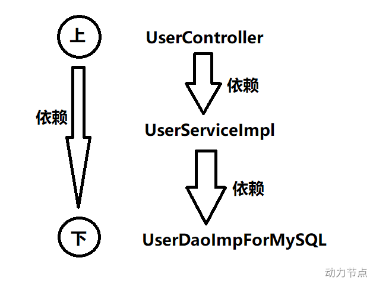
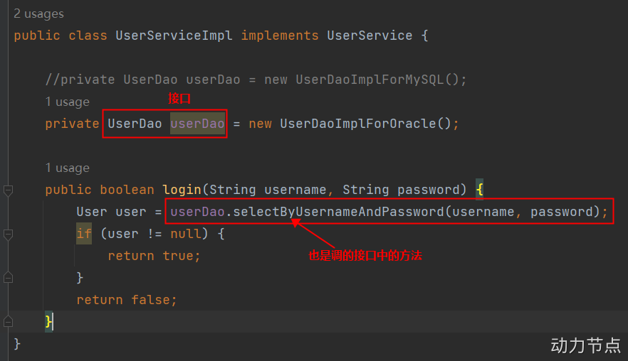
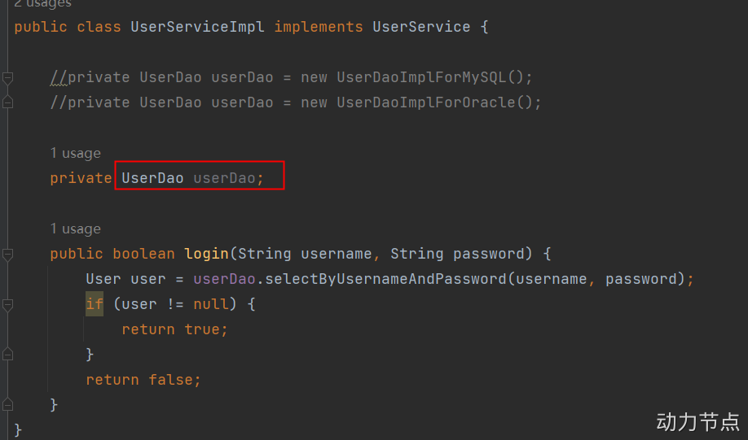
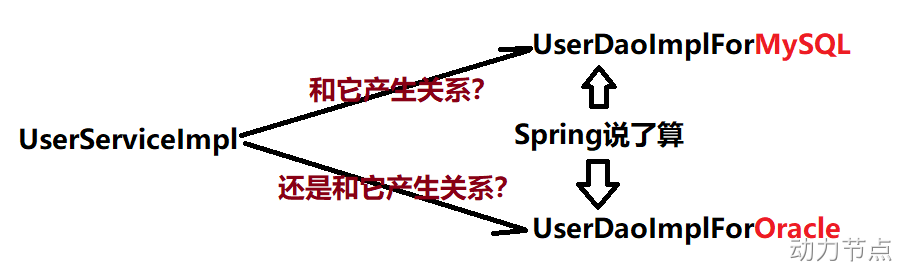

https://www.yuque.com/dujubin/ltckqu/kipzgd?singleDoc#

mg9b

一、Spring 启示录

阅读以下代码：

```java
package com.powernode.oa.controller;

import com.powernode.oa.service.UserService;
import com.powernode.oa.service.impl.UserServiceImpl;

public class UserController {

    private UserService userService = new UserServiceImpl();

    public void login(){
        String username = "admin";
        String password = "123456";
        boolean success = userService.login(username, password);
        if (success) {
            // 登录成功
        } else {
            // 登录失败
        }
    }
}
```

```java
package com.powernode.oa.service.impl;

import com.powernode.oa.bean.User;
import com.powernode.oa.dao.UserDao;
import com.powernode.oa.dao.impl.UserDaoImplForMySQL;
import com.powernode.oa.service.UserService;

public class UserServiceImpl implements UserService {

    private UserDao userDao = new UserDaoImplForMySQL();

    public boolean login(String username, String password) {
        User user = userDao.selectByUsernameAndPassword(username, password);
        if (user != null) {
            return true;
        }
        return false;
    }
}

```

```java
package com.powernode.oa.dao.impl;

import com.powernode.oa.bean.User;
import com.powernode.oa.dao.UserDao;

public class UserDaoImplForMySQL implements UserDao {
    public User selectByUsernameAndPassword(String username, String password) {
        // 连接MySQL数据库，根据用户名和密码查询用户信息
        return null;
    }
}

```

可以看出，UserDaoImplForMySQL 中主要是连接 MySQL 数据库进行操作。如果更换到 Oracle 数据库上，则需要再提供一个 UserDaoImplForOracle，如下：

```java
package com.powernode.oa.dao.impl;

import com.powernode.oa.bean.User;
import com.powernode.oa.dao.UserDao;

public class UserDaoImplForOracle implements UserDao {
    public User selectByUsernameAndPassword(String username, String password) {
        // 连接Oracle数据库，根据用户名和密码查询用户信息
        return null;
    }
}

```

很明显，以上的操作正在进行功能的扩展，添加了一个新的类 UserDaoImplForOracle 来应付数据库的变化，这里的变化会引起连锁反应吗？当然会，如果想要切换到 Oracle 数据库上，UserServiceImpl 类代码就需要修改，如下：

```java
package com.powernode.oa.service.impl;

import com.powernode.oa.bean.User;
import com.powernode.oa.dao.UserDao;
import com.powernode.oa.dao.impl.UserDaoImplForOracle;
import com.powernode.oa.service.UserService;

public class UserServiceImpl implements UserService {

    //private UserDao userDao = new UserDaoImplForMySQL();
    private UserDao userDao = new UserDaoImplForOracle();

    public boolean login(String username, String password) {
        User user = userDao.selectByUsernameAndPassword(username, password);
        if (user != null) {
            return true;
        }
        return false;
    }
}

```

1.1 OCP 开闭原则

> 这样一来就违背了开闭原则 OCP。开闭原则是这样说的：在软件开发过程中应当对扩展开放，对修改关闭。也就是说，如果在进行功能扩展的时候，添加额外的类是没问题的，但因为功能扩展而修改之前运行正常的程序，这是忌讳的，不被允许的。因为一旦修改之前运行正常的程序，就会导致项目整体要进行全方位的重新测试。这是相当麻烦的过程。导致以上问题的主要原因是：代码和代码之间的耦合度太高。如下图所示：



> 可以很明显的看出，上层是依赖下层的。UserController 依赖 UserServiceImpl，而 UserServiceImpl 依赖 UserDaoImplForMySQL，这样就会导致下面只要改动，上面必然会受牵连（跟着也会改），所谓牵一发而动全身。这样也就同时违背了另一个开发原则：依赖倒置原则。

1.2 依赖倒置原则 DIP

> 依赖倒置原则(Dependence Inversion Principle)，简称 DIP，主要倡导面向抽象编程，面向接口编程，不要面向具体编程，让上层不再依赖下层，下面改动了，上面的代码不会受到牵连。这样可以大大降低程序的耦合度，耦合度低了，扩展力就强了，同时代码复用性也会增强。（软件七大开发原则都是在为解耦合服务）

你可能会说，上面的代码已经面向接口编程了呀：


确实已经面向接口编程了，但对象的创建是：new UserDaoImplForOracle()显然并没有完全面向接口编程，还是使用到了具体的接口实现类。什么叫做完全面向接口编程？什么叫做完全符合依赖倒置原则呢？请看以下代码：


如果代码是这样编写的，才算是完全面向接口编程，才符合依赖倒置原则。那你可能会问，这样 userDao 是 null，在执行的时候就会出现空指针异常呀。你说的有道理，确实是这样的，所以我们要解决这个问题。解决空指针异常的问题，其实就是解决两个核心的问题：

● 第一个问题：谁来负责对象的创建。【也就是说谁来：new UserDaoImplForOracle()/new UserDaoImplForMySQL()】
● 第二个问题：谁来负责把创建的对象赋到这个属性上。【也就是说谁来把上面创建的对象赋给 userDao 属性】

如果我们把以上两个核心问题解决了，就可以做到既符合 OCP 开闭原则，又符合依赖倒置原则。
很荣幸的通知你：Spring 框架可以做到。
在 Spring 框架中，它可以帮助我们 new 对象，并且它还可以将 new 出来的对象赋到属性上。换句话说，Spring 框架可以帮助我们创建对象，并且可以帮助我们维护对象和对象之间的关系。比如：


> Spring 可以 new 出来 UserDaoImplForMySQL 对象，也可以 new 出来 UserDaoImplForOracle 对象，并且还可以让 new 出来的 dao 对象和 service 对象产生关系（产生关系其实本质上就是给属性赋值）。很显然，这种方式是将对象的创建权/管理权交出去了，不再使用硬编码的方式了。同时也把对象关系的管理权交出去了，也不再使用硬编码的方式了。像这种把对象的创建权交出去，把对象关系的管理权交出去，被称为控制反转。

1.3 控制反转 IoC

> 控制反转（Inversion of Control，缩写为 IoC），是面向对象编程中的一种设计思想，可以用来降低代码之间的耦合度，符合依赖倒置原则.控制反转的核心是：将对象的创建权交出去，将对象和对象之间关系的管理权交出去，由第三方容器来负责创建与维护。

控制反转常见的实现方式：依赖注入（Dependency Injection，简称 DI）

通常，依赖注入的实现又包括两种方式：
● set 方法注入
● 构造方法注入
而 Spring 框架就是一个实现了 IoC 思想的框架。

IoC 可以认为是一种全新的设计模式，但是理论和时间成熟相对较晚，并没有包含在 GoF 中。（GoF 指的是 23 种设计模式）
