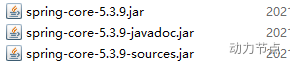
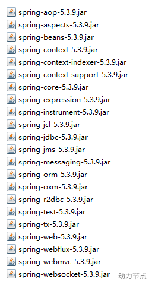

Spring 的 jar 文件

打开 libs 目录，会看到很多 jar 包：

spring-core-5.3.9.jar：字节码（这个是支撑程序运行的 jar 包）
spring-core-5.3.9-javadoc.jar：代码中的注释
spring-core-5.3.9-sources.jar：源码

我们来看一下 spring 框架都有哪些 jar 包：

spring-aop-5.3.9.jar

> 这个 jar 文件包含在应用中使用 Spring 的 AOP 特性时所需的类

spring-aspects-5.3.9.jar

> 提供对 AspectJ 的支持，以便可以方便的将面向切面的功能集成进 IDE 中

spring-beans-5.3.9.jar

> 这个 jar 文件是所有应用都要用到的，它包含访问配置文件、创建和管理 bean 以及进行 Inversion ofControl / Dependency Injection（IoC/DI）操作相关的所有类。如果应用只需基本的 IoC/DI 支持，引入 spring-core.jar 及 spring-beans.jar 文件就可以了。

spring-context-5.3.9.jar

> 这个 jar 文件为 Spring 核心提供了大量扩展。可以找到使用 Spring ApplicationContext 特性时所需的全部类，JDNI 所需的全部类，instrumentation 组件以及校验 Validation 方面的相关类。

spring-context-indexer-5.3.9.jar

> 虽然类路径扫描非常快，但是 Spring 内部存在大量的类，添加此依赖，可以通过在编译时创建候选对象的静态列表来提高大型应用程序的启动性能。

spring-context-support-5.3.9.jar

> 用来提供 Spring 上下文的一些扩展模块,例如实现邮件服务、视图解析、缓存、定时任务调度等

spring-core-5.3.9.jar

> Spring 框架基本的核心工具类。Spring 其它组件要都要使用到这个包里的类，是其它组件的基本核心，当然你也可以在自己的应用系统中使用这些工具类。

spring-expression-5.3.9.jar

> Spring 表达式语言。

spring-instrument-5.3.9.jar

> Spring3.0 对服务器的代理接口。

spring-jcl-5.3.9.jar

> Spring 的日志模块。JCL，全称为"Jakarta Commons Logging"，也可称为"Apache Commons Logging"。

spring-jdbc-5.3.9.jar

> Spring 对 JDBC 的支持。

spring-jms-5.3.9.jar

> 这个 jar 包提供了对 JMS 1.0.2/1.1 的支持类。JMS 是 Java 消息服务。属于 JavaEE 规范之一。

spring-messaging-5.3.9.jar

> 为集成 messaging api 和消息协议提供支持

spring-orm-5.3.9.jar

> Spring 集成 ORM 框架的支持，比如集成 hibernate，mybatis 等。

spring-oxm-5.3.9.jar

> 为主流 O/X Mapping 组件提供了统一层抽象和封装，OXM 是 Object Xml Mapping。对象和 XML 之间的相互转换。

spring-r2dbc-5.3.9.jar

> Reactive Relational Database Connectivity (关系型数据库的响应式连接) 的缩写。这个 jar 文件是 Spring 对 r2dbc 的支持。

spring-test-5.3.9.jar

> 对 Junit 等测试框架的简单封装。

spring-tx-5.3.9.jar

> 为 JDBC、Hibernate、JDO、JPA、Beans 等提供的一致的声明式和编程式事务管理支持。

spring-web-5.3.9.jar

> Spring 集成 MVC 框架的支持，比如集成 Struts 等。

spring-webflux-5.3.9.jar

> WebFlux 是 Spring5 添加的新模块，用于 web 的开发，功能和 SpringMVC 类似的，Webflux 使用当前一种比较流程响应式编程出现的框架。

spring-webmvc-5.3.9.jar

> SpringMVC 框架的类库

spring-websocket-5.3.9.jar

> Spring 集成 WebSocket 框架时使用
