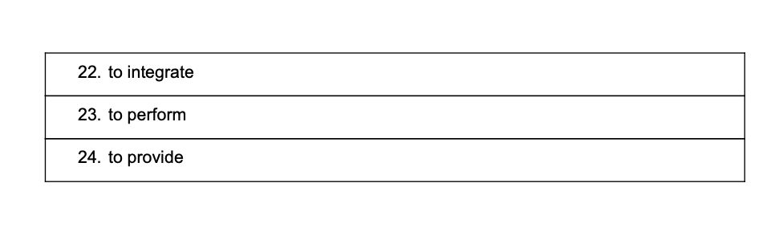

to start/turn on a computer

to shut down/turn off a computer

to start your computer and run the upgrade process.

shut down your computer at the end of the day.

to plug in（给...接通） - to connect to power supply. 插上电源
to unplug / to disconnect - to disconnect from power supply.
[（将插头插入插座）给…接通（电源）;（某一电器以电线或导线）连接（电源），与（另一电器）相接;把（某一电器）与（另一电器）连接;用…堵住;将…塞入]

if your speakers do not work, try to plug and unplug them.

to crash/to freeze up - when your computer stops working
to restart/reboot -to start a cpmputer again after it stopped working

my computer freezes up all the time.
After successful installation, reboot your computer.

to look up a word/address - to find something
to check up information - find something
I looked up my IP address.
I checked up the best Internet providers in my area.

to click/to tap - actions you do with your mouse/touchpad.
to drap and drop - actions you do with your mouse.

Double/left/right-click your code files to run them.
To order the files, simply drap and drop into a new position.

to copypaste/to create

to enter words/to type words.
to key in - to enter infomation into computer

It will take about 2 hours to key in all the data.
My program asks the user to enter words.

to use a shortcut
to silent/mute - make the sound disappear

Use ctrl + L to see the last saved version.
His background noise was so terrible, so I muted him.

to sign up - to register
to sign off - to unsubscribe
To begin your registration you just need to press sign up button.
You may unsubscribe by clicking the link below.

to log in - to enter.
to log out - exit.
Use your email address and password to log in.
Log out of your account when you are not using it.

to install - add new software to computer.
to integrate - to combine 2 things to work better

To run a code in Ruby, you have to install Ruby first.
Select the language of your website and integrate the automatically
generated HTML code into your website.

The computer performs instructions written in your code.
Technical documentation provides all the necessary information,
but it is sometimes difficult to read it.

