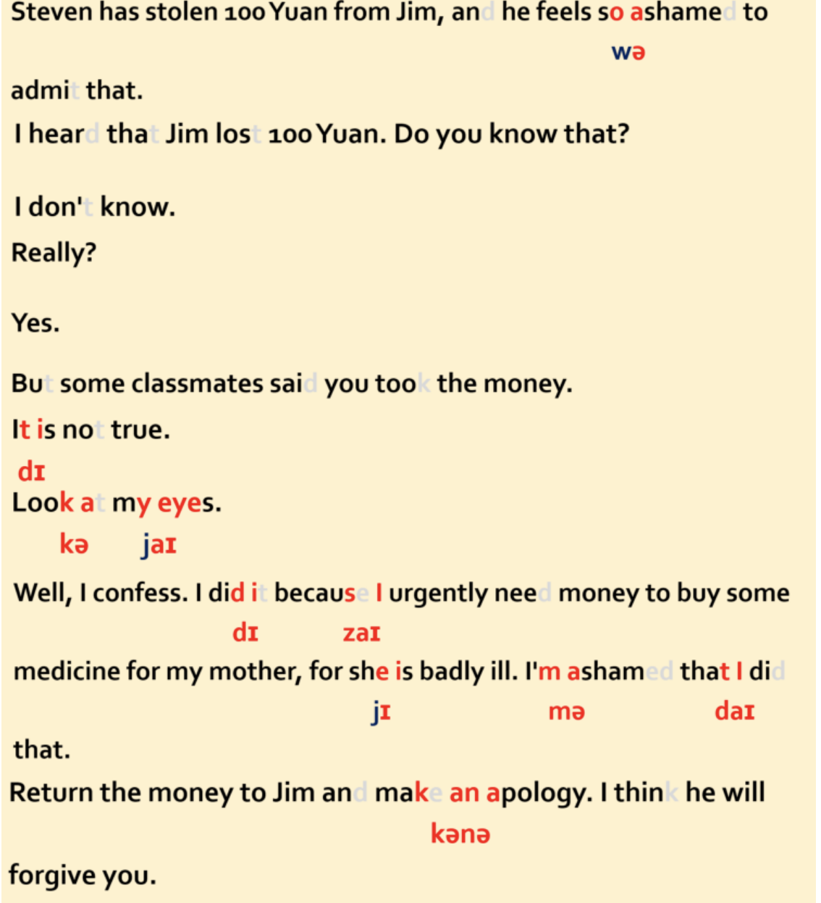

Stealing Things 偷东西

Steven has stolen 100 Yuan from Jim, and he feels so ashamed to admit that.史蒂文偷了吉姆 100 元钱，他感到很羞愧而不愿承认。
A: I heard that Jim lost 100 Yuan. Do you know that? 我听说吉美丢了 100 元钱，你知道这事儿吗？
B: I don't know. 我不知道。
A: Really?真的吗？
B: Yes.
是的。
A: But some classmates said you took the money.但有同学说是你拿了那 100 元钱。

B: It is not true. 不是的。
A: Look at my eyes.看着我的眼睛。
B: Well, I confess. I did it because I urgently need money to buy some medicine for my mother, for she is badly ill. I'm ashamed that I did that.好吧，我承认是我做的。因为我急需用钱给我妈妈买药，她病得很严重。我为自己所做的事情感到羞愧。
A: Return the money to Jim and make an apology. I think he will forgive you.把钱还给吉姆道个歉，我想他会原谅你的。

