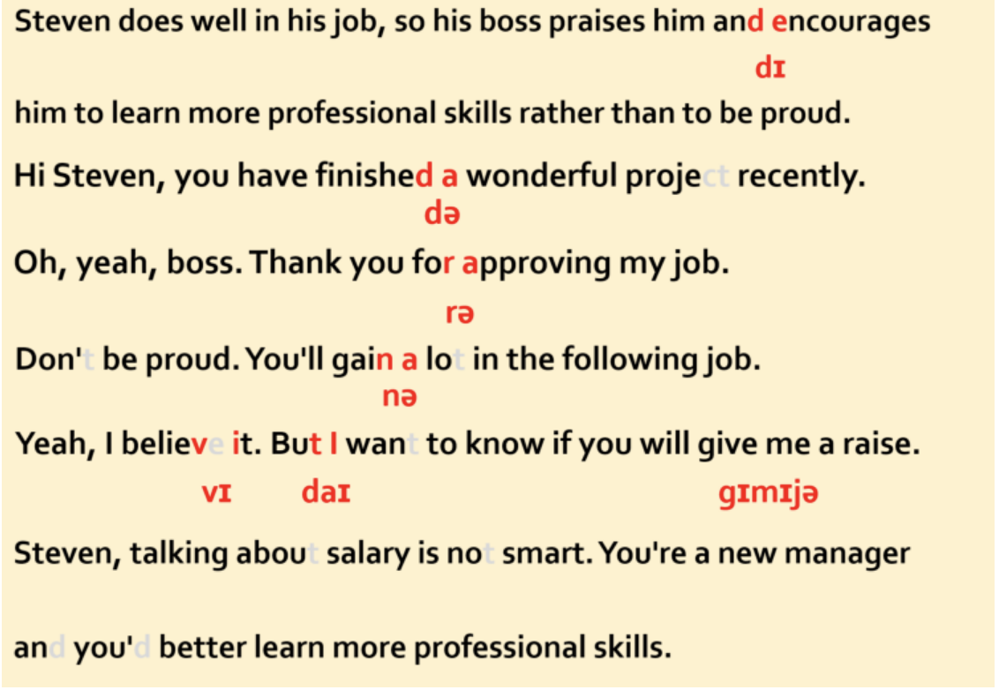

Working Performance 工作表现

Steven does well in his job, so his boss praises him and encourages him to learn more professional skills rather than to be proud. 史蒂文在工作上取得了成绩，他的老板表扬了他，并告诫他不要骄傲，要好好学专业技能。
A: Hi Steven, you have finished a wonderful project recently. 你好，史蒂文，你最近的项目完成的很好呀。
B: Oh, yeah, boss. Thank you for approving my job. 哦，是的，老板。谢谢您对我工作的认可。
A: Don't be proud. You'll gain a lot in the following job.别骄傲，你将在以后的工作中得到更好的锻炼。
B: Yeah, I believe it. But I want to know if you will give me a raise.是的，我相信。但是老板，我想知道，你是否会给我加薪呢？
A: Steven, talking about salary is not smart. You're a new manager and you'd better learn more professional skills. 史蒂文，谈薪资可不明智。你刚升做经理，应该多学些专业技能。

