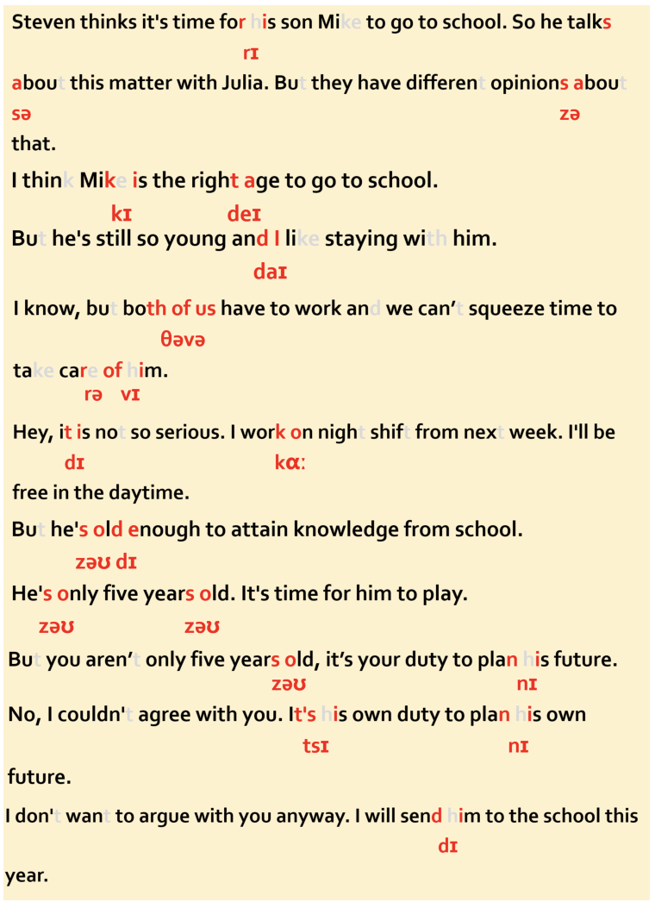

Arguing With Someone 与某人争辩

Steven thinks it's time for his son Mike to go to school. So he talks about this matter with Julia. But they have different opinions about that. 史蒂文认为他的儿子麦克到了上学的年纪，于是和妻子茱莉亚商量，但是他们对此各抒己见。
A: I think Mike is the right age to go to school.我想麦克到了去学校读书的年龄了。
B: But he's still so young and I like staying with him.但是他还很小啊，而且我也喜欢和他待在一起。
A: I know, but both of us have to work and we can't squeeze time to take care of him. 我知道，但是我们两个都要工作，挤不出时间来照顾他。
B: Hey, it is not so serious. I work on night shift from next week. I'll be free in the daytime. 嘿，事情没那么严重。我下个星期开始上夜班，白天就有空了。
A: But he's old enough to attain knowledge from school. 但是他也到了去学校学习知识的年龄。
B: He's only five years old. It's time for him to play.他才五岁，正是玩的时候。
A: But you aren't only five years old, it's your duty to plan his future.可是你不止五岁，你有责任为他的未来做计划。
B: No, I couldn't agree with you. It's his own duty to plan his own future. 不，我不同意你的观点。为他将来做打算是他自己的事。
A: I don't want to argue with you. Anyway, I will send him to the school this year.我不想和你争。不管怎样，我今年都要送他去读书。

