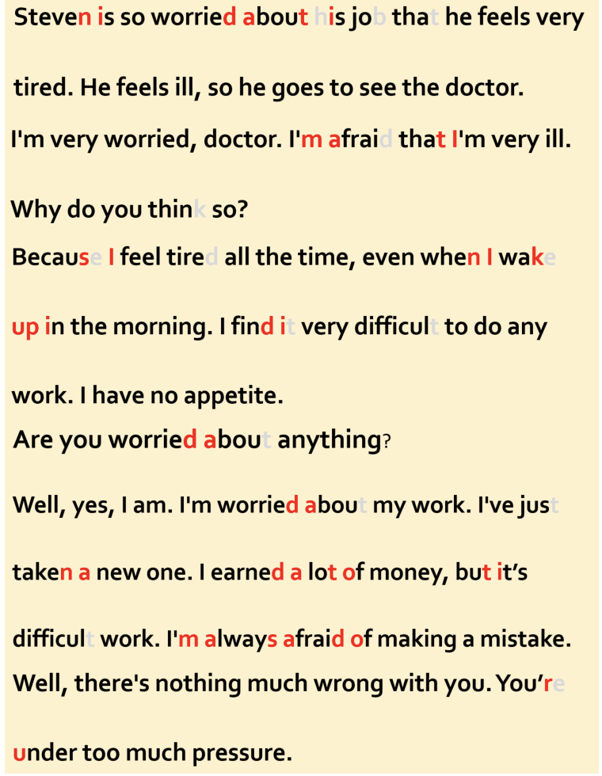

Working Pressure 工作压力

Steven is so worried about his job that he feels very tired. He feels ill, so he goes to see the doctor. 史蒂文太担心工作，以至于感到非常的累，他觉得自己好像生病了，于是去看医生。
A: I'm very worried, doctor. I'm afraid that I'm very ill. 医生，我很担心，我觉得自己好像病的很严重。
B: Why do you think so? 为什么这么认为呢？
A: Because I feel tired all the time, even when I wake up in the morning. I find it very difficult to do any work. I have no appetite. 因为我一直感觉很疲惫，即使是我早上刚起床的时候，我感觉工作也很吃力，胃口也不好。
B: Are you worried about anything? 你是不是总担心什么事？
A: Well, yes I am. I'm worried about my work. I've just taken a new one. I earned a lot of money, but it's difficult work. I'm always afraid of making a mistake.嗯，是的，我很担心我的工作，我刚找了个新工作，可以赚很多钱，但是工作太难了，我总担心出错。
B: Well, there'

