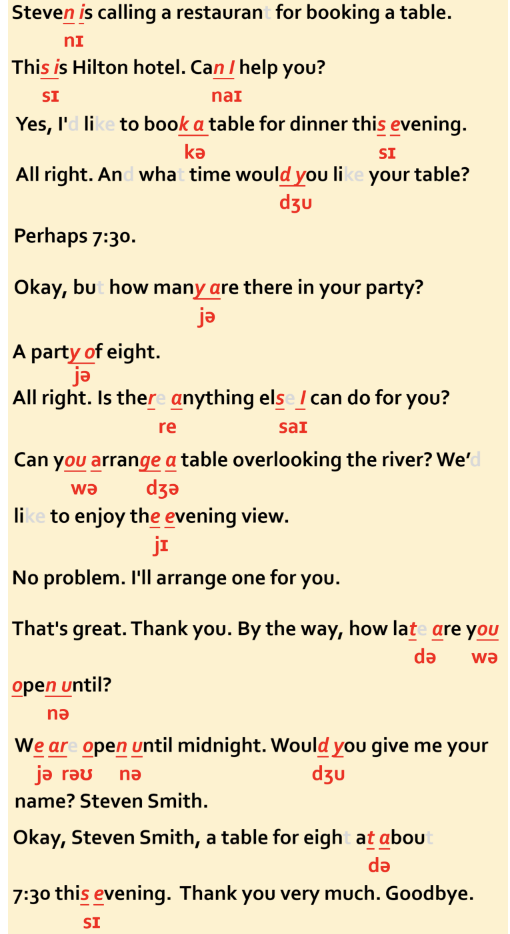

Booking A Table 预定餐厅

Steven is calling a restaurant for booking a table. 史蒂文正在给一家酒店打电话预定餐厅。
A: This is Hilton hotel. Can I help you? 这里是希尔顿酒店，请问您有什么需要？
B: Yes, I'd like to book a table for dinner this evening. 对，我想预定今天的晚餐。
A: All right. And what time would you like your table?好的，什么时候需要？
B: Perhaps 7:30.大概七点半。
A: Okay, but how many are there in your party? 好的，请问你们有几个人用餐？
B: A party of eight.八个人。

A: All right. Is there anything else I can do for you? 请问你还有什么要求吗？
B: Can you arrange a table overlooking the river? We'd like to enjoy the evening view. 我希望您能给我安排一个能俯瞰到河的位置，我们想欣赏一下夜景。
A: No problem. I'll arrange one for you. 没问题，我会为您安排的。
B: That's great. Thank you. By the way, how late are you open until?那太好了，谢谢你。顺便问一下，你们晚上营业到几点？
A: We are open until midnight. Would you give me your name? 我们一直营业到午夜。请问您贵姓？
B: Steven Smith.史蒂文•史密斯。
A: Okay, Steven Smith, a table for eight at about 7:30 this evening. 好的，史蒂文•史密斯，今晚七点半，八个人餐桌。
B: Thank you very much. Goodbye.非常感谢，再见。

